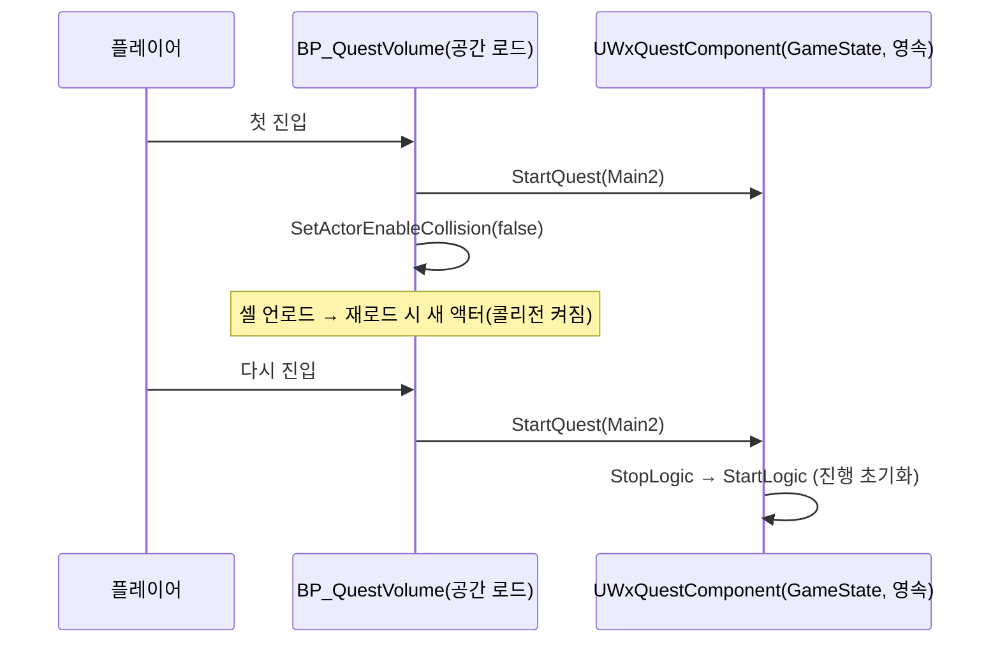

# 프로젝트 코드 리뷰

* 시간: 2026-10-04 06:07 (Asia/Seoul)

* 기준 커밋: e9dbe2a28

* 작업 트리: 미커밋 변경 있음. 소스는 [WxEnemyCharacter.cpp](../../../../Source/WxGame/Character/WxEnemyCharacter.cpp) 한 파일이다. 생성자에서 적 ASC 복제 모드를 Minimal로 설정하고, BeginPlay의 Full 설정을 지웠다. 검토는 이 작업 트리 내용을 기준으로 했다. 나머지 미커밋 변경(Content의 PCG·머티리얼·텍스처 에셋, `Docs/Programmer/ProjectCodeReview_2026-10-02.md` 삭제)은 코드 검토 대상이 아니다.

## 결과 요약

`Source/WxGame` 게임 런타임 C++의 459개 파일, 33,005줄을 검토했다. 자체 플러그인 3개는 모두 Editor 모듈이라 범위에서 뺐다. 중복 병합과 반증 검증을 거쳐 총 68건을 확정했다.

| 카테고리 | 🔴 심각 | 🟡 개선 | 🟢 사소 |
| --- | ---: | ---: | ---: |
| 전투·어빌리티 (AbilitySystem·Combat·Animation·Weapons·Targeting) | 1 | 17 | 15 |
| 퀘스트·월드 (Quest·Spawner·Device·Inventory·Interaction·Save·Player) | 0 | 6 | 10 |
| 캐릭터·네트워크 (Character·Minion) | 0 | 4 | 0 |
| UI·프론트엔드 (UI·FrontEnd) | 0 | 3 | 4 |
| AI | 0 | 1 | 5 |
| 공통·개발 (Development·전역 규칙) | 0 | 0 | 2 |
| 합계 | 1 | 31 | 36 |

## 항목별 세부 사항

### C01. 🔴 콤보가 한 활성화로 바뀐 뒤 패시브 적중 UP가 콤보 전체에 한 번만 지급된다

**발생 조건**: 플레이어가 콤보 창에서 다음 타를 이어 4단 평타(GA_Template_Attack_Light, GA_HGTest_Attack_Light_1)를 치고 각 단이 적중한다. 패시브(GA_Template_Passive, GA_HGTest_Passive)는 Event.DamageDealt로 트리거된다. 4단 뒤 0단으로 되감아 계속 치는 동안에도 같은 활성화가 이어진다.

**판단 근거**: 묶음 리뷰와 GAS 횡단 리뷰가 각각 보고했다(후보 B03-01, X3-01). [WxAbility_Passive.cpp:53](../../../../Source/WxGame/AbilitySystem/Abilities/WxAbility_Passive.cpp#L53)은 원인 어빌리티의 활성화 예측 키를 "공격 1회"의 식별자로 쓴다. [WxAbility_Combo.cpp:86](../../../../Source/WxGame/AbilitySystem/Abilities/WxAbility_Combo.cpp#L86)의 `CommitAbility`는 ActivationInfo를 바꾸지 않는다. 엔진 `InternalTryActivateAbility`도 활성화할 때만 키를 넣는다(AbilitySystemComponent_Abilities.cpp:1875-1886). 그래서 콤보 전 단이 한 키를 같이 쓴다. 콤보를 한 활성화+WaitInputPress로 바꾼 커밋 4cc8cfb39(10-02)는 Passive 파일을 건드리지 않았다. [WxAbility_Passive.h:16](../../../../Source/WxGame/AbilitySystem/Abilities/WxAbility_Passive.h#L16)의 "콤보는 단마다 발동이 따로라 단마다 지급된다", [cpp:50](../../../../Source/WxGame/AbilitySystem/Abilities/WxAbility_Passive.cpp#L50)의 "콤보 재발동도 새 키를 받는다", 패시브 설계 기록(08-26)은 모두 단마다 지급을 전제로 하는데, 지금 동작은 그 반대다. 기획자에게 공유한 [09-19 회의자료](<../../../../Docs/Meeting/2026-09-19 회의자료.md#L9>)와 [Wiki/entities/현광.md:39](../../../../Wiki/entities/현광.md#L39)도 "도플갱어가 있을 때 피해를 줄 때마다 UP +10"이고, 당시 콤보는 단마다 재발동이었다. 원본 전투 기획의 "MP 스킬 적중 시에만 충전"은 09-19 회의가 예전 규칙이라 부른 내용이라 근거가 되지 않는다. 2차 검증은 이 항목을 🟡로 봤고, 세 번째 검증자가 위 회의자료를 근거로 🔴로 판정했다.

**원인**: 10-02 콤보 리팩터로 "단계 = 새 활성화"라는 전제가 사라졌다. 그런데 패시브의 식별자는 여전히 활성화 예측 키다. 같은 키가 이미 지급된 키와 같으면 [WxAbility_Passive.cpp:54-58](../../../../Source/WxGame/AbilitySystem/Abilities/WxAbility_Passive.cpp#L54)이 지급 없이 끝낸다.

**영향**: 4단 콤보가 모두 적중해도 UP가 Template 기준 +20이 아니라 +5만 오른다(HGTest는 도플갱어가 있을 때 +40이 아니라 +10). 끊지 않고 되감아 치면 사실상 처음 한 번만 받는다. 콤보를 끊고 1단을 반복하는 쪽이 궁극기 충전에 더 유리해지는 역전도 생긴다. 플레이어 기본 평타라는 주 흐름에서 늘 재현되는 기능 오류라 🔴로 둔다.

**수정 제안**: 콤보 단 단위로 식별한다. 원인 어빌리티가 `UWxAbility_Combo`면 (활성화 키, `GetComboIndex()`) 쌍을 비교 키로 저장한다. 단계가 하나인데 콤보 창으로 자기 반복하는 경우까지 맞추려면, 피해를 낸 몽타주 인스턴스 ID를 쓰는 편이 정확하다. 활성화당 1회가 새 의도라면 Passive 주석 두 곳과 `Wiki/concepts/스탯과-피해-계산.md`를 고친다.

**확신도**: 높음 — 코드 경로와 엔진 소스만으로 결과가 정해진다. 단마다 키를 새로 받는 경로가 없다는 것도 확인했다.

### C02. 🟡 Manual 퀘스트 스포너는 셀이 언로드되면 적이 다시 나오지 않아 「스포너 처치 대기」가 영구 정체된다

**발생 조건**: (a) KillEnemies 스텝에서 적이 살아 있는데, 플레이어가 스포너 셀의 로딩 범위 밖으로 나갔다가 돌아온다. 체크포인트가 모두 범위 안이라, 맵 서부·북부 끝까지 이동해야 한다(C16과 같은 조건). (b) 스텝에 들어가는 순간 대상 스포너 셀이 언로드돼 있다. 지금 Main2는 앞 스텝이 스포너 근처(약 60m)에서 끝나 (b)는 드러나기 어렵다.

**판단 근거**: 묶음 리뷰와 저장·부활 횡단 리뷰가 각각 보고했다(후보 B16-01, X4-02). LV_OpenWorld의 대상 스포너는 `EWxSpawnerMode::Manual`이고 공간 로드된다. [WxSpawnerLocatorUtils.cpp:12-15](../../../../Source/WxGame/Spawner/WxSpawnerLocatorUtils.cpp#L12)의 UOL 해석은 언로드된 액터를 로드하지 않는다. [WxStateTreeTask_TriggerSpawners.cpp:39-51](../../../../Source/WxGame/Spawner/WxStateTreeTask_TriggerSpawners.cpp#L39)은 진입할 때 한 번만 시도한다. 재로드된 스포너는 [WxSpawner.cpp:107-122](../../../../Source/WxGame/Spawner/WxSpawner.cpp#L107)에서 Auto일 때만 스폰한다. 부활 때의 `RespawnAll`도 Manual은 건너뛴다([WxSpawner.cpp:63](../../../../Source/WxGame/Spawner/WxSpawner.cpp#L63)). [WxStateTreeTask_WaitSpawnersKilled.cpp:117-143](../../../../Source/WxGame/Spawner/WxStateTreeTask_WaitSpawnersKilled.cpp#L117)은 해석되지 않았거나 처치되지 않은 스포너를 계속 Running으로 본다.

**원인**: 스폰 트리거를 받았다는 사실이 스포너의 런타임 상태로만 남는데, 그 상태가 셀 언로드로 사라진다. 대기 태스크는 그대로 계속 기다린다.

**영향**: Main2가 진행 불가가 된다. 레벨을 다시 열거나 C16으로 퀘스트가 재시작되는 것 말고는 복구 수단이 없다. 결과는 진행 불가지만, 지금 배치에서는 드문 이동이 필요해 🟡로 둔다.

**수정 제안**: C16과 같은 에셋 규약을 쓴다. 퀘스트 대상 Manual 스포너를 Is Spatially Loaded=false로 배치하면, 런타임에 스폰된 적도 영속 레벨 소속이라 함께 유지된다. 코드로 고친다면 TriggerSpawners가 상태에 머무는 동안 해석되지 않은 스포너를 낮은 주기로 다시 시도하게 한다.

**확신도**: 높음 — 해석·스폰·대기 세 경로를 코드로 확인했고, 스포너 모드와 로드 설정을 에셋 문자열로 확인했다.

### C03. 🟡 처형 피해로 대상이 죽으면 피해자가 1초 지점에서 즉시 래그돌이 돼 짝 연출이 끊긴다

**발생 조건**: TemplateEnemy(BP_Soldier, Enemy/BP_Template)를 피해로 그로기에 빠뜨린 뒤 앞잡한다. GP는 받은 최종 피해만큼 쌓이므로(MaxGP 50) 그로기 시점의 HP는 50 이하다. 처형 피해 86(DT_Damage `AM_Shared_Finisher`, CoeffATK 3)이면 반드시 죽는다. 반사 GP로 띄운 그로기, Sandbag, 만피 적에게 쓰는 뒤잡은 해당하지 않는다.

**판단 근거**: GAS 횡단 리뷰가 보고했다(후보 X3-04). 1차 검증에서 원인을 바로잡았다. 1.0초 노티파이의 처형 피해가 HP를 0으로 만들면 사망 어빌리티가 발동한다. GA_Shared_Death에는 몽타주가 없어서 [WxAbility_Death.cpp:62-66](../../../../Source/WxGame/AbilitySystem/Abilities/WxAbility_Death.cpp#L62)이 곧바로 `EnableRagdoll`로 간다. 이어 [WxCharacterBase.cpp:223-253](../../../../Source/WxGame/Character/WxCharacterBase.cpp#L223)의 `HandleRagdollTagChanged`→`EnterRagdoll`이 전 바디 물리를 켠다. 사망 어빌리티는 PlayMontageOnce를 취소하지 않지만, 몸이 래그돌이 되므로 피해자 짝 몽타주(2.48초)는 사실상 끝난다. 원본 기획서 [그로기_피니시_시스템_기획서.md:86](../../../../Docs/CombatDesign/그로기_피니시_시스템_기획서.md#L86)은 "그로기 피니시 발동 중 적이 사망하는 경우에도 그로기 피니시 애니메이션은 모두 재생된다"이고, 그로기 피니시가 곧 앞잡이다([Wiki/concepts/그로기와-처형.md:17](../../../../Wiki/concepts/그로기와-처형.md#L17)). 2차 검증은 미구현 뒤잡 문서를 근거로 기각했지만, 세 번째 검증자가 이 기획서를 근거로 확정했다.

**원인**: "몽타주가 없으면 즉시 래그돌"이라는 사망 연출 규칙이 처형 짝 연출 중에도 그대로 적용된다.

**영향**: 앞잡 결정타 순간 피해자가 래그돌로 무너지고 공격자 몽타주(1.54초)만 계속 재생된다. 기획한 짝 연출과 기상 구간이 앞잡 주 흐름에서 거의 매번 재생되지 않는다.

**수정 제안**: 활성 `Ability.PlayMontageOnce`가 있으면, 사망 어빌리티가 래그돌(또는 사망 몽타주)을 그 어빌리티가 끝날 때까지 미룬다(OnAbilityEnded나 태그 제거 대기). 미루는 동안의 피격 판정 해제는 지금처럼 `HandleDeath`가 맡는다.

**2026-10-05 반영**: 사망 어빌리티가 발동할 때 `Ability.PlayMontageOnce`가 있으면, 그 태그가 빠질 때까지 사망 몽타주·래그돌을 미룬다(`WaitGameplayTagRemove`). 짝 몽타주 완주는 기획서 86행대로이고, 끝난 뒤의 처리는 기존 규칙(사망 몽타주가 없으면 래그돌)을 따른다. 마지막 포즈를 유지할지는 아래 기획 확인 표에 남긴다. PIE 검증은 하지 않았다.

**확신도**: 높음 — 사망 몽타주 유무, 처형 피해 수치, 그로기 진입 시 HP를 에셋 목록과 코드로 확인했다.

### C04. 🟡 미커밋 적 ASC Minimal 복제가 40ac9e924의 수정을 되돌려 원격 클라의 적·보스 네임플레이트 이펙트 목록이 빈다

**발생 조건**: 리슨 서버나 데디 서버의 원격 클라에서, 아이콘(`UWxEffectComponent_UIData`)이 달린 지속형 GE가 걸린 적의 네임플레이트나 보스 바를 본다. 지금 에셋에서는 플레이어가 가드하면 BP_Doppelganger가 GA_Shared_Guard를 따라 쓰고, 아이콘이 붙은 GE_Shared_GuardReduction을 받는다.

**판단 근거**: 리뷰어 5명이 같은 문제를 짚었다(후보 B13-01, X1-01, 그 밖의 범위 밖 언급 3건). 작업 트리의 [WxEnemyCharacter.cpp:26](../../../../Source/WxGame/Character/WxEnemyCharacter.cpp#L26)이 Minimal을 설정한다. 커밋 40ac9e924("멀티플레이 클라이언트 WxViewModel_Effect 미출력 버그 수정")는 바로 이 설정을 Minimal에서 Full로 바꾸며 "네임플레이트 UI에 필요"라고 적었다. 엔진 `GetReplicationCondition`(GameplayEffect.cpp:5183-5213)은 Minimal이면 COND_Never라 클라 ASC에 활성 GE가 오지 않는다. [WxViewModel_AbilitySystem.cpp:158-176](../../../../Source/WxGame/UI/MVVM/WxViewModel_AbilitySystem.cpp#L158)의 목록은 클라 ASC의 활성 GE로만 만든다. WBP_Nameplate_Enemy와 WBP_Nameplate_Boss가 모두 `ActiveEffectViewModels`를 바인딩한다. Minimal로 돌아간다는 결정 기록은 메모리·Wiki·git log 어디에도 없다.

**원인**: 클라 네임플레이트 이펙트 목록의 원천은 복제된 `FActiveGameplayEffect`인데, Minimal은 그것을 복제하지 않는다. 태그·큐·어트리뷰트는 Minimal에서도 복제되므로 다른 클라 로직에는 영향이 없다.

**영향**: 호스트는 도플갱어 네임플레이트에서 방패 아이콘과 남은 시간 링을 보지만, 원격 클라에는 아무것도 뜨지 않는다. 앞으로 적 버프·디버프 아이콘을 저작해도 원격 클라에는 나오지 않는다.

**수정 제안**: 커밋 전에 Minimal 줄을 빼고 엔진 기본값 Full을 쓴다. 옛 BeginPlay의 Full 재설정은 다시 넣지 않아도 된다. 대역폭 때문에 Minimal을 유지하려면, "원격 클라에서는 적 네임플레이트 이펙트 목록이 나오지 않는다"는 결정을 기록하고 두 WBP의 바인딩을 걷는다.

**확신도**: 높음 — 엔진 복제 조건과 VM 원천은 코드로 정해진다. 도플갱어 가드로 재현되는 경로는 PIE로 확인하지 않았다.

### C05. 🟡 퍼펙트 가드 반사 GP로 막 그로기에 든 공격자에게 패리 넉이 나가 그로기 시작 자세를 밀어낸다

**발생 조건**: Enemy/BP_Template의 `AM_Template_Pattern_1_4` 타격(bCanParry인 유일한 적 패턴 행)을 플레이어가 퍼펙트 가드한다. 이때 적 GP는 36 이상이다(반사량 14, MaxGP 50).

**판단 근거**: 묶음 리뷰와 GAS 횡단 리뷰가 각각 보고했다(후보 B04-01, X3-05). 10-02 리뷰 R13도 아직 남아 있다. [WxEffectComponent_PerfectGuard.cpp:40-42](../../../../Source/WxGame/AbilitySystem/Effects/WxEffectComponent_PerfectGuard.cpp#L40)의 `AddGP`가 같은 호출 안에서 그로기를 띄운다. 그런데 [45-53행](../../../../Source/WxGame/AbilitySystem/Effects/WxEffectComponent_PerfectGuard.cpp#L45)은 그로기 여부를 보지 않고 Event.Hit.Parry를 보낸다. 패리 섹션은 AM_Shared_HitReact_Knock(DefaultSlot)에 있어 같은 그룹의 그로기 몽타주를 멈춘다. 피해 경로는 같은 이유로 그로기 중 넉을 Normal로 강등하는데([WxEffectComponent_DamageReaction.cpp:57-65](../../../../Source/WxGame/AbilitySystem/Effects/WxEffectComponent_DamageReaction.cpp#L57)), 패리 경로에는 이 규칙이 없다.

**원인**: 패리 반동을 보내기 전에, GP를 더한 뒤 시점의 공격자 `Ability.Groggy`를 확인하지 않는다.

**영향**: 기획의 "그로기 시작 리액션" 대신 패리 넉이 나온다. 패리가 끝나면 폴링이 그로기 몽타주를 다시 틀어 준다. 그로기 지속 시간과 처형 가능 구간은 줄지 않고, 그로기 자세가 보이는 시간만 줄어든다(원 보고의 "그로기 창이 잘린다"는 과장이었다).

**수정 제안**: 45행 조건에 `!SourceASC->HasMatchingGameplayTag(WxGameplayTags::Ability_Groggy)`를 더한다. 42행 `AddGP` 뒤에 판정하므로 방금 든 그로기도 걸러진다.

**2026-10-05 반영**: 제안대로 조건을 더했다. 그로기를 일으킨 타격은 원래 반응을 내지 않는다는 기획 규칙(`그로기_시스템.md` 4.1)이 근거이고, C18과 같은 규칙이다. PIE 검증은 하지 않았다.

**확신도**: 높음 — 실행 순서, 차단 태그, 슬롯 그룹, 에셋 행을 코드와 목록으로 확인했다.

### C06. 🟡 그로기 적을 처형하는 중 제3자의 일반 피격이 끝나면 그로기 폴링이 처형 짝 몽타주를 그로기 자세로 덮는다

**발생 조건**: 그로기 적을 앞잡하는 동안 다른 아군(소환 미니언의 AM_Minion_Skill_1/2, 다른 플레이어)이 그 적을 친다. 그 가산 피격 반응이 처형보다 먼저 끝난다.

**판단 근거**: GAS 횡단 리뷰가 10-02 리뷰 R21이 아직 남아 있다고 짚었다. 처형은 공격자에게만 무적을 걸어서 피해자는 맞는다. HitReact_Normal은 AdditiveHitReact 슬롯 몽타주를 `ASC::PlayMontage`로 틀어 ASC의 "현재 몽타주" 기록을 차지한다. 반응이 끝나면 엔진 `GetCurrentMontage`(AbilitySystemComponent_Abilities.cpp:3772-3781)가 nullptr를 돌려준다. DefaultSlot의 짝 몽타주가 아직 재생 중이어도 마찬가지다. 그러면 [WxAbility_Groggy.cpp:115-124](../../../../Source/WxGame/AbilitySystem/Abilities/WxAbility_Groggy.cpp#L115)와 [135-140](../../../../Source/WxGame/AbilitySystem/Abilities/WxAbility_Groggy.cpp#L135)이 "비었다"고 보고 그로기 몽타주를 다시 튼다. 처형 피해 행은 HitReactTag가 비어 있어 공격자 자신의 타격으로는 생기지 않는다.

**원인**: 폴링이 "슬롯이 비었는가"를 ASC의 단일 기록으로 판정한다. 가산 반응이 그 기록을 차지했다가 비우면, 아직 재생 중인 DefaultSlot 몽타주를 놓친다.

**영향**: 피해자가 처형 도중 그로기 자세로 튀어 공격자 몽타주와 짝이 어긋난다. 처형이 끝나면 ResetGP로 그로기가 풀려 기상 구간도 사라진다.

**수정 제안**: 115행과 135행의 판정을 "그로기 몽타주와 같은 슬롯 그룹에 활성 몽타주 인스턴스가 있는가"로 바꾼다(AnimInstance의 MontageInstances 순회). 폴링 구조는 그대로 둔다.

**2026-10-05 반영(다른 방법)**: 그룹 순회 대신 엔진 `UAnimInstance::Montage_IsActive(nullptr)`(어떤 몽타주든 활성인가)로 두 판정을 바꿨다. 기존 판정도 ASC가 기록한 가산 피격이 도는 동안은 기다렸으므로, 달라진 점은 GAS 기록에서 빠진 DefaultSlot 몽타주도 기다린다는 것뿐이다. 폴링 구조는 그대로다. PIE 검증은 하지 않았다.

**확신도**: 높음 — 엔진의 몽타주 기록 규칙과 슬롯·차단 태그를 소스로 확인했다.

### C07. 🟡 KillZ 낙하로 플레이어 폰이 Destroy되면 사망 화면도 부활 경로도 없어 복구할 수 없다

**발생 조건**: 지형 구멍이나 맵 가장자리로 떨어져 기본 KillZ(약 -10.5km)에 닿는다.

**판단 근거**: 저장·부활 횡단 리뷰가 보고했다(후보 X4-03). 엔진 `AActor::FellOutOfWorld`(Actor.cpp:3373)는 액터를 Destroy한다. 폰·캐릭터 쪽 재정의는 없고, 프로젝트 전역에도 KillZ 처리가 없으며, LV_OpenWorld에 KillZVolume도 없다. 사망 화면은 [WxPlayerLayoutComponent.cpp:136-146](../../../../Source/WxGame/UI/WxPlayerLayoutComponent.cpp#L136)에서 Ability.Death 태그로만 뜬다. [WxRespawnLibrary.cpp:34-39](../../../../Source/WxGame/Player/WxRespawnLibrary.cpp#L34)의 부활은 살아 있는 DeadPawn과 Ability.Death를 요구한다. 게임 안에는 재시작이나 타이틀 복귀 메뉴가 없다.

**원인**: 사망 판정 경로가 HP 0 → Ability.Death 하나뿐인데, KillZ는 그 경로를 거치지 않고 폰을 없앤다.

**영향**: 폰도 HUD도 없는 화면에 갇혀 게임을 다시 켜야 한다. 다만 그 전에 이미 몇 분 동안 낙하하므로 빈도와 체감은 제한적이다.

**수정 제안**: `AWxCharacterBase::FellOutOfWorld`를 재정의한다. 권위 측에서 기존 사망 경로(Event.Death)로 보내고, Super의 Destroy는 하지 않는다.

**2026-10-05 반영**: 권위 측에서 `Ability.Death`가 없으면 Event.Death를 보낸다. 받는 사망 어빌리티가 없는 폰(분신 등)은 엔진처럼 파괴하고, 그 밖에는 파괴하지 않는다(Lyra와 같은 방식). 래그돌 시체가 KillZ 아래로 떨어져 물리 쪽에서 다시 불려도 사망 표식 확인에서 끝난다. 처음 넣었던 이동·물리 정지, 숨김, 충돌 끄기는 하는 일이 없어 같은 날 걷어냈다. 이 경로는 HP가 남은 채 죽으므로 C12를 함께 고쳤다. PIE 검증은 하지 않았다.

**확신도**: 높음 — 엔진 기본 동작과 프로젝트의 사망·부활 조건을 코드로 확인했다.

### C08. 🟡 적 네임플레이트 Character VM을 Deinitialize하지 않아 적 ASC 구독과 매 틱 타이머가 GC까지 남는다

**발생 조건**: 로컬 화면에서 적 네임플레이트가 붙었다 떨어질 때마다 생긴다(가시 거리 이탈, 교전 해제, 락온 해제, 사망, 컨트롤러 EndPlay).

**판단 근거**: 묶음 리뷰와 수명 횡단 리뷰가 각각 보고했다(후보 B06-01, X2-01). [WxNameplateManagerComponent.cpp:121-132](../../../../Source/WxGame/UI/WxNameplateManagerComponent.cpp#L121)는 VM을 만들어 수동 소스로 넣는다. 그런데 떼는 두 곳([97-108](../../../../Source/WxGame/UI/WxNameplateManagerComponent.cpp#L97), [47-54](../../../../Source/WxGame/UI/WxNameplateManagerComponent.cpp#L47))은 `DestroyComponent`만 부른다. 엔진 `UMVVMView::UninitializeSource`(MVVMView.cpp:315-325)는 수동 소스를 정리하지 않는다. 보스 리졸버는 [WxViewModelResolver_BossCharacter.cpp:45](../../../../Source/WxGame/UI/MVVM/WxViewModelResolver_BossCharacter.cpp#L45)에서 Deinitialize하므로, 이 정리가 빠진 곳은 네임플레이트뿐이다.

**원인**: 121행 주석은 VM이 "위젯과 함께 사라진다"고 보지만, 실제로 사라지는 시점은 GC다. 수동 소스라서 엔진도 해제 훅을 주지 않는다.

**영향**: 떼어낸 네임플레이트마다 VM 트리가 GC 주기 동안 적의 태그·속성·GE 변화를 계속 처리한다. 시한부 효과가 있으면 Effect VM의 매 틱 타이머도 계속 돈다. 다시 붙을 때마다 새 트리가 생긴다. 기능 오류는 아니고 CPU와 델리게이트 목록의 낭비다.

**수정 제안**: 떼는 두 곳에서 `DestroyComponent` 전에 Character VM의 `Deinitialize()`를 부른다. 이 함수가 자식 VM까지 정리한다. VM은 생성할 때 맵 값으로 함께 보관하거나 뷰에서 꺼낸다. 121행 주석도 고친다.

**확신도**: 높음 — 정리 누락은 코드와 엔진 소스로 정해진다. 영향 크기는 경미하다.

### C09. 🟡 콤보 다음 단의 커밋이 실패하면 입력을 무시하지 않고 진행 중인 단을 취소한다

**발생 조건**: 쿨다운(MaxRecharges 1)이나 단마다 비용이 있는 Skill·Combo 파생 어빌리티에 콤보 창을 두고, 창 안에서 입력한다. 현재 에셋에는 쿨다운·비용이 있으면서 콤보 창이 있는 몽타주가 없다.

**판단 근거**: 묶음 리뷰가 보고했다(후보 B02-02). [WxAbility_Combo.cpp:86-90](../../../../Source/WxGame/AbilitySystem/Abilities/WxAbility_Combo.cpp#L86)은 커밋에 실패하면 무조건 `EndAbility(취소)`이고, 다음 단 입력은 앞 단 몽타주가 재생 중인 창 구간에 들어온다([107-112](../../../../Source/WxGame/AbilitySystem/Abilities/WxAbility_Combo.cpp#L107)). 1단 커밋이 쿨다운 GE를 걸었으므로 2단의 `CheckCooldown`은 반드시 실패한다.

**원인**: "다음 단 불가"와 "현재 단 중단"을 구분하지 않고 같은 실패 처리를 쓴다.

**영향**: 쿨다운이나 비용이 있는 다단 스킬을 저작하면, 2단 입력 순간 1단 모션이 끊긴다. [WxAbility_Combo.h](../../../../Source/WxGame/AbilitySystem/Abilities/WxAbility_Combo.h#L10)의 "각 단계마다 비용·쿨다운을 커밋한다"는 설명을 따라 저작할 가능성이 있다.

**수정 제안**: 다음 단 진행에서는 엔진 `CommitCheck`로 먼저 확인하고, 실패하면 입력만 무시한 채 앞 단을 계속 재생한다. `EndAbility`는 첫 단 커밋이 실패했을 때만 부른다. 다단 스킬의 쿨다운을 첫 단에만 걸 의도라면 2단부터는 `CommitAbilityCost`만 한다.

**확신도**: 높음 — 커밋 실패 경로와 엔진 CommitCheck를 확인했다. 현재 에셋에서는 드러나지 않는다.

### C10. 🟡 패턴이 단계를 넘길 때 ResetActionState를 거치지 않아 앞 단의 Recovery가 다음 단까지 이어진다

**발생 조건**: 다단 패턴의 중간 단 몽타주에 `WxAnimNotify_StartRecovery`를 둔 경우. 현재 패턴 몽타주에는 하나도 없다.

**판단 근거**: 묶음 리뷰가 보고했다(후보 B03-03). Combo는 단마다 `ResetActionState`로 Blocking에 되돌리지만([WxAbility_Combo.cpp:95](../../../../Source/WxGame/AbilitySystem/Abilities/WxAbility_Combo.cpp#L95)), [WxAbility_Pattern.cpp:26-27](../../../../Source/WxGame/AbilitySystem/Abilities/WxAbility_Pattern.cpp#L26)은 `PlayMontage`만 부른다. Recovery 단계는 다른 어빌리티 차단을 풀고, 새 액션이 발동하면 `CancelRecoveringAbilities`가 Recovery 상태인 어빌리티를 끊는다.

**원인**: 단계 전환 경로에서 단계 상태 초기화가 빠졌다.

**영향**: 저작자가 중간 단에 후딜을 두면, 다음 단 전체가 차단이 풀린 채로 돈다. BT가 그 사이 다른 패턴이나 스킬을 발동하면 남은 단이 통째로 끊긴다.

**수정 제안**: Pattern.cpp 26행과 27행 사이에서 `ResetActionState()`를 부른다.

**확신도**: 높음 — 코드 경로만으로 정해진다. 현재 에셋에서는 드러나지 않는다.

### C11. 🟡 피해 출처 어빌리티를 AnimatingAbility로 추정해 적 패턴 타격이 HitReact나 출처 없음·레벨 1로 기록된다

**발생 조건**: 적이 패턴을 휘두르는 중에 가산 일반 피격을 맞고(패턴은 취소되지 않음), 그 뒤 같은 패턴의 무기 타격이나 AreaDamage가 적중한다.

**판단 근거**: GAS 횡단 리뷰가 보고했다(후보 X3-03). [WxCombatLibrary.cpp:63-68](../../../../Source/WxGame/Combat/WxCombatLibrary.cpp#L63)은 피해 시점 ASC의 `AnimatingAbility`로 출처와 레벨을 정한다. 엔진은 이 값을 마지막 PlayMontage 호출자로 덮어쓰고, 종료할 때 비운다. 소비처는 AdditionalEffects 스펙 레벨과 패시브 발동 식별 두 곳이다. 적에게는 패시브가 없고 AdditionalEffects를 쓰는 행도 없어 지금은 결과가 같다.

**원인**: 피해를 낸 어빌리티를 넘겨받지 않고, 피해 시점 ASC의 대표값에서 되묻는다.

**영향**: 레벨별 추가 효과나 적 패시브가 생기면 레벨 1·출처 없음으로 계산된다.

**수정 제안**: 무기 BeginAttack과 AreaDamage 경로에서 구간을 연 어빌리티를 ApplyDamage까지 넘긴다. 투사체는 지금처럼 발사 레벨을 쓴다.

**확신도**: 높음 — 엔진의 AnimatingAbility 규칙과 소비처를 코드로 확인했다. 현재 에셋에서는 드러나지 않는다.

### C12. 🟡 Event.Death로 거둔 소환물은 HP가 남아 IsAlive가 참이라 시체에 네임플레이트와 교전이 남는다

**발생 조건**: `UWxAnimNotify_DespawnMinion`이 사망 어빌리티를 가진 소환물을 지목하고, 그 소환물이 대상을 물고 있을 때. 지금 이 노티파이는 사망 어빌리티가 없는 BP_Doppelganger만 지목해서(즉시 Destroy) 드러나지 않는다.

**판단 근거**: 묶음 리뷰가 보고했다(후보 B13-03). 1차 검증에서 발생 조건을 바로잡았다. [WxMinionComponent.cpp:85-112](../../../../Source/WxGame/Minion/WxMinionComponent.cpp#L85)는 HP를 건드리지 않고 Event.Death만 보낸다. [WxCharacterBase.cpp:166-173](../../../../Source/WxGame/Character/WxCharacterBase.cpp#L166)의 `IsAlive`는 HP>0만 본다. AI 컨트롤러의 사망 처리는 락온 대상을 비우지 않으므로, [WxEnemyCharacter.cpp:66-69](../../../../Source/WxGame/Character/WxEnemyCharacter.cpp#L66)의 `IsEngaged`가 참으로 남는다.

**원인**: "죽음"을 HP로 묻는 곳과 Ability.Death로 묻는 곳이 섞여 있다. Event.Death로 바로 보내는 경로는 HP를 0으로 만들지 않는다.

**영향**: 위 조건이 생기면, 사망 연출 중인 소환물 시체 위에 시체 수명 동안 HP 바와 교전 상태가 남는다.

**수정 제안**: `IsAlive`를 "HP>0 && !Ability.Death"로 바꾼다. 호출처가 많으니 상호작용·타깃팅 판정에 미치는 영향도 함께 확인한다. HP를 깎아 죽이는 방식(WxEffect_Kill)은 치트 전용 결정과 충돌하므로 권하지 않는다.

**2026-10-05 반영**: `IsAlive`가 `Ability.Death`를 먼저 본다. 호출처는 `IsEngaged`, 처형 상호작용 선택지, 네임플레이트 세 곳뿐이고, 모두 사망 표식이 있으면 죽은 것으로 보는 편이 맞다. C07의 KillZ 사망도 HP를 깎지 않아 이 수정이 필요했다.

**확신도**: 높음 — 코드 경로를 확인했다. 현재 에셋에서 발생하지 않는다는 점도 에셋 문자열로 확인했다.

### C13. 🟡 퀘스트 트리의 GiveRewards가 픽업형 보상을 월드 원점에 스폰한다

**발생 조건**: 퀘스트 StateTree(소유자 AWxGameState)의 GiveRewards가 Pickup Fragment를 가진 아이템 보상 행을 지급할 때. 지금 Content에는 `WxItemFragment_Pickup`을 쓰는 에셋이 없다.

**판단 근거**: 묶음 리뷰가 보고했다(후보 B12-01). [WxStateTreeTask_GiveRewards.cpp:37-40](../../../../Source/WxGame/Inventory/WxStateTreeTask_GiveRewards.cpp#L37)은 소유자의 액터 트랜스폼을 스폰 기준으로 넘긴다. 퀘스트 러너의 소유자인 GameState는 루트가 없는 AInfo라 이 값이 원점이다. [WxRewardLibrary.cpp:53-84](../../../../Source/WxGame/Inventory/WxRewardLibrary.cpp#L53)는 이 값을 그대로 쓴다.

**원인**: 장치 트리를 전제로 만든 스폰 위치 계산을 퀘스트 트리에서도 그대로 쓴다.

**영향**: 픽업형 퀘스트 보상을 추가하면 원점 근처에 떨어져 회수할 수 없다.

**수정 제안**: 소유자에 루트 컴포넌트가 없으면 보상 대상 플레이어 폰 위치를 쓴다. 또는 퀘스트 보상은 픽업이어도 인벤토리에 직접 넣는다.

**확신도**: 높음 — 소유자와 트랜스폼 경로를 코드로 확인했다. 현재 에셋에서는 드러나지 않는다.

### C14. 🟡 PlayMontageOnce에 EventTag 없는 이벤트를 넘겨 원격 플레이어 대상이면 클라 재생이 빠지고 그 취소가 서버 어빌리티까지 끊는다

**발생 조건**: 리슨 서버에서 장치 StateTree의 PlayMontageOnce 대상이 원격 클라 플레이어일 때. 지금 이 태스크를 쓰는 에셋은 없다. 처형도 같은 패턴이지만 피해자가 서버 로컬 AI라 해당하지 않는다.

**판단 근거**: 묶음 리뷰의 범위 밖 언급에서 올린 후보다(B02 범위 밖). 엔진은 서버가 원격 대상 어빌리티를 발동하면 `ClientActivateAbilitySucceedWithEventData`를 보내는데, 클라 쪽은 EventTag가 유효할 때만 이벤트 데이터를 넘긴다(AbilitySystemComponent_Abilities.cpp:2453-2468). [WxStateTreeTask_PlayMontageOnce.cpp:41-48](../../../../Source/WxGame/Device/WxStateTreeTask_PlayMontageOnce.cpp#L41)은 Payload에 EventTag를 넣지 않는다. 그래서 클라의 [WxAbility_PlayMontageOnce.cpp:34-42](../../../../Source/WxGame/AbilitySystem/Abilities/WxAbility_PlayMontageOnce.cpp#L34)가 몽타주 없이 실패해 취소를 복제한다. 서버는 원격 취소를 존중하는 기본 설정 때문에 서버 인스턴스도 취소한다.

**원인**: 직접 활성화하면서 EventTag를 비워 두었다. 엔진은 클라 복제 경로에서 EventTag를 보고 이벤트 데이터가 있는지 판단한다.

**영향**: 원격 플레이어에게 거는 장치 연출 몽타주가 클라에서 재생되지 않고, 서버 쪽 연출도 곧바로 취소된다.

**수정 제안**: 이 태스크와 [WxAbility_Finisher.cpp:178-184](../../../../Source/WxGame/AbilitySystem/Abilities/WxAbility_Finisher.cpp#L178)의 Payload.EventTag에 기존 네이티브 태그(예: `Ability_PlayMontageOnce`)를 넣는다.

**확신도**: 높음 — 엔진 복제 경로를 소스로 확인했다. 현재 에셋에서는 드러나지 않는다.

### C15. 🟡 CameraMove NotifyEnd가 자기가 바꾼 뷰인지 확인하지 않고 무조건 폰으로 되돌린다

**발생 조건**: 로컬 뷰에 적용되는 CameraMove 구간 두 개가 겹치거나, 구간 도중 다른 시스템이 뷰 타깃을 바꿀 때. 지금 사용처는 플레이어 처형 몽타주 둘뿐이고, 처형 중에는 상호작용이 막혀 대화 카메라도 끼어들 수 없다.

**판단 근거**: 묶음 리뷰가 보고했다(후보 B14-03). [WxAnimNotifyState_CameraMove.cpp:188](../../../../Source/WxGame/Animation/WxAnimNotifyState_CameraMove.cpp#L188)은 현재 뷰 타깃을 확인하지 않고 `SetViewTargetWithBlend(PC->GetPawn())`를 부른다. 38-39행 주석대로 적·AI 몽타주의 CameraMove도 로컬 뷰에 적용하는 설계다.

**원인**: End가 뷰를 자기가 바꿨는지 확인하지 않는다.

**영향**: 적 몽타주에 CameraMove를 저작하는 순간, 먼저 끝난 구간이 진행 중인 다른 구간의 카메라를 끊는다.

**수정 제안**: End에서 `PC->GetViewTarget()`이 이 오너가 스폰한 ACameraActor일 때만 되돌린다.

**확신도**: 높음 — 코드만으로 정해진다. 현재 에셋에서는 드러나지 않는다.

### C16. 🟡 공간 로드되는 퀘스트 수주 볼륨이 셀 재로드 뒤 다시 열려 진행 중이거나 끝낸 Main2를 처음부터 다시 시작시킨다

**발생 조건**: LV_OpenWorld에서 볼륨(약 X=73161, Y=-26774)을 밟아 Main2를 받는다. 진행 중이든 완료 후든, 볼륨 셀이 언로드될 만큼 멀어졌다가 다시 볼륨 자리를 지나간다. 로딩 범위는 76800(768m)이다. 플레이어 시작점, 체크포인트 5개, NPC, 스포너 등 게임플레이 액터는 모두 이 범위 안에 있다. 그래서 체크포인트 부활로는 생기지 않고, 콘텐츠가 없는 맵 서부(x < 약 -26400)나 북부(y > 약 51600) 끝까지 갔다 와야 생긴다.

**판단 근거**: 저장·부활 횡단 리뷰가 보고했다(후보 X4-01). BP_QuestVolume 그래프 문자열은 ReceiveActorBeginOverlap → Switch Has Authority → Cast To WxPlayerCharacter → StartQuest → SetActorEnableCollision뿐이다. DoOnce, 퀘스트 상태 조회, Destroy는 없다. 볼륨 인스턴스(`__ExternalActors__/Maps/LV_OpenWorld/7/A9/5CMPLAXVT7YC1G9LY4PDV8.uasset`)와 BP CDO 어디에도 bIsSpatiallyLoaded 재정의가 없어, 엔진 기본값대로 공간 로드된다. [WxQuestLibrary.cpp:10-17](../../../../Source/WxGame/Quest/WxQuestLibrary.cpp#L10)은 GameState의 퀘스트 컴포넌트를 찾는다. [WxQuestComponent.cpp:18-37](../../../../Source/WxGame/Quest/WxQuestComponent.cpp#L18)의 `ActivateQuest`는 돌던 퀘스트가 무엇이든 StopLogic → SetStateTreeReference → StartLogic을 한다. 퀘스트 구조 결정 기록은 "ActivateQuest는 교체 의미라 1회성은 배치 쪽 책임"이라고 적고 있다. 09-01 셀 리셋 결정이 다루는 것은 스포너·장치·픽업의 리셋이고, 영속 퀘스트를 재시작시키는 결과는 포함하지 않는다.

**원인**: 스트리밍으로 리셋되는 볼륨(콜리전 꺼짐 상태)이, 리셋되지 않는 GameState의 퀘스트 러너를 덮어쓴다. 셀이 다시 로드되면 볼륨 액터는 패키지에서 새로 만들어지고 콜리전도 다시 켜진다.

**영향**: 진행 중인 메인 퀘스트가 첫 스텝으로 돌아간다. 같은 세션 안에서는 완료한 퀘스트도 다시 시작돼 대화와 GiveRewards(Gold)가 반복된다. 레벨을 다시 시작했을 때의 재수주는 퀘스트 구조 결정이 세이브 도입 때로 미뤘지만, 셀 재로드로 다시 받는 것은 그 범위가 아니다. 결과는 진행 손실이지만 맵 끝 구역까지 가야 생겨서 🟡로 둔다. 1차 검증은 🔴, 2차 검증은 🟡로 봤고, 세 번째 검증자가 맵 배치를 스캔해 🟡로 판정했다.

**수정 제안**: 볼륨 인스턴스(또는 BP_QuestVolume CDO)의 Is Spatially Loaded를 끈다. 그러면 세션 동안 콜리전 꺼짐이 유지된다. "같은 에셋이 돌고 있으면 무시" 같은 코드 보강만으로는 완료 후 재수주를 막지 못한다.

**확신도**: 중간 — 그래프는 에디터로 열지 않고 문자열로만 확인했다. 셀이 내려가는 거리는 umap의 CellSize·LoadingRange와 외부 액터 위치로 계산했고, 플레이로 확인하지는 않았다.

### C17. 🟡 가드 리액션 뒤 자세를 다시 세울 때 퍼펙트 가드 창이 입력 없이 다시 열린다

**발생 조건**: 가드를 누른 채 가드 피격이나 퍼펙트 가드를 받아, GuardReact가 끝날 때(서버).

**판단 근거**: 묶음 리뷰가 보고했다(후보 B03-02). 10-02 리뷰 R31과 같은 항목이 아직 남아 있다. [WxAbility_Guard.cpp:103](../../../../Source/WxGame/AbilitySystem/Abilities/WxAbility_Guard.cpp#L103)은 섹션을 지정하지 않고 `PlayMontage(GetMontage())`를 부른다. 그래서 AM_Shared_Guard가 첫 섹션 Default부터 재생되고, 진입부의 WxEffect_PerfectGuard 구간(0~0.25초)이 다시 걸린다. 기획(PC규격서 7.3)은 "적 공격 적중 직전에 가드 입력에 성공했을 때" 패링으로 정해 두었다.

**원인**: 자세 복구가 루프 구간(LoopStart)이 아니라 진입 구간(Default)부터 재생해서, 첫 발동용 퍼펙트 가드 노티파이가 다시 걸린다.

**영향**: 키를 누른 채 연속 공격을 받기만 해도 리액션이 끝날 때마다 새 퍼펙트 가드 창이 생긴다. 그래서 다음 타가 패링(공격자 GP 반사·패리 경직)으로 판정될 확률이 오른다. 창은 서버에만 열린다(원 보고의 "서버와 소유 클라 양쪽"은 틀렸다).

**수정 제안**: 다시 세울 때는 루프 섹션부터 재생한다(섹션 이름을 명명 필드로 두고 `PlayMontage(GetMontage(), 그 섹션)`). 재상승 창이 의도라면 주석으로 남긴다.

**2026-10-05 반영**: AM_Shared_Guard를 헤드리스 T3D로 확인했다. Default(0~0.983초) 다음이 LoopStart(0.983초부터 자기 반복)이고, 퍼펙트 가드 창(0~0.25초)과 SnapToTarget(0~0.249초)은 Default에만 있다. 자세를 다시 세울 때 `LoopStart`부터 재생한다(`UWxAbility_Guard::LoopSectionName`). 노티파이 시각을 확인했으므로 확신도는 높음이다. PIE 검증은 하지 않았다.

**확신도**: 중간 — 노티파이 시각은 리뷰어의 MCP 조회와 섹션 구조에서 추론했다. 검증 때는 MCP가 시간 초과로 재확인하지 못했다.

### C18. 🟡 그로기를 일으킨 타격이 그로기 시작 자세 위에 일반 피격 반응을 함께 재생한다

**발생 조건**: 그로기가 아닌 적이 HitReactTag 있는 타격을 맞아 GP가 MaxGP에 닿는다. 그로기에 들어가는 타격이면 모두 해당하므로 주 흐름이다.

**판단 근거**: GAS 횡단 리뷰가 10-02 리뷰 R30이 아직 남아 있다고 짚었다. GP 모디파이어가 그로기를 동기로 발동시킨다. 그 뒤 [WxEffectComponent_DamageReaction.cpp:55-65](../../../../Source/WxGame/AbilitySystem/Effects/WxEffectComponent_DamageReaction.cpp#L55)가 돌 때는 Ability.Groggy가 이미 붙어 있다. 그래서 넉 계열은 Normal로 바뀌고 Normal은 그대로 Event.Hit에 실린다. 기획 규칙은 "원래 히트 리액션 대신 그로기 시작 리액션"이다.

**원인**: "이번 타격이 그로기를 띄웠다"와 "이미 그로기였다"를 구분하지 않는다.

**영향**: 그로기 진입 순간 일반 피격 가산 반응이 그로기 시작 자세 위에 겹친다. 가산 슬롯이 다른 그룹이라 자세는 유지되고, 시각적인 어긋남만 남는다.

**수정 제안**: 이번 스펙에 GP 수정 기록이 있고(진입 시점에 그로기가 아니었다는 뜻) 지금 Ability.Groggy이면 ReactionTag를 비운다. Event.Hit과 DamageDealt는 그대로 보낸다.

**2026-10-05 반영**: 제안대로 고쳤다. GP 누적은 실행 시점에 그로기가 아닐 때만 나가므로([WxEffect_Damage.cpp:204](../../../../Source/WxGame/AbilitySystem/Effects/WxEffect_Damage.cpp#L204)) 기록이 있으면 이 타격이 그로기를 띄운 것이다. 이미 그로기면 지금처럼 넉 계열을 일반 피격으로 낮춘다. 기획 근거는 `그로기_시스템.md` 4.1·7.1이다. PIE 검증은 하지 않았다.

**확신도**: 중간 — 실행 순서는 코드로 확인했다. 가산 겹침이 실제로 어떻게 보이는지는 에디터에서 확인하지 않았다.

### C19. 🟡 극한 회피 전환이 면역 콜백 안에서 이전 구간의 무적 GE를 즉시 걷어 다음 애님 갱신까지 무적이 빈다

**발생 조건**: 서버에서 회피 무적 중 첫 피해가 면역에 막혀 극한 회피가 성립한 직후, 같은 프레임이나 다음 애님 갱신 전에 다른 공격이 닿는다(두 번째 무기 오버랩, 투사체, 범위 피해).

**판단 근거**: 묶음 리뷰와 GAS 횡단 리뷰가 각각 보고했다(후보 B02-01, X3-02). 엔진은 적용 질의 루프 안에서 면역 차단 델리게이트를 동기로 방송한다(AbilitySystemComponent.cpp:1036-1043). [WxAbility_Dodge.cpp:165-206](../../../../Source/WxGame/AbilitySystem/Abilities/WxAbility_Dodge.cpp#L165)은 그 안에서 Success 섹션을 재생한다. 그러면 [WxAbilityBase.cpp:383-390](../../../../Source/WxGame/AbilitySystem/Abilities/WxAbilityBase.cpp#L383)이 이전 MontageEventsTask를 끝내고, [WxAbilityTask_MontageEvents.cpp:155-183](../../../../Source/WxGame/AbilitySystem/Tasks/WxAbilityTask_MontageEvents.cpp#L155)이 열린 무적 구간을 걷는다. 새 구간은 다음 애님 갱신의 노티파이 Begin에서야 다시 걸린다.

**원인**: 섹션 전환을 "새 몽타주 재생"으로 처리하는 베이스가 구간 자원을 즉시 회수한다. 반면 회피는 Success 섹션까지 무적이 이어진다는 전제를 둔다.

**영향**: 여러 적에게 동시에 공격받을 때, 극한 회피에 성공하고도 같은 프레임의 다른 공격에 맞을 수 있다. 엔진 스코프 락 덕분에 크래시는 없다.

**수정 제안**: Dodge 안에서만 처리한다. Success를 재생하기 전에 같은 무적 GE를 한 스택 걸어 두고, 다음 틱이나 EndAbility에서 그 스택만 걷는다. 베이스의 구간 회수 규칙은 바꾸지 않는다.

**확신도**: 중간 — 엔진 경로는 확인했다. 무적이 비는 길이는 틱 순서에서 추론했고, Success 섹션 무적 시각은 리뷰어의 에셋 파싱에 기댔다.

### C20. 🟡 처형 중에도 대상의 GP 드레인·누적이 계속돼 그로기가 도중에 풀리거나 다시 걸린다

**발생 조건**: 그로기 구간의 마지막 1.54초 안에 앞잡을 시작하고, 처형이 대상을 죽이지 않을 때(Sandbag, 반사 GP 그로기, HP가 남은 적).

**판단 근거**: GAS 횡단 리뷰가 10-02 리뷰 R35가 아직 남아 있다고 짚었다. [WxAbility_Finisher.cpp:62-81](../../../../Source/WxGame/AbilitySystem/Abilities/WxAbility_Finisher.cpp#L62)은 State.FinisherReserved만 달고, 드레인이나 GP 누적은 건드리지 않는다. 드레인이 GP를 0으로 만들면 그로기가 끝나고 AI 잠금이 풀린다. 그 뒤 [WxEffect_Damage.cpp:204-207](../../../../Source/WxGame/AbilitySystem/Effects/WxEffect_Damage.cpp#L204)이 처형 피해 86을 GP에 다시 쌓아(MaxGP 50) 그로기에 또 든다. 기획은 "앞잡 발동 중 적 스태거 증감이 멈춤"이다.

**원인**: 처형 예약 중 GP 변화를 멈추는 장치가 없다.

**영향**: 처형 도중 그로기가 풀렸다가 다시 붙고, 그 사이 BT 잠금이 풀린다. 처형 종료 ResetGP가 최종 상태를 정리하므로 큰 붕괴는 아니다. 처형이 대개 대상을 죽이는 지금 수치에서는 보이는 빈도가 낮다.

**수정 제안**: 누적은 204행 조건에 `!TargetASC->HasMatchingGameplayTag(State_FinisherReserved)`를 더한다. 드레인 정지는 설계가 필요하다. "만료 기반 종료 재도입 금지" 결정을 지키면서, 처형이 대상을 잡기 전에 실패하는 경로까지 함께 설계한다.

**확신도**: 중간 — 코드 경로는 확인했다. 도중에 풀린 뒤 BT가 재개되면서 보이는 영향은 추론이다.

### C21. 🟡 궁극기 컷신 도중 접속한 클라는 시퀀스를 처음부터 끝까지 재생해 서버 세션 종료 뒤에도 입력이 묶인다

**발생 조건**: 다른 플레이어의 궁극기 컷신이 도는 중에 접속을 마치고 GameState 초기 복제를 받는다.

**판단 근거**: 네트워크 횡단 리뷰가 보고했다(후보 X1-04). `FWxSkillCutsceneSession`에는 시작 시각이 없다. 늦게 접속한 클라는 `bPlaying`인 세션을 받아 [WxSkillCutsceneComponent.cpp:206-214](../../../../Source/WxGame/Combat/WxSkillCutsceneComponent.cpp#L206)에서 처음부터 재생한다. 서버가 끝내도 [222-226행](../../../../Source/WxGame/Combat/WxSkillCutsceneComponent.cpp#L222) 규칙이 로컬 재생을 끝까지 둔다. 컷신 정지 설계 기록의 "Ultimate는 늦은 접속 한계 없음"은 옛 Multicast 구조 기준이라 지금 코드와 맞지 않는다.

**원인**: 늦게 받은 수신자는 경과 시간을 알 수 없고, 서버 종료를 받아도 "이미 재생 중이면 끝까지" 규칙이 그대로 적용된다.

**영향**: 월드 정지가 풀린 뒤에도 그 접속자만 남은 컷신을 보며, 최대 시퀀스 길이만큼 이동·시점 입력이 막힌다.

**수정 제안**: 초기 복제를 구분한다. 컴포넌트 `HasBegunPlay()` 이전의 `OnRep_State`가 진행 중인 세션을 받으면, Preparing으로 보내지 않고 세션만 받아들인다. 원 보고가 제안한 `Session.Id == 0` 판별은, 처음부터 접속해 있던 클라도 첫 컷신을 건너뛰게 만들어서 틀렸다. 고치지 않을 거라면 이 한계를 결정으로 기록한다.

**확신도**: 중간 — 코드 경로는 확인했다. 접속이 컷신 도중에 끝나야 하는 타이밍 조건이다.

### C22. 🟡 클라 무브 재연(replay) 중에도 OnJumped가 불려 그 시점의 후딜 어빌리티를 취소한다

**발생 조건**: 소유 클라가 점프한 뒤, 그 무브가 서버 ack를 받기 전에 위치 보정이 도착한다. 그리고 그 시점에 Recovery 단계인 액션이 있다. RTT가 크거나 보정이 잦을 때만 열리는 좁은 창이다.

**판단 근거**: 묶음 리뷰와 네트워크 횡단 리뷰가 각각 보고했다(후보 B13-04, X1-03). 엔진 `ClientUpdatePositionAfterServerUpdate`는 `bClientUpdating`으로 저장된 무브를 재생한다. 이때 `PrepMoveFor`가 점프 상태를 되돌려 `CheckJumpInput`이 `OnJumped()`를 다시 부른다(CharacterMovementComponent.cpp:13355-13370, Character.cpp:1591-1600). [WxCharacterBase.cpp:110-116](../../../../Source/WxGame/Character/WxCharacterBase.cpp#L110)은 여기서 `CancelRecoveringAbilities`를 부르고, 클라의 취소는 서버로 복제된다.

**원인**: OnJumped를 "실제로 막 점프했다"는 일회성 사건으로 쓰는데, 재연이 과거 무브를 다시 실행하면서 이 사건을 또 낸다.

**영향**: 드물게, 입력한 공격의 후딜이 이유 없이 클라와 서버 모두에서 끊긴다.

**수정 제안**: `OnJumped_Implementation`에서 Super를 부른 뒤 `if (bClientUpdating) { return; }`를 둔다. CanJump의 GAS 검사를 입력 시점으로 옮기자는 제안(X1-03의 두 번째)은 서버 판정을 없애므로 받지 않았다.

**확신도**: 중간 — 엔진 경로는 확인했다. 실제로 일어나는지는 RTT와 보정 타이밍에 달려 있고, PIE로 재현하지 않았다.

### C23. 🟡 위치 보정 재생이나 시뮬 프록시 착지가 착지 섹션 점프를 다시 걸어 몽타주가 Landing 처음으로 되감긴다

**발생 조건**: (a) 소유 클라가 착지 섹션이 있는 몽타주 중에 이미 Landing을 재생하고 있는데, 서버 기준으로 아직 Falling이던 시점의 보정이 온다. (b) 시뮬 프록시가 몽타주 복제로 이미 Landing에 들어간 뒤, Falling→Walking 전이가 늦게 일어난다.

**판단 근거**: 네트워크 횡단 리뷰가 보고했다(후보 X1-02). 엔진 `ClientAdjustPosition_Implementation`은 서버 이동 모드를 무조건 다시 적용한다. [WxCharacterMovementComponent.cpp:74-77](../../../../Source/WxGame/Character/WxCharacterMovementComponent.cpp#L74)의 착지 처리는 [99-105행](../../../../Source/WxGame/Character/WxCharacterMovementComponent.cpp#L99)에서 현재 섹션을 보지 않고 `JumpToSectionName(Landing)`을 부른다.

**원인**: 착지 섹션 전이가 멱등이 아닌데, 보정·재생 경로에서도 돈다.

**영향**: (a) 소유 클라의 Landing이 처음부터 다시 재생돼, 로컬 몽타주가 서버보다 뒤처지고 후딜 진입이 늦어진다. (b) 시뮬 프록시는 잠깐 히치가 생긴다.

**수정 제안**: 루프 안에서 `MontageInstance->GetCurrentSection() != LandingSectionName`일 때만 점프한다.

**확신도**: 중간 — 엔진 경로는 확인했고, PIE로는 재현하지 않았다.

### C24. 🟡 부활로 HUD가 다시 뜨면 마지막 획득 아이템 토스트가 다시 뜬다

**발생 조건**: 아이템을 한 번 이상 얻은 뒤, 사망·부활 등으로 폰이 바뀌어 WBP_GameLayout이 다시 Push된다.

**판단 근거**: 묶음 리뷰가 보고했다(후보 B07-01). Inventory VM은 PC 수명이다(10-01 결정). 폰이 바뀌면 레이아웃이 다시 Push되고, WBP_AcquiredItemList는 같은 VM의 `LastAcquiredItem`을 ListView `AddItem`에 바인딩한다. 엔진은 정방향 바인딩을 소스 초기화 때 즉시 실행한다(MVVMView.cpp:553-560). `UListView::AddItem`은 null과 중복만 거른다. [WxViewModel_Inventory.h:54](../../../../Source/WxGame/UI/MVVM/WxViewModel_Inventory.h#L54)의 "첫 실행에서는 nullptr"는 VM을 HUD마다 새로 만들던 시절 기준이다.

**원인**: [WxViewModel_Inventory.cpp:83-93](../../../../Source/WxGame/UI/MVVM/WxViewModel_Inventory.cpp#L83)의 `LastAcquiredItem`이 마지막 획득 VM을 계속 들고 있다.

**영향**: 부활할 때마다 직전에 얻은 아이템의 획득 토스트가 다시 뜬다. 첫 HUD 구성 때는 ListView null 추가 경고가 남는다.

**수정 제안**: 획득을 통지한 직후 `LastAcquiredItem`을 nullptr로 되돌린다(null은 ListView가 무시한다). 54행 주석도 지금 수명에 맞게 고친다.

**2026-10-05 반영**: 통지 직후 통지 없이 비운다. WBP_AcquiredItemList의 컴파일된 바인딩은 `Flags=9`(OneWay·EnabledByDefault), 실행 모드 Auto, 공유 아님이라 즉시 실행된다(헤드리스 확인). 지연 실행이면 비운 값을 읽게 되므로, 수신 바인딩이 즉시 실행이어야 한다는 전제를 헤더 주석에 적었다. HUD를 구성할 때 ListView null 경고가 나는 것은 그대로다. PIE 검증은 하지 않았다.

**확신도**: 중간 — 바인딩과 엔진 실행 시점은 확인했다. CommonUI 풀이 위젯을 재사용할 때의 ListView 상태는 에디터에서 확인하지 않았다.

### C25. 🟡 교차 돌진의 "상대 출발점 고정"이 예측 클라에서는 성립하지 않는다

**발생 조건**: 원격 클라 플레이어가 GA_HGTest_Skill_2(분신 쪽으로 돌진)를 쓰고, 서버의 분신이 GA_Minion_Skill_2(주인 쪽으로 돌진)를 낸다. 서버에서 분신 돌진이 먼저 시작돼, 클라 화면에서 분신이 이미 움직인 뒤에 플레이어 돌진 노티파이가 오는 경우다.

**판단 근거**: 묶음 리뷰가 보고했다(후보 B05-01). [WxAbilityTask_Rush.cpp:64-79](../../../../Source/WxGame/AbilitySystem/Tasks/WxAbilityTask_Rush.cpp#L64)의 `FindRush`는 KnownTasks만 훑는다. 그런데 엔진은 복제로 받은 모의 태스크를 TickingTasks에만 넣는다(GameplayTasksComponent.cpp:205-233). 그래서 클라는 서버 전용 AI인 분신의 Rush를 찾지 못하고, [33-38행](../../../../Source/WxGame/AbilitySystem/Tasks/WxAbilityTask_Rush.cpp#L33)의 목적지 고정과 [140-149행](../../../../Source/WxGame/AbilitySystem/Tasks/WxAbilityTask_Rush.cpp#L140)의 짝 맺기를 하지 못한다.

**원인**: 짝 탐색이 로컬에서 활성화한 태스크 목록에만 기댄다.

**영향**: 예측 루트모션의 목적지가 서버와 달라, 돌진 끝에 위치가 보정(스냅)된다. 스탠드얼론과 리슨 호스트에서는 드러나지 않는다.

**수정 제안**: 클라에서 KnownTasks에 없으면 상대 ASC의 `GetSimulatedTasks()`에서 Rush를 찾아, 복제되는 `StartLocation`을 쓴다. `Target`은 복제되지 않으니 짝 검사는 상대 Rush가 있는지로 대신한다. 이것이 과하면 36행 주석에 서버 한정이라는 점이라도 적는다.

**확신도**: 중간 — KnownTasks 누락은 엔진 소스로 확인했다. 목적지가 실제로 갈리는지는 두 몽타주의 노티파이 순서와 지연에 달려 있다.

### C26. 🟡 원격 클라에서는 어빌리티 부여·제거가 슬롯 VM 재매칭을 부르지 않는다

**발생 조건**: 원격 클라의 로컬 플레이어에서 슬롯 VM이 생긴 뒤 어빌리티 스펙이 복제로 추가·제거되고, 그 뒤 그 ASC에 태그 변화가 없을 때.

**판단 근거**: 묶음 리뷰가 보고했다(후보 B07-02). 재매칭은 [WxViewModel_AbilitySystem.cpp:22](../../../../Source/WxGame/UI/MVVM/WxViewModel_AbilitySystem.cpp#L22)에서 엔진 `AbilitySpecDirtiedCallbacks`에만 걸려 있다. 그런데 엔진은 이 통지를 권위에서만 낸다(AbilitySystemComponent_Abilities.cpp:1008-1023). 클라에서는 Ability VM의 태그 변화 처리([WxViewModel_Ability.cpp:251-253](../../../../Source/WxGame/UI/MVVM/WxViewModel_Ability.cpp#L251))가 우연히 대신해 줄 뿐이다.

**원인**: 슬롯 재매칭이 서버에서만 나오는 엔진 통지에 걸려 있다.

**영향**: 원격 클라에서 첫 스펙 복제보다 HUD가 먼저 구성되면, 처음 행동하기 전까지 스킬 슬롯이 빈다. 런타임 부여·회수가 생기면 회수된 아이콘이 남거나 새 스킬이 안 뜬다. 지금은 부여가 빙의 시점이라 거의 드러나지 않는다.

**수정 제안**: `UWxAbilitySystemComponent`에서 `OnGiveAbility`/`OnRemoveAbility`(서버·클라 모두 호출)를 Super 뒤에 재정의하고, 클라일 때 기존 `AbilitySpecDirtiedCallbacks`를 방송한다. [헤더 25행](../../../../Source/WxGame/UI/MVVM/WxViewModel_AbilitySystem.h#L25) 주석도 실제 동작에 맞춘다.

**확신도**: 중간 — 엔진 분기는 확인했다. HUD가 스펙보다 먼저 뜨는 순서가 실제로 생기는지는 PIE로 확인하지 않았다.

### C27. 🟡 클라의 「연결 장치 미로드」 분기가 LinkedDevices의 빈 칸까지 열어 서버와 답이 갈린다

**발생 조건**: `bOnlyWhenLinkedAccepts` 장치(ST_Button 계열)의 LinkedDevices에 null 칸이 있거나 연결 장치가 런타임에 파괴됐을 때, 원격 클라에서.

**판단 근거**: 묶음 리뷰가 보고했다(후보 B11-03). [WxDevice.cpp:41-45](../../../../Source/WxGame/Device/WxDevice.cpp#L41)는 IsValid에 실패하면 클라에서만 빈 선택지를 추가한다. 서버는 같은 칸을 건너뛰고, [WxAbility_Interact.cpp:83-88](../../../../Source/WxGame/Interaction/WxAbility_Interact.cpp#L83)이 같은 함수로 다시 검증한다. 이것은 [WxInteractable.h:40](../../../../Source/WxGame/Interaction/WxInteractable.h#L40)의 "클라 표시 게이트와 서버 발동 검증이 같은 답을 받는다" 계약에 어긋난다. 분기의 전제인 "다른 WP 셀이라 미로드"는, 월드 파티션이 서로 참조하는 액터를 같은 클러스터로 묶기 때문에 사실상 생기지 않는다.

**원인**: IsValid 실패를 "미로드"로만 해석해 클라에서만 열어 둔다.

**영향**: null 칸이 있는 버튼은 원격 클라에서만 프롬프트가 뜨고, 눌러도 서버에서 무시된다.

**수정 제안**: 41-45행 분기를 지워 무효 칸은 서버처럼 건너뛴다.

**확신도**: 중간 — 코드만으로 불일치가 정해진다. 현재 배치에 null 칸이 실제로 있는지는 바이너리로 판정하지 못했다.

### C28. 🟡 시간 배율이 "가장 최근 요청 우선"이라 컷신 전역 정지 중 시작된 슬로모션이 정지를 풀어 버린다

**발생 조건**: 스킬 컷신(0.001배)이 걸린 뒤 SlowTime 구간(퍼펙트 가드 리액션, 극한 회피 Success)이 시작될 때. 컷신 중에는 입력이 막히고 월드가 거의 멈추므로, 현실적인 경로는 같은 서버 프레임 경합 하나다(예: A의 궁극기 컷신과 B의 퍼펙트 가드가 동시에 일어남).

**판단 근거**: 묶음 리뷰의 범위 밖 언급에서 올린 후보다(B05 범위 밖). [WxTimeDilationSubsystem.cpp:31-45](../../../../Source/WxGame/Combat/WxTimeDilationSubsystem.cpp#L31)의 `ApplyCurrentRequest`는 배율 값이 아니라 핸들이 가장 큰(가장 최근) 요청을 적용한다. 컷신 정지 설계 기록의 "Ultimate과 동시 발동 시 Dilation 충돌" 한계와 같은 계열이다.

**원인**: 겹친 요청 사이의 우선순위를 "강도"가 아니라 "최근"으로 정한다.

**영향**: 전원 월드 정지가 계약인 컷신 도중 월드가 슬로모션 배율로 풀려, 1초 안팎 동안 적과 플레이어가 움직인다.

**수정 제안**: `ApplyCurrentRequest`에서 활성 요청 가운데 가장 작은 배율을 적용한다.

**확신도**: 중간 — 선택 규칙은 코드로 정해진다. SlowTime 구간이 섹션 시작 지점에 있는지는 에디터에서 확인하지 않았다.

### C29. 🟡 플레이어 잔상이 표시 바디(메타휴먼)가 아니라 숨겨 둔 구동 메시(SKM_Quinn_Simple)를 복사한다

**발생 조건**: 메타휴먼 바디를 단 BP_HGTest가 회피할 때. Player/BP_Template은 Quinn이 곧 보이는 메시라 해당하지 않는다.

**판단 근거**: 묶음 리뷰가 보고했다(후보 B01-02). [WxCueNotify_GhostTrail.cpp:31-43](../../../../Source/WxGame/AbilitySystem/Cues/WxCueNotify_GhostTrail.cpp#L31)은 `GetMesh()`의 스킨 에셋과 포즈를 복사한다. BP_HGTest는 이중 메시 구조이고, [WxMetaHumanComponent.cpp:45-55](../../../../Source/WxGame/Character/WxMetaHumanComponent.cpp#L45)가 리더 메시를 숨긴다.

**원인**: 잔상 원본을 항상 `GetMesh()`로 잡는데, 이중 메시 구조에서는 이것이 보이는 메시가 아니다.

**영향**: BP_HGTest가 회피할 때마다 잔상이 실제 캐릭터와 체형이 다른 Quinn 마네킹 실루엣으로 나온다. 기능 영향은 없는 시각 결함이다.

**수정 제안**: 의도가 아니라면, 메타휴먼 바디가 있을 때 스킨 에셋은 바디 메시로 바꾸고 포즈 원본은 리더 메시를 그대로 쓴다. 본 이름 매핑 결과는 에디터에서 확인해야 한다.

**확신도**: 중간 — 메시 구조는 에셋 문자열로 확인했다. 화면에서 체형 차이가 얼마나 보이는지와 시각 의도는 확인하지 않았다.

### C30. 🟡 AdditionalEffects가 피해 0인 히트와 사망한 대상에도 추가 효과 GE를 적용한다

**발생 조건**: AdditionalEffects가 있는 피해 행이 (a) 대상을 죽이거나 (b) 최종 피해 0으로 끝날 때. 지금 DT_Damage에는 AdditionalEffects를 쓰는 행이 없다.

**판단 근거**: 묶음 리뷰(후보 B04-04)와, GAS 횡단 리뷰가 아직 남아 있다고 짚은 10-02 리뷰 R38을 합쳤다. [WxEffectComponent_AdditionalEffects.cpp:20-36](../../../../Source/WxGame/AbilitySystem/Effects/WxEffectComponent_AdditionalEffects.cpp#L20)은 퍼펙트 가드만 거르고, 사망 여부와 피해량은 보지 않는다. 반응·Cue·히트스톱은 피해가 0보다 클 때만 나간다.

**원인**: 다른 컴포넌트가 쓰는 "성립한 히트" 조건(피해 > 0)과 대상 사망 여부를 보지 않는다.

**영향**: 추가 효과 행이 생기면 시체에 상태이상 GE가 걸리고, 연출 없는 0 피해 히트에 상태이상만 남는다.

**수정 제안**: 20행 가드 옆에 HitStop과 같은 피해 기록 조건과 `Ability_Death` 확인을 둔다. 피해 0에도 적용하는 것이 의도라면 헤더에 그 계약을 적는다.

**확신도**: 중간 — 코드 경로는 확인했다. 피해 0 갈래는 의도일 가능성을 배제하지 못했다.

### C31. 🟡 RandomChoice가 가중치 0인 자식도 조건 실패 시 관찰자로 등록해 조건이 뒤집히면 추첨 없이 강제 실행된다

**발생 조건**: RandomChoice 자식에 RandomWeight=0과 LowerPriority/Both 조건 데코레이터가 함께 있고, 추첨 때 실패한 조건이 다른 자식 실행 중에 참이 될 때. 지금 BT_Soldier와 BT_Template에는 가중치 0인 자식이 없다.

**판단 근거**: 묶음 리뷰가 보고했다(후보 B09-01). [WxBTComposite_RandomChoice.cpp:63-74](../../../../Source/WxGame/AI/WxBTComposite_RandomChoice.cpp#L63)는 가중치를 검사하기(89행) 전에 조건 실패를 통지한다. 엔진은 관찰자의 조건이 뒤집히면 GetNextChildHandler를 건너뛰고 그 자식으로 바로 들어간다(BTCompositeNode.cpp:597-602).

**원인**: 사전 필터가 가중치를 보기 전에 조건 실패 자식에게 활성화 실패를 통지한다.

**영향**: 가중치 0으로 꺼 둔 행동이 실행 중인 행동을 끊고 실행된다. bAvoidRepeat가 기억하는 자식도 틀어진다.

**수정 제안**: 루프에서 가중치를 먼저 읽고, 0이면 조건 검사와 통지 없이 넘어간다.

**2026-10-05 반영**: 제안대로 가중치를 먼저 읽어, 0이면 조건 검사와 통지 없이 넘어간다. 가중치 0 자식은 후보가 없을 때 엔진에 돌려주는 자식도 되지 않으므로, 가중치가 전원 0이면 조건과 무관하게 부모가 직전 결과를 이어받는다(헤더에 반영). C59 주석도 함께 고쳤다. PIE 검증은 하지 않았다.

**확신도**: 중간 — 엔진 경로는 확인했다. 가중치 0 자식이 없다는 것은 BT 에셋에 Weight가 직렬화돼 있지 않은 것으로 판단했다.

### C32. 🟡 CameraMove 임시 카메라 수명이 애니메이션 시간 기준이라 재생 속도가 느리면 구간 도중에 파괴된다

**발생 조건**: 구간의 실제 길이가 `TotalDuration + BlendOutTime + 1초`를 넘을 때(몽타주 재생 속도가 1 미만이거나 오너 CustomTimeDilation이 1초 넘게 낮아짐). 지금 처형 몽타주는 재생 속도 1이고 히트스톱도 걸리지 않는다.

**판단 근거**: 묶음 리뷰가 보고했다(후보 B14-02). [WxAnimNotifyState_CameraMove.cpp:79](../../../../Source/WxGame/Animation/WxAnimNotifyState_CameraMove.cpp#L79)의 `SetLifeSpan`은 월드 타이머라 몽타주 재생 속도와 액터 배율을 따르지 않는다.

**원인**: 누락 대비용 수명을 애니메이션 시간으로 잡았다.

**영향**: 조건이 성립하면 뷰 타깃 카메라가 사라져 시점이 폰으로 툭 튄다.

**수정 제안**: 수명 여유를 넉넉히 둔다(고정 수 초 추가). 정상 경로에서는 NotifyEnd가 시점을 되돌린다.

**확신도**: 중간 — 코드 경로는 확인했다. 현재 에셋에서는 드러나지 않는다.

### C33. 🟢 UWxEffect_HitStop::Apply 주석이 0 이하 지속시간에서의 엔진 동작을 틀리게 설명한다

**판단 근거**: [WxEffect_HitStop.h:27](../../../../Source/WxGame/AbilitySystem/Effects/WxEffect_HitStop.h#L27)은 "0.1초로 올린다"고 적었다. 하지만 엔진은 기본 지속시간이 0 이하면 만료 타이머를 아예 걸지 않는다(GameplayEffect.cpp:4436-4441). 코드의 조기 return은 맞다.

**수정 제안**: "0 이하 지속시간은 만료 타이머가 걸리지 않아 정지가 풀리지 않으므로 걸지 않는다"로 고친다.

**2026-10-05 반영**: 엔진 확인 결과, 기본 지속시간이 0 이하면 수정치 계산·0.1초 보정·만료 타이머를 모두 건너뛴다. 0.1초 보정은 양수였던 지속시간이 수정으로 0 이하가 될 때만 걸린다. 제안 취지대로 고쳤다.

**확신도**: 높음 — 엔진 소스로 확인했다.

### C34. 🟢 ComboWindow 헤더가 폐기된 "자기 재발동" 방식을 설명한다

**판단 근거**: [WxAnimNotifyState_ComboWindow.h:10](../../../../Source/WxGame/Animation/WxAnimNotifyState_ComboWindow.h#L10)은 재발동 방식을 설명한다. 10-02부터는 창 동안 WaitInputPress가 다음 타를 받아 한 활성화 안에서 이어간다(재발동 재도입 금지 결정).

**수정 제안**: 10행을 "구간 동안 콤보 어빌리티가 다음 타 입력을 받아 한 활성화 안에서 다음 단으로 넘어간다"로 고친다.

**2026-10-05 반영**: 제안대로 고쳤다.

**확신도**: 높음.

### C35. 🟢 FWxDamageEffectContext의 "복제하지 않는다" 주석이 실제와 다르다

**판단 근거**: [WxDamageEffectContext.h:11](../../../../Source/WxGame/AbilitySystem/WxDamageEffectContext.h#L11)과 달리, 엔진은 Context의 타입과 부모 필드를 복제한다. 직렬화되지 않는 것은 `AdditionalEffects`뿐이다.

**수정 제안**: "AdditionalEffects는 서버에서만 유효하며 직렬화하지 않는다(타입과 부모 필드는 복제된다)"로 고친다.

**2026-10-05 반영**: 제안대로 고쳤다.

**확신도**: 높음.

### C36. 🟢 FWxAbilityTargetData_Direction 주석이 두 용도 중 하나만 적는다

**판단 근거**: [WxAbilityTargetData_Direction.h:9](../../../../Source/WxGame/AbilitySystem/WxAbilityTargetData_Direction.h#L9)은 클라→서버 입력 방향만 적는다. 실제로는 서버가 만든 피격 방향도 Event.Hit에 실어 보낸다.

**수정 제안**: "서버·클라이언트 사이에서 방향 벡터(입력 방향, 피격 방향)를 나르는 TargetData"로 넓힌다.

**2026-10-05 반영**: 제안대로 고쳤다.

**확신도**: 높음.

### C37. 🟢 Pattern 재생 실패 분기의 `ComboIndex = INDEX_NONE`이 중복이다

**판단 근거**: 바로 뒤 `UWxAbility_Combo::EndAbility`가 첫 줄에서 같은 대입을 한다([WxAbility_Pattern.cpp:29](../../../../Source/WxGame/AbilitySystem/Abilities/WxAbility_Pattern.cpp#L29)).

**수정 제안**: 29행을 지운다.

**2026-10-05 반영**: 29행을 지웠다.

**확신도**: 높음.

### C38. 🟢 WxEffect_AddAttribute.h의 Context 설명 주석이 어떤 선언에도 붙어 있지 않다

**판단 근거**: [WxEffect_AddAttribute.h:31](../../../../Source/WxGame/AbilitySystem/Effects/WxEffect_AddAttribute.h#L31)이 클래스 사이에 떠 있어, UWxEffect_AddGP 설명처럼 읽힌다.

**수정 제안**: 베이스 Apply(28행) 주석에 한 문장으로 합친다.

**2026-10-05 반영**: 베이스 Apply 주석으로 옮겼다.

**확신도**: 높음.

### C39. 🟢 SlowTime 태스크의 지속시간 타이머 경로가 죽은 코드이고 헤더 설명도 그 경로 기준이다

**판단 근거**: 유일한 호출자가 Duration에 -1을 넘겨, [WxAbilityTask_SlowTime.cpp:52-60](../../../../Source/WxGame/AbilitySystem/Tasks/WxAbilityTask_SlowTime.cpp#L52)의 타이머 분기는 실행되지 않는다. 종료는 구간 소유자가 맡는다. [헤더 12행](../../../../Source/WxGame/AbilitySystem/Tasks/WxAbilityTask_SlowTime.h#L12)은 타이머 경로를 기준으로 설명한다.

**수정 제안**: Duration 인자·멤버와 타이머 분기를 지우고, 헤더 설명을 "구간 소유자가 EndTask로 끝낸다"로 고친다.

**2026-10-05 반영**: Duration 인자·멤버와 타이머 분기를 지우고, 헤더를 「구간 소유자(몽타주 이벤트 태스크)가 EndTask로 끝낸다」로 고쳤다. World가 널이면 걸지 않고 소유자의 EndTask를 기다린다.

**확신도**: 높음.

### C40. 🟢 Rush의 bUseControllerRotationYaw 저장·복원이 하는 일이 없다

**판단 근거**: 이 값은 `AWxCharacterBase`가 항상 false로 고정하고, 바꾸는 코드나 BP가 없다([WxAbilityTask_Rush.cpp:105-106](../../../../Source/WxGame/AbilitySystem/Tasks/WxAbilityTask_Rush.cpp#L105), [226](../../../../Source/WxGame/AbilitySystem/Tasks/WxAbilityTask_Rush.cpp#L226)).

**수정 제안**: `bSavedControllerYaw`와 저장·복원 줄을 지운다. 회전 차단은 이미 LockMovementRotation이 맡는다.

**2026-10-05 반영**: `bSavedControllerYaw`와 저장·복원 줄을 지웠다.

**확신도**: 높음.

### C41. 🟢 ProjectileBase.h의 PostNetReceiveVelocity가 IGenericTeamAgentInterface 구역 안에 들어가 있다

**판단 근거**: [WxProjectileBase.h:52-57](../../../../Source/WxGame/Weapons/WxProjectileBase.h#L52)의 인터페이스 구역 안에 AActor 오버라이드인 56행이 섞여 있다.

**수정 제안**: 56행을 `//~ End` 뒤로 옮겨 AActor 구역으로 묶는다.

**확신도**: 높음.

### C42. 🟢 WeaponBase의 "콤보 전환으로 ANS가 겹쳐도" 주석이 낡았다

**판단 근거**: 새 몽타주를 재생하기 전에 기존 MontageEvents 태스크가 끝나며 EndAttack이 먼저 불리므로, 콤보 전환으로는 공격 구간이 겹치지 않는다. 대미지 행이 하나의 필드라 서로 다른 행의 겹침은 지원하지 않는데, 지금 저작에는 그런 겹침이 없다([WxWeaponBase.cpp:58-62](../../../../Source/WxGame/Weapons/WxWeaponBase.cpp#L58)). 처음엔 🟡 후보였지만 검증에서 주석 수준으로 낮췄다(후보 B14-04).

**수정 제안**: 58행 주석의 근거를 "같은 몽타주 안의 구간 겹침"으로 고치고, 서로 다른 행의 겹침은 지원하지 않는다고 적는다.

**2026-10-05 반영**: 제안대로 고쳤다.

**확신도**: 높음.

### C43. 🟢 HandlePossessedPawnChanged의 "같은 Pawn 알림" 가드는 도달할 수 없다

**판단 근거**: 폰이 바뀔 때 HUD를 걷는 구조로 바뀐 9a03745db(09-06) 이후로는, [WxPlayerLayoutComponent.cpp:65-74](../../../../Source/WxGame/UI/WxPlayerLayoutComponent.cpp#L65)의 가드가 참이 되는 경로가 없다.

**수정 제안**: 가드와 주석을 지운다.

**2026-10-05 반영**: 엔진 확인 결과, `OnPossessedPawnChanged`는 폰이 바뀔 때만(빙의 전 배정된 폰은 이전 폰을 null로) 방송하고, 바로 위 `ClearLayout`이 확인 대상을 비운다. 가드 두 개와 주석을 지웠다.

**확신도**: 높음.

### C44. 🟢 자막 VM이 Global Collection 조회 코드를 따로 중복한다

**판단 근거**: [WxViewModel_Subtitle.cpp:14-21](../../../../Source/WxGame/UI/MVVM/WxViewModel_Subtitle.cpp#L14)의 조회 체인이 [WxViewModelUtils.cpp:40-46](../../../../Source/WxGame/UI/MVVM/WxViewModelUtils.cpp#L40)의 `WxViewModel::GetGlobalCollection`과 글자 그대로 같다.

**수정 제안**: 유틸 호출로 바꾸고, 쓰지 않게 된 include를 정리한다.

**2026-10-05 반영**: `WxViewModel::GetGlobalCollection` 호출로 바꾸고 쓰지 않게 된 include를 정리했다.

**확신도**: 높음.

### C45. 🟢 자막 유지 시간이 게임 시간으로 흐르는데 단위가 명시돼 있지 않다

**판단 근거**: [WxStateTreeTask_PrintSubtitle.cpp:47](../../../../Source/WxGame/UI/Subtitle/WxStateTreeTask_PrintSubtitle.cpp#L47)은 전역 배율을 받는 StateTree 틱 DeltaTime을 누적한다. 그래서 슬로우·컷신 정지 동안 자막이 늘어난다. [WxSubtitleTableRow.h:26-28](../../../../Source/WxGame/UI/Subtitle/WxSubtitleTableRow.h#L26)은 "유지할 시간(초)"라고만 적는다. 지금은 이 태스크를 쓰는 StateTree가 없어서, 처음엔 🟡 후보였지만 검증에서 낮췄다(후보 B08-01).

**수정 제안**: 의도를 먼저 정한다. 게임 시간이 맞으면 Duration 주석에 "게임 시간(초)"을 적고, 실시간이 맞으면 `DeltaTime / 전역 배율`로 누적한다.

**확신도**: 높음 — 동작 자체는 확인했다.

### C46. 🟢 '나이아가라 스폰'의 「이미 재생 중이면 다시 띄우지 않음」 검사가 죽은 코드이고 헤더 설명과 어긋난다

**판단 근거**: e0accaab6 이후 ExitState가 매번 컴포넌트를 지운다. 엔진도 재선택 때 Exit와 Enter를 대칭으로 부르므로 [WxStateTreeTask_SpawnNiagara.cpp:25-28](../../../../Source/WxGame/Device/WxStateTreeTask_SpawnNiagara.cpp#L25)은 참이 될 수 없다. [헤더 43행](../../../../Source/WxGame/Device/WxStateTreeTask_SpawnNiagara.h#L43)도 이와 어긋난다.

**수정 제안**: 25-28행을 지우고, 헤더를 "진입할 때 Niagara를 새로 띄우고 Succeeded로 완료한다"로 고친다.

**2026-10-05 반영**: 25-28행 검사를 지우고 헤더를 제안대로 고쳤다.

**확신도**: 높음.

### C47. 🟢 RequestUseConsumable은 호출하는 곳이 없는데 주석은 UI 진입점이라고 적는다

**판단 근거**: [WxInventoryComponent.h:171-177](../../../../Source/WxGame/Inventory/WxInventoryComponent.h#L171)의 함수는 C++·Content 어디서도 호출되지 않는다. UFUNCTION도 아니다. UI 호출 경로는 09-23 아이템 VM 단일화 때 사라졌다.

**수정 제안**: 함수와 주석을 지운다. UI에서 필요해지면 VM Command(Request~)로 추가한다.

**2026-10-05 반영**: 함수와 주석을 지웠다. 이 함수만 쓰던 `WxGameplayTags.h` include도 뺐다.

**확신도**: 높음.

### C48. 🟢 RemoveItemInstance와 FWxInventoryList::RemoveEntry가 죽은 코드다

**판단 근거**: [WxInventoryComponent.h:149-153](../../../../Source/WxGame/Inventory/WxInventoryComponent.h#L149)의 주석이 스스로 "현재 호출부가 없다"고 적는다. RemoveEntry는 RemoveItemInstance 안에서만 불린다([cpp:153-164](../../../../Source/WxGame/Inventory/WxInventoryComponent.cpp#L153)).

**수정 제안**: 둘을 함께 지운다. 둘만 쓰는 보조 함수가 있는지 확인한다.

**2026-10-05 반영**: 둘을 함께 지웠다. 쓰던 보조 함수(`UnregisterReplicatedInstance`, `Notify*ChangedFromList`)는 소비·추가 경로에서도 쓰여 남긴다.

**확신도**: 높음.

### C49. 🟢 「UOL 픽커는 AllowedClasses를 읽지 않는다」 주석이 현재 커스텀 픽커와 어긋난다

**판단 근거**: WxEditor의 커스텀 픽커가 AllowedClasses 메타로 후보를 실제로 좁힌다(08-13 결정). 그런데 [WxStateTreeTask_TriggerSpawners.h:19](../../../../Source/WxGame/Spawner/WxStateTreeTask_TriggerSpawners.h#L19), [WxStateTreeTask_WaitSpawnersKilled.h:19](../../../../Source/WxGame/Spawner/WxStateTreeTask_WaitSpawnersKilled.h#L19), [WxSpawnerLocatorUtils.cpp:22](../../../../Source/WxGame/Spawner/WxSpawnerLocatorUtils.cpp#L22)은 읽지 않는다고 적는다.

**수정 제안**: "픽커가 AllowedClasses로 후보를 좁히지만 드래그 앤 드롭·텍스트 입력은 거르지 못해 ST 컴파일이 한 번 더 잡는다"로 고친다.

**2026-10-05 반영**: WxEditor 커스텀 픽커(`FWxActorLocatorCustomization`)에는 드래그 앤 드롭·텍스트 입력이 없어, 거르지 못하는 경로를 복사·붙여넣기로 적었다. 세 곳을 고쳤다.

**확신도**: 높음.

### C50. 🟢 SpawnTarget의 처치 상태·기존 인스턴스 가드와 로그는 도달할 수 없다

**판단 근거**: 호출자는 Respawn과 BeginPlay 둘뿐이고, 두 경로 모두에서 [WxSpawner.cpp:130-139](../../../../Source/WxGame/Spawner/WxSpawner.cpp#L130)의 조건은 거짓이다. 세이브가 있던 시절의 방어 코드다.

**수정 제안**: 두 if 블록과 로그를 지운다.

**2026-10-05 반영**: 호출자가 Respawn(처치 상태 해제·추적 인스턴스 파괴 뒤)과 BeginPlay 둘뿐임을 확인하고 두 if 블록과 로그를 지웠다.

**확신도**: 높음.

### C51. 🟢 체크포인트 SaveGame이 세션을 넘어 남아 프론트엔드를 거치지 않은 시작에서 지난 체크포인트로 부활한다

**판단 근거**: 슬롯이 고정이고 디스크에 남는다. 초기화는 [WxGameFlowSubsystem.cpp:58-62](../../../../Source/WxGame/FrontEnd/WxGameFlowSubsystem.cpp#L58)의 새 게임 경로뿐이다([WxCheckpointSaveGame.cpp:24-38](../../../../Source/WxGame/Save/WxCheckpointSaveGame.cpp#L24)). 디스크에 남기는 것 자체는 의도(b94ebbc84)이고, 배포 흐름은 새 게임에서 반드시 초기화한다. 그래서 PIE로 맵을 바로 실행할 때만 드러난다. 처음엔 🟡 후보였지만 검증에서 낮췄다(후보 X4-04).

**수정 제안**: 이어하기를 전제하지 않는다면, 선택 없이 열린 게임 맵에서도 초기화하거나 GameInstance 수명 값으로 바꾼다.

**확신도**: 높음.

### C52. 🟢 `.cpp`에 익명 namespace 8곳과 static 자유 함수 6개가 남아 있다

**판단 근거**: 기계 검사로 찾았다. 10-02 리뷰 Q1의 WxGame 부분이 그대로 남아 있다. 익명 namespace: [WxAbility_Finisher.cpp:16](../../../../Source/WxGame/AbilitySystem/Abilities/WxAbility_Finisher.cpp#L16), [WxHitStopComponent.cpp:11](../../../../Source/WxGame/AbilitySystem/WxHitStopComponent.cpp#L11), [WxAnimNotifyState_SnapToTarget.cpp:13](../../../../Source/WxGame/Animation/WxAnimNotifyState_SnapToTarget.cpp#L13), [WxAnimNotify_AbilityEvent.cpp:9](../../../../Source/WxGame/Animation/WxAnimNotify_AbilityEvent.cpp#L9), [WxSkillCutsceneComponent.cpp:26](../../../../Source/WxGame/Combat/WxSkillCutsceneComponent.cpp#L26), [WxDeviceStateTreeComponent.cpp:12](../../../../Source/WxGame/Device/WxDeviceStateTreeComponent.cpp#L12), [WxStateTreeTask_WaitForInteraction.cpp:11](../../../../Source/WxGame/Interaction/WxStateTreeTask_WaitForInteraction.cpp#L11), [WxStateTreeTask_WaitSpawnersKilled.cpp:11](../../../../Source/WxGame/Spawner/WxStateTreeTask_WaitSpawnersKilled.cpp#L11). static 자유 함수: [WxEffect_Damage.cpp:60](../../../../Source/WxGame/AbilitySystem/Effects/WxEffect_Damage.cpp#L60)부터 `GetDamageStatics`와 `Calculate*` 5개. WaitForInteraction의 namespace에는 전역 대기 등록부와 핸들 카운터가 들어 있어, 정적 상태의 소유자가 코드에 드러나지 않는다. 코딩 규칙 1~3(Wx 접두사, 저작권 첫 줄, 인라인 함수 정의)은 전수 검사에서 모두 통과했다.

**수정 제안**: 상수는 지역 상수나 클래스 static 멤버로, 헬퍼는 호출부 인라인이나 private 멤버로 옮긴다. WaitForInteraction의 등록부는 태스크 클래스의 private static 멤버로 옮긴다. `GetDamageStatics`는 GAS ExecCalc의 관용 패턴(Lyra와 같음)이라 예외로 둘지 정한다.

**확신도**: 높음.

### C53. 🟢 포즈를 유지하는 사망 몽타주에서는 메시 틱 승격이 시체가 사라질 때까지 되돌아가지 않는다

**판단 근거**: 틱 정책 복원이 "모든 몽타주 인스턴스 종료"에만 걸려 있다([WxAbilitySystemComponent.cpp:102-134](../../../../Source/WxGame/AbilitySystem/WxAbilitySystemComponent.cpp#L102)). 그런데 사망 몽타주는 일부러 끝나지 않는 인스턴스다. 지금 GA_Shared_Death에는 몽타주가 없어서 잠재 상태다. CorpseLifeSpan 기본값이 0이라 시체가 계속 남는다는 점도 확인했다.

**수정 제안**: 사망 몽타주를 지정할 때 사망 어빌리티의 `HandleDeathMontageElapsed`에서 `RestoreAnimatingMontageMeshTick()`을 한 번 부른다.

**확신도**: 중간.

### C54. 🟢 패턴 생성자 주석 "패턴은 그로기·사망에만 끊긴다"가 실제와 다르다

**판단 근거**: 넉·패리 반응 몽타주가 패턴과 같은 DefaultSlot이라, 몽타주 인터럽트로 패턴을 끊는다([WxAbility_Pattern.cpp:15](../../../../Source/WxGame/AbilitySystem/Abilities/WxAbility_Pattern.cpp#L15)). `Wiki/concepts/피격-경직.md`도 이것을 의도된 동작으로 적고 있어, 고칠 것은 주석이다.

**수정 제안**: "태그 취소는 그로기·사망뿐이고, 같은 슬롯 그룹의 넉·패리 반응 몽타주가 패턴을 끊는다"로 고친다.

**2026-10-05 반영**: 제안대로 고쳤다.

**확신도**: 중간.

### C55. 🟢 UWxEffect_Exceed와 짝 큐는 파생 에셋이 삭제돼 도달할 수 없는 죽은 코드다

**판단 근거**: GE_Exceed가 e0e3ecc51(09-09)에서 삭제됐다. 그 뒤 [WxEffect_Exceed.h:9-16](../../../../Source/WxGame/AbilitySystem/Effects/WxEffect_Exceed.h#L9)과 `AWxCueNotify_Exceed`, GC_Exceed, `GameplayCue.Exceed` 태그를 참조하는 곳이 없다. 큐의 OnActive 전용 스폰 문제(후보 B01-01)도 같은 이유로 지금은 도달하지 않는다.

**수정 제안**: Exceed를 되살릴 계획이 없으면 클래스·큐·태그·GC_Exceed를 한꺼번에 지운다. 되살린다면 큐의 스폰을 WhileActive로 옮기고 멱등하게 만든다.

**확신도**: 중간 — 템플릿으로 남긴 의도인지는 기록에서 확인되지 않았다.

### C56. 🟢 WxEffect_IgnoreAggro의 AssetTags 주석이 없는 "도발" 기능을 근거로 든다

**판단 근거**: GE 애셋 태그를 질의하는 곳이 C++·Content에 없고, 도발 기능도 없다([WxEffect_IgnoreAggro.cpp:18-23](../../../../Source/WxGame/AbilitySystem/Effects/WxEffect_IgnoreAggro.cpp#L18)). 호출자 없는 방어적 선언이다.

**수정 제안**: AssetTags 컴포넌트와 해당 include를 지운다. 다른 GE의 AssetTags는 관례라 범위에서 뺐다.

**2026-10-05 반영**: AssetTags 컴포넌트와 include를 지웠다. 이 GE를 부모로 쓰는 에셋은 없고(ABS_Doppelganger·ABS_Minion이 C++ 클래스를 직접 부여), 태그 사용처는 모두 부여 태그 확인이다.

**확신도**: 중간 — BP 쪽 질의는 문자열 검색으로만 확인했다.

### C57. 🟢 SnapToTarget의 「지정 대상이 늦게 도착하면 회전을 옮긴다」 설명은 폴백 결과가 있을 때만 맞다

**판단 근거**: 대상이 전혀 없으면 modifier가 Disabled가 되고, 엔진에는 Active로 돌아오는 경로가 없다. 그래서 [WxRootMotionModifier_SnapToTarget.h:20](../../../../Source/WxGame/Targeting/WxRootMotionModifier_SnapToTarget.h#L20)의 재조준은 폴백으로라도 Active가 된 경우에만 돈다.

**수정 제안**: 주석을 그 범위로 한정한다. 동작은 바꾸지 않는다.

**2026-10-05 반영**: 엔진 확인 결과, 워프 타겟이 없으면 `URootMotionModifier_Warp::Update`가 Disabled로 바꾸고 Active 전이는 Waiting에서만 일어난다. 그 범위를 주석에 적었다.

**확신도**: 중간.

### C58. 🟢 HandleTravelFailure 주석 "출발 맵에 그대로 있으므로"가 엔진 동작과 다르다

**판단 근거**: 엔진은 이동에 실패할 때마다 기본 맵으로 다시 보내고, LoadMap 단계 실패에서는 출발 월드가 이미 내려가 있다([WxGameFlowSubsystem.cpp:119](../../../../Source/WxGame/FrontEnd/WxGameFlowSubsystem.cpp#L119)).

**수정 제안**: "엔진이 기본 맵으로 되돌리며, 문구는 GameInstance 수명이라 다시 뜬 메뉴가 읽는다"로 고친다.

**2026-10-05 반영**: 엔진 확인 결과, `TickWorldTravel`이 `BrowseToDefaultMap` 뒤에 실패를 방송하고, `UEngine::HandleTravelFailure`도 `?closed` 이동으로 기본 맵(LV_FrontEnd)에 보낸다. 제안대로 고쳤다.

**확신도**: 중간 — LoadMap 단계 실패의 문구 누락은 PIE로 확인하지 않았다.

### C59. 🟢 RandomChoice 주석이 엔진의 실제 재진입 동작과 다르다

**판단 근거**: 조건이 뒤집힌 자식은 추첨을 거치지 않고 강제로 진입한다(C31). [WxBTComposite_RandomChoice.h:28](../../../../Source/WxGame/AI/WxBTComposite_RandomChoice.h#L28)의 "재추첨"과 [cpp:87-88](../../../../Source/WxGame/AI/WxBTComposite_RandomChoice.cpp#L87)의 "선점만 하고 실행되지 못한다"는 틀렸다.

**수정 제안**: 실제 동작대로 고친다. C31을 고치면 함께 고친다.

**2026-10-05 반영**: C31과 함께 고쳤다. 엔진은 관찰자 조건이 뒤집히면 `GetNextChild`에서 그 자식으로 바로 들어가 `GetNextChildHandler`를 거치지 않는다.

**확신도**: 중간.

### C60. 🟢 UWxPatrolComponent::FindPatrolComponent가 금지된 정적 Find 래퍼 형태다

**판단 근거**: 09-02 결정은 정적 조회 래퍼를 금지했다. 그런데 [WxPatrolComponent.cpp:24-29](../../../../Source/WxGame/AI/WxPatrolComponent.cpp#L24)는 그보다 나중인 09-17 커밋 a22ddb0e3에서 생겼다. 호출부는 BT Patrol 태스크 두 곳이다.

**수정 제안**: 호출부에서 `FindComponentByClass<UWxAIBehaviorComponent>()`를 직접 부르고 정적 함수를 지운다.

**2026-10-05 반영**: 정적 함수를 지우고 BT Patrol 태스크 두 곳에서 `FindComponentByClass<UWxAIBehaviorComponent>()`로 직접 찾는다.

**확신도**: 중간 — 규칙 문구는 자기 클래스를 찾는 형태를 말해서, 적용 범위에 해석이 필요하다.

### C61. 🟢 AI 컨트롤러의 SelfActor 기록이 엔진이 이미 하는 일을 되풀이한다

**판단 근거**: 엔진 `InitializeBlackboard`와 `SetPawn`이 SelfActor 키를 채우고, `OnUnPossess`의 Super가 같은 값으로 덮어쓴다([WxAIController.cpp:104](../../../../Source/WxGame/AI/WxAIController.cpp#L104), [142](../../../../Source/WxGame/AI/WxAIController.cpp#L142)).

**수정 제안**: 두 호출과 `SetSelfActor` 접근자를 지우고, [WxBlackboardKeys.h:13](../../../../Source/WxGame/AI/WxBlackboardKeys.h#L13) 주석을 "SelfActor는 엔진이 채운다"로 고친다.

**2026-10-05 반영**: 엔진 확인 결과, SelfActor는 모든 Blackboard 에셋의 고정 키(`UpdatePersistentKey`)이고 `InitializeBlackboard`·`SetPawn`이 채운다. 두 호출과 `SetSelfActor`를 지우고 키 주석을 고쳤다. `GetSelfActor`는 TargetDistance 서비스가 써서 남긴다.

**확신도**: 중간 — 각 블랙보드 에셋의 SelfActor 키는 에디터에서 열어 보지 않았다.

### C62. 🟢 PawnHitDelegateHandle은 해제에 쓰이지 않고 중복 가드에만 쓰인다

**판단 근거**: 핸들은 [WxAIBehaviorComponent.cpp:61](../../../../Source/WxGame/AI/WxAIBehaviorComponent.cpp#L61)의 가드에서만 읽힌다. BeginPlay는 한 번만 불리고 ASC도 폰과 수명이 같아서, 이 가드가 막는 경우가 없다.

**수정 제안**: 멤버와 가드를 지운다.

**2026-10-05 반영**: 멤버와 가드를 지웠다.

**확신도**: 중간.

### C63. 🟢 ObserveAbility는 InstancedPerExecution 어빌리티의 발동을 놓친다

**판단 근거**: 엔진은 발동 통지를 ActiveCount를 올리기 전에 보낸다. 그래서 PerActor가 아닌 분기([WxBTDecorator_ObserveAbility.cpp:101-110](../../../../Source/WxGame/AI/WxBTDecorator_ObserveAbility.cpp#L101))는 발동 시점에 비활성으로 읽는다. 지금은 모든 어빌리티가 PerActor라 도달하지 않는다.

**수정 제안**: 50행 근처에 PerActor 전제를 주석으로 적는다.

**확신도**: 중간.

### C64. 🟢 에셋에서 쓰이지 않는 장치 태스크 4종

**판단 근거**: EnablePlayerInput, PlayLevelSequence, PlayMontageOnce, PlaySound 태스크([WxStateTreeTask_PlaySound.h](../../../../Source/WxGame/Device/WxStateTreeTask_PlaySound.h#L1) 등)는 Content·Config 어디서도 참조되지 않는다. 같은 폴더의 다른 태스크는 모두 쓰인다. `UWxAbility_PlayMontageOnce`는 처형과 적이 쓰고 있어 대상이 아니다.

**수정 제안**: 4종을 지우거나, 디자이너 팔레트로 의도했다면 남긴다.

**확신도**: 중간 — 미사용은 확실하다. 팔레트로 남긴 것인지는 기록이 없다.

### C65. 🟢 상호작용 어빌리티의 차단 태그 주석이 그 아래 줄과 뜻이 다르다

**판단 근거**: [WxAbility_Interact.cpp:26](../../../../Source/WxGame/Interaction/WxAbility_Interact.cpp#L26)의 주석이 말하는 효과(마시는 중에 표시가 사라짐)는 27행의 `BlockAbilitiesWithTag`가 아니라 21-24행의 AssetTags에서 나온다.

**수정 제안**: 설명을 21-24행 쪽으로 옮긴다.

**2026-10-05 반영**: 설명을 AssetTags 주석으로 옮겼다.

**확신도**: 중간.

### C66. 🟢 러너 상태 변경 콜백의 "재진입 가드에 막힌다" 주석이 StopLogic 경로에는 맞지 않는다

**판단 근거**: 엔진 StateTreeComponent의 Tick·Start 경로는 재진입 가드 안에서 방송하지만, StopLogic의 비재진입 갈래는 가드 없이 방송한다([WxQuestComponent.h:79](../../../../Source/WxGame/Quest/WxQuestComponent.h#L79)).

**수정 제안**: "Tick·Start 경로에서만 막힌다"로 고치거나 지운다.

**2026-10-05 반영**: 엔진 확인 결과, `StopLogic`의 비재진입 갈래는 `CurrentlyRunningExecContext` 가드 없이 방송한다. 「Tick·Start 경로에서만 막힌다」로 고쳤다.

**확신도**: 중간.

### C67. 🟢 치트 매니저 클래스 주석이 「존재 = 권위 측」으로 단정하고, 쓰지 않는 선언이 남아 있다

**판단 근거**: EnableCheats로 클라에 강제 생성한 매니저는 권위가 없다. `Templates/SubclassOf.h` include와 `UGameplayAbility` 전방 선언은 쓰이지 않는다([WxCheatManager.h:5-14](../../../../Source/WxGame/Development/WxCheatManager.h#L5)).

**수정 제안**: 미사용 선언을 지우고 주석의 단정을 완화한다.

**2026-10-05 반영**: 엔진 확인 결과, 개발 빌드의 `EnableCheats`는 `AddCheats(true)`로 권위와 무관하게 매니저를 만든다. 미사용 include·전방 선언을 지우고, 주석은 「권위 측 전제라 클라에 강제로 만든 매니저에서는 제대로 동작하지 않는다」로 고쳤다. 가드는 더하지 않았다.

**확신도**: 중간.

### C68. 🟢 부활 시 스트리밍 완료 대기가 일괄 리스폰보다 먼저라 막 로드된 셀의 적이 같은 프레임에 두 번 생성된다

**판단 근거**: `BlockTillLevelStreamingCompleted`가 새 셀의 BeginPlay까지 끝내 Auto 스포너가 적을 만든다. 바로 뒤 `RespawnAll`이 그 적을 파괴하고 다시 만든다([WxRespawnLibrary.cpp:79-80](../../../../Source/WxGame/Player/WxRespawnLibrary.cpp#L79)).

**수정 제안**: `RespawnAll`을 대기 앞으로 옮긴다. 이득이 작을 수 있으니 측정한 뒤 정한다.

**확신도**: 중간 — 실제 프레임 비용은 측정하지 않았다.

### 기획 확인 필요

| ID | 확신도 | 문제 | 수정 제안 |
| --- | --- | --- | --- |
| C01 | 높음 | 패시브 UP가 콤보당 1회만 지급된다. 주석과 설계 기록은 단마다 지급한다. | UP를 콤보 단마다 줄지, 콤보 1회당 줄지 정한다. 단마다면 (활성화 키, 콤보 단) 식별로 고친다. |
| C03 | 높음 | 앞잡 결정타에 피해자가 1초 지점에서 래그돌이 된다. 기획은 끝까지 재생이다. | 짝 몽타주가 끝날 때 래그돌로 넘길지, 마지막 포즈를 유지할지 정한다. 2026-10-05에 끝까지 재생한 뒤 래그돌로 넘어가게 반영했다. |
| C04 | 높음 | 미커밋 Minimal 복제로 원격 클라에서 적 네임플레이트 이펙트 목록이 빈다. | 원격 클라에서도 적 아이콘을 보여야 하는지 정한다. 보여야 하면 Full을 유지한다. |
| C09 | 높음 | 다단 스킬 2단의 커밋이 실패하면 1단이 끊긴다. | 다단 스킬의 쿨다운·비용을 단마다 걸지, 첫 단에만 걸지 정한다. |
| C20 | 중간 | 처형 중 GP 드레인·누적이 계속된다. | 드레인을 멈출 때 그로기 남은 시간을 어떻게 다룰지 정한다. |
| C29 | 중간 | 회피 잔상이 Quinn 마네킹 실루엣으로 나온다. | 실제 캐릭터 외형이어야 하는지, 마네킹 실루엣이 의도된 스타일인지 정한다. |
| C30 | 중간 | 추가 효과가 피해 0 히트와 시체에도 걸린다. | 가드로 완전히 막힌 히트에도 상태이상을 걸지 정한다. |
| C45 | 높음 | 자막 시간이 게임 시간으로 흐른다. | 자막 표시 시간이 슬로우·컷신 정지에 함께 늘어나야 하는지 정한다. |
| C51 | 높음 | 체크포인트가 세션을 넘어 남는다. | 이어하기를 전제로 체크포인트를 세션 너머로 이어 쓸지 정한다. |
| C55 | 중간 | Exceed 계열이 죽은 코드다. | Exceed 버프를 폐기했는지, 다시 도입할 계획인지 정한다. |
| C64 | 중간 | 장치 태스크 4종이 쓰이지 않는다. | 팔레트로 남길지 지울지 정한다. |

### 기각·판정 보류

- 하지 않은 것: PIE·멀티플레이 실행 재현은 하지 않았다. 네트워크·타이밍 항목은 엔진 소스 추론에 기댄다. 빌드와 경고 확인은 미실행이다. BP 그래프·몽타주 노티파이 시각은 에디터로 열지 않았고, .uasset 문자열과 `Saved/AbilitySystemLists/` 목록으로만 확인했다. 검증 도중 Unreal MCP 조회가 시간 초과로 실패한 항목이 있다(C17). 성능은 측정하지 않았다. 10-02 리뷰 항목 가운데 GAS 흐름에 걸친 R13·R21·R30·R31·R35·R38만 이번에 다시 확인해 반영했다. 나머지 이전 항목은 따로 대조하지 않았다.

| 후보 ID | 판정 | 후보 | 사유 |
| --- | --- | --- | --- |
| B02-03 | 판정 보류 | 회피 후딜을 회피로 끊을 수 없다(bRetriggerInstancedAbility 미설정) | 엔진이 재발동을 거부하는 동작은 확인했다. 회피 후딜 캔슬을 허용할지에 대한 기획 결정이 없다. |
| B01-01 | 기각 | Exceed 큐가 OnActive에서만 무기 이펙트를 붙인다 | 발행하는 GE 에셋이 삭제돼 도달할 수 없다. C55에 묶었다. |
| B05-04 | 기각 | ApplyEffect 예측 키 설명이 호출 경로와 다르다 | 주석이 "창 밖에서는 키 없이 걸린다"고 이미 정확히 설명한다. |
| B06-04 | 기각 | InputMode=All이면 입력 설정이 적용되지 않는다 | 해당 에셋이 없고, 엔진 기본 의미와 같다. |
| B07-04 | 기각 | 플러시에서 CheckCost를 두 번 계산한다 | 이득이 호출 1회뿐이고, 줄이려면 호출 계약을 바꿔야 한다. |
| B08-02 | 기각 | 자막 태스크가 VM을 불필요하게 만든다 | Tick 경로에서는 핸들이 늘 유효하고, ExitState 경로는 HUD 리졸버가 같은 VM을 어차피 만든다. |
| B10-01 | 기각 | MirrorMovement 해제가 이동 모드를 되돌리지 않는다 | 해제 뒤 폰이 살아 있는 경로가 없고, 제안대로 고치면 콜리전 없는 분신이 지형 아래로 떨어진다. |
| B10-02 | 기각 | MirrorAbility가 반응·락온·아이템까지 따라 발동한다 | "커밋되면 모두 따라 하고, 제외는 ExcludedAbilities에서" 결정(09-18)대로이고, 실제 피해도 없다. |
| B10-03 | 기각 | AutomaticHandles가 사라진 Master 스펙을 정리하지 않는다 | Master가 스펙을 잃는 경로가 Source·에셋 어디에도 없다. |
| B11-01 | 기각 | 스플라인 이동의 도착 허용오차가 0에 가깝다 | 엔진 근사 탐색과 재매개변수 표 덕분에 거리가 비트 단위로 같아진다. 차이가 나도 첫 틱에 스냅한다. |
| B11-02 | 기각 | 복원 표시가 한 틱 단위라 연쇄 뒷부분이 라이브로 처리된다 | 복원 대상 뒤의 상태는 서버 기준으로도 미래 진행이라 라이브가 계약에 맞다. 제안한 수정은 클라 연출을 지운다. |
| B11-06 | 기각 | 닫힌 루프 스플라인에서 정차 지점을 잘못 클램프한다 | 닫힌 루프는 이동 태스크도 지원하지 않는 미구현 구성이고, 쓰는 에셋도 없다. |
| B12-04 | 기각 | GrantReward가 트랜스폼 전체를 픽업에 적용한다 | 픽업 에셋이 없고, 적은 스케일 1로 스폰되며, 매개변수가 FTransform이라 의도된 동작이다. |
| B13-02 | 기각 | 원격 클라에서 보스 사망 후 교전 해제가 안 될 수 있다 | 레거시 복제는 AttributeSet을 ASC보다 먼저 써서(DataChannel.cpp:4206-4229) 태그 델리게이트가 돌 때 HP는 이미 0이다. |
| B13-05 | 기각 | 참조하지 않는 네이티브 태그가 있다 | 번호 슬롯 계열 선언이다. 태그가 네이티브 전용이라 미리 선언돼 있어야 저작할 수 있다. |
| B14-01 | 기각 | SnapToTarget Queued 구간 합침으로 NotifyBegin이 빠진다 | 발생 조건이 반대이고, 빠져도 앞 modifier가 계속 보정해 스냅은 빠지지 않는다. |
| B15-01 | 기각 | 대화 데이터 오류로 끊긴 대화를 무한 재시작한다 | 헤더가 행 해석 실패를 재시작 대상으로 명시한 의도이고, 깨진 데이터에서만 생기며 경고 로그로 바로 보인다. |
| B04 범위 밖 | 기각 | HandleSPChanged가 질주 중 Exhaust를 초당 30회 재적용한다 | 비용을 알고 감수한 결정(09-03)이고, 결과 상태도 정확하다. |
| B13 범위 밖 | 기각 | 플레이어 ASC Mixed 때문에 다른 플레이어 네임플레이트 효과가 빈다 | WBP_Nameplate_Player는 로컬 플레이어 자신의 HUD 표시라, 소유자 복제로 정상 동작한다. |
