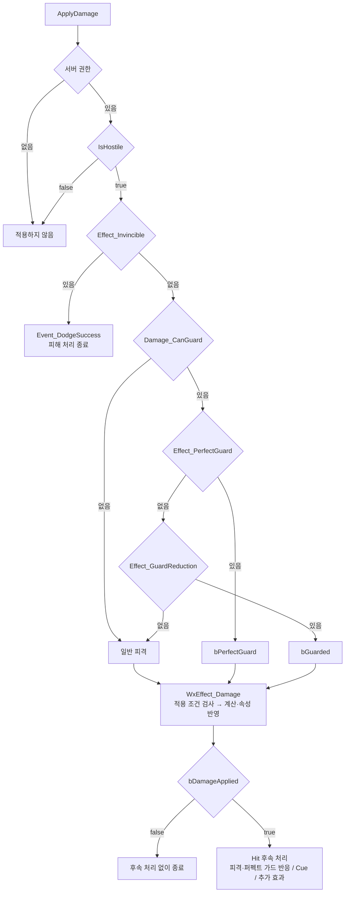

# 피해 처리와 전투 연출

## 한줄 요약

피해 처리는 권한·적대·무적·가드 판정을 거쳐 피해·반사량을 계산하고 결과에 따라 반응과 연출을 실행합니다.

## 피해 처리 흐름

이 그림은 **피해가 중단되는 지점과 방어 결과가 결정되는 순서**를 보여준다. 노드의 식별자는 코드 검색용이며 전체 조건식을 재현하지 않는다. 계산 결과와 후속 반응의 차이는 바로 아래 표에서 확인한다.

서버 권한은 `ApplyDamage`에서 공격자 ASC, `CanGameplayEffectApply`에서 대상 ASC의 `IsOwnerActorAuthoritative()`로 각각 검사한다. `IsHostile`은 두 ASC의 Avatar를 비교하며 팀 인터페이스가 없거나 중립·우호이면 거부한다. 그림에서 무적·가드 상태는 대상의 태그, `Damage_CanGuard`는 공격 Spec의 태그다. 객체·피해 행의 유효성 검사는 생략했다.

### 방어 결과별 차이

아래 자원 변화는 피해 GE 적용에 성공한 경우다. `Ability_Death`가 있으면 피해 GE가 거부되며, 후속 Cue·반응·추가 효과도 실행하지 않는다.

| 결과 | 피해 계산·자원 반영 | 후속 처리 |
| --- | --- | --- |
| 일반 피격 | 허용된 크리 반영, HP 차감 → GP 증가 | 양수 공격 피해이면 피격·피해 가함 이벤트. 추가 효과 적용 |
| 일반 가드 · `bGuarded` | 크리·가드 경감 반영, SP 차감 → HP 차감 → GP 증가 | 차감 전 SP가 피해량 이하이면 `Damage_GuardBreak`. 가드 유지 여부에 따라 반응 결정. 추가 효과 적용 |
| 퍼펙트 가드 · `bPerfectGuard` | 크리·가드 경감 없이 반사량 계산. 대상 HP·SP·GP 피해 없음 | `Event_PerfectGuard`, 공격자 반사 GP, 조건부 패리 반응. 추가 효과 없음 |

일반 피격·가드의 자원 변화는 최종 피해가 양수일 때만 발생한다. 이미 `Ability_Groggy` 상태인 대상에게는 GP를 추가하지 않는다. 퍼펙트 가드는 일반 가드보다 우선하며, 가드 불가 공격에는 둘 다 성립하지 않는다.

### 수정할 때 확인할 코드

| 확인할 내용 | 담당 코드 |
| --- | --- |
| 진입·권한·적대 | [WxCombatLibrary.cpp](../../../../Plugins/WxCombat/Source/WxCombat/Private/WxCombatLibrary.cpp)의 `ApplyDamage`, `IsHostile` |
| 무적·가드 판정·후속 반응 | [WxEffectComponent_Hit.cpp](../../../../Plugins/WxCombat/Source/WxCombat/Private/AbilitySystem/Effect/WxEffectComponent_Hit.cpp)의 `CanGameplayEffectApply`, `OnGameplayEffectApplied`, `ProcessDamageTaken`, `ProcessPerfectGuard` |
| 공격의 크리·가드·패리 허용 태그 | [WxDamageTableRow.cpp](../../../../Plugins/WxCombat/Source/WxCombat/Private/Damage/WxDamageTableRow.cpp)의 `MakeHitSpec` |
| 피해 GE 거부·계산·출력 순서 | [WxEffect_Damage.cpp](../../../../Plugins/WxCombat/Source/WxCombat/Private/AbilitySystem/Effect/WxEffect_Damage.cpp)의 `UWxEffect_Damage`, `UWxExecCalc_Damage::Execute_Implementation` |
| HP·GP 반영·사망·그로기 이벤트 | [WxCombatAttributeSet.cpp](../../../../Plugins/WxCombat/Source/WxCombat/Private/AbilitySystem/Attribute/WxCombatAttributeSet.cpp)의 `PostGameplayEffectExecute` |
| 실행 결과 수집·피해 숫자 연출 | [WxEffectComponent_DamageResponse.cpp](../../../../Plugins/WxCombat/Source/WxCombat/Private/AbilitySystem/Effect/WxEffectComponent_DamageResponse.cpp)의 `OnGameplayEffectExecuted` |

### 놓치기 쉬운 조건

- **HP를 GP보다 먼저 반영한다.** 사망 반응이 그로기 발동보다 먼저 처리되도록 하는 순서다. HP가 0 이하이고 사망 태그가 없으면 `Event_Death`, MaxGP가 양수이고 GP가 상한에 도달했으며 그로기 상태가 아니면 `Event_Groggy`를 보낸다. 실제 발동·종료 조건은 [그로기](groggy.md)를 함께 확인한다.
- **가드 브레이크 태그만으로 반응을 정하지 않는다.** `Ability_Guard`가 유지 중일 때 `Event_Hit_GuardBreak`로 보낸다. 같은 타격의 그로기로 가드가 끊겼다면 `Event_Hit`으로 보낸다. 가드 불가 공격은 피격 이벤트 전에 가드를 취소한다.
- **반사 GP와 패리 반응은 별개다.** 공격자가 이미 그로기이면 반사 GP를 추가하지 않는다. `Damage_CanParry`는 `Event_Hit_Parry`만 제어한다. 반사량 0도 `bHasReflect`가 남으므로 퍼펙트 가드 반응과 연출을 유지한다.
- **적용 성공은 양수 피해를 뜻하지 않는다.** `ApplyDamage`는 자식 GE의 `bDamageApplied`를 반환한다. 0 피해로도 true일 수 있으며, 퍼펙트 가드가 아니면 추가 효과도 적용한다. 무적·GE 거부는 false다.
- **후속 효과는 계산 후 상태를 모두 다시 읽지 않는다.** 추가 효과 Spec은 피해·반응 이벤트 전 소스 태그를 캡처한다. `DamageResponse`는 실행 기록에서 피해·반사·태그를 수집한다. 양수 `Damage_Attack`은 피해 숫자 연출과 피격·피해 가함 이벤트를 발생시키고, 양수 피해 또는 반사 기록이 있으면 `GameplayCue_Hit`을 실행한다.

### 피해량 계산

최종량은 `Round(Max(ATK × CoeffATK × K / (K + DEF), 0) × 크리 배율 × 가드 배율)`이다. K는 DefenseConstant를 작은 양수 이상으로 제한한 값이다. 크리는 `Damage_CanCritical`일 때 확률 판정하며, 일반 가드 배율은 `1 − Clamp(GuardReductionScale, 0, 1)`이다. 퍼펙트 가드는 크리·가드 배율을 1로 두어 반사량을 산출한다.

## 권한과 연출

- **리플리케이션/권한**: `ApplyDamage`와 소환물 생성은 서버 권위를 검사한다. `UWxAbilityBase`의 기본 실행 정책은 LocalPredicted이며, `ApplyEffect`도 예측 키를 사용하므로 모든 GE가 서버 전용인 것은 아니다. 락온 대상은 서버에서 복제하지만 선택 자체는 클라이언트를 신뢰한다. 각 어빌리티·연출의 실제 멀티 동작은 별도 실행 검증이 필요하다.
- **연출 훅**: `UWxCueNotify_*`(GameplayCue)와 `Public/AnimNotify/WxAnimNotify(State)_*`(무기 판정·AOE 대미지·GE 적용·소환·투사체·모션워핑·슬로우타임·콤보 창/후딜 전이). `UWxAbilitySystemGlobals`를 `DefaultGame.ini`의 `AbilitySystemGlobalsClassName`에 등록해야 큐 위치가 히트 결과에서 채워진다 — 빠지면 큐가 원점에서 터진다.

출처·검증 및 참고 정보

> 상태: current · 범위: 본문 핵심 계약·주요 C++ 경로의 정적 재검증 · 2026-09-20 · 기준 커밋: 5a3f282e3bd71fd85d263021c113cd30558820b7
> 아래 검증 범위와 근거에 명시한 경로를 현재 작업 트리에서 확인했습니다. 전체 소스의 결함 검토·빌드·게임 실행·BP/WBP·DataTable·BT/StateTree 에셋 내부는 미검증입니다.
> [Wiki 목차](../../index.md) · [운영 절차](../../wiki-maintenance.md)

2026-09-22 문서 분리 당시의 검증 기준은 위와 같습니다. 이후 이 페이지의 다이어그램과 판정 설명은 현재 작업 트리의 ApplyDamage·IsHostile·MakeHitSpec·Hit 컴포넌트·Damage GE/ExecCalc·CombatAttributeSet·DamageResponse를 정적으로 대조했습니다. 다른 권한·연출 설명은 기존 확인 범위를 승계하며, 빌드·실제 게임·멀티플레이·바이너리 에셋 내부는 추가 검증하지 않았습니다.

## 검증 범위와 근거

- [Hit 처리](../../../../Plugins/WxCombat/Source/WxCombat/Private/AbilitySystem/Effect/WxEffectComponent_Hit.cpp)와 [결과 수집](../../../../Plugins/WxCombat/Source/WxCombat/Private/AbilitySystem/Effect/WxEffectComponent_DamageResponse.cpp)을 대조해 위 처리 순서를 정정했다. 피해·쿨다운 수치가 들어 있는 실제 DataTable은 확인하지 않았다.
- [Combat 설정](../../../../Plugins/WxCombat/Source/WxCombat/Public/System/WxCombatDeveloperSettings.h)의 `DefenseConstant`는 [피해 계산](../../../../Plugins/WxCombat/Source/WxCombat/Private/AbilitySystem/Effect/WxEffect_Damage.cpp)에서 읽는다. AnimNotify 표시색도 이 설정을 사용한다.

전체 어빌리티·노티파이·무기·컷신 실행과 바이너리 에셋 배선은 미검증입니다.

관련: [전투 개요](index.md), [어빌리티와 이펙트](abilities.md), [그로기](groggy.md).

*이관 원문의 기준 커밋 `2872e9a` · 생성일 2026-09-17 · 소스 187파일 — 원문 출처 보존; 현재 확인 범위는 이 참고 정보 참고*

