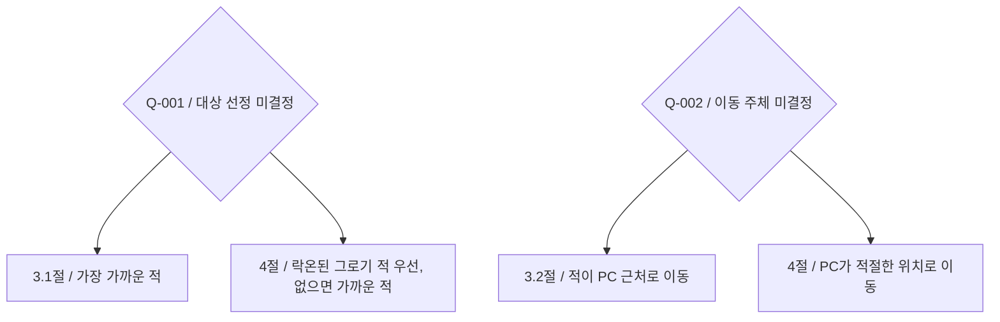

# 그로기 피니시

## 한줄 요약

그로기 피니시 기획의 대상 선정과 위치 조정 규칙이 서로 충돌하여 확정 판단이 필요합니다.

[원 기획서](../../../../Docs/CombatDesign/그로기_피니시_시스템_기획서.md)에는 그로기 적을 상호작용 키로 공격하고 피해 후 게이지를 제거하는 흐름이 있다. 그러나 다음 두 규칙은 확정된 하나의 요구사항으로 정리할 수 없다.

| 항목 | 본문 | 흐름도 |
| --- | --- | --- |
| 복수 후보 | 3.1절: 가장 가까운 적 | 4절: 락온된 그로기 적 우선, 없으면 가까운 적 |
| 위치 조정 | 3.2절: 적이 PC 근처로 이동 | 4절: PC가 적절한 위치로 이동 |

이는 동일 원자료 내 충돌이며 문서 날짜로 우선순위를 정할 수 없다. 아래 미결정으로 추적한다. 이 페이지는 현재 코드가 어느 규칙을 구현했는지 또는 어느 규칙이 옳은지 판정하지 않는다.

관련: [그로기](groggy.md), [WxCombat](index.md), [WxWorld](../world/index.md), [WxGame](../game/index.md).

## 충돌하는 기획 비교

실행 순서가 아니라 원 기획서의 서로 다른 서술을 비교한 그림이다. 어느 쪽도 확정하지 않으며 Q-001·Q-002의 답과 근거는 아래 항목에서 관리한다.

## 확인할 사항

- **Q-001:** 피니시 대상은 가까운 적 우선인가, 락온 우선인가? 원 기획서 3.1절과 4절의 충돌로 기획 결정이 필요하다.
- **Q-002:** 피니시 위치 조정은 PC와 적 중 누가 이동하는가? 원 기획서 3.2절과 4절의 충돌로 기획 결정이 필요하다.

결정자와 답은 아직 확인되지 않았다. 2026-09-21 기존 검토 문서의 미결정을 통합했으며, 원자료 재검증은 아니다. 기존 검토 기준 커밋은 `5836af84`다. 확정 시 답·근거·날짜를 이 문서에 기록한다.

출처·검증 및 참고 정보

상태: blocked · 범위: 기획 내부 불일치 확인, 구현 대응 미검증 · 2026-09-20

