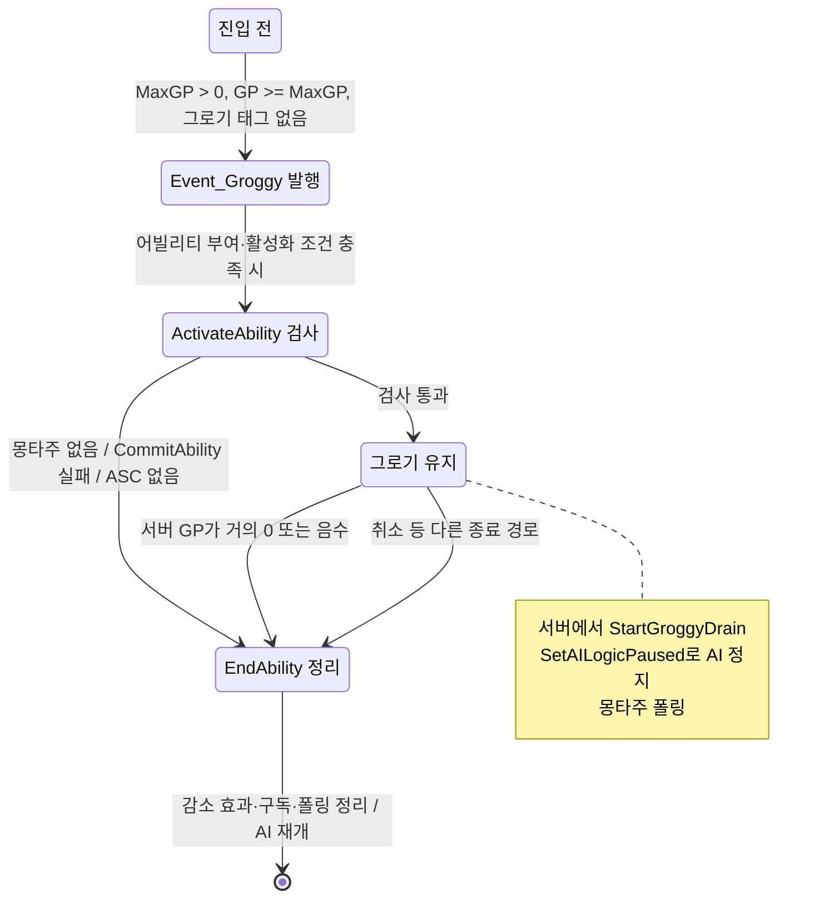

# 그로기

## 한줄 요약

그로기는 GP가 최대치에 도달하면 진입을 요청하는 구조이며, 기획 요구와 확인된 구현 범위를 구분해야 합니다.

## 요구사항

[그로기 기획](../../../../Docs/CombatDesign/그로기_시스템.md)의 3·6절은 스태거 최대치에서 진입하고, 그로기 중 감소하여 0에서 종료한다고 명시한다. 이동·공격 불가, 받는 피해 30% 증가도 기획 요구다. 이 페이지에서는 실제 캐릭터의 피해 배율을 검증하지 않았다.

## 구현 관찰

- [WxCombatAttributeSet.cpp](../../../../Plugins/WxCombat/Source/WxCombat/Private/AbilitySystem/Attribute/WxCombatAttributeSet.cpp)의 `PostGameplayEffectExecute`는 GP 변경 시 MaxGP > 0, GP >= MaxGP, 그로기 태그 부재를 확인하고 `Event_Groggy`를 발행한다.
- [WxAbility_Groggy.cpp](../../../../Plugins/WxCombat/Source/WxCombat/Private/AbilitySystem/Ability/WxAbility_Groggy.cpp)의 `ActivateAbility`는 몽타주·커밋 가능 여부를 확인하고 서버 권위에서 `StartGroggyDrain`을 호출한다. 몽타주가 없으면 즉시 종료될 수 있다.
- `HandleGPChanged`는 GP가 거의 0이거나 음수일 때 종료한다. `SetAILogicPaused`는 BrainComponent를 일시정지·재개한다. `EndAbility`는 감소 효과와 구독을 정리한다.

## 그로기 상태와 종료

구현 관찰에 해당하는 어빌리티 수명만 요약한다. Event_Groggy 발행이 활성화 성공을 보장하지 않으며 실제 AbilitySet·몽타주·GE 배선은 미검증이다. 이동 제한·피해 배율 등 기획 요구는 이 상태도에 구현된 사실로 추가하지 않는다.

## 변경할 때 확인할 곳

진입 기준은 AttributeSet, 지속·종료는 Groggy 어빌리티, 피니시와 겹치는 규칙은 [피니시](finisher.md)를 함께 확인한다. 구조 탐색은 [WxCombat](index.md), AI 접점은 [WxAI](../ai/index.md)에 있다.

## 확인 범위 밖

개별 BP의 AbilitySet 부여, 몽타주·GE 설정, 실제 피해 증가량, 멀티플레이 종료 타이밍은 미검증이다. 이 정적 경로 확인을 모든 적의 정상 동작 보증으로 해석하지 않는다.

출처·검증 및 참고 정보

상태: current · 범위: 아래 기획과 C++ 경로의 정적 확인 · 2026-09-20 작업 트리

