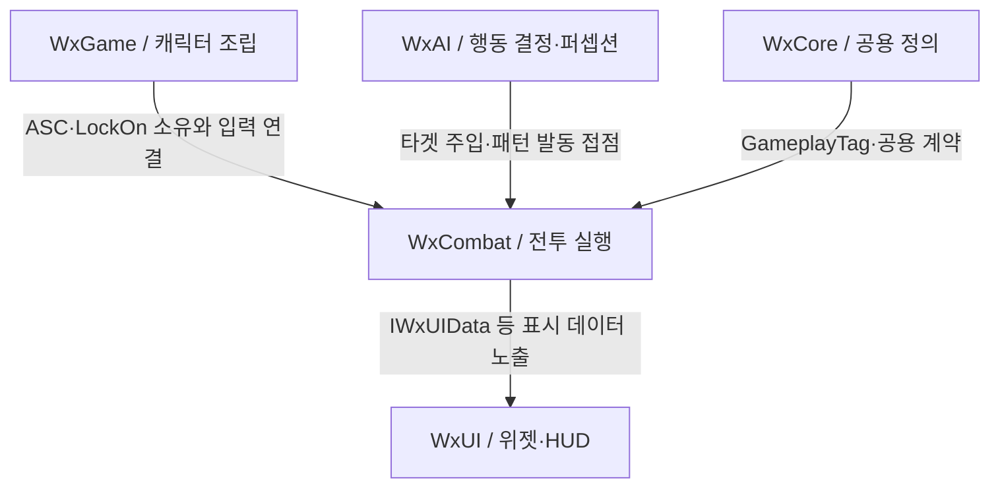

# WxCombat — 전투 시스템

## 한줄 요약

WxCombat은 GAS를 기반으로 어빌리티·전투 자원·피해 처리와 전투 상태를 관리합니다.

> Gameplay Ability System(GAS) 위에 세운 액션 RPG 전투 전반을 담당한다. 어빌리티·어트리뷰트·이펙트·대미지 파이프라인·락온/타겟팅·무기/투사체/소환물·처형까지 실제 전투 루프를 이 모듈이 굴린다.

## 책임
**담당**
- ASC 허브와 입력 라우팅(라이브 경로 + 선입력 버퍼), `UWxAbilitySet` 기반 어빌리티·이펙트·어트리뷰트 일괄 부여
- 전투 어트리뷰트(HP/SP/GP/MP/UP, ATK/DEF, Crit, SPD/ASPD, GuardReductionScale)와 상한 클램프·사망·그로기 규칙
- 대미지 파이프라인: Hit Wrapper의 적대·권한·무적 및 가드 판정 → Damage GE의 ExecCalc·속성 반영·결과 수집 → Hit의 후속 반응·추가 효과
- 어빌리티 발동 배타성(`EWxAbilityActivationGroup`)과 발동 중 캔슬 창(`EWxAbilityActionPhase`: Blocking→ComboWindow→Recovery)
- 무기 히트박스 스윕, 투사체·소환물 서버 권위 스폰, 처형(Finisher) 피해
- 락온/타겟팅(TargetingSystem 선택·필터·소터 태스크), 모션 워핑 스냅/러시, 히트스톱·슬로우타임·스킬 컷신 연출 훅

**경계 (비담당)**
- 어빌리티·이펙트의 표시 데이터(제목/설명/아이콘)는 `IWxUIData`로 노출만 하고 실제 위젯·HUD는 [WxUI](../ui/index.md)
- 공용 GameplayTag 선언(`WxGameplayTags`)·콜리전 채널·`IWxUIData` 같은 공용 정의는 [WxCore](../foundation/index.md). 자체 태그는 선언하지 않고 WxCore의 태그만 소비한다(2026-09-21 확인)
- 적·소환물의 행동 결정과 퍼셉션 타겟 주입은 [WxAI](../ai/index.md) — 전투는 `UWxLockOnComponent`라는 그릇과 `UWxAbility_Pattern` 같은 발동 대상만 제공한다
- 캐릭터 액터·컴포넌트 조립(ASC/LockOn 컴포넌트 소유)과 입력 매핑은 `WxGame`의 `AWxCharacterBase` 계열

## 책임 관계

아래는 본문의 책임·경계를 요약한 협력 관계다. 화살표는 표시된 역할의 연결이며 Build.cs 의존성이나 전체 호출 순서를 뜻하지 않는다. 실제 에셋 배선은 포함하지 않는다.

## 핵심 타입 (진입점)
| 타입 | 역할 | 위치 |
| --- | --- | --- |
| `UWxAbilitySystemComponent` | ASC 허브. 입력→어빌리티 라우팅의 유일한 진입점이자 AbilitySet 부여·몽타주 재생속도·메시 틱 정책의 주인 | [Plugins/WxCombat/Source/WxCombat/Public/AbilitySystem/WxAbilitySystemComponent.h](../../../../Plugins/WxCombat/Source/WxCombat/Public/AbilitySystem/WxAbilitySystemComponent.h) |
| `UWxAbilitySet` | 캐릭터 BP가 ASC에 꽂는 DataAsset. 어빌리티·이펙트·어트리뷰트 초기화 행을 묶어 서버에서 일괄 부여 | [Plugins/WxCombat/Source/WxCombat/Public/AbilitySystem/WxAbilitySet.h](../../../../Plugins/WxCombat/Source/WxCombat/Public/AbilitySystem/WxAbilitySet.h) |
| `UWxAbilityBase` | 모든 어빌리티의 베이스이자 배타/캔슬 모델의 정의처. 쿨·코스트를 데이터 행에서 읽는 규약도 여기 | [Plugins/WxCombat/Source/WxCombat/Public/AbilitySystem/Ability/WxAbilityBase.h](../../../../Plugins/WxCombat/Source/WxCombat/Public/AbilitySystem/Ability/WxAbilityBase.h) |
| `UWxCombatAttributeSet` | 전투 수치의 단일 보관처. 클램프·사망·그로기 판정과 ExecCalc가 실어 보낸 메타 어트리뷰트의 착지점 | [Plugins/WxCombat/Source/WxCombat/Public/AbilitySystem/Attribute/WxCombatAttributeSet.h](../../../../Plugins/WxCombat/Source/WxCombat/Public/AbilitySystem/Attribute/WxCombatAttributeSet.h) |
| `UWxCombatLibrary` | 모듈 바깥이 전투에 말을 거는 정적 진입점(`ApplyDamage`/`ApplyEffect`). 무기·투사체·노티파이가 전부 여기로 모인다 | [Plugins/WxCombat/Source/WxCombat/Public/WxCombatLibrary.h](../../../../Plugins/WxCombat/Source/WxCombat/Public/WxCombatLibrary.h) |
| `FWxHitEffectContext` | 대미지 GE가 파이프라인 전 구간에 실어 나르는 컨텍스트. 대미지 행 지목·방어 판정·실행 결과가 여기 모인다 | [Plugins/WxCombat/Source/WxCombat/Public/Damage/WxHitEffectContext.h](../../../../Plugins/WxCombat/Source/WxCombat/Public/Damage/WxHitEffectContext.h) |
| `UWxInputBufferComponent` | 선입력 정책의 주인. ASC가 라우팅만 하는 대신 "무엇을 얼마나 오래 기억할지"를 여기서 정한다 | [Plugins/WxCombat/Source/WxCombat/Public/AbilitySystem/WxInputBufferComponent.h](../../../../Plugins/WxCombat/Source/WxCombat/Public/AbilitySystem/WxInputBufferComponent.h) |
| `AWxWeaponBase` | 몽타주 노티파이가 켜고 끄는 근접 히트 판정의 주체. 받은 대미지 행을 `ApplyDamage`로 흘려보낸다 | [Plugins/WxCombat/Source/WxCombat/Public/Weapon/WxWeaponBase.h](../../../../Plugins/WxCombat/Source/WxCombat/Public/Weapon/WxWeaponBase.h) |

## 기능별 지식

`UWxTargetingSelectionTask_LockOn`은 `UTargetingSelectionTask_AOE`와 함께 사용하며, 락온 대상을 추가하거나 기존 결과를 선두로 옮긴다. 기존 후보와 상대 순서·충돌 정보는 유지하고, 락온이 없으면 결과를 변경하지 않는다. 최종 락온 우선순위를 유지하려면 AOE와 일반 정렬 뒤에 배치한다. 별도 락온 Sorter는 사용하지 않는다. [구현](../../../../Plugins/WxCombat/Source/WxCombat/Private/Targeting/WxTargetingSelectionTask_LockOn.cpp), [기존 필터 클래스 리다이렉트](../../../../Config/DefaultEngine.ini)에 근거한다. 이전 필터의 `bSkipIfEmpty` 옵션은 제거되었다. 2026-09-22 코드 확인 기준이며 기존 프리셋의 실제 태스크 순서와 플레이 동작은 미검증이다.

- [어빌리티와 이펙트](abilities.md) — 부여·발동·캔슬·비용·데이터 확장 규약
- [피해 처리와 전투 연출](damage.md) — Hit 처리 순서·권한·설정·연출 접점
- [그로기](groggy.md) — 기획과 C++ 진입·종료 경로
- [그로기 피니시](finisher.md) — 대상 선정·위치 조정의 기획 충돌과 미결정
- [전투 자원](resources.md) — 공통 기획과 현광의 예외·미결정

## 관련
- 상위: `WxGame`(유일한 소비 모듈 — 캐릭터가 ASC·락온 컴포넌트를 소유하고 어빌리티를 꽂는다)
- 기반: [WxCore](../foundation/index.md) · 협력: [WxUI](../ui/index.md), [WxAI](../ai/index.md)

출처·검증 및 참고 정보

> 상태: current · 범위: 본문 핵심 계약·주요 C++ 경로의 정적 재검증 · 2026-09-20 · 기준 커밋: 5a3f282e3bd71fd85d263021c113cd30558820b7
> 아래 검증 범위와 근거에 명시한 경로를 현재 작업 트리에서 확인했습니다. 전체 소스의 결함 검토·빌드·게임 실행·BP/WBP·DataTable·BT/StateTree 에셋 내부는 미검증입니다.
> [Wiki 목차](../../index.md) · [운영 절차](../../wiki-maintenance.md)

## 검증 범위와 근거

이 참고 정보의 기존 검증 기준을 유지합니다. 어빌리티와 피해 처리의 근거·미검증 범위는 각 기능 페이지에서 확인합니다. 문서 분리는 코드 재검증이 아닙니다.

- [MinionComponent](../../../../Plugins/WxCombat/Source/WxCombat/Private/Minion/WxMinionComponent.cpp)·[MinionSubsystem](../../../../Plugins/WxCombat/Source/WxCombat/Private/Minion/WxMinionSubsystem.cpp): 네이티브 CDO 컴포넌트가 상한·주인 상태 태그·소환/취소 조건을 선언한다. 주인은 Instigator에서 찾고, 같은 주인 상태 태그의 소환물에 상한을 적용한다. 0은 무제한이며 초과 시 오래된 소환물을 제거한다. 소환물의 재소환은 거부한다.

*이관 원문의 기준 커밋 `2872e9a` · 생성일 2026-09-17 · 소스 187파일 — 원문 출처 보존; 현재 확인 범위는 이 참고 정보 참고*

