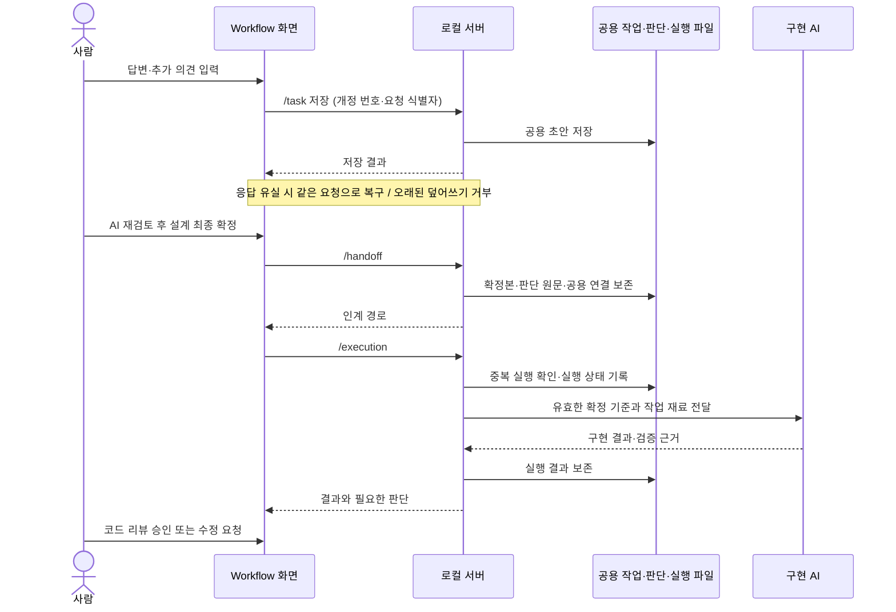

# Wiki·Workflow 도구 구조

## 한줄 요약

Wiki는 지식을 열람하고, Workflow는 공용 작업 파일과 로컬 AI를 연결해 판단·실행·저장 복구를 처리합니다.

[Wiki 목차](../../index.md) · [Wiki 유지 관리](../../wiki-maintenance.md) · [개발 작업 절차](../../../workflow/process/index.md)

## 검색과 탐색

Wiki 화면은 검색창·검색 결과와 문서 열람에 집중한다. 사이드 메뉴·생성 시각·운영 안내는 표시하지 않으며 검색어가 없으면 전체 문서 목록을 펼치지 않는다. index.md는 AI의 지식 탐색 목차로 유지하고, Workflow 메뉴는 .agents/workflow/index.md에서 생성한다.

검색은 카테고리 필터 없이 문서 제목·코드 심볼·본문의 검색어로 수행한다. 검색 결과에 작업 단계 배지를 표시하지 않으며 Wiki 문서에도 검색 분류용 작업 단계 문구를 넣지 않는다. Workflow 절차 문서도 Wiki 검색에 포함하며 열면 Workflow 화면으로 이동한다. 진행 중 인계·검토 자료는 Workflow 검색에서 찾는다. 문서 검증 상태·경로·등록된 확인 범위·기준 커밋은 본문의 출처·검증 근거와 함께 문서 맨 아래의 “출처·검증 및 참고 정보”에 기본적으로 접어 표시한다. AI는 접힌 정보까지 확인하며 검증 범위 자체는 바꾸지 않는다. Wiki 본문은 화면 너비를 활용하고 다이어그램 이미지는 본문 폭에 맞춰 축소한다.

Wiki의 코드 참조는 뷰어에서 링크 없이 Markdown 백틱과 같은 인라인 코드 스타일로 표시한다. Markdown 원문의 상대경로는 AI의 근거 추적용으로 유지하지만, 생성기는 연결된 소스 파일을 읽거나 HTML에 포함하지 않는다. 문서 간 이동과 외부 웹 링크는 유지한다.

## 로컬 웹 뷰어

[OpenWiki.bat](../../../../BatchFiles/OpenWiki.bat)은 AI 서버 없이 지식 검색 화면을 연다. [OpenWorkflow.bat](../../../../BatchFiles/OpenWorkflow.bat)은 로컬 AI 연결을 시작하고 작업·판단 화면을 연다. 두 실행기는 PowerShell 7을 사용하며, Workflow에는 Node.js와 선택한 AI CLI가 필요하다. 파일 첨부 변환의 Python 조건은 아래를 참고한다.

Markdown과 sources.json은 공용 정본이다. Export-Wiki.ps1은 Wiki를 Saved/Wiki/knowledge.html에, Workflow를 Saved/Wiki/index.html에 생성한다. Workflow는 기존 파일 URL과 브라우저 저장 키를 유지하여 미확정 입력·판단·저장 복구 기록의 이동을 피한다. 화면에서 서로 이동할 수 있으나, AI 연결이 없을 때는 OpenWorkflow.bat을 실행해야 한다. Wiki는 AI 인증 토큰·작업 상태 코드를 포함하지 않고 네트워크 연결도 차단한다. 지식 작성·갱신은 AI 작업에서 수행하며 Wiki 화면이 자율적으로 문서를 생성하는 기능은 아니다.

기획·설계의 AI 재검토 중에는 중앙 진행 안내와 회전 표시를 띄우고 배경 입력·메뉴 조작을 잠근다. 완료·실패 시 잠금을 풀고 결과 안내로 이동하며, 실패한 경우 기존 답변을 보존하고 재시도를 안내한다. 페이지 이탈·새로고침 시에는 브라우저의 이탈 확인을 요청한다. 판단 카드에는 확정 전(노랑), 답변 확정됨(초록)을 색상과 문구로 함께 표시한다. 확정 답변을 수정하면 확정 전 상태로 되돌아간다.

인계 저장 버튼 옆에는 저장 가능 여부와 필요한 조치를 표시한다. 미확정 답변·미해결 사항·재검토 필요 상태에서는 저장을 비활성화한다. 저장 중에는 중앙 진행 안내를 표시하고, 완료 후 인계 경로를 안내한다. 실패하면 구체적인 오류와 복구 방법을 유지한다. 사실·조사 근거와 자료·충돌의 별도 상세 섹션은 화면에 표시하지 않고 AI 검토·인계 자료로 보존한다.

문서 변경 후 실행기를 다시 실행한다. 문서 감시나 주기적 갱신은 하지 않는다. 검증 상태는 등록된 범위에 대한 표시이며 실시간 코드 검증 결과가 아니다. 생성 HTML은 저장소와 같은 범위에서 관리한다.

기획·구현 설계는 AI가 판단 자료 준비 → 사람이 항목별 답변 → AI가 결정 기록·통합 → AI 재검토 → 추가 판단만 질문하는 과정을 반복한다. 원문에 명확한 사실은 AI가 추출하고 사람에게 재입력시키지 않는다. 통합된 기획·설계는 사람이 최종 확정한다. 확정 답변은 보존하고 변경 영향이 있는 항목만 이유와 함께 다시 질문한다. AI가 원본·최종본·판단 기록·구현 및 검증 재료의 인계를 담당한다. 상세 절차는 [기획](../../../workflow/process/planning.md)과 [구현](../../../workflow/process/implementation.md)에 둔다.

입력·답변·초안·진행상황은 `.agents/workflow/tasks/workflow_<작업 제목>_task.json`에 저장한다. 인증된 `/tasks` 조회와 `/task` 저장을 사용하며, 화면을 열면 파일에서 작업 목록을 읽어 기존 작업을 선택한다. 일반 리뷰 Markdown은 작업 목록에 포함하지 않는다. 브라우저에는 미전송 입력과 실패 요청의 복구 자료만 유지한다. 화면 진입·복귀와 연결 복귀 시 목록 조회·저장 결과 확인을 자동 수행한다. 사용자에게 새로고침·복구 버튼이나 별도 복구 작업 생성 기능을 제공하지 않는다. 작업 저장은 개정 번호로 오래된 덮어쓰기를 차단하고 동일 요청을 재전송해도 중복 적용하지 않는다. 과거 브라우저 목록은 읽지 않으며 자동 이관·중복 작업 생성은 하지 않는다. 최종 확정은 인증된 `/handoff`에서 작업·단계별 Markdown·JSON과 목록 링크를 만든다. 최종 확정본은 삭제·덮어쓰지 않는다. 변경은 `/change`로 새 작업을 생성해 이전 원본·판단·초안을 연결한다. 기존 작업의 공용 기록에 후속 작업을 연결하며 `node .agents/scripts/Wiki-AI.cjs --current "작업 제목"`는 이전·새 작업 어디에서 시작해도 변경 연결 전체를 따라 최신 기획·설계와 `pending` 보류 범위를 반환한다. 기획 변경이 확정되면 이전 설계를 새 기획에 적용하지 않으며, 설계만 변경하면 확정 기획을 그대로 이어받는다. 새 설계 확정 뒤 영향받는 구현·리뷰·테스트만 다시 수행한다. 기존 판단과 수용 근거는 과거 버전의 기록으로 보존한다.

기획·설계 분석은 기존 판단과 추가 의견을 함께 화면에서 선택한 Codex·Claude Code·Gemini CLI에 전달한다. 서비스별 읽기 전용 조사 제한과 응답 변환은 `.agents/scripts/Wiki-AI-Providers.cjs`에서 담당한다. 설계 분석은 관련 코드·설정·Wiki를 조사하고 확인한 근거와 자료 부족을 구분한다. 상태 모델과 서버가 같은 응답 검증을 사용하며 답변 변경 뒤 AI 재검토 전에는 최종 확정할 수 없다. 서버 코드를 갱신하면 실행기는 저장소 소유가 확인된 유휴 프로세스만 재시작한다. 기획·설계 검토에는 Node.js와 선택한 CLI의 설치·로그인이 필요하다. 구현·검증 실행에는 현재 Codex CLI가 필요하며 workspace-write 샌드박스를 사용한다. 설치된 CLI가 없으면 검토 버튼을 비활성화하지만 문서 열람과 로컬 인계 서버는 사용할 수 있다. 서비스별 인자·응답·실패 검증은 `node .agents/scripts/TestWikiProviders.cjs`, 모의 연결·인계 저장 검증은 `node .agents/scripts/TestWikiAI.cjs`, 실제 Codex 분석 검증은 같은 명령의 `--live` 또는 `--live-planning` 옵션과 실행 파일 경로를 사용한다. UI는 `node .agents/scripts/TestWikiViewer.cjs`로 반복 판단·보존·무효화·저장 실패·구버전 이관을 검사한다. 이 검사는 실제 모델 품질·브라우저 권한·게임 실행 검증이 아니다.

첨부 문서는 로컬 `/import`에서 Python으로 텍스트를 추출한다. Word(.docx) 본문·표, PDF 텍스트, PowerPoint(.pptx) 슬라이드 텍스트를 지원한다. 최대 20MB·추출 후 120,000자이며 이미지·스캔 OCR·도표·발표자 노트는 포함하지 않는다. UTF-8 Markdown·텍스트는 브라우저에서 읽는다. Python은 `WX_WIKI_PYTHON`, 현재 사용자 Codex 번들, PATH 순서로 찾으며 PDF에는 `pypdf`가 필요하다. 검증 명령은 `node .agents/scripts/TestWikiImport.cjs`다.

## 웹 작업 실행

작업 메뉴는 하나이며 현재 공용 기록에서 필요한 화면을 결정한다. 기획 확정은 설계 조사로, 설계 확정은 구현으로, 코드 리뷰 승인은 검증으로 이어진다. 최종 수용은 사람이 한다. 단계 선택·인계 문서 복사·명령 실행을 사용자에게 맡기지 않는다.

구현·검증 상태의 정본은 workflow_<제목>_execution.json이다. Workflow-Execution.cjs가 실행·결과·승인을 기록하고 /tasks가 초안과 확정 기록을 합쳐 읽는다. 브라우저 초안 저장은 실행 상태를 덮어쓰지 않는다. UI는 wiki-viewer/execution.js에서 결과와 판단만 표시한다. 상태를 여러 입력란에 중복 저장하지 않는다.

인증된 /execution은 동일 요청의 재전송으로 구현을 중복 실행하지 않는다. 실행 중에는 같은 저장소의 추가 구현과 확정 기준 변경을 막는다. 서버 중단은 중단 상태로 기록하고 이전 프로세스가 남아 있으면 저장소 전체의 추가 AI 실행을 막는다. 수정 요청은 판단 기록에 보존하며 실패 후 재시도에도 그대로 전달한다. 코드 리뷰·최종 수용은 결과를 생성한 코드 버전에 연결한다. 검증 중 코드가 변경되면 코드 리뷰로 돌아간다. 실패·미실행 검사를 통과로 바꾸지 않으며 미검증 수용에는 이유가 필요하다. 코드 검토용 diff는 현재 HEAD 대비 저장소 변경이며 기존 미커밋 변경도 포함한다.

TestWorkflowExecution.cjs는 실행 중복·중단·코드 변경·승인·미검증 수용·CLI 호출을 모의 검증한다. 실제 AI 응답 품질·UE 빌드·게임 플레이 성공을 보증하는 검사는 아니다.

## 저장과 구현 실행

본문의 저장·실행 계약을 요약한 시퀀스다. 확정 인계와 구현 실행은 구분하며, 아래 그림은 정상 경로와 대표 복구 경로만 포함한다. 실제 모델 품질·게임 실행 성공을 보증하지 않는다.

## 저장과 복구

한 작업은 한 사람이 편집하며 다른 사람은 공용 파일로 진행상황·결과를 확인한다. 별도 체크아웃·PC에는 작업 파일과 관련 확정 인계·공용 기록을 함께 전달해야 한다. 자동 Git 전송은 제공하지 않는다. 동시 편집 병합이나 충돌 선택 화면은 제공하지 않는다. 오래된 저장 요청은 거부하고 미전송 입력은 브라우저에 보존한다. 확정·변경 작업 생성·제목 변경 전에 요청 식별자·정확한 요청·반영할 입력 상태를 브라우저에 저장한다. 응답 유실이나 브라우저 저장 실패는 같은 요청으로 복구하며 이전 작업과 새 작업을 함께 보존한다. 변경 시작은 자식 기록을 준비한 뒤 상위 기록에 연결하므로 중간 실패 시 기존 기준은 유지된다. 연결되지 않은 자식은 구현 기준으로 쓰지 않는다. 확정 저장과 변경 연결은 개정 번호로 오래된 요청을 차단한다. 구버전의 미처리 철회 요청은 파일을 삭제하지 않고 복구한다. 이미 처리된 구버전 철회는 기존 처리 결과만 반환하며 삭제된 자료를 자동 복원하지 않는다. 관련 회귀 검사는 `TestWikiAI.cjs`와 `TestWikiRecovery.cjs`에 둔다.

Workflow 작업은 제목 자체(1~80자)를 식별자로 사용하며 별도의 내부 작업 ID가 없다. 공용 작업 파일, 공용 기록의 `taskId`, 이전·후속 작업 연결, `workflow_<작업 제목>_<단계>.md/.json` 파일명에 같은 제목을 쓴다. 한글·공백·괄호를 지원하고 파일명 금지 문자·끝의 점과 공백·중복 제목을 차단한다. 기존 작업은 제목으로 열고, 새 제목을 입력하면 새 작업을 만든다. 변경 작업 제목은 기존 제목과 요청 내용으로 자동 제안한다. **제목 변경**은 `/rename`에서 파일명·공용 참조·표시 제목을 함께 갱신하되 인간 판단·확정 내용·시각은 유지한다. 서버에 `workflow_rename_pending.json`을 먼저 저장하고 전체 갱신을 완료하기 전 다른 인계 사용을 막는다. 브라우저도 같은 요청으로 파일·부모·자식 작업 키를 복구한다. 구버전 내부 ID 작업은 제목 변경 경로로 이관하며 미처리 요청을 먼저 복구한다. 저장 요청의 재전송 식별자는 작업 식별자가 아니다. 인계가 일부 저장됐어도 공용 기록에 연결되지 않으면 구현 기준이 아니다.

작업 화면의 진행상황은 검토·답변·확정 기록에서 계산하며 별도 단계·메모를 입력받지 않는다. 첫 검토 전에는 기획서 입력만 표시하고, 추가 수정 의견은 검토 후 또는 저장된 의견이 있을 때 표시한다. 기존 진행 메모는 읽기 전용으로 보존한다. 작업 현황과 작업 편집 화면은 같은 상태 계산 함수를 사용한다.

## Mermaid 표시

Markdown의 mermaid 블록을 로컬 Mermaid 11.12.0으로 렌더링하고 SVG 데이터 이미지로 표시한다. 원문은 접힌 상세 영역에 유지하며 문법 오류 시 원문과 오류 안내를 남긴다. strict 설정과 이미지 격리로 문서의 HTML·클릭 동작을 실행하지 않는다. 렌더링 중 페이지를 바꾸면 이전 결과를 새 문서에 적용하지 않는다.

배포 파일과 MIT 라이선스는 `.agents/scripts/wiki-viewer/vendor/`에 있으며 Export-Wiki.ps1이 생성 HTML에 포함한다. 버전·출처·해시는 해당 폴더의 README를 따른다. 실제 브라우저 검사는 `TestWikiDiagrams.cjs`로 수행한다.

2026-09-22 Mermaid 표시만 Edge에서 확인했다. flowchart·stateDiagram-v2·sequenceDiagram의 다섯 그림, 외부 요청 없음, 오류 시 원문 보존과 화면 전환을 검사했다. 이는 기존 Workflow 실행·게임 검증 범위를 확대하지 않는다. 검사는 Node.js·Playwright·Edge가 필요하며 Playwright가 별도 위치에 있으면 `WX_WIKI_PLAYWRIGHT`에 패키지 경로를 지정한다.

출처·검증 및 참고 정보

상태: current · 범위: 기존 운영 문서의 뷰어·저장·복구·실행 구조 설명 이관 · 기준: 기존 2026-09-21 검증 기록, 2026-09-22 문서 재분류; 실제 AI·브라우저·게임 실행 재검증 아님

