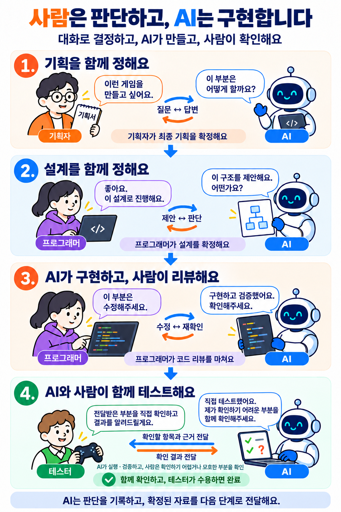

# 사용 방법 안내

상태: current · 범위: 반복 판단 워크플로우와 로컬 뷰어 사용 안내 · 기준: 2026-09-21 사용자 합의 및 작업 트리; 실브라우저·실제 AI 품질 미검증

**Workflow는 사람이 작업하고 판단하는 공간입니다.** AI가 준비·구현·검증·정리를 맡습니다. 지식 검색은 별도의 **Wiki**에서 합니다.

| 단계 | 내가 할 일 |
| --- | --- |
| [기획](../workflow/planning.md) | 기획서 입력 → 질문에 답변 → AI 재검토 → 기획 확정 |
| [구현](../workflow/implementation.md) | 설계 질문에 답변 → 설계 확정 → AI에 구현 요청 → 코드 리뷰 |
| [테스트](../workflow/testing.md) | AI가 확인을 요청한 부분 테스트 → 결과 승인 |
| [완료](../workflow/completion.md) | 최종 결과와 남은 제약 확인 |

AI 질문에 답한 뒤에는 **AI 재검토**를 거쳐 통합본을 최종 확정하세요. 위키의 확정 버튼이 코드 구현이나 게임 테스트를 자동 실행하지는 않습니다.

- 작업을 구분할 때: 새 작업을 만들 때 제목을 입력합니다. 기존 제목은 **제목 변경**으로 수정합니다.
- 다른 기획을 시작할 때: **새 작업 제목 입력 → 새 작업 만들기**

OpenWorkflow.bat으로 새로 열면 빈 시작 화면을 표시합니다. 이전 작업은 기존 작업 드롭다운에서 선택해 불러옵니다. 새로고침할 때도 빈 시작 화면을 표시하며, 저장된 입력은 기존 작업을 선택하면 불러옵니다.
- 확정한 내용을 바꿀 때: **변경 요청 입력 → 기획/설계 변경 작업 시작**
- 입력과 저장은 자동으로 처리하며 실패할 때만 안내합니다.
- 문서 변경을 화면에 반영할 때: **OpenWorkflow.bat 다시 실행**

첨부: **.md · .txt · .docx · .pdf · .pptx**, 최대 20MB·추출 후 120,000자. 이미지·스캔·도표는 읽지 않습니다.

입력·답변·초안·진행상황은 `.agents/in-progress/`의 공용 작업 파일에 자동 저장됩니다. 화면의 저장 상태를 확인하세요.

상세 절차와 운영 규칙 (필요할 때 펼치기)

## 시작과 역할

AI가 직접 구현하고, 테스트는 AI와 사람이 함께합니다. AI가 먼저 실행·검증하고, AI가 확인할 수 없거나 모호한 부분은 항목과 근거를 사람 테스터에게 전달합니다. 테스터는 해당 부분을 직접 확인하고 결과를 돌려줍니다. 필요한 수정·재검증을 거쳐 테스터가 결과를 수용하면 완료합니다.

[OpenWorkflow.bat](../../../BatchFiles/OpenWorkflow.bat)을 실행합니다. [목차](../index.md)의 기획 → 구현 → 테스트 → 완료를 탐색할 수 있습니다. 문서·보고서를 찾으려면 첫 화면의 **문서 검색**을 이용합니다. 문서 변경 후 실행기를 다시 실행하면 생성 HTML이 갱신됩니다.

**사람은 판단에 집중하고 AI는 그 판단을 실현하는 준비·구현·검증·기록·인계를 맡습니다.** 체크리스트는 사람의 판단 질문과 AI 작업 목록으로 나눕니다. 선택 수를 작업 완료나 인간 승인으로 취급하지 않습니다.

## 기획 반복 검토

1. 기획서 원본을 입력하거나 20MB 이하 .md·.txt·.docx·.pdf·.pptx 파일을 불러옵니다. AI 분석은 원본 120,000자까지 지원합니다.
2. **AI 기획 검토 · 답변 반영**을 누릅니다. 명확한 사실과 미정·충돌을 분리하고 통합 초안·판단 질문을 준비합니다.
3. 표시된 질문에 답변하고 **이 답변으로 결정**을 누릅니다. 기존 질문의 범위 제외가 제안된 경우에만 미리보기의 **검토 결과 반영 · 기존 판단 보존**으로 제외를 승인합니다.
4. AI 검토 버튼으로 답변을 반영·재검토합니다. 추가 질문이 있으면 반복합니다. 기존 판단은 보존하고 재확인이 필요한 항목에는 이전 답변과 이유를 표시합니다.
5. 필수 미결정·자료 부족이 해소된 통합 초안을 검토하고 **기획 최종 확정 · 인계 문서 저장**을 누릅니다. 답변 확정 직후에는 재검토 전까지 전체 확정을 할 수 없습니다. 질문이 없는 명확한 기획도 지원합니다.

통합 초안은 AI가 작성합니다. 질문이 없어도 **추가 요청·수정 의견**을 입력해 재검토할 수 있습니다. 최종 확정 전에는 답변·의견을 수정하며, 최종 확정 후에는 별도 변경 작업에서 영향받는 판단만 다시 검토합니다. 기존 확정본과 판단 기록은 보존합니다.

## 설계 반복 검토와 구현 인계

구현 화면은 확정된 기획과 인계 경로를 사용합니다. **AI 설계 검토 · 답변 반영**으로 코드·기존 패턴을 읽기 전용 조사하고 설계 초안·근거·구현 목록·설계 질문을 준비합니다. 기획과 같은 방식으로 답변·재검토를 반복합니다. AI가 수행할 구현 목록은 사람이 답할 질문과 별도로 표시합니다.

**설계 최종 확정 · 인계 문서 저장** 후 구현 AI는 표시된 인계 문서를 기준으로 구현·자체 검증·인간 리뷰 자료 준비를 진행합니다. 실제 코드 구현이나 에디터 플레이는 이 화면에서 자동 시작하지 않습니다. 구현·테스트 담당 AI가 기록·재료 수집을 맡고 사람은 설계·리뷰·결과 수용을 판단합니다.

## 저장과 실행 조건

같은 작업은 한 사람이 편집하고 다른 사람은 같은 공용 작업을 열어 확인합니다. 오래 열린 화면의 저장은 버전 충돌로 차단하며 자동 병합하지 않습니다.

확정·변경 작업 생성·제목 변경 요청은 전송 전에 복구 기록으로 보관합니다. 서버 처리 뒤 응답이 끊기면 화면 진입·복귀 또는 연결 복귀 시 같은 요청으로 저장 결과를 자동 확인합니다. 확인 전에는 입력·작업 전환을 잠그며 실패하면 짧은 안내를 표시합니다. 구버전의 미처리 철회 요청은 확정본을 지우지 않고 복구합니다. 구버전에서 이미 철회·삭제한 파일을 자동 복원하는 기능은 아닙니다.

**새 작업 제목 입력 → 새 작업 만들기**은 독립된 기획을 만들고, **기존 작업** 드롭다운은 보관한 입력·판단을 복원합니다. 원본 입력란 수정이나 파일 불러오기는 현재 작업을 수정합니다. 목록은 로컬 서버가 `.agents/in-progress/workflow_<작업 제목>_task.json`과 공용 확정 기록을 조회합니다. 일반 리뷰 문서는 작업 목록에 포함하지 않습니다. 화면 진입·복귀와 작업 선택 시 최신 목록을 자동으로 읽습니다. 별도 새로고침·복구 버튼은 두지 않습니다.

확정본은 고정하고 **변경 요청 → 기획/설계 변경 작업 시작**으로 새 작업을 만듭니다. 기존 원본·판단·초안과 이전 확정본을 자동 연결합니다. 기획 변경은 이후 설계도 재검토하며, 설계만 바꾸면 확정 기획을 그대로 사용합니다. 변경 검토 중 영향받는 구현은 보류하고 영향 없는 작업은 계속합니다. AI가 영향 범위를 조사해 변경 초안에 정리하며 새 확정본이 해당 기준을 대체합니다. 작업 제목 자체가 식별자입니다. 파일명과 변경 연결도 제목을 사용합니다. 제목은 중복될 수 없으며 **현재 작업 제목 변경**을 펼쳐 **제목 변경** 시 인계 파일명·공용 연결·브라우저 기록을 함께 갱신합니다. 한글·공백·괄호를 지원하며 파일명에 사용할 수 없는 문자와 끝의 점·공백은 사용할 수 없습니다.

AI가 제시한 범위 제외는 근거와 함께 미리보기에 표시하며 반영 시 승인합니다. 제외 질문은 이력을 유지합니다. **기획 변경 질문 함께 전달 · 답변 보존**은 기존 확정본을 보존하는 별도 기획 변경 작업에 관련 질문을 한꺼번에 전달합니다. 답변·확정 여부를 그대로 이어받습니다.

입력·답변·통합 초안·공유 진행상황은 편집 시 공용 작업 JSON에 저장합니다. 브라우저에는 전송 전 입력과 실패 요청만 복구용으로 보관합니다. 저장 성공 표시 전에는 페이지를 닫지 마세요. 저장 충돌 시 기존 공용 내용을 덮어쓰지 않고 입력을 유지하며 실패 이유를 표시합니다. 별도 복구 작업을 생성하지 않습니다. 진행 단계·다음 할 일 메모는 실제 리뷰나 테스트 승인을 대신하지 않습니다.

같은 저장소 폴더를 사용하는 브라우저는 같은 작업을 읽습니다. 다른 PC·별도 체크아웃에는 공용 작업 JSON과 관련 확정 인계·current JSON을 Git 등으로 함께 전달해야 합니다. 이 화면은 자동 커밋·푸시·원격 동기화를 하지 않습니다.

작업 목록은 공용 파일만 읽습니다. 과거 브라우저 작업 목록을 읽거나 자동으로 작업을 추가하지 않습니다.

최종 확정 버튼은 `.agents/in-progress/workflow_<작업 제목>_<단계>.md`와 JSON을 생성합니다. Markdown에는 통합 확정본·원본·판단·근거·작업 목록을, JSON에는 판단 이력과 원본 버전을 보존합니다. 작업·단계별 확정 내용은 다시 쓰거나 지우지 않습니다. 제목 변경 시에는 인계 내용을 보존하면서 이름과 연결 경로를 옮깁니다. 변경 작업은 별도 제목으로 생성해 새 확정본을 남깁니다. 공용 기록의 변경 연결을 따라 최신 기준을 확인합니다. 제목 변경은 판단 내용·확정 시각을 바꾸지 않으며 파일명·연결·표시 제목을 함께 갱신합니다. 버튼을 누른 시각은 기록하지만 사용자 신원 인증은 제공하지 않습니다.

OpenWorkflow.bat은 PowerShell 7과 Node.js를 사용합니다. AI 검토는 설치·로그인된 Codex, Claude Code, Gemini CLI 중 화면의 **검토할 AI 서비스**에서 선택합니다. Codex가 없어도 Claude Code 또는 Gemini CLI만으로 사용할 수 있습니다. CLI 설치 여부만 탐지하므로 로그인·사용 한도는 각 서비스에서 확인해야 합니다. 새로 설치한 뒤에는 실행기를 다시 실행합니다. 브라우저의 로컬 네트워크 접근 허용이 필요할 수 있습니다. AI 버튼을 누르면 선택한 서비스에 원본/확정본·기존 판단·추가 의견·이전 초안·기획 인계 정보를 전달합니다. 검토 자료 전체 한도는 2MB입니다. 설계 조사 중 읽은 파일 내용도 선택한 서비스에 전달될 수 있습니다. 파일 내용·출력은 실행 중인 사용자 권한으로 접근합니다. 서비스가 실패해도 다른 서비스로 자동 전송하지 않습니다. 각 CLI의 기본 모델 설정을 사용하며 웹 채팅 구독만으로 CLI 로그인·사용 권한이 보장되는 것은 아닙니다.

Claude Code는 Read·Glob·Grep만, Gemini CLI는 파일 읽기·검색 도구만 제공하며 셸·편집·MCP 도구와 훅을 차단합니다. Codex는 기존 read-only 샌드박스를 사용합니다. CLI 자체의 인증·캐시 기록까지 막는 OS 수준 격리를 의미하지는 않습니다. 서비스 선택은 작업 파일에 저장하며 기존 판단·초안을 보존합니다. 확정 인계 JSON에는 해당 초안을 검토한 서비스도 기록합니다.

연결 규격은 [Claude Code CLI 문서](https://code.claude.com/docs/en/cli-reference), [Gemini CLI 설정](https://geminicli.com/docs/reference/configuration/), [Gemini 정책](https://geminicli.com/docs/reference/policy-engine/)을 기준으로 작성했습니다. 모의 응답·HTTP·화면 로직은 검증했으며 실제 계정별 AI 응답 품질과 인증은 별도 확인이 필요합니다.

AI 연결의 코드·규격이 바뀌면 실행기는 해당 저장소의 식별 가능한 유휴 서버를 재시작합니다. 진행 중인 분석이 있으면 완료 후 다시 실행하라는 오류를 냅니다. 새 인계 문서를 뷰어 검색에 포함하려면 실행기를 다시 실행합니다. 문서 자동 감시·주기적 갱신은 하지 않습니다.

## 문서의 검증 상태

`.agents/in-progress/`는 진행 중 인계·미결정·미해결 사항·필요한 수용 근거를 두는 작업 공간입니다. 일회성 조사·검증은 대화로 전달하며 보고서를 기본 생성하지 않습니다. AI는 완료 시 필요한 지식만 Wiki에 통합하고 임시·중복 자료를 정리하며, 재개 시 현재 원자료와 대조합니다. 보류 작업은 이유와 재개 조건을 남깁니다. 정기 점검은 누락된 자료를 찾는 보조 절차이며 자동 삭제·예약 실행 기능은 아닙니다. [상세 정리 절차](../maintenance.md#작업-자료의-보존과-정리)를 따릅니다.

`current`는 명시한 범위의 확인 완료이며 게임 실행 보증이 아닙니다. `needs-review`는 재검토 필요, `blocked`는 근거 부족, `superseded`는 대체됨을 뜻합니다. 기존 리뷰는 현재 구현의 보증이나 인간 승인 증거가 아닙니다. 코드 변경 전 원자료를 확인합니다.

현재 설명은 Wiki, AI 검토·판단·인계는 `.agents/in-progress/`, 재사용할 설계 근거는 `decisions/`에서 관리합니다. `Docs/Programmer/`에는 AI가 작성하지 않고 작업별 worklog·중복 질문 목록도 만들지 않습니다. [운영 절차](../maintenance.md), [작성 규칙](../AGENTS.md), [페이지 메타데이터](../sources.json), [문서 통합 결정](../decisions/wiki-ownership.md)을 참고합니다.

