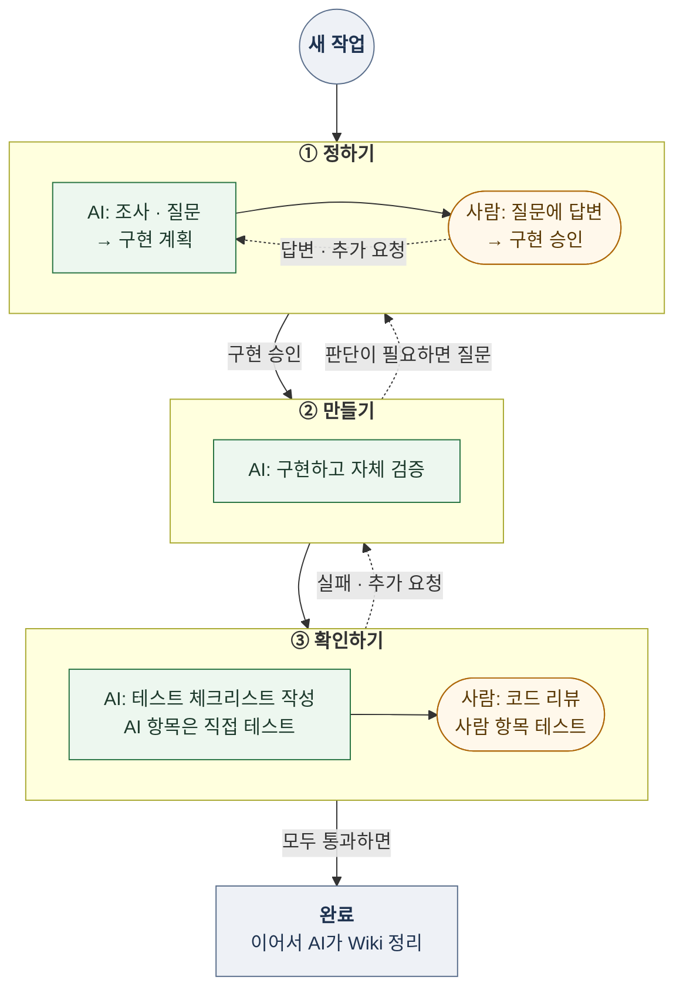

# 작업 절차

사람은 판단하고, AI는 조사·구현·검증·기록을 맡습니다. 작업은 세 단계로 진행하며, 사람은 정하기 끝과 확인하기 끝에서 판단합니다.



## 시작과 이어하기

웹(`BatchFiles/OpenWorkflow.bat`으로 여는 대시보드)과 AI 대화 어느 쪽에서 시작해도 같은 기록을 이어갑니다.

| 하고 싶은 일 | 웹 | AI 대화 |
| --- | --- | --- |
| 새 작업 시작 | **새 작업**에 제목·요청을 적어 AI에게 전달합니다. 기록이 만들어지고 AI가 읽기 전용으로 조사한 뒤 질문이나 구현 계획을 돌려줍니다. | 저장소에서 Claude Code·Codex·Gemini CLI를 열고 요청이나 기획서를 전달합니다. AI는 조사·질문을 시작할 때 `tasks/`에 기록을 만듭니다. 질문에 답하고 끝나는 일은 기록을 만들지 않습니다. |
| 사람 차례인 작업 | 확인 대기에서 **작업 진행**을 누르면 지금 할 일(질문 답변 → 구현 승인 → 코드 리뷰·사람 항목 테스트)이 나옵니다. | 작업 제목을 말하고 질문에 답하거나 승인합니다. |
| 작은 수정 | 작업 진행의 **AI에게 추가 요청**에 적습니다. | "○○ 고쳐줘"처럼 지시합니다. |
| 이어하기 | 작업 진행의 **터미널에서 이어하기**를 누르면 고른 AI가 그 기록을 읽고 이어가는 대화 창이 열립니다. | 작업 제목을 말하고 이어서 해달라고 요청합니다. 제목은 `node .agents/scripts/Wiki-AI.cjs --tasks`로 찾을 수 있습니다. |

이미 승인된 범위 안의 작은 수정은 지시가 구현 승인입니다. AI는 이어갈 때 기록 맨 위의 상태·다음 행동과 요청·질문·구현 계획·체크리스트부터 읽습니다.

## 단계

| 단계 | AI | 사람 |
| --- | --- | --- |
| 정하기 | 조사하고 구현에 필요한 질문을 모두 합니다 | 답변 → 구현 승인 |
| 만들기 | 구현하고 빌드·테스트로 자체 검증합니다 | — |
| 확인하기 | 테스트 체크리스트를 만들고 AI 항목을 직접 테스트합니다 | 코드 리뷰·사람 항목 테스트 |
| 완료 | 완료 뒤 재사용할 지식을 Wiki에 반영합니다(상태는 바꾸지 않습니다) | — |

- AI는 요청·기획서와 관련 코드·Wiki를 직접 조사해 사실을 확인하고, 사람에게는 선택이 필요한 것만 근거·선택지·추천과 함께 묻습니다. 답변 때문에 새 판단이 생기면 다시 묻습니다.
- 더 물을 것이 없으면 "추가 질문 없음"과 구현 계획을 알리고 구현 승인을 요청합니다. 사람이 승인하기 전에는 구현하지 않습니다. 질문·계획·승인은 기록의 `## 질문`·`## 구현 계획` 절에 남깁니다(아래 기록 절).
- 사람이 구현 내용을 명확히 지시한 요청은 그 지시를 구현 승인으로 봅니다. 이미 승인된 범위 안의 버그 수정·세부 구현은 다시 묻지 않고 만들기부터 시작합니다.
- AI가 사람에게 넘기는 것은 질문·구현 계획·테스트 체크리스트 세 가지뿐이고, 작업 상태도 이 셋에서만 정해집니다. 사람의 판단이 필요하면 구현 중이라도 선택지가 있는 질문으로 묻고(→ 새 계획 → 승인), 자유 형식의 '확인 요청'은 쓰지 않습니다.
- 이 작업과 무관하게 발견한 문제(다른 작업의 변경, 관계없는 문서의 검사 경고)는 요약에 한 줄로만 알리고, 다른 작업의 변경 때문인 실패는 고치지 않습니다.
- 작업 전에 자동 백업(파일 복사, 임시 커밋, Git stash 등)을 만들지 않습니다.
- 코드 리뷰는 확인하기 체크리스트의 사람 항목으로 받습니다. 사람은 대시보드에서 코드 리뷰와 플레이·에디터 확인을 한 번에 기록합니다.

## 테스트 체크리스트

확인하기에서 AI가 작업 기록에 `## 테스트 체크리스트` 절을 만들고 아래 형식의 표로 적습니다. 셀에는 `|`와 줄바꿈을 쓰지 않습니다.

| 항목 | 확인 방법 | 담당 | 결과 | 근거 |
| --- | --- | --- | --- | --- |
| 저장 위치 복원 | 자동화 테스트 실행 | AI | 통과 | 명령·결과 요약 |
| 코드 리뷰 | 변경 파일과 볼 점: 저장 실패 처리·슬롯 이름 | 사람 | 대기 |  |
| 부활 시 적 재생성 | 게임: 사망 → 부활. 처치한 일반 적이 다시 나타난다. | 사람 | 대기 |  |

- 담당은 AI 또는 사람입니다. 빌드·자동화 테스트·헤드리스 실행처럼 AI가 직접 돌릴 수 있으면 AI, 화면·조작감·연출처럼 AI가 볼 수 없으면 사람입니다.
- 이번 작업에서 코드를 바꿨으면 담당 사람의 `코드 리뷰` 항목을 두고 확인 방법에 변경 파일과 볼 점을 적습니다.
- 결과는 대기·통과·실패·미실행 중 하나입니다. 빌드 성공이나 오류 로그가 없다는 것만으로 플레이 항목을 통과로 적지 않습니다.
- AI가 직접 실행할 수 없는 항목은 미실행으로 남기지 않고 담당을 사람으로 바꿔 재현 순서와 기대 결과를 적습니다. 웹 처리에서는 서버가 AI의 미실행·대기 항목을 사람 항목으로 넘깁니다.
- 사람 항목은 하나 이상 둡니다(코드를 바꿨으면 코드 리뷰, 아니면 결과 확인). 사람 항목은 사람만 통과로 바꿀 수 있고, 모든 항목이 통과하는 즉시 완료입니다.

## 상태

기록 제목 바로 아래 두 줄이 그 작업의 상태입니다. 대시보드와 `node .agents/scripts/Wiki-AI.cjs --tasks`가 이 줄에서 작업 현황을 만들므로 목록을 따로 고치지 않습니다.

```text
상태: 확인 대기 · 빌드·자동화 테스트 통과
다음 행동: 코드 리뷰와 부활 시 적 재생성을 확인한다.
```

| 상태 | 뜻 |
| --- | --- |
| 진행 중 | AI가 조사·구현·수정하고 있습니다. |
| 확인 대기 | 사람 차례입니다: 질문 답변 · 구현 승인 · 사람 항목 테스트 · 실패 항목 확인(추가 요청으로 방향을 정함). |
| 완료 | 체크리스트가 모두 통과했습니다. AI의 Wiki 정리는 그 뒤에 하며 상태를 바꾸지 않습니다. |

상태 줄이 없는 기록(모듈 리뷰 보고서 등)은 리뷰·참고로 표시됩니다. 리뷰 지적을 고치려면 새 작업으로 요청하고, 착수 전에 현재 코드와 다시 대조합니다.

## 문제가 생기면

| 상황 | 처리 |
| --- | --- |
| 체크리스트에 실패 항목·수정 요청 | AI가 고칩니다 → 영향받는 항목과 코드 리뷰를 대기로 되돌려 다시 확인합니다. |
| 확인한 뒤 코드가 바뀜 | 코드를 바꾼 AI가 영향받는 사람 항목을 대기로 되돌립니다. 다른 작업의 변경은 그 작업의 체크리스트가 확인합니다. |
| 방향이 바뀜 | 정하기로 돌아가 바뀌는 항목만 다시 묻고 구현 승인을 다시 받습니다. 이전 결정은 지우지 않고 바뀐 이유와 함께 남깁니다. |
| AI가 정할 수 없음 | 선택지가 있는 질문으로 묻습니다. |
| AI 항목이 실패 | 체크리스트에 실패로 남고 확인 대기가 됩니다. 근거를 보고 추가 요청으로 방향을 정합니다. |
| 처리 중 기록이 바뀜 | 기록 충돌로 표시되고 AI 결과는 반영하지 않습니다. 최신 기록을 확인하고 다시 전달합니다. |

## 작업 진행 화면

대시보드에서 **새 작업**이나 작업의 **작업 진행**을 누르면 지금 사람이 할 일 하나가 나옵니다. 이름과 처리할 AI(Codex·Claude Code·Gemini CLI 중 연결된 것)를 고르고 전달합니다.

| 화면 | 사람이 할 일 | 전달하면 AI가 하는 일 | AI 권한 |
| --- | --- | --- | --- |
| 새 작업 | 제목·요청을 적고 **AI에게 전달** | 조사해 질문이나 구현 계획을 돌려줍니다. | 읽기 전용 |
| 질문 | 질문마다 선택지를 고르거나 직접 적고 **답변 전달** | 다시 조사해 추가 질문이나 구현 계획을 돌려줍니다. | 읽기 전용 |
| 구현 계획 | 계획을 읽고 **구현 승인** | 구현·자체 검증하고 테스트 체크리스트를 만듭니다. | 모든 명령 허용 |
| 테스트 체크리스트 | 코드 리뷰·사람 항목마다 **통과** 또는 **실패**(문제 상황과 재현 방법)를 고르고 **테스트 결과 전달** | 실패가 있으면 고친 뒤 다시 확인할 항목을 대기로 돌려줍니다. 실패 없이 일부만 통과했으면 AI 없이 기록만 하고, 모두 통과하면 바로 완료한 뒤 Wiki를 정리합니다. | 모든 명령 허용 |
| AI에게 추가 요청(항상) | 계획 수정·추가로 고칠 점을 적어 전달 | 승인된 범위 안이면 바로 고치고, 범위를 바꾸면 질문이나 새 계획으로 답합니다. | 모든 명령 허용 |

- 권한은 사용자 결정(2026-09-25)입니다. 정하기(조사·질문·계획)는 파일을 바꾸지 않고, 구현·추가 요청·테스트 결과 처리는 권한 확인 없이 명령을 실행합니다. 커밋·푸시·관리자 정책과 CLI 설정 변경은 지시로 막습니다.
- AI 처리는 새 터미널 창에서 보이며 실행됩니다. Codex·Claude Code는 진행 과정을, Gemini CLI는 끝난 결과를 보여줍니다. 처리하는 동안 기록 상태는 진행 중이고, 끝나면 결과가 작업 기록과 화면에 반영되며 창은 60초 뒤(Enter로 바로) 닫힙니다.
- **터미널에서 이어하기**는 고른 AI와 직접 대화하는 창을 엽니다. 이 창은 평소 CLI 권한 확인을 따르며, AI가 처리 중인 작업에서는 열리지 않습니다.
- AI 처리는 한 번에 하나만 실행합니다. 전송이나 AI 처리가 실패해도 입력은 보존되며, 같은 버튼이나 **저장된 요청으로 AI 다시 시도**로 이어갑니다. 결과 없이 끝나면 기록 상태가 `확인 대기 · AI 처리 실패`로 바뀝니다.
- 요청·질문·계획·체크리스트가 모두 없는 옛 기록은 다음 행동을 사람 항목 하나로 보여주고, 전달하면 체크리스트를 만듭니다.

## 기록

- 작업마다 `tasks/`에 기록 파일 하나를 둡니다. 제목 아래에 상태·다음 행동 두 줄과 결정을 두고, 이어서 `## 요청` · `## 질문` · `## 구현 계획` · `## 테스트 체크리스트` 절을 이 순서로 두며(필요한 절만), 이력은 아래에 쌓습니다.
- 웹의 **새 작업**으로 만든 기록은 제목이 파일 이름이 됩니다(공백·기호는 `-`, 같은 이름이 있으면 `-2`).
- 질문은 `| ID | 질문 | 선택지 | 추천 | 답변 |` 표로 적습니다. 선택지는 ` / `로 나누고, 답변 칸이 비어 있으면 아직 답하지 않은 질문입니다. 구현 계획 절의 `구현 승인: 이름 날짜` 줄이 승인이며, 계획이 바뀌면 승인 줄도 지우고 다시 승인받습니다.
- 상태가 바뀌면 그 기록의 상태·다음 행동 두 줄만 고칩니다.
- 사람의 결정은 누가·언제·무엇을 정했는지 원문대로 남깁니다. 구현 승인·코드 리뷰·사람 항목 테스트는 서로를 대신하지 않습니다.
- 한 번 쓰고 끝나는 결과는 대화로 전달하고 파일을 만들지 않습니다. 재사용할 지식만 완료 때 Wiki에 반영합니다. Wiki는 지식이며 승인 기록이 아닙니다.
- 정리할 때는 결정 원문과 필요한 근거를 남기고 중복·임시 자료만 지웁니다. `Docs/Programmer/`는 읽기만 합니다.

<details id="document-notes">
<summary>출처·검증 및 참고 정보</summary>

상태: current · 범위: 전체 작업 절차·웹/대화 시작과 이어하기·작업 진행 화면·구현 승인·테스트 체크리스트·상태 줄·문제 처리·기록 규칙 · 기준: 2026-09-25 사용자 요청으로 3단계·상태 3개로 단순화하고 구현 승인과 AI·사람 담당 테스트 체크리스트를 도입했다. 같은 날 코드 리뷰를 체크리스트 사람 항목으로 옮기고 작업 현황을 기록의 상태 줄에서 만들었으며, 웹 새 작업·질문 답변·구현 승인·추가 요청·터미널 이어하기를 추가했다(정하기 읽기 전용, 구현·수정 모든 명령 허용, 터미널 창 표시 실행). 가짜 AI로 실제 터미널 창까지 확인했고 실제 AI 요청·게임 실행 재검증 아님. 2026-09-26 사용자 요청으로 이 문서를 워크플로우 규칙의 유일한 정본으로 두고, AGENTS.md의 절차 요약을 링크로 바꾸고 자동 백업 금지를 옮겨 왔다. 같은 날 첫 실제 웹 처리에서 AI의 자유 형식 보고가 상태를 틀어지게 해, 사용자 승인으로 AI가 넘기는 것을 질문·구현 계획·체크리스트로 한정하고 완료를 체크리스트 전부 통과로 즉시 판정하며 AI의 Wiki 정리를 완료 뒤로 옮겼다. 같은 날 사용자 요청으로 도식을 단계 상자 배치로 바꾸고, 서버 동작과 대조해 답변마다 AI가 다시 조사하는 흐름, 실패·추가 요청의 수정 경로, 구현 중 질문 경로를 그렸다. 웹 새 작업은 항상 구현 승인을 거치므로 명확한 지시로 만들기에 바로 들어가는 지름길은 그리지 않았다

</details>
