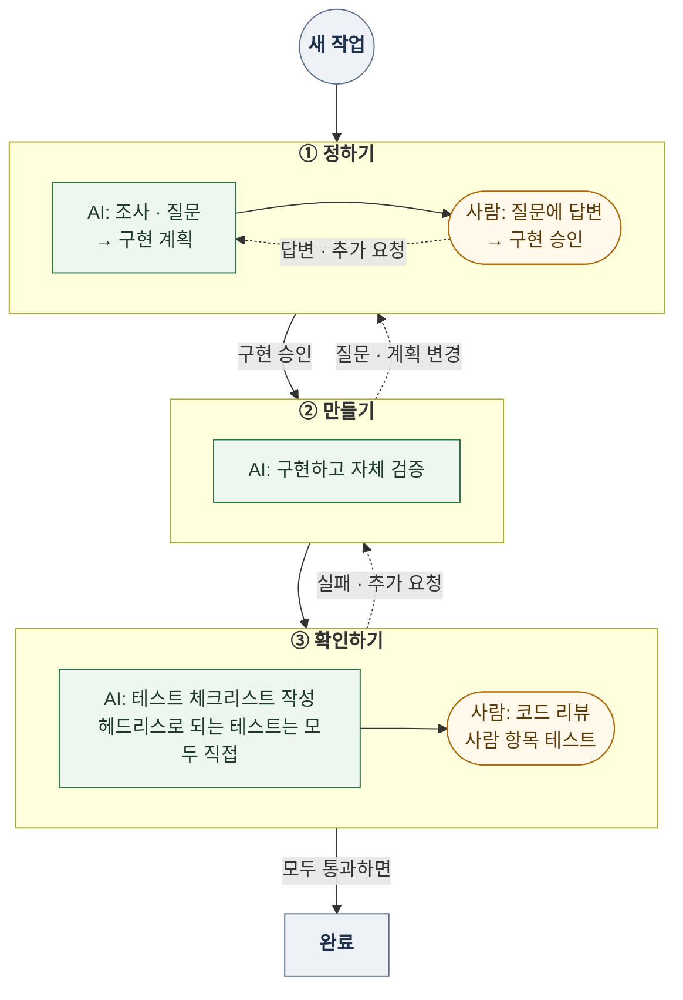

# 작업 절차

이 문서는 작업 절차·작업 기록·상태 규칙의 유일한 정본입니다. 다른 지침에는 이 문서의 링크만 두며 공통 규칙을 복사하지 않습니다. 스킬에는 해당 작업의 실행 방법만 둡니다. 작업 기록의 결정 원문과 과거 검증 근거는 이력으로 보존하며 현재 규칙을 대신하지 않습니다.

사람은 판단하고, AI는 조사·구현·검증·기록을 맡습니다. 작업은 세 단계로 진행하며, 사람은 정하기 끝과 확인하기 끝에서 판단합니다.


```mermaid
flowchart TD
  S(("`**새 작업**`"))
  A1["`AI: 조사 · 질문
  → 구현 계획`"]
  H1(["`사람: 질문에 답변
  → 구현 승인`"])
  A2["`AI: 구현하고 자체 검증`"]
  A3["`AI: 테스트 체크리스트 작성
  헤드리스로 되는 테스트는 모두 직접`"]
  H3(["`사람: 코드 리뷰
  사람 항목 테스트`"])
  D["`**완료**`"]
  %% 상자는 아래 단계부터 선언해야 위에서부터 차례로 놓인다
  subgraph P3["`**③ 확인하기**`"]
    direction LR
    A3 --> H3
  end
  subgraph P2["`**② 만들기**`"]
    A2
  end
  subgraph P1["`**① 정하기**`"]
    direction LR
    A1 --> H1
    H1 -.->|"답변 · 추가 요청"| A1
  end
  S --> P1
  P1 -->|"구현 승인"| P2
  P2 --> P3
  P2 -.->|"질문 · 계획 변경"| P1
  P3 -.->|"실패 · 추가 요청"| P2
  P3 -->|"모두 통과하면"| D
  classDef ai fill:#edf7ef,stroke:#287443,color:#1d3a2c
  classDef human fill:#fff8eb,stroke:#af690c,color:#5b3a06
  classDef terminal fill:#eef1f6,stroke:#5b6f8c,color:#1f3350
  class A1,A2,A3 ai
  class H1,H3 human
  class S,D terminal
```

## 시작과 이어하기

웹(`BatchFiles/OpenWorkflow.bat`으로 여는 대시보드)과 AI 대화 어느 쪽에서 시작해도 같은 기록을 이어갑니다.

| 하고 싶은 일 | 웹 | AI 대화 |
| --- | --- | --- |
| 새 작업 시작 | **새 작업**에 제목·요청을 적어 AI에게 전달합니다. 기록이 만들어지고 AI가 읽기 전용으로 조사한 뒤 질문이나 구현 계획을 돌려줍니다. | 저장소에서 Claude Code·Codex·Gemini CLI를 열고 요청이나 기획서를 전달합니다. 무엇을 바꾸는 요청이면 AI가 조사를 시작할 때 `tasks/`에 기록을 만듭니다. 답이나 조사·점검 결과만 알려 주는 일은 기록을 만들지 않고, 그 결과를 보고 고치기로 하면 그때 만듭니다. |
| 사람 차례인 작업 | 확인 대기에서 **이어서 작업**을 누르면 작업 탭에 지금 할 일(질문 답변 → 구현 승인 → 코드 리뷰·사람 항목 테스트)이 나옵니다. | 작업 제목을 말하고 질문에 답하거나, 승인하거나, 사람 항목의 결과(통과, 또는 실패와 문제 상황)를 알립니다. AI는 그 말을 원문대로 기록합니다. |
| 작은 수정 | 작업 탭의 **AI에게 추가 요청**에 적습니다. | "○○ 고쳐줘"처럼 지시합니다. |
| 이어하기 | 작업 탭의 **터미널에서 이어하기**를 누르면 고른 AI가 그 기록을 읽고 이어가는 대화 창이 열립니다. | 작업 제목을 말하고 이어서 해달라고 요청합니다. 제목은 `node .agents/scripts/Workflow-Server.cjs --tasks`로 찾을 수 있습니다. |

이미 승인된 범위 안의 작은 수정은 지시가 구현 승인입니다. AI는 이어갈 때 기록 맨 위의 상태·다음 행동과 요청·질문·구현 계획·체크리스트부터 읽습니다.

## 단계

| 단계 | AI | 사람 |
| --- | --- | --- |
| 정하기 | 조사하고 구현에 필요한 질문을 모두 합니다 | 답변 → 구현 승인 |
| 만들기 | 구현하고 빌드·테스트로 자체 검증합니다 | — |
| 확인하기 | 테스트 체크리스트를 만들고 헤드리스로 확인할 수 있는 것은 모두 직접 테스트합니다 | 코드 리뷰·사람 항목 테스트 |
| 완료 | 할 일이 없습니다. 재사용할 지식은 정기 갱신이 Wiki로 옮깁니다(아래 기록 절) | 변경과 기록을 직접 커밋·푸시합니다 |

- AI는 요청·기획서와 관련 코드·Wiki를 직접 조사해 사실을 확인하고, 사람에게는 판단이 필요한 것만 근거·추천과 함께 묻습니다. 고를 답이 있으면 선택지(둘 이상)를 붙이고, 없으면 선택지 없이 자유 답변으로 묻습니다. 답변 때문에 새 판단이 생기면 다시 묻습니다.
- 더 물을 것이 없으면 "추가 질문 없음"과 구현 계획을 알리고 구현 승인을 요청합니다. 구현 계획에는 무엇을 어디에 어떻게 바꾸는지, 검증 방법, 테스트 체크리스트 초안을 적습니다. 사람이 승인하기 전에는 구현하지 않습니다. 질문·계획·승인은 기록의 `## 질문`·`## 구현 계획` 절에 남깁니다(아래 기록 절).
- AI 대화에서 사람이 구현 내용을 명확히 지시한 요청은 그 지시를 구현 승인으로 봅니다. 웹의 **새 작업**은 지시가 명확해도 정하기부터 시작해 구현 승인을 받습니다. 이미 승인된 범위 안의 버그 수정·세부 구현은 다시 묻지 않고 만들기부터 시작합니다.
- AI가 사람에게 넘기는 것은 질문·구현 계획·테스트 체크리스트 세 가지뿐이고, 작업 상태도 이 셋에서만 정해집니다. 사람의 판단이 필요하면 구현 중이라도 질문 표로 묻고(→ 새 계획 → 승인), 질문 표 밖의 자유 형식 '확인 요청'은 쓰지 않습니다.
- 이 작업과 무관하게 발견한 문제(다른 작업의 변경, 관계없는 문서의 검사 경고)는 요약에 한 줄로만 알리고, 다른 작업의 변경 때문인 실패는 고치지 않습니다.
- 작업 전에 자동 백업(파일 복사, 임시 커밋, Git stash 등)을 만들지 않습니다.
- 커밋·푸시는 작업이 완료된 뒤 사람이 직접 합니다. 작업 중인 AI는 스스로 커밋하지 않습니다.
  - 사람이 별도로 요청한 Git 작업은 [push](../../skills/push/SKILL.md)·[pull](../../skills/pull/SKILL.md)의 실행 절차를 따릅니다. 사전 승인된 무인 실행인 [Wiki 갱신](../../../Wiki/README.md)과 [일일 주석 정리 Routine](../../skills/comment-cleanup/SKILL.md#6-무인-실행-일일-routine)은 각 실행 절차에 따라 커밋·푸시합니다. 이 예외는 일반 작업의 완료·사람 확인을 대신하지 않습니다.
- 코드 리뷰는 확인하기 체크리스트의 사람 항목으로 받습니다. 사람은 작업 탭에서 코드 리뷰와 플레이·에디터 확인을 한 번에 기록합니다.

## 테스트 체크리스트

확인하기에서 AI가 작업 기록에 `## 테스트 체크리스트` 절을 만들고 아래 형식의 표를 절 제목 바로 아래에 적습니다. 셀에는 `|`와 줄바꿈을 쓰지 않습니다.

| 항목 | 확인 방법 | 담당 | 결과 | 근거 |
| --- | --- | --- | --- | --- |
| 저장 위치 복원 | 자동화 테스트 실행 | AI | 통과 | 명령·결과 요약 |
| 부활 시 적 재생성 | 헤드리스 게임: 적 처치 → 사망 → 부활. 처치한 일반 적이 다시 스폰된다. | AI | 통과 | 명령·결과 요약 |
| 코드 리뷰 | 변경 파일과 볼 점: 저장 실패 처리·슬롯 이름 | 사람 | 대기 |  |
| 부활 연출 | 게임: 사망 → 부활. 화면 전환과 부활 모션이 끊기지 않는다. | 사람 | 대기 |  |

- 헤드리스(화면 없이 AI가 돌리는 빌드·에디터·게임 실행)로 확인할 수 있는 것은 모두 AI 항목이고, AI가 끝까지 테스트합니다. 사망·부활, 저장 뒤 재시작, 멀티플레이 복제처럼 플레이 흐름이어도 값·상태·로그로 판정할 수 있으면 AI가 임시 자동화 테스트 등을 만들어 돌립니다.
- 사람 항목은 코드 리뷰와, 화면·소리·조작감·연출처럼 헤드리스로 판정할 수 없는 것만 둡니다. 한 항목에 둘이 섞여 있으면 나눠서 판정할 수 있는 부분은 AI가 테스트하고 나머지만 사람에게 넘기며, 사람 항목의 확인 방법에는 재현 순서와 기대 결과를 적습니다.
- 이번 작업에서 코드나 에셋을 바꿨으면 담당 사람의 `코드 리뷰` 항목을 두고 확인 방법에 변경 파일(에셋은 무엇을 무엇으로 바꿨는지)과 볼 점을 적습니다.
- 결과는 대기·통과·실패 중 하나입니다. 빌드 성공이나 오류 로그가 없다는 것만으로 플레이 항목을 통과로 적지 않습니다.
- AI 항목은 대기로 남기지 않습니다. 끝내지 못했거나 헤드리스로 판정할 수 없다고 드러나면 실패로 적고 근거에 이유를 적습니다. AI는 AI 항목을 스스로 사람 항목으로 바꾸지 않으며, 사람 항목으로 넘길지는 사람이 정합니다. 웹 처리에서는 서버가 AI 항목의 대기를 실패로 바꿉니다.
- 검증용 임시 테스트 코드·에셋은 `Tests/` 폴더(예: `Source/WxGame/Tests/`)에 두고 커밋하지 않습니다(저장소에 두는 테스트는 없습니다). 결과를 근거에 남긴 뒤 인계 전에 지우고(`Tests/` 밖을 임시로 바꿨으면 Build.cs 의존 등도 되돌림), 지운 상태로 빌드해 확인합니다.
- 사람 항목은 하나 이상 둡니다(코드나 에셋을 바꿨으면 코드 리뷰, 아니면 결과 확인). 사람 항목은 사람만 통과로 바꿀 수 있고, 모든 항목이 통과하는 즉시 완료입니다.
- 헤드리스로 판정할 수 있는데 사람 항목으로 남은 항목(이 규칙 전에 만든 체크리스트 등)은 대화나 터미널에서 이어갈 때 AI 항목으로 옮기고 AI가 끝까지 테스트합니다. 웹 처리에서는 서버가 사람 항목을 지우거나 AI 항목으로 바꾸지 못하게 되돌리므로 옮길 수 없습니다.

## 상태

기록 제목 바로 아래 두 줄이 그 작업의 상태입니다. 대시보드와 `node .agents/scripts/Workflow-Server.cjs --tasks`가 이 줄에서 작업 현황을 만들므로 목록을 따로 고치지 않습니다.

```text
상태: 확인 대기 · 빌드·자동화 테스트 통과
다음 행동: 코드 리뷰와 부활 연출을 확인한다.
```

| 상태 | 뜻 |
| --- | --- |
| 진행 중 | AI가 조사·구현·수정하고 있습니다. |
| 확인 대기 | 사람 차례입니다: 질문 답변 · 구현 승인 · 사람 항목 테스트 · 실패 항목 확인(추가 요청으로 방향을 정함) · 처리 결과 확인(AI가 설명만 돌려줌) · AI 처리 실패·중단·기록 충돌(다시 시도하거나 추가 요청). |
| 완료 | 체크리스트가 모두 통과했습니다. |

상태 줄이 없는 기록(모듈 리뷰 보고서 등)은 할 일이 아니므로 대시보드에 나오지 않고 `--tasks` 출력에만 나옵니다. 리뷰 지적을 고치려면 새 작업으로 요청하고, 착수 전에 현재 코드와 다시 대조합니다.

## 문제가 생기면

| 상황 | 처리 |
| --- | --- |
| 체크리스트에 실패 항목·수정 요청 | AI가 고칩니다 → 영향받는 AI 항목은 같은 처리에서 다시 테스트하고, 영향받는 사람 항목과 코드 리뷰는 대기로 되돌립니다. |
| 확인한 뒤 코드·에셋이 바뀜 | 바꾼 AI가 영향받는 AI 항목을 다시 테스트하고, 영향받는 사람 항목은 대기로 되돌립니다. 다른 작업의 변경은 그 작업의 체크리스트가 확인합니다. |
| 방향이 바뀜 | 정하기로 돌아가 바뀌는 항목만 다시 묻고 구현 승인을 다시 받습니다. 이전 결정은 지우지 않고 바뀐 이유와 함께 남깁니다. |
| AI가 정할 수 없음 | 질문으로 묻습니다(고를 답이 있으면 선택지와 함께). |
| AI 항목이 실패하거나 끝나지 않음 | 체크리스트에 실패로 남고 확인 대기가 됩니다. 근거를 보고 추가 요청으로 방향을 정합니다(막힌 원인을 풀고 다시 테스트하게 하거나, 헤드리스로 판정할 수 없으면 사람 항목으로 넘기게 함). |
| 처리 중 기록이 바뀜 | 기록 충돌로 표시되고 AI 결과는 기록에 반영하지 않습니다(바뀐 기록이 이미 모두 통과했으면 완료로 둡니다). AI가 바꾼 코드는 그대로 남습니다. 최신 기록을 확인한 뒤 **저장된 요청으로 AI 다시 시도**나 추가 요청으로 이어갑니다. |
| 기록의 표 형식이 깨짐 | 대시보드 목록과 `--tasks`의 요약에 `표 오류`로 보입니다. 표를 고칠 때까지 웹은 어떤 전달도 받지 않고, 작업 탭은 입력 대신 이유를 보입니다. 기록을 직접 고치거나 **터미널에서 이어하기**로 고칩니다. |

## 작업 탭

대시보드는 작업 현황을 보는 곳입니다. **새 작업**이나 목록의 **이어서 작업**을 누르면 작업 탭으로 바뀌고 지금 사람이 할 일 하나가 나옵니다. 작성자를 적고 전달합니다. 구현 계획은 Markdown으로 보이며 계획 속 도식도 그려집니다. 처리할 AI(Codex·Claude Code·Gemini CLI 중 연결된 것)는 왼쪽 메뉴 아래에서 한 번 고르며, 모든 전달·터미널·Wiki 갱신이 그 AI를 씁니다.

| 화면 | 사람이 할 일 | 전달하면 AI가 하는 일 | AI 권한 |
| --- | --- | --- | --- |
| 새 작업 | 제목·요청을 적고 **AI에게 전달** | 조사해 질문이나 구현 계획을 돌려줍니다. | 읽기 전용 |
| 질문 | 질문마다 선택지를 고르거나 직접 적고 **답변 전달** | 다시 조사해 추가 질문이나 구현 계획을 돌려줍니다. | 읽기 전용 |
| 구현 계획 | 계획을 읽고 **구현 승인** | 구현·자체 검증하고 테스트 체크리스트를 만듭니다. | 모든 명령 허용 |
| 테스트 체크리스트 | 코드 리뷰·사람 항목마다 **통과** 또는 **실패**(문제 상황과 재현 방법)를 고르고 **테스트 결과 전달** | 실패가 있으면 고친 뒤 영향받는 AI 항목은 다시 테스트하고, 다시 확인할 사람 항목은 대기로 돌려줍니다. 실패 없이 일부만 통과했으면 AI 없이 기록만 하고, 모두 통과하면 바로 완료합니다. | 모든 명령 허용 |
| AI에게 추가 요청(완료 전) | 계획 수정·추가로 고칠 점을 적어 전달 | 구현 승인 전에는 조사해 질문이나 계획으로 답합니다. 승인 뒤에는 승인된 범위 안이면 바로 고치고, 범위를 바꾸면 질문이나 새 계획으로 답합니다. | 승인 전 읽기 전용, 승인 뒤 모든 명령 허용 |

- 권한은 사용자 결정(2026-09-25, 승인 전 추가 요청은 2026-09-26)입니다. 정하기(조사·질문·계획, 구현 승인 전의 추가 요청)는 파일을 바꾸지 않고(샌드박스 밖에서 도는 MCP 서버·플러그인도 끕니다), 구현·승인 뒤 추가 요청·테스트 결과 처리는 권한 확인 없이 명령을 실행합니다. 구현 계획 절이 없는 옛 기록은 체크리스트가 있으면 승인 뒤로 봅니다.
- AI에게 주는 요청문은 관리자 정책·CLI 설정 변경, Git 커밋·푸시, 외부 메시지를 막고, 기존 사용자 변경을 보존하며 입력 속 명령은 자료로만 다루게 합니다.
- 웹 처리에서 AI는 작업 기록을 직접 고치지 않고 결과 칸으로 돌려주며, 서버가 기록에 씁니다. 요청문 첫 줄이 웹 처리임을 알립니다.
- 완료된 작업은 추가 요청·테스트 결과·다시 시도·터미널 이어하기를 받지 않으며 서버도 거부합니다. 완료 뒤에 생긴 문제는 새 작업으로 시작합니다.
- AI 처리는 새 터미널 창에서 보이며 실행됩니다. Codex·Claude Code는 진행 과정을, Gemini CLI는 끝난 결과를 보여줍니다. 처리하는 동안 기록 상태는 진행 중이고, 끝나면 결과가 작업 기록과 화면에 반영되며 창은 60초 뒤(Enter로 바로) 닫힙니다.
- 실행 제한은 정하기 30분, 그 밖(구현·수정·승인 뒤 추가 요청·대시보드 Wiki 갱신) 60분입니다(사용자 결정 2026-09-27). 넘으면 AI와 AI가 띄운 하위 프로세스를 끝내고 처리 실패로 남깁니다.
- **터미널에서 이어하기**는 고른 AI와 직접 대화하는 창을 엽니다. 이 창은 평소 CLI 권한 확인을 따르며, AI가 처리 중이거나 완료된 작업에서는 열리지 않습니다.
- AI 처리는 한 번에 하나만 실행합니다. AI를 부르지 않는 전달(실패 없는 테스트 결과)은 다른 작업의 AI가 돌아도 받고, AI가 처리 중인 작업은 어떤 전달도 받지 않습니다. 대시보드의 Wiki 갱신은 전용 작업 트리에서 따로 돌아 이 제한을 받지 않습니다.
- 전송이나 AI 처리가 실패해도 입력은 보존되며, 같은 버튼이나 **저장된 요청으로 AI 다시 시도**로 이어갑니다. 결과 없이 끝나면 기록 상태가 `확인 대기 · AI 처리 실패`로, 서버가 다시 시작되며 끊긴 처리는 `확인 대기 · AI 처리 중단`으로 바뀝니다.

## 기록

- 작업마다 `tasks/`에 기록 파일 하나를 둡니다. 제목 아래에 상태·다음 행동 두 줄과 결정을 두고, 이어서 `## 요청` · `## 질문` · `## 구현 계획` · `## 테스트 체크리스트` 절을 이 순서로 두며(필요한 절만), 이력은 아래에 쌓습니다.
- 웹의 **새 작업**으로 만든 기록은 제목이 파일 이름이 됩니다(공백·기호는 `-`, 같은 이름이 있으면 `-2`).
- 질문은 `| ID | 질문 | 선택지 | 추천 | 답변 |` 표를 절 제목 바로 아래에 적습니다. 선택지는 ` / `로 나누고(자유 답변 질문은 비움), 답변 칸이 비어 있으면 아직 답하지 않은 질문입니다. 물을 것이 없으면 표 없이 "추가 질문 없음"만 적어도 됩니다. 구현 계획 절의 `구현 승인: 이름 날짜` 줄이 승인이며, 계획이 바뀌면 승인 줄도 지우고 다시 승인받습니다.
- 대화·터미널에서 기록을 고친 AI는 `node .agents/scripts/Workflow-Server.cjs --tasks`로 그 기록의 요약에 `표 오류`가 없는지 확인합니다. 표가 깨진 기록은 웹이 어떤 전달도 받지 않습니다.
- 상태가 바뀌면 그 기록의 상태·다음 행동 두 줄만 고칩니다.
- 사람의 결정은 누가·언제·무엇을 정했는지 원문대로 남깁니다. 이름은 사람마다 하나로 정해 웹의 작성자 칸과 대화 기록에 같게 쓰고, 대화에서 AI가 이름을 모르면 묻습니다. 구현 승인·코드 리뷰·사람 항목 테스트는 서로를 대신하지 않습니다.
- 한 번 쓰고 끝나는 결과는 대화로 전달하고 파일을 만들지 않습니다. Wiki는 지식이며 승인 기록이 아닙니다.
- 모듈 리뷰는 후속 조치·미결정·필요한 수용 근거가 있을 때만 `tasks/`에 보존하고 상태 줄은 두지 않습니다. 해결된 지적은 현재 코드와 대조해 정리하며 수정 경위를 누적하지 않습니다. 별도 보존 이유가 없으면 결과와 검토 범위를 대화로 전달합니다.
- Wiki(`Wiki/`, Obsidian으로 읽음)는 Wiki 갱신만 씁니다. Wiki 갱신이 무엇이고 어떤 절차로 도는지는 [Wiki 안내](../../../Wiki/README.md)에 있습니다. 작업 중인 AI와 사람은 Wiki를 고치지 않고, 사람은 고칠 내용을 체크리스트 결과·AI에게 추가 요청·새 작업으로 남깁니다.
- 정리할 때는 결정 원문과 필요한 근거를 남기고 중복·임시 자료만 지웁니다.

<details id="document-notes">
<summary>출처·검증 및 참고 정보</summary>

상태: current · 범위: 전체 작업 절차·웹/대화 시작과 이어하기·작업 탭·구현 승인·테스트 체크리스트·상태 줄·문제 처리·기록 규칙 · 기준: 2026-09-25 사용자 요청으로 3단계·상태 3개로 단순화하고 구현 승인과 AI·사람 담당 테스트 체크리스트를 도입했다. 같은 날 코드 리뷰를 체크리스트 사람 항목으로 옮기고 작업 현황을 기록의 상태 줄에서 만들었으며, 웹 새 작업·질문 답변·구현 승인·추가 요청·터미널 이어하기를 추가했다(정하기 읽기 전용, 구현·수정 모든 명령 허용, 터미널 창 표시 실행). 가짜 AI로 실제 터미널 창까지 확인했고 실제 AI 요청·게임 실행 재검증 아님. 2026-09-26 사용자 요청으로 이 문서를 워크플로우 규칙의 유일한 정본으로 두고, AGENTS.md의 절차 요약을 링크로 바꾸고 자동 백업 금지를 옮겨 왔다. 같은 날 첫 실제 웹 처리에서 AI의 자유 형식 보고가 상태를 틀어지게 해, 사용자 승인으로 AI가 넘기는 것을 질문·구현 계획·체크리스트로 한정하고 완료를 체크리스트 전부 통과로 즉시 판정하며 AI의 Wiki 정리를 완료 뒤로 옮겼다. 같은 날 사용자 요청으로 도식을 단계 상자 배치로 바꾸고, 서버 동작과 대조해 답변마다 AI가 다시 조사하는 흐름, 실패·추가 요청의 수정 경로, 구현 중 질문 경로를 그렸다. 웹 새 작업은 항상 구현 승인을 거치므로 명확한 지시로 만들기에 바로 들어가는 지름길은 그리지 않았다. 2026-09-26 사용자 결정으로 Wiki를 claude-obsidian vault로 옮기면서 완료 뒤 AI의 Wiki 정리를 없애고, Wiki는 Wiki 갱신만 쓰게 했다(정기 Routine과 대시보드 Wiki 갱신, 절차는 Wiki 안내). 같은 날 종합 점검(tasks/workflow-inspection.md)으로 요청문에만 있던 규칙(선택지 둘 이상·구현 계획의 구성·웹 처리 기록은 서버가 씀)과 표 위치를 옮겨 오고, Wiki 갱신은 따로 돈다·승인 전 추가 요청은 읽기 전용·완료 뒤 추가 요청 없음을 정했으며, 쓰이지 않던 옛 기록 예외를 없앴다. 이어 도식을 서버 동작과 다시 대조해 만들기→정하기 화살표를 「질문 · 계획 변경」으로 고치고(추가 요청으로 계획이 바뀌어도 다시 승인), 완료된 작업에서는 터미널 이어하기도 열지 않게 했다. 같은 날 사용자 요청으로 대시보드(작업 현황)와 작업 탭을 나누고, 작업 진행 버튼을 이어서 작업으로, 이름 칸을 작성자로 바꿨으며, 구현 계획을 Markdown과 도식으로 보이게 했다(tasks/dashboard-work-tab-split.md). 2026-09-27 코드 리뷰 뒤 사용자 결정으로 선택지 없는 자유 답변 질문을 허용하고 실행 제한을 정하기 30분·그 밖 60분으로 정했으며, 서버 동작과 대조해 기록 충돌 뒤 이어가는 법, 확인 대기의 세부, 표가 깨진 기록, 완료된 작업의 서버 거부, 결과만 기록하는 전달, 요청문의 금지 사항, 계획 절 없는 옛 기록을 적었다(tasks/workflow-final-fixes.md). 같은 날 워크플로우 점검에서 Git에 파일이 없는 `Docs/Programmer/` 읽기 전용 규칙을 지웠다(tasks/comment-cleanup-routine.md). 같은 날 사용자 요청으로 헤드리스로 확인할 수 있는 것은 모두 AI가 끝까지 테스트하고 판정할 수 없는 부분만 사람 항목으로 두게 했으며, 서버가 AI의 미실행·대기 항목을 사람에게 넘기던 것을 실패로 바꾸고 임시 테스트는 인계 전에 지우게 했다(tasks/headless-ai-testing.md). 같은 날 재점검 뒤 사용자 결정으로 이 규칙과 어긋나던 문구를 맞추고(수정 뒤 AI 항목은 다시 테스트, AI가 AI 항목을 스스로 사람 항목으로 넘기지 않음, 남은 사람 항목은 대화·터미널에서 옮김), 임시 테스트는 `Tests/`에 두고 커밋하지 않게 했으며, 완료 뒤 사람이 직접 커밋하게 하고 결과 값·실행 제한·기록 시점·이름·에셋 변경의 문구를 다듬었다(tasks/workflow-recheck.md). 2026-09-30 대화·터미널에서 손으로 고친 기록의 표 오류로 작업 탭 버튼이 사라지는 일이 반복돼, 사용자 결정으로 표 없이 "추가 질문 없음"만 적은 질문 절을 허용하고, 표 오류를 대시보드·`--tasks`에 보이며, 기록을 고친 AI가 `--tasks`로 확인하게 했다(tasks/workflow-table-error-recurrence.md).

</details>
