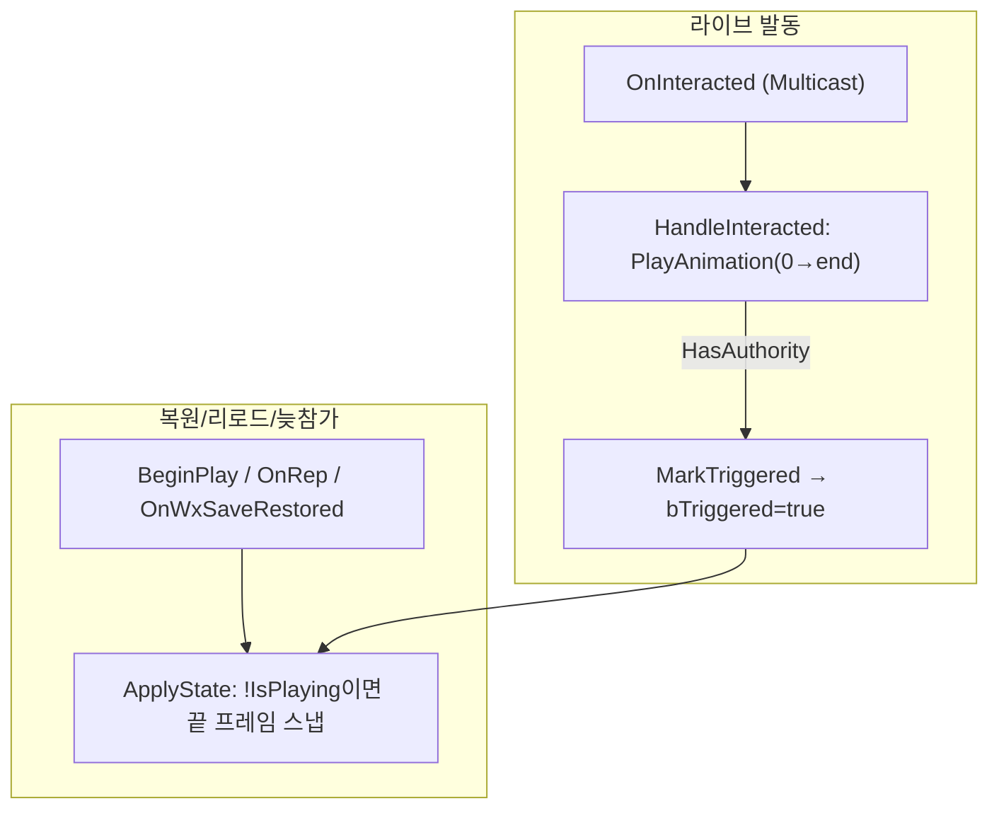

# TreasureChest 스켈레탈 메시 + 열기 애니메이션

## 계획

### 목표
보물상자 메시를 스켈레탈 메시로 교체하고, 상호작용 순간 열기 애니메이션을 재생한다. 재접속·월드 파티션 리로드처럼 이미 발동된 상태로 다시 로드될 때는 애니메이션이 끝난 모습(열린 최종 포즈)으로 나타나게 한다.

### 수정 범위
| 모듈 | 파일 | 수정할 내용 |
|---|---|---|
| `WxWorld` | `Public/Gimmick/WxTreasureChest.h` | `MeshComponent` 타입을 `USkeletalMeshComponent`로 교체, `OpenAnimation`(`UAnimSequenceBase`) 프로퍼티 추가 |
| `WxWorld` | `Private/Gimmick/WxTreasureChest.cpp` | 생성자 컴포넌트 생성 교체, `ApplyState`에 끝 포즈 스냅, `HandleInteracted`에 라이브 재생 추가 |

### 접근 방식
발동 상태(`bTriggered`)는 부모 `AWxGimmick`이 리플리케이션·Level Streaming Persistence·WxSave로 이미 보존한다. 따라서 "이미 열림" 판정용 데이터 추가 없이, **재생(라이브 edge)** 과 **스냅(정적 상태 적용)** 두 경로만 분리하면 된다.

두 신호가 이미 존재한다. 상호작용 컴포넌트의 `OnInteracted`은 멀티캐스트로 발화하므로 발동 순간 서버+전 클라에서 `HandleInteracted`가 한 번 실행되고, 리로드/재접속/늦참가 시엔 발화하지 않는다 — 이를 "라이브 edge"로 본다. 반면 `ApplyState`는 BeginPlay 복원·OnRep·WxSave 복원 등 정적 상태 적용 경로에서 호출된다.

재생은 `HandleInteracted`(처음부터 `PlayAnimation`, 비루프), 스냅은 `ApplyState`(`!IsPlaying()`일 때 끝 프레임으로 `SetPosition`)에 둔다. 비루프 단일노드 재생은 종료 후 끝 프레임을 유지하므로 재생 결과와 스냅 결과가 같다. `!IsPlaying()` 가드 덕분에 클라에서 OnRep과 멀티캐스트의 도착 순서와 무관하게 항상 "라이브면 재생 / 복원이면 스냅"으로 수렴한다. 멤버 플래그는 불필요.

### 에디터 후속(디자이너, 코드 외)
컴포넌트 클래스 변경으로 BP_TreasureChest의 기존 StaticMesh(Cube)·머티리얼 오버라이드가 무효화된다. 빌드 후 BP에서 닫힌 ref pose 스켈레탈 메시와 비루프 열기 AnimSequence를 지정해야 한다. 에셋 미지정 시 코드는 graceful degrade(재생/스냅 없이 인터랙션 비활성만).

---

## 완료

### 수정한 파일
| 모듈 | 파일 | 수정 내용 |
|---|---|---|
| `WxWorld` | `Public/Gimmick/WxTreasureChest.h` | `MeshComponent`를 `USkeletalMeshComponent`로 교체, `OpenAnimation`(`UAnimSequenceBase`) 프로퍼티·전방선언 추가 |
| `WxWorld` | `Private/Gimmick/WxTreasureChest.cpp` | include 교체, 생성자 컴포넌트 생성 교체, `ApplyState` 끝 포즈 스냅, `HandleInteracted` 라이브 재생 추가 |

### 구현·결정과 그 이유
- **재생/스냅을 두 진입점으로 분리**: 라이브 발동은 멀티캐스트로 도는 `HandleInteracted`에서 처음부터 재생, 정적 복원은 `ApplyState`에서 끝 프레임 스냅. 이미 보존되는 `bTriggered` 외에 별도 상태를 두지 않았다.
- **`!IsPlaying()` 가드**: 클라에서 OnRep(스냅)과 멀티캐스트(재생) 도착 순서가 보장되지 않으므로, 메시 자체의 재생 여부를 직접 질의해 순서에 무관하게 "라이브면 재생 / 복원이면 스냅"으로 수렴시켰다. 멤버 플래그를 피하고 원천 상태에서 분기.
- **비루프 단일노드 재생**: `PlayAnimation(..., false)`는 종료 후 끝 프레임을 유지하므로 재생 종료 모습과 스냅 모습이 동일 — 라이브와 복원의 최종 외형이 일치.
- **컴포넌트 이름 `MeshComponent` 유지**: BP의 컴포넌트 참조·이벤트그래프 `SetMaterial` 노드를 보존하기 위함.

### 계획 대비 달라진 점
- 계획대로.

### 후속 과제
- 디자이너: BP_TreasureChest에 닫힌 ref pose 스켈레탈 메시 + 비루프 열기 AnimSequence 지정(클래스 변경으로 기존 Cube 지정 무효화됨). 미지정 시 코드는 graceful degrade(인터랙션 비활성만).
- 인게임 검증(상호작용 재생 / 셀 리로드·재접속 시 끝 포즈)은 에셋 지정 후 가능 — 현재는 컴파일까지 검증.
- 이벤트그래프 임시 `SetMaterial` 노드 정리 검토(디자이너).
