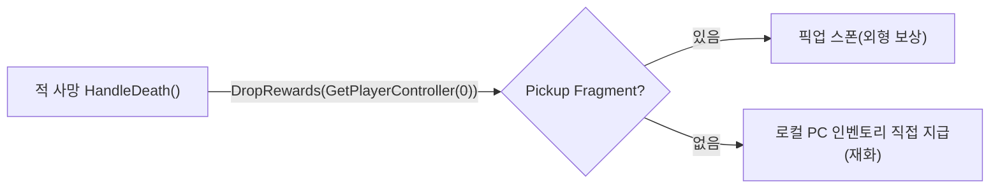

# 적 사망 시 재화(골드) 즉시 지급 전환

## 계획

### 목표
적 사망 시 골드 같은 재화가 픽업 액터로 떨어져 [F]로 줍던 방식을, 처치 즉시 로컬 플레이어 인벤토리에 지급되도록 바꾼다. 외형 없는 모든 보상에 일반 적용한다.

### 수정 범위
| 모듈 | 파일 | 수정할 내용 |
|---|---|---|
| `WxGame` | `Source/WxGame/Character/WxEnemyCharacter.cpp` | `HandleDeath()`의 `DropRewards()`에 로컬 PC(`GetPlayerController(0)`)를 대상으로 전달, include 추가 |
| (데이터) | `Content/Item/DA_Gold.uasset` | Pickup Fragment 제거 — 사용자가 에디터에서 직접 |
| (문서) | `Docs/Programmer/Reward_Grant_Flow.md` | 적 사망 = 직접 지급 가능으로 서술 갱신 |

### 접근 방식
보상 지급 로직은 외형 있는 아이템은 픽업 액터로 흩뿌리고, 외형 없는 재화는 지정한 대상 인벤토리에 직접 넣도록 이미 분기돼 있다. 상호작용 드랍은 상호작용한 폰을 대상으로 넘겨 재화가 즉시 지급되지만, 적 사망 드랍만 대상을 비운 채 호출해 외형 없는 재화가 지급될 곳을 못 찾고 스킵됐다.

그래서 적 사망 경로가 로컬 플레이어를 대상으로 넘기게만 하면 공백이 메워진다 — 외형 없는 모든 보상이 직접 지급 경로를 탄다. 보상 컴포넌트와 픽업 액터 자체는 손대지 않는다.

대상으로는 플레이어 컨트롤러를 넘긴다. 인벤토리가 컨트롤러에 붙어 있어 조회가 한 단계로 끝나고, 대상이 없으면 기존대로 안전하게 스킵된다. 사망이 태그 기반이라 가해자 정보가 없어, 막타 추적 대신 로컬 플레이어로 지급한다(스탠드얼론 기준).

---

## 완료

### 수정한 파일
| 모듈 | 파일 | 수정 내용 |
|---|---|---|
| `WxGame` | `Source/WxGame/Character/WxEnemyCharacter.cpp` | `#include "Kismet/GameplayStatics.h"` 추가, `HandleDeath()`의 `DropRewards()` → `DropRewards(UGameplayStatics::GetPlayerController(this, 0))` |
| (문서) | `Docs/Programmer/Reward_Grant_Flow.md` | 적 사망 = 로컬 PC에 직접 지급으로 서술/다이어그램/예시/주의사항 갱신 |

### 구현·결정과 그 이유
- **대상에 `PlayerController` 전달**: 인벤토리가 PC에 부착되어 `FindInventory`가 PC를 바로 처리. `nullptr`이면 기존대로 안전 스킵. `UWxRewardComponent`/`AWxItemPickup`은 손대지 않음 — 직접 지급 분기가 이미 존재.
- **빌드 환경 수정(`git config core.quotepath false`)**: 빌드 검증 중 UnrealBuildTool이 `git status` 출력의 비ASCII escape 경로(삭제된 한글 `.m4a` 등 `"\353..."`)를 파싱하다 CLR 미처리 예외(0xE0434352)로 크래시. quotepath를 끄면 경로를 UTF-8 그대로 출력해 회피됨. 이후 빌드 `Result: Succeeded`. 코드와 무관한 환경 이슈.

### 계획 대비 달라진 점
- 코드/문서는 계획대로. 빌드 검증 단계에서 위 UBT git status 크래시를 만나 `core.quotepath false`로 해결 후 통과(계획에 없던 환경 조치).

### 후속 과제
- **데이터(사용자, 에디터)**: `DA_Gold`에서 Pickup Fragment 제거 → 외형 없는 재화로 분류해 직접 지급 경로 타게 함. `DT_Reward`에 골드 보상이 들어 있어야 적 처치 시 지급.
- **인게임 검증**: 골드 보유 적 처치 시 픽업 없이 즉시 골드 UI(`WBP_TotalGold`) 반영, 외형 보상은 기존처럼 픽업 흩뿌림 회귀 확인.
- 즉시 지급 시 획득 연출(사운드/팝업)은 별도 작업.
