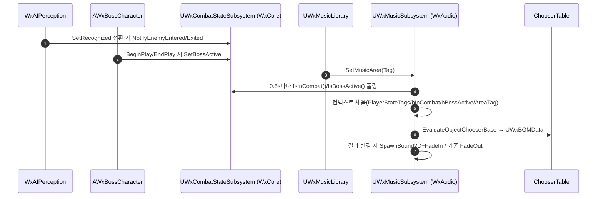

# Chooser Table 기반 BGM 재생 시스템

## 계획

### 목표
게임 상태(전투/보스/플레이어 상태태그/지역)를 입력으로 받아 적절한 BGM을 골라 크로스페이드로 재생하는 시스템 구축. 선택 로직은 코드가 아니라 UE5 Chooser Table(데이터)로 표현해 기획자가 조건 조합을 행으로 관리하게 한다. 현재 프로젝트엔 BGM 전용 시스템이 없고 오디오는 전부 단발성 이벤트뿐이다.

### 수정 범위
| 파일 | 수정할 내용 | 구분 |
|---|---|---|
| `Plugins/WxAudio/WxAudio.uplugin` | 모듈 `WxAudio`(Runtime), Plugins=[Chooser, GameplayAbilities, WxCore] | 신규 |
| `Plugins/WxAudio/Source/WxAudio/WxAudio.Build.cs` | Deps: Core, CoreUObject, Engine, GameplayTags, GameplayAbilities, Chooser, DeveloperSettings, WxCore | 신규 |
| `.../Public/WxAudioModule.h` · `Private/WxAudioModule.cpp` | IModuleInterface 기본 구현 | 신규 |
| `.../Public/WxBGMChooserContext.h` | `FWxBGMChooserContext` USTRUCT (PlayerStateTags/bInCombat/bBossActive/AreaTag) | 신규 |
| `.../Public/WxBGMData.h` · `Private/WxBGMData.cpp` | `UWxBGMData : UPrimaryDataAsset` (Sound + 페이드/루프/우선순위) — Chooser 결과 타입 | 신규 |
| `.../Public/System/WxMusicSettings.h` · `.cpp` | `UWxMusicSettings : UDeveloperSettings` (DefaultBGMChooser, DefaultFadeTime, ReevaluateInterval) | 신규 |
| `.../Public/System/WxMusicSubsystem.h` · `.cpp` | `UWxMusicSubsystem : UWorldSubsystem` — 재평가·크로스페이드 본체 | 신규 |
| `.../Public/WxMusicLibrary.h` · `.cpp` | `UWxMusicLibrary : UBlueprintFunctionLibrary` — SetMusicArea/RequestMusicReevaluation/StopMusic/SetMusicChooser | 신규 |
| `Plugins/WxCore/.../Public/WxCombatStateSubsystem.h` · `Private/...cpp` | `UWxCombatStateSubsystem : UWorldSubsystem` — 교전 적/보스 카운트, IsInCombat()/IsBossActive() | 신규 |
| `Plugins/WxAI/.../Private/WxAIPerceptionComponent.cpp` | `SetRecognized()` 전환 지점에서 WxCore 서브시스템에 Enter/Exit 통지 | 수정 |
| `Source/WxGame/Character/WxBossCharacter.h` · `.cpp` | BeginPlay/EndPlay override → `SetBossActive(true/false)` | 수정 |
| `Wx.uproject` | Plugins에 Chooser, WxAudio 활성화 | 수정 |
| `.claude/CLAUDE.md` | 모듈 표에 WxAudio 한 줄 추가 | 수정 |

### 접근 방식
- **WxAudio 플러그인 (도메인, WxCore + 엔진 Chooser/GameplayAbilities 의존)**: `UWxMusicSubsystem`(WorldSubsystem)이 0.5s 타이머 + 이벤트성으로 컨텍스트를 채우고 Chooser를 평가, 결과 `UWxBGMData`가 직전 곡과 다르면 크로스페이드(같으면 no-op).
- **입력 4종**: 전투(자동, WxCore `UWxCombatStateSubsystem`을 WxAI 퍼셉션이 통지) / 보스 플래그(보스 BeginPlay·EndPlay가 통지) / 플레이어 상태 태그 스냅샷(로컬 폰 ASC owned-tags) / 지역 태그(BP `SetMusicArea`).
- **Chooser API (UE5.7 검증)**: `MakeChooserEvaluationContext` → `AddStructParam(멤버 struct)` → `EvaluateObjectChooserBase(ctx, MakeEvaluateChooser(Table), UWxBGMData::StaticClass())`. `AddStructParam`은 참조만 저장하므로 컨텍스트 struct는 평가 동안 살아있는 subsystem 멤버여야 함. include는 Public `ChooserFunctionLibrary.h`만.
- **로컬 전용**: DedicatedServer면 서브시스템 미생성, 로컬 폰 ASC만 스냅샷. 순수 클라 전투태그 전파 정확도는 범위 밖(standalone/listen 기준).

---

## 완료

> 구현 막바지에 입력 설계를 단순화했다(아래 「계획 대비 달라진 점」). 최종적으로 BGM 입력은 **플레이어 ASC owned-tag + 지역 태그**뿐이며, 전투/보스 교차 도메인 집계(WxCombatStateSubsystem)와 그 통지(WxAI·보스)는 만들지 않았다.

### 수정한 파일
| 파일 | 수정한 내용 | 구분 |
|---|---|---|
| `Plugins/WxAudio/WxAudio.uplugin` | 모듈 WxAudio, Plugins=[WxCore, GameplayAbilities, Chooser] | 신규 |
| `Plugins/WxAudio/Source/WxAudio/WxAudio.Build.cs` | Public=[…GameplayTags, DeveloperSettings, WxCore], Private=[GameplayAbilities, Chooser] | 신규 |
| `.../Public/WxAudioModule.h` · `Private/WxAudioModule.cpp` | IModuleInterface 기본 구현 | 신규 |
| `.../Public/WxBGMChooserContext.h` | `FWxBGMChooserContext`(PlayerStateTags + BGMTag) | 신규 |
| `.../Public/WxBGMData.h` | `UWxBGMData : UPrimaryDataAsset` (Sound/Fade/bLoop/Priority) | 신규 |
| `.../Public/System/WxMusicSettings.h` · `.cpp` | `UWxMusicSettings`(DefaultBGMChooser, ReevaluateInterval) | 신규 |
| `.../Public/System/WxMusicSubsystem.h` · `.cpp` | `UWxMusicSubsystem` 재평가·크로스페이드 본체 | 신규 |
| `.../Public/WxMusicLibrary.h` · `.cpp` | `UWxMusicLibrary` BP 진입점 2종(`StartBGM`, `StopBGM`) | 신규 |
| `Wx.uproject` | Chooser, WxAudio 활성화 | 수정 |
| `.claude/CLAUDE.md` | 모듈 표에 WxAudio 행 추가 | 수정 |

### 구현·결정과 그 이유
- **입력은 플레이어 owned-tag만 감지**: 전투(`State.InCombat`)는 적 ASC 에 붙어 플레이어 중심 신호가 없는데, 이를 위해 교차 도메인 집계기를 두는 대신 *감지 대상을 로컬 플레이어 ASC 의 owned-tag 로 한정*했다. 전투/보스 등을 BGM 에 반영하려면 그 상태를 플레이어 ASC 에 태그로 부여하면 `PlayerStateTags` 스냅샷에 그대로 잡힌다(추가 결합 0). BGM 분류는 BP `StartBGM(BGMTag)` 으로 명시 주입 — Chooser 가 그 키 + 플레이어 태그로 행을 고른다.
- **선택은 Chooser, 재생 파라미터는 결과 에셋**: 곡별 페이드/우선순위를 `UWxBGMData` 에 실어, Chooser 는 선택만 담당하고 트랙마다 다른 페이드를 줄 수 있게 했다.
- **재평가 = 주기(0.5s) + 이벤트**: 플레이어 상태태그는 폴링으로 충분(같은 곡이면 no-op), BGM 분류 변경·폰 교체만 즉시 재평가. 람다 없이 멤버 콜백으로 구성.
- **수명 제약 준수**: `FChooserEvaluationContext::AddStructParam` 이 참조만 잡으므로 컨텍스트 struct 를 subsystem 멤버로 보유해 평가 동안 생존 보장. Struct Parameter 1개만 등록해 인덱스 바인딩을 안전화.
- **로컬 전용**: DedicatedServer 면 OnWorldBeginPlay 에서 즉시 반환(타이머/재생 없음), 로컬 플레이어(index 0)의 폰 ASC 만 스냅샷.

### 계획 대비 달라진 점
- **전투/보스 교차 도메인 감지 제거(가장 큰 변경)**: 승인된 plan 은 WxCore 에 `UWxCombatStateSubsystem`(교전/보스 카운트)을 두고 WxAI·보스가 통지하는 구조였으나, 사용자 요청으로 *플레이어 OwnedTag 외에는 감지하지 않도록* 단순화했다. → `WxCombatStateSubsystem`(WxCore) 미생성, WxAIPerceptionComponent·WxBossCharacter 통지 코드 철회, 컨텍스트에서 `bInCombat`/`bBossActive` 제거. GameplayMessageRouter 는 UE5.7 기본 엔진에 없어(라이라 전용) 도입하지 않음.
- `WxMusicSettings` 에서 `DefaultFadeTime` 제거 — 페이드는 항상 결과 에셋(`UWxBGMData`)에서 오고, 페이드아웃 시점엔 직전 곡(CurrentBGM)이 항상 존재해 전역 기본값이 불필요했다.
- `WxBGMData.cpp` 생성 생략 — 함수 없는 데이터에셋이라 빈 TU 회피.
- 계획에 없던 `StopBGM` 보류 플래그(`bSuspended`) 추가 — Stop 후 타이머가 곡을 되살리지 않도록.
- **BP API 정리(후속)**: 진입점을 `StartBGM(BGMTag)` / `StopBGM` 2종으로 확정. `RequestMusicReevaluation`·`SetMusicChooser` 제거(+ 호출처 없는 서브시스템 메서드도 제거), `SetMusicArea`→`StartBGM`(`AreaTag`→`BGMTag`, 영역→BGM 분류 키로 의미 재정의), `StopMusic`→`StopBGM` 개명.

### 후속 과제
- **콘텐츠 작성(코드 외)**: `UWxBGMData` 트랙 에셋들 + `UChooserTable`(Result Class=`UWxBGMData`, Parameter=`FWxBGMChooserContext`) 작성, Project Settings > Wx > Wx Music Settings 의 `DefaultBGMChooser` 지정. BGM 분류(BGMTag) GameplayTag 정의 + BP 에서 `StartBGM(BGMTag)` 호출. 이후 인게임 동작(상태 전환/BGM 분류 전환 크로스페이드) 수동 검증.
- **전투/보스 BGM(보류)**: 필요해지면 "플레이어 ASC 에 전투/보스 태그 부여" 경로로 잇는다(예: 적 어그로 집계가 플레이어에 `State.InCombat` 부여). 집계 위치(WxCore vs WxCombat+릴레이)는 그때 결정.
- 음악 레이어링/스팅어, 레벨 트래블 간 연속성(GameInstanceSubsystem 전환)은 범위 밖.
