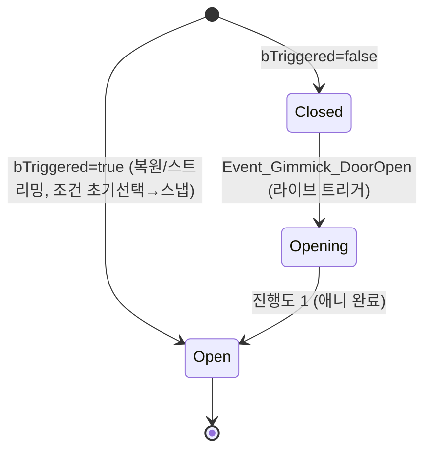

# WxDoor StateTree 전환

## 계획

### 목표
`AWxDoor`의 수작업 enum 상태머신(`EWxDoorState` + 액터 `Tick` + `OnRep_State` + `ApplyState` switch)을 StateTree 구동으로 전환한다. 프로젝트 최초의 StateTree 사용처로, 향후 다른 기믹이 따라올 WxWorld StateTree 패턴을 함께 확립한다. (이번 작업은 C++만. `ST_Door` 에셋 작성·BP 할당은 별도.)

### 수정 범위
| 파일 | 수정할 내용 | 구분 |
|---|---|---|
| `Plugins/WxWorld/WxWorld.uplugin` | `StateTree`, `GameplayStateTree` 엔진 플러그인 활성화 추가 | 수정 |
| `Plugins/WxWorld/Source/WxWorld/WxWorld.Build.cs` | `StateTreeModule`, `GameplayStateTreeModule` 의존성 추가 | 수정 |
| `Plugins/WxCore/.../WxGameplayTags.h/.cpp` | 라이브 트리거용 이벤트 태그 `Event_Gimmick_DoorOpen` 추가 | 수정 |
| `.../Public/Gimmick/WxDoor.h` | 상태머신 멤버 제거, `UStateTreeComponent` + 노드용 헬퍼 추가 | 수정 |
| `.../Private/Gimmick/WxDoor.cpp` | `Tick`/`ApplyState` switch 제거, 트리거→이벤트 송출로 재작성 | 수정 |
| `.../Public/Gimmick/WxDoorStateTreeNodes.h` | StateTree 태스크 2종 + 조건 1종 선언 | 신규 |
| `.../Private/Gimmick/WxDoorStateTreeNodes.cpp` | 위 노드 구현 | 신규 |

### 접근 방식
- **상태 소유권 이동**: 런타임 전이 상태(Opening 진행)는 StateTree가 보유. 영속·복제되는 단일 비트는 베이스의 `bTriggered` 재사용("문이 열렸는가"). 문은 본래 1회성 발동 기믹이라 `bTriggered` 모델과 의미가 일치 → `State` enum 제거가 순수 단순화.
- **StateTree 노드(C++)**:
  - `FWxStateTreeTask_DoorPose { bool bEnableInteraction; float OpenAlpha; }` — Enter 시 인터랙션 토글 + 문 포즈 스냅, Running 유지(틱 없음). Closed(true,0)·Open(false,1) 두 상태에서 재사용.
  - `FWxStateTreeTask_DoorOpening` — Enter 시 인터랙션 off, Tick으로 진행 0→1 보간, 완료 시 Succeeded.
  - `FWxStateTreeCondition_DoorTriggered` — `bTriggered` 반환. Open 상태 진입 조건으로 초기 선택(복원/스트리밍/레이트조인 시 Open 스냅)에 사용.
- **트리거 경로**: 라이브 상호작용은 복제된 `bTriggered`가 true로 전환되는 신뢰 경로(서버 `MarkTriggered` / 클라 `OnRep_bTriggered`) → 베이스 `ApplyState()` 후크에서 `Event_Gimmick_DoorOpen` 이벤트 송출 → Closed가 이벤트 전이로 Opening 진입. 언릴라이어블 멀티캐스트가 아닌 복제 프로퍼티 기반이라 현행 견고성 유지.
- **효율 유지**: Closed/Open은 틱 없는 hold 태스크 + 이벤트 전이라 닫힌 문은 매 프레임 틱하지 않음(현행 `SetActorTickEnabled(false)`와 동등). 액터 Tick 제거, 컴포넌트가 Opening 동안만 틱.
- **포즈 캐시 시점**: 문 닫힘 위치/오프셋 캐시를 `BeginPlay` → `PostInitializeComponents`로 앞당김. StartLogic(컴포넌트 BeginPlay)이 Super::BeginPlay 중 실행되어 복원 시 Open 포즈 스냅이 오프셋을 필요로 하므로, 그 전에 캐시 완료 보장.

---

## 완료

### 수정한 파일
| 파일 | 수정한 내용 | 구분 |
|---|---|---|
| `WxWorld.uplugin` | `StateTree`, `GameplayStateTree` 플러그인 활성화 | 수정 |
| `WxWorld.Build.cs` | `StateTreeModule`(Public), `GameplayStateTreeModule`(Private) 추가 | 수정 |
| `WxGameplayTags.h/.cpp` | `Event_Gimmick_Triggered` ("Event.Gimmick.Triggered") 추가 | 수정 |
| `Gimmick/WxDoor.h` | `EWxDoorState`/`State`/`OnRep_State`/`Tick`/`GetLifetimeReplicatedProps`/`DoorAnimProgress` 제거, `UStateTreeComponent` + 노드용 헬퍼 4종 추가 | 수정 |
| `Gimmick/WxDoor.cpp` | switch 상태머신·틱 제거, 트리거→`MarkTriggered`→이벤트 송출로 재작성, 오프셋 캐시를 `PostInitializeComponents`로 이동, `StartLogic` 수동 시작 | 수정 |
| `Gimmick/WxDoorStateTreeNodes.h/.cpp` | StateTree 태스크 `DoorPose`/`DoorOpening` + 조건 `DoorTriggered` | 신규 |

### 구현·결정과 그 이유
- **`State` enum → 베이스 `bTriggered` 흡수**: 문은 본래 1회성 개방(영구) 기믹이라 "열렸는가" 단일 비트로 충분. 복제·SaveGame 필드를 베이스가 이미 제공하는 `bTriggered`로 일원화해 Door 고유 복제 필드를 제거(순수 단순화). 런타임 전이(Opening 진행)는 StateTree 인스턴스 데이터가 보유.
- **트리거를 신뢰 경로로 송출**: 라이브 트리거를 인터랙션의 언릴라이어블 멀티캐스트가 아닌, 복제 프로퍼티 `bTriggered`가 true로 전환되는 지점(서버 `MarkTriggered`/클라 `OnRep_bTriggered`)의 공통 후크 `ApplyState`에서 StateTree 이벤트로 송출. 현행 "복제 상태가 시각을 구동" 견고성을 유지(패킷 손실에 강건).
- **효율 유지(닫힌 문 무비용)**: Closed/Open은 `bShouldCallTick=false`인 hold 태스크 + 이벤트 전이라 닫힌 문이 매 프레임 틱하지 않음. 현행 `SetActorTickEnabled(false)`와 동등. 액터 Tick 자체를 제거하고 컴포넌트가 Opening 동안에만 틱.
- **복원 스냅은 조건 초기 선택으로**: 시작 시 이미 `bTriggered`면 `DoorTriggered` 조건이 Open을 초기 선택해 애니 없이 스냅. 이벤트(라이브)와 조건(초기 선택)을 분리해 "새 개방은 애니, 로드된 문은 스냅"을 자연스럽게 구분.
- **오프셋 캐시를 `PostInitializeComponents`로**: `StartLogic`(컴포넌트 BeginPlay)이 `Super::BeginPlay` 중 실행되어 복원 문을 Open 포즈로 스냅할 때 오프셋이 필요. BeginPlay보다 앞선 시점에 캐시해 의존 순서 보장.
- **`StartLogic` 수동 시작**: `bStartLogicAutomatically=false`로 두고 `BeginPlay`에서 `Super` 이후 직접 시작. 포즈 태스크의 `SetConsoleInteractionEnabled` 호출이 인터랙션 컴포넌트 BeginPlay 이후가 되도록 순서 확정.
- **노드는 얇은 프리미티브만 호출**: 태스크/조건은 `Cast<AWxDoor>(Context.GetOwner())` 후 인터랙션 토글/포즈/발동여부 헬퍼만 호출. 문 너비·오프셋 계산 등 내부는 액터가 캡슐화.

### 계획 대비 달라진 점
- 트리거 이벤트 태그를 도어 전용 `Event_Gimmick_DoorOpen`이 아니라 범용 `Event_Gimmick_Triggered`로 명명(향후 StateTree 기믹 재사용 여지).
- 계획의 "BeginPlay에서 오프셋 캐시"를 `PostInitializeComponents` + 수동 `StartLogic` 조합으로 구체화(컴포넌트 BeginPlay 순서 안전).

### 후속 과제
- **에디터 에셋 작업(사용자)**: `ST_Door`(StateTree Component 스키마) 생성 — Open(enter cond: DoorTriggered, task: DoorPose false/1) / Closed(task: DoorPose true/0, on event `Event.Gimmick.Triggered`→Opening) / Opening(task: DoorOpening, on Succeeded→Open). BP_Door의 DoorStateTree에 ST_Door 할당. 에셋 작성 전까지 문은 열리지 않음(예상된 과도기).
- **세이브 호환성**: 저장 필드가 `State`→`bTriggered`로 변경. 기존 세이브 슬롯의 Door 상태와 비호환(개발 중 무시 가능).
- **세션 중 세이브 로드 미세 거동**: `RestartFromSave` 등 BeginPlay 이후 복원 시, 이미 열린 문이 스냅이 아닌 개방 애니를 1회 재생(자가 수렴, 시각적 사소). 필요 시 복원 경로에서 스냅 분기 추가로 개선 가능.
