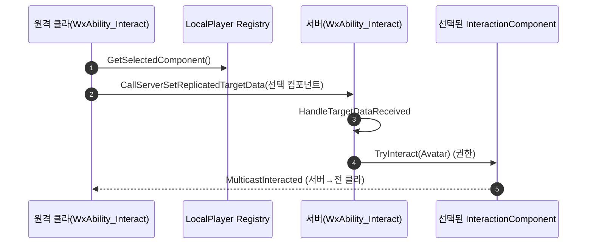

# 상호작용 선택을 클라→서버 TargetData로 전달 (멀티플레이 대응)

## 계획

### 목표
상호작용 실행 어빌리티가 클라이언트 로컬 서브시스템의 선택 컴포넌트를 서버로 전달해, 리슨서버 호스트뿐 아니라 접속 클라이언트에서도 선택 대상에 `TryInteract`가 작용하도록 한다. 기존 `ServerInitiated` 정책은 서버에서 원격 클라의 `GetLocalPlayer()`가 nullptr라 호스트만 동작하던 한계가 있었다.

### 수정 범위
| 파일 | 수정할 내용 | 구분 |
|---|---|---|
| `Source/WxGame/AbilitySystem/TargetData/WxAbilityTargetData_Interaction.{h,cpp}` | 선택된 `UWxInteractionComponent*`를 싣는 TargetData 구조체(`FWxAbilityTargetData_Direction` 본뜸, 포인터 NetSerialize) | 신규 |
| `Source/WxGame/AbilitySystem/Ability/WxAbility_Interact.{h,cpp}` | 정책 `ServerInitiated`→`LocalPredicted`, 권한/로컬 분기로 클라는 TargetData 전송·서버는 수신 후 `TryInteract`. 흐름 주석 갱신 | 수정 |
| `Plugins/WxWorld/.../Interaction/WxInteractionComponent.h` | 흐름 주석 2)를 "클라 선택 전달→서버 권한 TryInteract"로 다듬음 | 수정 |

### 접근 방식
- **Dodge 선례 차용**: `WxAbility_Dodge`+`FWxAbilityTargetData_Direction`의 `CallServerSetReplicatedTargetData`(클라) → `AbilityTargetDataSetDelegate`+`CallReplicatedTargetDataDelegatesIfSet`(서버) → `ConsumeClientReplicatedTargetData` 패턴을 그대로 따른다. 페이로드만 방향 벡터 → 선택 컴포넌트 포인터.
- **포인터 직렬화**: `UWxInteractionComponent`는 `SetIsReplicatedByDefault(true)`라 복제 객체. `Map->SerializeObject`로 포인터를 직렬화하면 액터당 컴포넌트 다중 모호성 없이 정확한 대상이 서버에 전달된다.
- **레지스트리 불변**: 선택/집계/강조/HUD는 로컬 `ULocalPlayerSubsystem` 그대로. 어빌리티만 전송을 담당해 자기완결성·의존 방향 보존(PC/Character 미수정).
- **분기**: ①권한+로컬(호스트)=로컬 선택 직접 읽어 즉시 `TryInteract` ②권한+비로컬(서버의 원격 클라 처리)=TargetData 수신 대기 후 `TryInteract` ③비권한(원격 클라)=로컬 선택을 TargetData로 전송 후 즉시 EndAbility(선택 없으면 null 전송→서버 무동작 종료).

---

## 완료

### 수정한 파일
| 파일 | 수정한 내용 | 구분 |
|---|---|---|
| `Source/WxGame/AbilitySystem/TargetData/WxAbilityTargetData_Interaction.{h,cpp}` | 선택 `UWxInteractionComponent*` 1개를 싣는 TargetData. `NetSerialize`는 `Map->SerializeObject`로 포인터 직렬화, `WithNetSerializer` 트레잇 | 신규 |
| `Source/WxGame/AbilitySystem/Ability/WxAbility_Interact.{h,cpp}` | 정책 `ServerInitiated`→`LocalPredicted`, 권한/로컬 3분기로 클라 전송·서버 수신 실행. `HandleTargetDataReceived`/`GetLocalSelectedComponent`/`ExecuteInteract` 추가, 흐름 주석 갱신, include 정리 | 수정 |
| `Plugins/WxWorld/.../Interaction/WxInteractionComponent.h` | 흐름 주석 2)를 "원격 클라는 선택을 TargetData로 서버 전달 → 서버 권한 TryInteract"로 갱신 | 수정 |

### 구현·결정과 그 이유
- **Dodge 선례 그대로 차용**: 이미 검증된 `CallServerSetReplicatedTargetData`→`AbilityTargetDataSetDelegate`+`CallReplicatedTargetDataDelegatesIfSet`→`ConsumeClientReplicatedTargetData` 흐름을 따랐다. 새 네트워크 메커니즘을 발명하지 않고 코드베이스 일관성을 유지하려는 의도.
- **레지스트리 미이동(방향 A)**: 집계/선택/강조/HUD는 순수 로컬 상태라 `ULocalPlayerSubsystem`에 그대로 둔다. 어빌리티만 전송을 담당해 자기완결 어빌리티 원칙과 의존 방향(PC/Character 미수정)을 보존했다. 컴포넌트로 옮기면 서버에 빈 인스턴스가 생기거나(PC) 리스폰에 선택이 날아가는(Pawn) 손해만 있고 이득이 없었다.
- **포인터 직렬화 선택**: 한 액터에 인터랙션 컴포넌트가 여럿일 수 있어 액터 단위 전달은 모호하다. 컴포넌트가 복제 객체(`SetIsReplicatedByDefault(true)`)라 포인터를 PackageMap으로 직렬화해 대상을 정확히 지정했다.
- **선택 없어도 null 전송**: 원격 클라가 선택이 없을 때도 TargetData(null)를 보내, 서버 수신 콜백이 반드시 한 번 돌고 EndAbility 되도록 했다. 안 보내면 서버 어빌리티가 콜백을 기다리며 매달릴 수 있다.
- **호스트 단축 경로**: 권한+로컬(리슨서버 호스트)은 RPC 왕복 없이 로컬 선택을 직접 읽어 즉시 실행한다.

### 계획 대비 달라진 점
- 계획대로. (TargetData 구조체는 WxGame에 어빌리티와 동거, 모듈 의존성 추가 없음 확인)

### 후속 과제
- **런타임 검증(사용자, PIE 2+ 클라)**: ①호스트·②접속 클라 양쪽에서 휠/방향키로 강조 바꾼 뒤 상호작용 시 선택(강조) 대상이 반응하는지, 범위 비면 무동작인지, 한 액터 다중 컴포넌트에서 올바른 대상이 골라지는지 확인. 기존엔 접속 클라가 무반응이던 케이스가 핵심.
