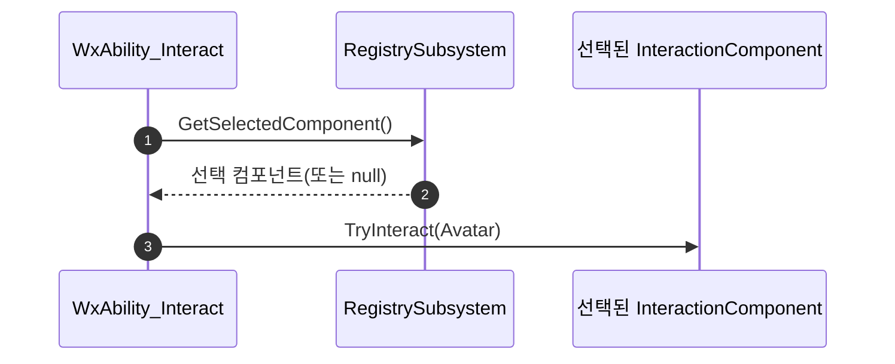

# 상호작용 실행을 선택된 대상 기준으로 전환

## 계획

### 목표
상호작용 실행 어빌리티가 거리상 "가장 가까운" 대상이 아니라, 레지스트리가 소유한 **현재 선택된 대상**에 작용하도록 바꾼다. 직전 작업으로 휠/방향키 선택과 외곽선 강조는 갖췄으나 실행 경로가 선택을 무시해 강조와 동작이 어긋났던 것을 일치시킨다.

### 수정 범위
| 파일 | 수정할 내용 | 구분 |
|---|---|---|
| `Plugins/WxWorld/.../Interaction/WxInteractionRegistrySubsystem.{h,cpp}` | 선택 컴포넌트 직접 반환하는 public `GetSelectedComponent()` 추가 | 수정 |
| `Source/WxGame/AbilitySystem/Ability/WxAbility_Interact.cpp` | 오버랩/최근접 스캔 제거, 레지스트리 선택 컴포넌트로 `TryInteract`, include 정리 | 수정 |
| `Source/WxGame/.../WxAbility_Interact.h` | 클래스 흐름 주석 갱신 | 수정 |
| `Plugins/WxWorld/.../Interaction/WxInteractionComponent.h` | 흐름 주석의 "가장 가까운" → "선택된" 갱신 | 수정 |

### 접근 방식
- **선택 단일 원천 재사용**: 레지스트리가 인덱스↔컴포넌트 매핑과 선택을 이미 소유하므로, 어빌리티는 스캔 대신 레지스트리에서 선택 컴포넌트를 받아 그대로 `TryInteract`. 레지스트리가 등록 시 선택을 0으로 시드하고 항상 유효 범위로 클램프하므로 범위 안엔 늘 유효 선택, 비면 `INDEX_NONE` → 최근접 폴백 불필요.
- **레지스트리 취득 경로**: 어빌리티의 `ActorInfo->PlayerController` → `GetLocalPlayer()` → `GetSubsystem<UWxInteractionRegistrySubsystem>()`.
- **네트워킹 범위**: 선택은 LocalPlayerSubsystem(클라 로컬) 소유, 어빌리티는 ServerInitiated. `GetLocalPlayer()`가 유효한 스탠드얼론/리슨서버 호스트 기준으로 둔다(프로젝트의 기존 스탠드얼론 단순화 방침과 동일). 데디 서버는 별도 TargetData 전달이 필요하나 범위 밖.

---

## 완료

### 수정한 파일
| 파일 | 수정한 내용 | 구분 |
|---|---|---|
| `Plugins/WxWorld/.../Interaction/WxInteractionRegistrySubsystem.{h,cpp}` | public `GetSelectedComponent()` 추가(헤더 순서대로 `GetPrompts`와 `CycleSelection` 사이에 정의) | 수정 |
| `Source/WxGame/AbilitySystem/Ability/WxAbility_Interact.cpp` | 오버랩/최근접 스캔 제거, 레지스트리 선택 컴포넌트로 `TryInteract`, include 정리(PrimitiveComponent·Pawn 제거, LocalPlayer·PlayerController·Registry 추가) | 수정 |
| `Source/WxGame/.../WxAbility_Interact.h` | 클래스 흐름 주석을 "선택된 대상" 기준으로 갱신, 네트워킹 범위 명시 | 수정 |
| `Plugins/WxWorld/.../Interaction/WxInteractionComponent.h` | 흐름 주석 "가장 가까운" → "선택된" | 수정 |

### 구현·결정과 그 이유
- **선택 단일 원천 재사용**: 선택의 주인인 레지스트리에 컴포넌트 직접 반환 진입점만 더했다. 어빌리티가 인덱스를 받아 배열을 다시 들여다보는 대신, 이미 클램프·시드가 보장된 선택을 한 번에 받게 해 인덱싱 책임이 한곳에 남도록 했다.
- **최근접 폴백 제거**: 레지스트리가 등록 시 선택을 시드하고 항상 유효 범위로 클램프하므로, 범위에 대상이 있으면 선택은 늘 유효하고 비면 nullptr다. 거리 기준 대체 경로를 둘 필요가 없어 스캔 로직을 통째로 들어냈다.
- **스탠드얼론 기준**: 선택을 로컬 서브시스템이 소유하는 기존 구조를 그대로 받아, 어빌리티도 로컬 플레이어 경유로 읽는다. 데디 서버 대응(TargetData 전달)은 의도적으로 범위에서 제외하고 주석에 한계를 명시했다.

### 계획 대비 달라진 점
- 계획대로.

### 후속 과제
- **런타임 검증(사용자)**: 대상 2개↑에서 휠/방향키로 강조 대상을 바꾼 뒤 상호작용 → 최근접이 아니라 선택(강조)된 대상이 반응하는지, 범위가 비면 무동작인지 PIE 확인.
- 진성 멀티플레이가 필요해지면 선택 컴포넌트를 클라→서버 TargetData로 전달하는 별도 작업 필요.
