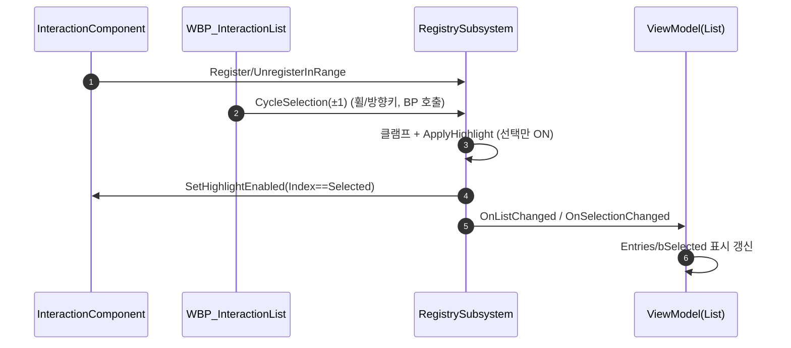

# 선택된 상호작용 대상만 외곽선 강조 + 휠 선택 입력

## 계획

### 목표
범위 안 모든 상호작용 대상이 외곽선으로 강조되던 것을, **현재 선택된 대상 하나만** 강조되게 바꾼다. 더불어 휠/방향키로 선택을 이동할 수 있게 한다. 선택 소유권을 레지스트리로 모아 "선택된 컴포넌트만 강조"를 단일 원천에서 조율한다(상호작용 실행은 기존 "가장 가까운" 유지).

### 수정 범위
| 파일 | 수정할 내용 | 구분 |
|---|---|---|
| `Plugins/WxWorld/.../Interaction/WxInteractionRegistrySubsystem.{h,cpp}` | `SelectedIndex` 소유, `CycleSelection`(BlueprintCallable)·`GetSelectedIndex`, `OnSelectionChanged` 델리게이트, `ApplyHighlight`, unregister 시 강조 OFF | 수정 |
| `Plugins/WxWorld/.../Interaction/WxInteractionComponent.{h,cpp}` | `SetHighlightEnabled` public 승격, 오버랩/BeginPlay/비활성의 자동 강조 호출 제거(등록만), 헤더 주석 갱신 | 수정 |
| `Plugins/WxUI/.../MVVM/WxViewModel_InteractionList.{h,cpp}` | `SetSelectedIndex`(BP) 제거, `HandleSelectionChanged` 추가, 주석 갱신 | 수정 |
| `Source/WxGame/MVVM/WxViewModelResolver_InteractionList.cpp` | `OnSelectionChanged` 바인딩, 초기 선택 시드를 레지스트리에서 | 수정 |
| `Plugins/WxWorld/README.md` | 레지스트리 책임·흐름 갱신 | 수정 |

### 접근 방식
- **단일 원천(레지스트리)**: 선택 인덱스를 `UWxInteractionRegistrySubsystem`(LocalPlayerSubsystem)가 소유. 등록/해제/선택변경 시 클램프 보정 → `ApplyHighlight`로 선택 컴포넌트만 강조 ON, 나머지 OFF → 목록(`OnListChanged`)/선택(`OnSelectionChanged`) 발행. VM은 표시만.
- **컴포넌트는 등록만**: 오버랩 시 자동 강조를 제거하고 레지스트리 등록만 한다. 강조 토글 권한을 레지스트리로 일원화(`SetHighlightEnabled` public). 목록에서 빠지는 컴포넌트는 unregister 시 명시적으로 OFF.
- **선택 이동 입력(UI 경로)**: `WxInputConfig`/`WxPlayerCharacter`를 건드리지 않는다. `WBP_InteractionList`(CommonListView·focusable)가 휠/방향키를 받아 레지스트리의 `CycleSelection`(BlueprintCallable)을 BP에서 `GetLocalPlayerSubsystem`으로 호출한다. 선택 이동은 UI 입력으로 취급(프로젝트의 "UI는 CommonUI" 관례, 락온 재탐색이 IA를 캐릭터 입력에 안 박고 소비자에 직접 둔 선례와도 정합). WBP 그래프 배선은 사용자 에디터 작업.

---

## 완료

### 수정한 파일
| 파일 | 수정한 내용 | 구분 |
|---|---|---|
| `Plugins/WxWorld/.../Interaction/WxInteractionRegistrySubsystem.{h,cpp}` | 선택 인덱스 소유, `CycleSelection`(BlueprintCallable)·`GetSelectedIndex`, `OnSelectionChanged`, `ApplyHighlight`, unregister 시 강조 OFF | 수정 |
| `Plugins/WxWorld/.../Interaction/WxInteractionComponent.{h,cpp}` | `SetHighlightEnabled` public 승격(정의도 헤더 순서대로 이동), 오버랩/BeginPlay/비활성의 자동 강조 호출 제거, 헤더 주석 갱신 | 수정 |
| `Plugins/WxUI/.../MVVM/WxViewModel_InteractionList.{h,cpp}` | `SetSelectedIndex`(BP) 제거, `HandleSelectionChanged` 추가, 주석 갱신 | 수정 |
| `Source/WxGame/MVVM/WxViewModelResolver_InteractionList.{h,cpp}` | `OnSelectionChanged` 바인딩, 초기 선택 시드를 레지스트리에서, 주석 갱신 | 수정 |
| `Plugins/WxWorld/README.md` | 레지스트리 책임(선택 소유·강조 조율)·흐름 갱신 | 수정 |

### 구현·결정과 그 이유
- **단일 원천(레지스트리)**: 인덱스↔컴포넌트 매핑의 주인이 강조까지 조율하게 했다. 목록 변경이든 선택 변경이든 "보정 → 선택만 ON, 나머지 OFF → 발행"의 같은 경로로 수렴해, 강조가 선택의 멱등한 파생이 된다.
- **컴포넌트의 자동 강조 제거**: 범위 진입이 곧 강조이던 책임을 떼고 등록만 남겼다. 강조 토글 권한을 한곳으로 모으기 위함. 다만 목록에서 빠지는 컴포넌트는 일괄 갱신이 닿지 못하므로 이탈 시점에 직접 끈다.
- **입력은 UI 경로**: 선택 이동을 게임플레이 입력이 아니라 HUD 위젯 네비게이션으로 보고, 게임플레이 입력 설정을 건드리지 않았다. 레지스트리엔 호출 진입점만 노출하고 입력 수신·전달은 위젯이 맡는다(프로젝트의 "UI는 CommonUI" 경계와, 보조 입력을 소비자에 직접 두는 락온 선례에 정합).
- **VM 표시 전용화**: 위젯이 선택을 직접 쓰던 진입점을 없애고, 레지스트리 발행을 받아 표시만 하도록 좁혔다.

### 계획 대비 달라진 점
- 초기 계획의 입력 경로(게임플레이 입력 설정에 액션 추가 + 캐릭터 핸들러)를 폐기. 사용자 지적으로 CommonUI/WBP 경로로 전환했다 — 게임플레이 입력 설정·플레이어 캐릭터는 무수정, 레지스트리에 `CycleSelection`을 BlueprintCallable로 노출해 위젯이 호출한다.

### 후속 과제
- **WBP 배선(사용자, 미검증)**: `WBP_InteractionList`에서 휠/방향키 → `GetLocalPlayerSubsystem`(레지스트리) → `CycleSelection(±1)`. 미배선 시 첫 항목만 강조되고 선택 이동이 안 된다.
- **런타임 검증(사용자)**: 대상 2개↑에서 선택만 외곽선, 휠로 이동, 선택 대상 이탈 시 보정, 전부 이탈 시 소거. 상호작용 실행은 여전히 "가장 가까운" 기준.
- VM의 `SetSelectedIndex`(BlueprintCallable)를 제거했으므로, 위젯 그래프가 이를 호출하던 노드가 있으면 정리 필요(현재 호출처는 코드에서 확인되지 않음).
