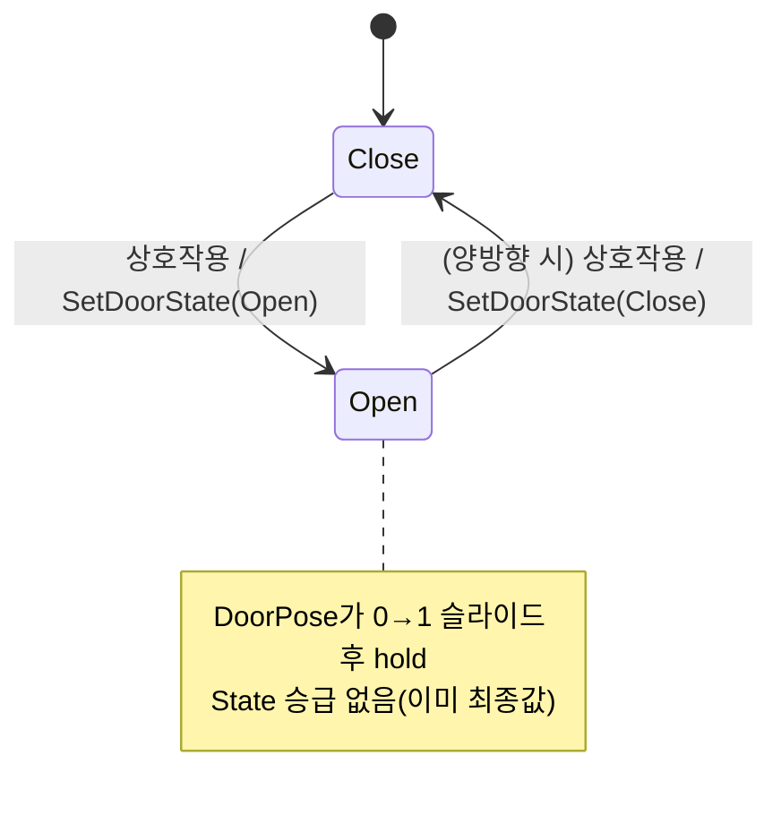

# WxDoor State enum 4종 → 2종(Close/Open) 압축

## 계획

### 목표
`AWxDoor`의 `EWxDoorState`를 `{ Closed, Opening, Open, Closing }` 4종에서 `{ Close, Open }` 2종으로 압축한다. `Opening`/`Closing`은 안정 상태와 동일한 DoorPose 태스크로 수렴하는 전이 상태일 뿐이라, "여는 중"을 별도 질의하지 않으면 2상태로 줄여도 동작이 같다(직전 작업 후속 과제로 예고됨). `State`를 "여닫는 확정 목표"로 재정의하고, 애니 완료 시 서버가 State를 승급하던 메커니즘을 제거한다.

### 수정 범위
| 파일 | 수정할 내용 | 구분 |
|---|---|---|
| `WxWorld/.../Gimmick/WxDoor.h` | `EWxDoorState`를 `{ Close, Open }`로 축소(`Closed`→`Close` 리네임); `State` 기본값·클래스 doc 다이어그램·`SetDoorState` 주석을 2상태/"State=확정 목표" 기준으로 갱신 | 수정 |
| `WxWorld/.../Gimmick/WxDoor.cpp` | `BeginPlay` pre-snap `bStartOpen = (State==Open)`(`\|\| Closing` 제거); `HandleConsoleInteracted` `Close→Open`·`Open→Close` 토글; 주석 갱신 | 수정 |
| `WxWorld/.../Gimmick/WxDoorStateTreeNodes.cpp` | `DoorPose::EnterState`/`Tick`에서 `SetDoorState(...)` 승급 호출 제거 → 순수 비주얼 보간 태스크화; 주석 갱신 | 수정 |
| `WxWorld/.../Gimmick/WxDoorStateTreeNodes.h` | `DoorStateIs` 인스턴스 기본값 `Closed`→`Close`; `bOpen`·노드 셋·`DoorStateIs` 주석에서 승급/4상태 열거 제거 | 수정 |

### 접근 방식
- **State = 확정 목표, 슬라이드 = 순수 비주얼**: 상호작용 시점에 `State`를 최종값(Open/Close)으로 곧장 확정한다. 전이 상태가 없으므로 DoorPose는 더 이상 State를 승급하지 않고, 현재 알파→목표 알파 보간 후 hold만 하는 권위-쓰기 없는 비주얼 태스크가 된다. 복제·SaveGame은 확정 목표를 그대로 보존한다.
- **인터랙션 토글은 안정 상태로 접힘**: 슬라이드-중 인터랙션 OFF 게이팅(구 Opening/Closing)이 사라진다. 현재 단방향(Open 인터랙션 OFF) 구성에선 가시 동작 100% 동일. 양방향 활성화 시에만 슬라이드 도중 재상호작용 허용이라는 차이가 생기며, 압축의 대가로 수용.
- **에셋 author 인터페이스 불변**: `DoorPose(bOpen)`/`DoorInteraction(bEnableInteraction)`/`DoorStateIs(State)` 노드 시그니처는 유지하고 내부 승급 로직만 제거 → ST_Door는 상태 2개로 재작성만 하면 됨(enum 값 변경으로 참조가 깨지므로 사용자 에디터 작업 필수).

---

## 완료

### 수정한 파일
| 파일 | 수정한 내용 | 구분 |
|---|---|---|
| `WxWorld/.../Gimmick/WxDoor.h` | `EWxDoorState` → `{ Close, Open }`(`Closed`→`Close` 리네임); `State` 기본값·클래스 doc 다이어그램·각 값/`SetDoorState` 주석을 "State=확정 목표, 슬라이드는 비주얼" 기준으로 갱신 | 수정 |
| `WxWorld/.../Gimmick/WxDoor.cpp` | `BeginPlay` pre-snap `State==Open` 단일 비교로 축소; `HandleConsoleInteracted` `Close↔Open` 토글; 주석 갱신 | 수정 |
| `WxWorld/.../Gimmick/WxDoorStateTreeNodes.cpp` | `DoorPose::EnterState`/`Tick`에서 `SetDoorState(...)` 승급 호출 2곳 제거 → 보간·hold만 하는 순수 비주얼 태스크; 주석 갱신 | 수정 |
| `WxWorld/.../Gimmick/WxDoorStateTreeNodes.h` | `DoorStateIs` 기본값 `Close`; `bOpen`·노드 셋·`DoorPose`·`DoorStateIs` 주석에서 승급/4상태 열거 제거 | 수정 |

### 구현·결정과 그 이유
- **State를 "확정 목표"로 재정의해 승급 메커니즘 제거**: 전이 상태(`Opening`/`Closing`)가 사라지면서, 상호작용이 곧장 최종값을 확정한다. 그 결과 DoorPose가 애니 완료 시 `State`를 승급하던 권위 쓰기가 두 곳 모두 불필요해져, DoorPose는 "현재→목표 보간 후 hold"만 하는 순수 비주얼 태스크가 됐다. 복제·SaveGame은 확정 목표를 그대로 보존하므로 복원/레이트조인은 pre-snap으로 0프레임 수렴한다.
- **에셋 author 인터페이스 불변**: `DoorPose(bOpen)`/`DoorInteraction`/`DoorStateIs(State)` 노드 시그니처를 유지하고 내부 로직만 덜어내, ST_Door는 상태를 2개로 줄이는 재작성만 하면 된다.
- **`Closed`→`Close` 리네임**: 사용자 지시. enum 값/기본값/상호작용 분기 전부 반영. DoorPose의 GetDescription 포즈 라벨("Open"/"Closed")은 bool `bOpen`을 설명하는 별개 개념이라 그대로 뒀고, DoorStateIs 설명은 `StaticEnum` 동적 표시명이라 자동으로 "Close"로 갱신된다.

### 계획 대비 달라진 점
- 계획대로. README는 검토 결과 기존 서술이 여전히 정확해 변경하지 않음.

### 후속 과제
- **ST_Door 에셋 재작성(사용자, 필수)**: enum 값 변경으로 `DoorStateIs` 참조가 깨진다. 비주얼 상태를 `Close`/`Open` 2개만 남기고(`Close`: Pose bOpen=false + Interaction enabled / `Open`: Pose bOpen=true + Interaction disabled), Root 전이 `On Event Event.Gimmick.StateChanged → Root`는 유지. BP_Door의 DoorStateTree 재할당 확인.
- **양방향 활성화 시**: Open 상태의 DoorInteraction을 enabled로만 바꾸면 됨. 단 2상태에선 슬라이드-중 인터랙션 게이팅이 없어 슬라이드 도중에도 즉시 반대 전환이 가능(스팸 방지 게이트 없음).
- **SaveGame 비호환**: `State` 값 의미 변경으로 기존 개발 슬롯 비호환(개발 중 무시).
