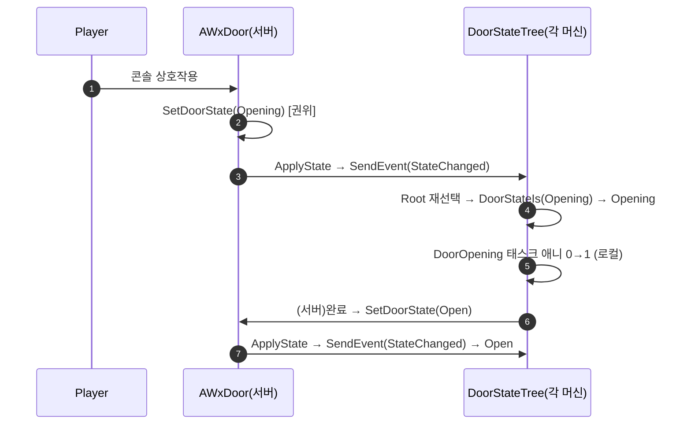

# WxDoor 자체 State enum 전환 (StateTree 유지)

## 계획

### 목표
`AWxDoor`가 base `bTriggered` 대신 자체 `EWxDoorState`(복제+SaveGame)를 소유하도록 전환한다. `AWxElevator`가 이미 쓰는 "자체 enum + `OnRep_State`→`ApplyState`" 관례에 도어를 합류시키고, StateTree는 그 `State`를 읽어 렌더·구동하는 상태머신으로 유지한다. base `bTriggered`는 점진적 폐기 방향(이번엔 도어만 이탈, 콘솔/상자는 후속 이전).

### 수정 범위
| 파일 | 수정할 내용 | 구분 |
|---|---|---|
| `WxCore/.../WxGameplayTags.h/.cpp` | `Event_Gimmick_Triggered` → `Event_Gimmick_StateChanged`("Event.Gimmick.StateChanged"). 재선택 신호로 일반화 | 수정 |
| `WxWorld/.../Gimmick/WxDoor.h` | `EWxDoorState` 추가; `State`(OnRep_State, SaveGame)·`OnRep_State`·`GetDoorState`·`SetDoorState`·`GetLifetimeReplicatedProps`; `IsDoorTriggered` 제거 | 수정 |
| `WxWorld/.../Gimmick/WxDoor.cpp` | bTriggered 경로 제거; `SetDoorState`/`OnRep_State`/`ApplyState`(=StateChanged 송출); 상호작용→`SetDoorState(Opening)`; `DOREPLIFETIME(State)` | 수정 |
| `WxWorld/.../Gimmick/WxDoorStateTreeNodes.h/.cpp` | `DoorTriggered` 조건 → `DoorStateIs{EWxDoorState State}`; `DoorOpening`은 완료 시 서버에서 `SetDoorState(Open)` 후 Running 유지(Succeeded 의존 제거); `DoorPose` 유지 | 수정 |
| `WxWorld/.../Gimmick/WxGimmick.h` | `bTriggered` 주석에 점진적 폐기 예정 명시(코드 유지) | 수정(주석) |

### 접근 방식
- **`State`가 권위 원천, StateTree는 그것을 따른다 (단일 클럭)**: `EWxDoorState{Closed,Opening,Open}` 가 권위/영속/조회 상태. 전이는 "State 변경 → `StateChanged` 이벤트 → Root 재선택" 한 메커니즘으로 통일(태스크 완료 전이 없음). Closed→Opening은 상호작용(서버)이 `SetDoorState(Opening)`, Opening→Open은 `DoorOpening` 태스크 애니 완료 시 서버가 `SetDoorState(Open)`.
- **초기 선택은 `DoorStateIs(State)` 조건**: BeginPlay→StartLogic이 현재 State에 맞는 상태를 선택(복원/레이트조인 스냅). 조건 상호배타라 자식 순서 무관.
- **엘리베이터와 동형 네트워크**: `State`는 서버 권위·복제·SaveGame, 클라는 쓰지 않음(SetDoorState 권위 게이트)·`OnRep_State`→StateChanged로 자기 StateTree를 맞춤. Opening 애니는 각 머신 로컬.

---

## 완료

### 수정한 파일
| 파일 | 수정한 내용 | 구분 |
|---|---|---|
| `WxCore/.../WxGameplayTags.h/.cpp` | `Event_Gimmick_Triggered` → `Event_Gimmick_StateChanged`("Event.Gimmick.StateChanged"). 재선택 신호로 일반화 | 수정 |
| `WxWorld/.../Gimmick/WxDoor.h/.cpp` | `EWxDoorState{Closed,Opening,Open,Closing}`(복제+SaveGame) 소유로 전환; `SetDoorState`/`OnRep_State`/`ApplyState`(=StateChanged 송출)/`GetLifetimeReplicatedProps`; 핸들러 `Closed→Opening`·`Open→Closing`; bTriggered 경로 제거 | 수정 |
| `WxWorld/.../Gimmick/WxDoorStateTreeNodes.h/.cpp` | `DoorTriggered` 조건 → `DoorStateIs`; 방향성 태스크 `DoorOpening`(0→1→Open)·`DoorClosing`(1→0→Closed); `DoorPose` 유지 | 수정 |
| `WxWorld/.../Gimmick/WxGimmick.h` | `bTriggered` 점진적 폐기 예정 주석 추가(코드 유지) | 수정(주석) |

### 구현·결정과 그 이유
- **상태 소유를 도어로 이동(엘리베이터와 동형)**: 도어가 자체 권위/영속 상태를 가지게 하여, base의 단일 발동 비트에 기대던 간접성을 제거했다. 엘리베이터가 이미 확립한 "자체 enum + OnRep→ApplyState + SaveGame" 관례에 합류해 다상태 기믹의 표현을 한 패턴으로 통일했다. base 발동 비트는 단순 콘솔/상자를 위해 남기되, 점진적 폐기 방향을 주석으로 명시했다.
- **State가 권위, StateTree는 그것을 따른다(단일 메커니즘)**: 모든 전이를 "상태 변경 → 한 이벤트 송출 → 루트 재선택"으로 통일했다. 서버는 상호작용·애니 완료 시 상태를 승급해 발행하고, 모든 머신의 StateTree는 그 상태에 맞는 비주얼을 조건으로 선택한다. 태스크 완료 기반 전이를 없애 에셋이 단순해지고, 선택 조건이 상호배타라 자식 순서 의존이 사라졌다. 권위 쓰기는 한 진입점에서 게이트되어 클라가 상태를 쓰지 않는다.
- **포즈는 파라미터화, 슬라이드는 방향성 명시**: 정지 포즈는 (interaction, bOpen)로 Closed/Open에 재사용하되(개방 알파는 0/1만 유효하므로 bool로 명시), 슬라이드는 제네릭 1종이 아니라 `DoorOpening`/`DoorClosing` 두 방향성 태스크로 두었다. 상태 이름과 태스크 이름을 1:1로 맞춰(에셋에서 자명) 제네릭 슬라이드의 이름 혼동을 피했다.
- **닫기는 구조 완비 + 게이트 오프**: Closing 상태·태스크·핸들러 분기까지 모두 넣되, Open의 인터랙션을 에셋에서 비활성으로 두어 현재는 Closing에 진입하지 못하게 했다. 단방향 동작을 유지하면서 닫기 활성화를 단일 에셋 플래그(Open interaction)로 환원했다.

### 계획 대비 달라진 점
- 승인 후 "향후 닫기" 논의를 거치며, 처음엔 개방 전용 슬라이드를 범용 파라미터 슬라이드로 일반화했다가 → 상태/태스크 이름 혼동 우려로 방향성 명시 태스크(`DoorOpening`/`DoorClosing`)로 재정리했다.
- 닫기 구조를 "나중에 추가"가 아니라 지금 완비하되 Open 인터랙션 비활성으로 게이트하는 방식으로 결정. enum에 `Closing` 추가, 핸들러에 `Open→Closing` 분기 포함.

### 후속 과제
- **ST_Door 에셋 재작성(사용자)**: 네 상태의 enter condition을 `Wx Door State Is`(Closed/Opening/Open/Closing)로, Opening→`Wx Door Opening`·Closing→`Wx Door Closing` 태스크로, 전이를 각 상태(또는 Root)의 `On Event Event.Gimmick.StateChanged → Root` 하나로. **Open의 `Wx Door Pose` interaction=false 유지(닫기 게이트 오프)**. BP_Door의 DoorStateTree에 ST_Door 할당.
- **닫기 활성화 시**: Open의 `Wx Door Pose` interaction=true로만 바꾸면 반복 개폐 동작(C++/핸들러는 이미 준비됨). 클래스 주석의 단방향 설명도 갱신.
- **세이브 호환성**: 저장 필드가 발동 비트 → State enum으로 변경(기존 슬롯 비호환, 개발 중 무시).
- **전이 상태 저장→복원**: Opening/Closing으로 저장되면 복원 시 해당 슬라이드 1회 재생(자가 수렴, 시각 사소).
- **bTriggered 점진 폐기**: 잔여 콘솔/상자(Alarm/Spawn/TreasureChest)를 각자 enum으로 이전하면 base에서 제거.
