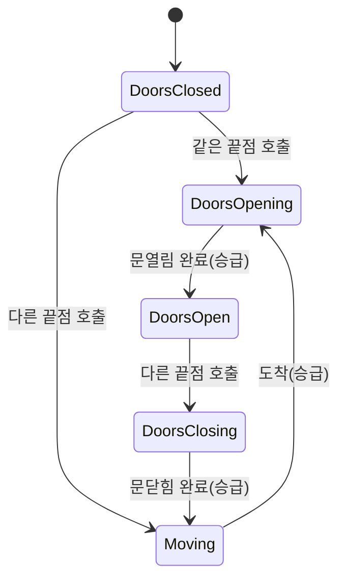

# WxElevator를 WxDoor처럼 StateTree 기반으로 전환

## 계획

### 목표
`AWxElevator`의 명령형 `Tick` 상태 머신(`switch(State)`로 플랫폼 이동·문 애니·승급)을 걷어내고, `AWxDoor`와 동형의 StateTree 구동 구조로 전환한다. C++는 권위 복제 상태(`State`/`TargetEndpoint`/거리)와 얇은 프리미티브만 들고, 연속 보간·전이 승급·인터랙션 토글은 `ElevatorStateTree`(신규 `ST_Elevator` 에셋 + `WxElevatorStateTreeNodes`)가 맡는다. 위치/알파 스냅은 엘리베이터 특유의 풍부한 위치 상태 때문에 `ApplyState`에 유지한다.

### 수정 범위
| 파일 | 수정할 내용 | 구분 |
|---|---|---|
| `WxWorld/.../Gimmick/WxElevator.h` | `ElevatorStateTree` 추가; 프리미티브(`Get/SetElevatorState`, `Set/GetPlatformDistance`, `GetTargetDistance/MoveDuration/SplineLength`, `Set/GetDoorOpenAlpha`, `GetDoorAnimDuration`, `SetAllInteractionsEnabled` public) 노출; `Tick` 선언 제거; `SnapVisualsToState` 헬퍼; `DoorAnimProgress`→`CurrentOpenAlpha` | 수정 |
| `WxWorld/.../Gimmick/WxElevator.cpp` | 생성자에 StateTree 컴포넌트(`SetStartLogicAutomatically(false)`); `Tick` 삭제; `ApplyState`=`SnapVisualsToState`+SendEvent; `SnapVisualsToState`(현 switch 위치/알파 스냅); `BeginPlay`=pre-snap+`StartLogic`; 프리미티브 구현 | 수정 |
| `WxWorld/.../Gimmick/WxElevatorStateTreeNodes.h/.cpp` | 노드 4종: `ElevatorStateIs`, `ElevatorInteraction(bEnableInteraction)`, `ElevatorDoorPose(bOpen, PromoteToState)`, `ElevatorMove(PromoteToState)` | 신규 |

### 접근 방식
- **명령형 Tick → 선언형 StateTree**: `Tick`의 이동/문애니/승급 분기를 태스크로 옮긴다. 전이는 도어와 동일하게 "권위 승급 → `Event.Gimmick.StateChanged` 송출 → Root 재선택" 한 메커니즘. `ElevatorMove`는 플랫폼을 `MoveDuration` 기준 일정속도 보간 후 도달 시 `DoorsOpening`으로 승급, `ElevatorDoorPose`는 문 알파를 보간 후 `PromoteToState`로 승급(정지 상태는 자기상태 승급=노옵으로 hold).
- **위치/알파 스냅은 C++ 유지**: 엘리베이터는 플랫폼 위치라는 상태가 있어 복원/복제 정합을 위해 `ApplyState`가 매 상태 적용 시 `SnapVisualsToState`로 위치·알파를 스냅한다(현 동작 보존). 틱-토글·인터랙션-토글만 태스크로 이전. 라이브 전이에선 `CurrentDistance`가 자연히 정위치라 스냅이 무해, 복원에선 필수.
- **상태 5개 유지**: `Moving`/`DoorsOpening`/`DoorsClosing`/정지는 태스크가 본질적으로 달라 도어처럼 접히지 않는다. SaveGame enum/필드 불변이라 기존 슬롯 호환.

---

## 완료

### 수정한 파일
| 파일 | 수정한 내용 | 구분 |
|---|---|---|
| `WxWorld/.../Gimmick/WxElevator.h` | `ElevatorStateTree` 추가; 프리미티브 public 노출(`Get/SetElevatorState`, `Set/GetPlatformDistance`, `GetTargetDistance/MoveDuration/SplineLength`, `Set/GetDoorOpenAlpha`, `GetDoorAnimDuration`, `SetAllInteractionsEnabled`); `Tick` 선언 제거; `SnapVisualsToState` 헬퍼; `DoorAnimProgress`→`CurrentOpenAlpha`; doc 주석 StateTree 기준 갱신 | 수정 |
| `WxWorld/.../Gimmick/WxElevator.cpp` | 생성자에 StateTree 컴포넌트(`SetStartLogicAutomatically(false)`)·`PrimaryActorTick` 설정 제거; `Tick` 전체 삭제; `ApplyState`=`SnapVisualsToState`+SendEvent; `SnapVisualsToState`(구 switch 위치/알파 스냅); `BeginPlay`=pre-snap+`StartLogic`; `SetPlatformDistance`/`SetDoorOpenAlpha` 프리미티브; `BeginMoveSequence`가 `SetElevatorState` 사용 | 수정 |
| `WxWorld/.../Gimmick/WxElevatorStateTreeNodes.h/.cpp` | 노드 4종: `ElevatorStateIs`, `ElevatorInteraction(bEnableInteraction)`, `ElevatorDoorPose(bOpen, PromoteToState)`, `ElevatorMove(PromoteToState)` + 에디터 `GetDescription` | 신규 |
| `WxWorld/README.md` | 엘리베이터/노드 StateTree 구동 반영(핵심타입·확장포인트·담당) | 수정 |

### 구현·결정과 그 이유
- **명령형 Tick → 선언형 StateTree(도어와 동형)**: `switch(State)` Tick의 이동/문애니/승급을 태스크로 옮겼다. `ElevatorMove`는 플랫폼을 `MoveDuration` 기준 일정속도 보간 후 도달 시 `DoorsOpening`으로, `ElevatorDoorPose`는 문 알파 보간 후 `PromoteToState`로 승급한다. 전이는 도어와 같은 "권위 승급 → `StateChanged` → Root 재선택" 단일 메커니즘. 액터 Tick을 없애고 StateTree 컴포넌트가 틱을 소유한다.
- **정지 상태는 자기상태 승급으로 hold**: `ElevatorDoorPose`에 별도 `bPromote` 불리언을 두는 대신, 정지 상태(DoorsClosed/DoorsOpen)의 `PromoteToState`를 자기상태로 두면 `SetElevatorState` 동일값 노옵으로 승급이 자연히 비활성된다. 파라미터 하나로 전이/정지를 모두 표현해 노드가 단순해졌다.
- **위치/알파 스냅은 C++ `ApplyState`에 유지**: 도어는 알파 하나라 StateTree만으로 충분했지만, 엘리베이터는 플랫폼 위치라는 상태가 있어 복원/복제 정합을 위해 `SnapVisualsToState`를 모든 상태 적용 시점(`ApplyState`)에 유지했다. 라이브 전이에선 `CurrentDistance`가 자연히 정위치라 스냅이 무해하고, 슬롯 복원(특히 DoorsClosing=반대끝점, Moving=출발보정)에선 필수다. `BeginPlay`는 StartLogic 전에 pre-snap만 한다.
- **GetDescription 헬퍼 인라인**: enum 표시명 조회를 익명 namespace 헬퍼 대신 각 `GetDescription`에 인라인했다(`.cpp` 내부 헬퍼 회피 관례).

### 계획 대비 달라진 점
- 계획대로. README는 도어 전용 서술이 부정확해져 엘리베이터/`WxElevatorStateTreeNodes` 포함으로 정정(계획의 "선택" 항목 수행).

### 후속 과제
- **ST_Elevator 에셋 신규 author(사용자, 필수)**: `StateTreeComponentSchema`(컨텍스트 `AWxElevator`)로 5개 상태 + Root 단일 전이. 각 상태 Tasks는 계획 표 참조(DoorsClosed/Open=정지 hold+Interaction enabled, DoorsOpening/Closing/Moving=전이+Interaction disabled). BP_Elevator의 `ElevatorStateTree`에 할당. ST_Door author 경험과 동일 패턴.
- **검증 미완**: 컴파일만 확인. ST_Elevator author 후 PIE에서 호출/이동/문/복원 시퀀스 및 2클라 복제 동기 확인 필요.
- **SaveGame 호환**: enum/필드 의미 불변이라 기존 슬롯 호환(도어와 달리 깨지지 않음).
