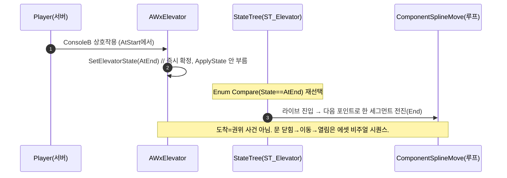

# WxElevator 도어 동형 단순화 (이벤트 없는, State-무관 mover)

## 계획

### 목표
`AWxElevator`의 권위 상태를 도착 목적지 `{AtStart, AtEnd}` 두 값으로 줄여 도어와 동일한 결로 만든다. 인터랙션 시 즉시 최종 State를 확정하고, 플랫폼 이동은 State 무관 비주얼 mover(닫힌 루프 위 한 세그먼트 전진)로 처리해 "Moving" 권위 상태·도착 승급·`BeginMoveSequence` 오케스트레이션을 전부 제거한다.

### 수정 범위
| 파일 | 수정할 내용 | 구분 |
|---|---|---|
| `WxGimmickStateTreeNodes.cpp/.h` | `ComponentSplineMove` 초기 진입을 "다음 포인트 전진"→"현재 포인트 hold"로, 라이브 전이만 전진. doc 정정 | 수정 |
| `WxElevator.h` | enum 2값 `{AtStart, AtEnd}`, Endpoint·TargetEndpoint·Current/TargetDistance·MoveDuration·BeginMoveSequence·MovePlatform*·OnRep·고아 게터 제거, `ApplyState` override, State Replicated+SaveGame(RepNotify 없음), doc 갱신 | 수정 |
| `WxElevator.cpp` | 복제 props 정리, `ApplyState`(State로 위치 스냅)·핸들러(즉시 확정)·`SetPlatformDistance`(stateless) 재작성, `SetElevatorState`는 쓰기만(ApplyState 호출 안 함), `SetClosedLoop(true)` 유지 | 수정 |

### 접근 방식
- **도어 동형 권위 상태**: State는 도착 목적지 2값. 인터랙션 콜백이 현재 State를 보고 다음 State를 즉시 확정(방향성/노옵 게이트는 핸들러가). "도착"이라는 권위 사건 없음.
- **State-무관 mover + 닫힌 루프**: `ComponentSplineMove`가 누를 때마다 한 세그먼트 전진. 닫힌 루프라 End→Start도 정방향 한 세그먼트. State 변화→Enum Compare 재선택→mover 라이브 진입→전진. 초기 진입(시작/복원/조인)은 현재 포인트 hold(전진 안 함).
- **로드/복원 위치만 C++ 스냅**: 베이스 후크 `ApplyState`(BeginPlay+OnWxSaveRestored)가 State로 끝점 스냅. 라이브 전이엔 ApplyState 안 부름(이동은 mover). mover 초기-진입-hold가 이 스냅을 덮어쓰지 않게 맞물림.

---

## 완료

### 수정한 파일
| 파일 | 수정한 내용 | 구분 |
|---|---|---|
| `WxGimmickStateTreeNodes.cpp` | `ComponentSplineMove::EnterState`를 초기 진입(SourceStateID 무효)=현재 포인트 hold / 라이브 전이=다음 포인트 전진으로 분기 재작성 | 수정 |
| `WxGimmickStateTreeNodes.h` | `ComponentSplineMove` doc 정정(초기 진입 hold) | 수정 |
| `WxElevator.h` | enum 2값 `{AtStart, AtEnd}`, Endpoint·TargetEndpoint·Current/TargetDistance·MoveDuration·BeginMoveSequence·MovePlatform*·OnRep·고아 게터 제거, State Replicated+SaveGame(RepNotify 없음), `SetElevatorState`/`SetPlatformDistance` private화, doc 전면 갱신 | 수정 |
| `WxElevator.cpp` | 복제 props=State만, BeginPlay 초기 1회 위치 스냅+StartLogic, 핸들러 즉시 확정(서버), `SetElevatorState`는 쓰기만, `SetPlatformDistance` stateless, `SetClosedLoop(true)` 유지 | 수정 |

### 구현·결정과 그 이유
- **도어 동형 권위 상태**: State를 도착 목적지 2값으로 줄이고 인터랙션 시 즉시 확정. "Moving" 권위 상태·도착 승급(노드/타이머)·`BeginMoveSequence` 오케스트레이션이 통째로 사라졌다. 방향성/노옵은 `SetElevatorState`의 동일값 노옵으로 자연 처리.
- **State-무관 mover + 닫힌 루프**: 플랫폼 이동을 `ComponentSplineMove`의 "한 전이=한 세그먼트 전진"으로 처리. 닫힌 루프라 End→Start도 폐합 구간을 타는 정방향 한 세그먼트라 양방향이 한 노드로 성립.
- **mover 초기 진입을 hold로**: 기존엔 초기 진입이 "다음 포인트로 스냅"이라 복원/시작 시 한 칸 튀었다. "현재 포인트 hold"로 바꿔 정지/주차 상태를 그대로 복원하게 했다(일반적으로도 더 타당, 소비처가 ST_Elevator뿐이라 영향 국소).

### 계획 대비 달라진 점
- **위치 스냅을 `ApplyState` 오버라이드 → `BeginPlay` 인라인 1회로 이동**: 구현 중, `ApplyState`를 복원 후크(`OnWxSaveRestored`, BeginPlay 이후)에서 스냅에 쓰면 State-무관 mover가 그 스냅 위치에서 한 칸 더 전진해 위치/State가 어긋나는 걸 발견. 초기 로드(BeginPlay)에서만 스냅하고 BeginPlay 이후 복원은 mover의 라이브 전진에 맡기도록 바꿨다(도어가 `ApplyState`를 오버라이드 안 하는 것과 동형). `ApplyState` 오버라이드 제거.

### 후속 과제
- **PIE 검증 미완**: 컴파일만 확인(WxEditor Development, Succeeded). 에셋 author 후 왕복/문 시퀀스, "같은 층 호출 시 이동 없이 문만 열림", 2클라 권위 게이팅, 복원/조인 위치 정합 확인 필요.

---

## 추가 수정 (3-state 복원: doors-shut-idle)

사용자 피드백 — "idle 시 문 닫힘, 같은 층에서 호출하면 이동 없이 문만 열림, 도착 후 문 계속 열림"이 필요. 2-state(`AtStart`/`AtEnd`)는 "같은 층 호출=동일값 노옵"이라 문 열기가 불가했다.

- **enum 3-state 복원**: `{Closed, AtStart, AtEnd}`(기본 `Closed`). `Closed`=Start+문 닫힘(초기). `Closed→AtStart`가 "같은 층, 이동 없이 문만 열기"를 표현. `HandlePlatformInteracted`는 `Closed`(문 닫힘)에서 노옵 가드. `ConsoleA/B`·`SetElevatorState`·BeginPlay 스냅은 그대로 정합(`Closed`→Start 위치).
- **에셋 요구(사용자)**: `Closed`와 `AtStart`는 같은 위치(Start)라 `Closed→AtStart` 전이가 플랫폼을 전진시키면 안 된다. ST_Elevator 를 **끝점별 부모(Start/End)가 Spline Move 를 들고, 그 아래 문 상태(Closed/AtStart, AtEnd)를 자식**으로 두어 같은 끝점 안 전이(Closed↔AtStart)에선 부모(Spline Move)가 재진입하지 않게 author. 끝점이 바뀌는 전이에서만 부모가 재진입해 플랫폼이 전진한다.
- 검증: WxEditor Development 재빌드 Succeeded.
