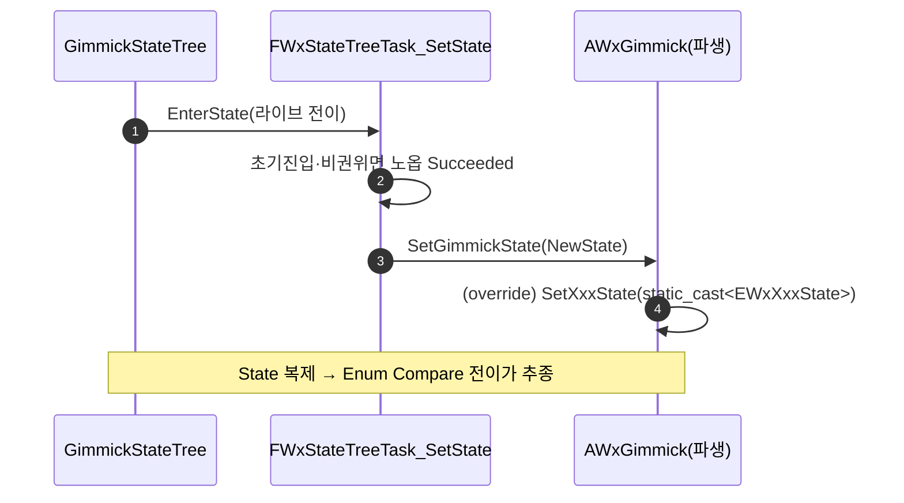

# FWxStateTreeTask_SetState 추가 (서버 권위 전용)

## 계획

### 목표
ST 가 권위 측에서 기믹의 State enum 을 직접 확정할 수 있는 공용 노드 `FWxStateTreeTask_SetState` 를 추가한다. 지금까지 State 는 C++ Handle 콜백만 썼고 ST 는 추종만 했으나, 상호작용 트리거 없이 ST 스스로 복귀해야 하는 경우(예: 시퀀스/타이머 종료 후 자동 복귀)를 ST 에셋으로 표현할 길을 연다. 서버 권위로만 실행한다.

### 수정 범위
| 파일 | 수정할 내용 | 구분 |
|---|---|---|
| `Plugins/WxWorld/.../Public/Gimmick/WxGimmick.h` | 베이스 가상 훅 `virtual void SetGimmickState(uint8 NewStateValue) {}` 추가(기본 노옵) | 수정 |
| `Plugins/WxWorld/.../Public/Gimmick/WxGimmickStateTreeNodes.h` | `FWxStateTreeTask_SetState` 선언 + 상단 노드 목록 주석 1줄 | 수정 |
| `Plugins/WxWorld/.../Private/Gimmick/WxGimmickStateTreeNodes.cpp` | `FWxStateTreeTask_SetState` 정의 + `WxGimmick.h` include | 수정 |

### 접근 방식
- **소유 액터 메서드 호출**: StateTree 일반 바인딩은 단방향 복사, `FStateTreePropertyRef` 도 Context/External(=소유 액터 멤버)를 못 가리킨다. 따라서 태스크는 owner 를 `AWxGimmick` 로 캐스트해 베이스 훅 `SetGimmickState(uint8)` 를 호출한다(`Wx Play Level Sequence` 의 호스트 호출과 동형). 기믹마다 enum 타입이 달라 공용 노드는 원시 `uint8` 로 다룬다.
- **가드는 `Wx Trigger Spawners` 와 동일**: ① 초기 진입(SourceStateID 무효: 시작/세이브 복원/레이트조인) 스킵 — 저장된 State 보존, ② 비권위 노옵 — 클라는 복제 State 추종. 둘 다 통과한 권위 라이브 진입에서만 1회 쓰기. `bShouldCallTick = false`.
- **범위 한정(승인)**: 태스크 + 베이스 훅만. 기믹 override(예: CutsceneTrigger) 와 ST_*.uasset 배선은 후속(.uasset 직접 편집 불가).

---

## 완료

### 수정한 파일
| 파일 | 수정한 내용 | 구분 |
|---|---|---|
| `Plugins/WxWorld/.../Public/Gimmick/WxGimmick.h` | 베이스 가상 훅 `virtual void SetGimmickState(uint8 NewStateValue) {}` 추가(생성자 뒤, 기본 노옵) | 수정 |
| `Plugins/WxWorld/.../Public/Gimmick/WxGimmickStateTreeNodes.h` | `FWxStateTreeTask_SetState`(+InstanceData `uint8 NewState`) 선언, TriggerSpawners 뒤. 상단 노드 목록 주석 1줄 | 수정 |
| `Plugins/WxWorld/.../Private/Gimmick/WxGimmickStateTreeNodes.cpp` | `FWxStateTreeTask_SetState` 정의(TriggerSpawners 뒤), `Gimmick/WxGimmick.h` include | 수정 |

### 구현·결정과 그 이유
- **소유 액터 메서드 호출**: StateTree 일반 바인딩은 단방향 복사이고 `FStateTreePropertyRef` 도 Context/External(=소유 액터 멤버)을 못 가리킨다(엔진 `StateTreePropertyRef.h` 주석 확인). 그래서 바인딩으로 기믹 State 에 쓸 길이 없어, owner 를 `AWxGimmick` 로 캐스트해 베이스 훅 `SetGimmickState(uint8)` 를 호출하는 방식으로 갔다. 기믹마다 State enum 타입이 달라 공용 노드는 원시 `uint8` 로 다룬다.
- **이중 가드(`Wx Trigger Spawners` 동형)**: ① 초기 진입 스킵으로 세이브 복원·레이트조인 시 저장된 State 를 덮어쓰지 않게 하고, ② 비권위 노옵으로 클라가 State 를 쓰지 않게 한다(클라는 복제 State 추종). 둘 다 통과한 권위 라이브 진입에서만 1회 쓰고 곧바로 Succeeded. `bShouldCallTick=false`.
- **베이스 가상함수(인터페이스 아님)**: 사용자 승인대로 `AWxGimmick` 베이스 훅으로 두었다. 호출자(새 태스크)가 있으므로 방어적 선언이 아니다. 이번 범위에선 어떤 기믹도 오버라이드하지 않는다.

### 계획 대비 달라진 점
- 훅 배치 위치: 계획은 기존 `HandleLevelSequenceFinished()` 바로 아래였으나, 작업 중 사용자가 동시 리팩터링으로 그 베이스 훅을 제거(시퀀스 종료를 OnComplete 전이로 전환)해, `SetGimmickState` 를 생성자 뒤 public 구역에 두었다. 결과 동일.
- 빌드 가능성: 계획 시점엔 사용자의 진행 중 작업(누락 `WxLevelSequencePlaybackHost.h` 참조)으로 트리가 컴파일 불가였으나, 구현 중 사용자가 그 참조를 제거해 컴파일 가능 상태가 됐다.

### 후속 과제
- **빌드 검증**: 사용자가 직접 수행하기로 한 사항(Q3). WxEditor(Development) 빌드로 컴파일 확인 필요. 본 추가는 `AWxGimmick`·표준 StateTree 헤더에만 의존하는 자기완결 변경.
- **채택**: 실제 사용하려면 (a) 대상 기믹이 `SetGimmickState` 를 오버라이드해 원시 값을 자기 enum 으로 캐스트 후 기존 `SetXxxState` 로 위임, (b) ST_*.uasset 에서 `Wx Set State` 노드 배치·`NewState` 지정. 첫 후보는 `AWxCutsceneTrigger`(현 C++ `PlaybackTimer` 의 Playing→Idle 복귀를 ST 의 PlayLevelSequence 완료→SetState 로 대체). 모두 이번 범위 밖.
