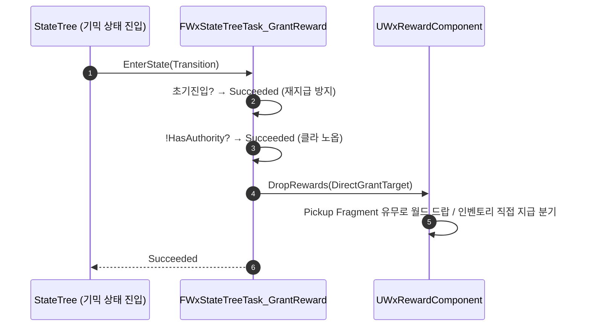

# 보상 지급 StateTreeTask 추가 (Wx Grant Reward)

## 계획

### 목표
StateTree로 구동되는 기믹이 특정 상태로 전이될 때 보상을 지급할 수 있도록, 컨텍스트 액터의 `UWxRewardComponent`를 트리거하는 공용 StateTreeTask `FWxStateTreeTask_GrantReward`를 WxInventory 플러그인에 추가한다. 아이템 타입에 따른 월드 드랍 vs 인벤토리 직접 지급 분기는 이미 `DropRewards`에 있으므로 재구현하지 않고 호출만 한다.

### 수정 범위
| 파일 | 수정할 내용 | 구분 |
|---|---|---|
| `Plugins/WxInventory/Source/WxInventory/Public/Inventory/WxRewardStateTreeNodes.h` | `FWxStateTreeTask_GrantRewardInstanceData`(RewardComponent, DirectGrantTarget) + `FWxStateTreeTask_GrantReward`(FStateTreeTaskCommonBase) 정의 | 신규 |
| `Plugins/WxInventory/Source/WxInventory/Private/Inventory/WxRewardStateTreeNodes.cpp` | 생성자(`bShouldCallTick=false`), `EnterState`, `#if WITH_EDITOR GetDescription` | 신규 |
| `Plugins/WxInventory/Source/WxInventory/WxInventory.Build.cs` | `PublicDependencyModuleNames`에 `"StateTreeModule"` 추가 | 수정 |

### 접근 방식
- **기존 추상화 트리거 (재구현 없음)**: 태스크는 `UWxRewardComponent`를 바인딩받아 `DropRewards(DirectGrantTarget)`만 호출. 타입별 분기·발사 물리·스폰 위치는 컴포넌트가 처리. `FWxStateTreeTask_TriggerSpawners`가 `AWxSpawner::Respawn()`만 호출하는 것과 동일한 결.
- **배치 = WxInventory**: 보상 시스템이 WxInventory에 있고, WxWorld는 WxInventory를 참조할 수 없으므로(도메인→도메인 의존 금지) 보상 태스크도 WxInventory에 둔다.
- **서버 권위 게이팅**: `Owner->HasAuthority()` 아니면 노옵 후 Succeeded.
- **초기 진입 가드**: `!Transition.SourceStateID.IsValid()`(시작·복원·레이트조인)이면 재지급하지 않고 Succeeded — 보상 중복 방지.
- **DirectGrantTarget**: 비-픽업 보상(재화) 수령 대상을 바인딩 가능한 `AActor*`로 노출. 비우면 비-픽업 보상 스킵(월드 드랍만) — `DropRewards`의 기존 명세 동작.

---

## 완료

### 수정한 파일
| 파일 | 수정한 내용 | 구분 |
|---|---|---|
| `Plugins/WxInventory/Source/WxInventory/Public/Inventory/WxRewardStateTreeNodes.h` | `FWxStateTreeTask_GrantReward` + InstanceData 정의 | 신규 |
| `Plugins/WxInventory/Source/WxInventory/Private/Inventory/WxRewardStateTreeNodes.cpp` | 생성자/`EnterState`/`GetDescription` 구현 | 신규 |
| `Plugins/WxInventory/Source/WxInventory/WxInventory.Build.cs` | `PublicDependencyModuleNames`에 `StateTreeModule` 추가 | 수정 |
| `Plugins/WxInventory/WxInventory.uplugin` | `Plugins`에 `StateTree` 의존성 선언 추가 | 수정 |

### 구현·결정과 그 이유
- **기존 `DropRewards` 트리거만, 재구현 없음**: 아이템 타입별 분기(Pickup Fragment → 월드 드랍 / 없으면 인벤토리 직접 지급)와 발사 물리·스폰 위치는 이미 `UWxRewardComponent::DropRewards`가 처리한다. 태스크는 컴포넌트를 바인딩받아 호출만 한다. 기존 `FWxStateTreeTask_TriggerSpawners`가 `AWxSpawner::Respawn`을 호출만 하는 결과 동일.
- **WxInventory에 배치**: 보상 시스템이 WxInventory에 있고 WxWorld는 WxInventory를 참조 불가(도메인→도메인 금지)이므로, 기존 ST 태스크 모음(WxWorld)이 아닌 보상 시스템과 같은 플러그인에 두었다.
- **반드시 서버 권위(사용자 강조)**: `EnterState`에서 ① 초기 진입 가드(`!SourceStateID.IsValid()` → 복원/조인 시 중복 지급 차단) ② 권위 가드(`Owner->HasAuthority()` 아니면 클라 노옵)를 통과해야만 `DropRewards` 호출. 클라는 노옵 후 `Succeeded`로 복제 추종, 컴포넌트 null이면 `Failed`. 기존 `TriggerSpawners`/`SetState`와 동일한 게이팅.
- **DirectGrantTarget 노출**: 비-픽업 보상(재화) 수령 대상은 기믹이 자동으로 알 수 없어 바인딩 가능한 `AActor*`로 노출. 비우면 `DropRewards(nullptr)`로 비-픽업 보상은 스킵(월드 드랍만) — `DropRewards` 기존 명세 동작.

### 계획 대비 달라진 점
- `WxInventory.uplugin`에 `StateTree` 플러그인 의존성 선언 추가(계획엔 없던 파일). 첫 빌드에서 "module depends on StateTreeModule but plugin not listed" 경고가 나와, WxWorld.uplugin과 동일하게 선언해 해소. `GameplayStateTreeModule`은 미사용이라 `GameplayStateTree`는 추가하지 않음.

### 후속 과제
- 없음. (실제 인게임 드랍/지급 동작 검증은 디자이너가 ST 에셋에 태스크를 배치하고 `RewardComponent`/`DirectGrantTarget`을 바인딩하는 콘텐츠 작업에서 확인.)
