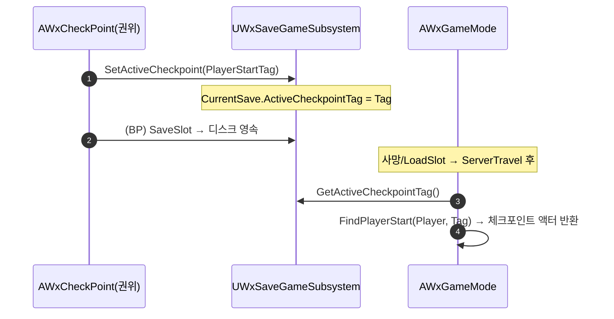

# 부활 지점: 저장된 Transform → WxCheckPoint(PlayerStart) 기반 전환

## 계획

### 목표
부활을 "SaveSlot 시점 플레이어 폰 Transform 저장 + 임시 PlayerStart 스폰"에서, `APlayerStart`가 된 `AWxCheckPoint` 액터를 직접 부활 지점으로 쓰는 방식으로 전환한다. WxSave는 좌표 대신 활성 체크포인트의 `PlayerStartTag`(FName)만 보관하고, GameMode는 엔진 `FindPlayerStart(Tag)`에 위임한다. 정확성(체크포인트 위치 부활)·단순화(임시 액터 제거)·응집도(의미 있는 참조 저장)를 동시에 개선.

### 수정 범위
| 파일 | 수정할 내용 | 구분 |
|---|---|---|
| `Plugins/WxSave/.../Public/WxSaveGame.h` | `FTransform PlayerRespawnTransform` → `FName ActiveCheckpointTag` | 수정 |
| `Plugins/WxSave/.../Public/WxSaveGameSubsystem.h` | `GetPlayerRespawnTransform` → `GetActiveCheckpointTag`, `SetActiveCheckpoint` 신설 | 수정 |
| `Plugins/WxSave/.../Private/WxSaveGameSubsystem.cpp` | SaveSlot 폰 Transform 캡처 삭제, Get/Set 구현, Dump 문구 교체 | 수정 |
| `Source/WxGame/Framework/WxGameMode.h` | `RespawnPlayerStart` 멤버·전방선언 삭제 | 수정 |
| `Source/WxGame/Framework/WxGameMode.cpp` | `ChoosePlayerStart`를 `FindPlayerStart(Tag)` 위임으로 축소, 임시 스폰 삭제 | 수정 |
| `Source/WxGame/WorldObject/WxCheckPoint.cpp` | `HandleInteracted` 권위 분기에 `SetActiveCheckpoint(PlayerStartTag)` 추가 | 수정 |

### 접근 방식
- **저장 데이터 전환**: raw 좌표 대신 활성 체크포인트 태그(FName). sentinel `NAME_None`.
- **GameMode 위임**: 임시 PlayerStart 스폰/파괴 전부 삭제, `FindPlayerStart(Player, Tag.ToString())`로 실제 배치된 체크포인트 액터 반환.
- **체크포인트 자기 등록**: 상호작용(권위) 시 자신의 `PlayerStartTag`를 WxSave에 활성 등록. 기존 BP `SaveSlot`이 디스크 영속.
- **식별자 = PlayerStartTag** (사용자 확정). 디자이너가 인스턴스마다 고유 부여.

---

## 완료

### 수정한 파일
| 파일 | 수정한 내용 | 구분 |
|---|---|---|
| `Plugins/WxSave/.../Public/WxSaveGame.h` | `FTransform PlayerRespawnTransform` → `FName ActiveCheckpointTag` | 수정 |
| `Plugins/WxSave/.../Public/WxSaveGameSubsystem.h` | `GetPlayerRespawnTransform` 제거, `SetActiveCheckpoint`/`GetActiveCheckpointTag` 추가, 클래스 주석 갱신 | 수정 |
| `Plugins/WxSave/.../Private/WxSaveGameSubsystem.cpp` | SaveSlot 폰 Transform 캡처 삭제, Get/Set 구현, Dump/LoadSlot 문구 교체, 미사용 PlayerController/Pawn include 제거 | 수정 |
| `Source/WxGame/Framework/WxGameMode.h` | `RespawnPlayerStart` 멤버·`APlayerStart` 전방선언 삭제, 주석 갱신 | 수정 |
| `Source/WxGame/Framework/WxGameMode.cpp` | `ChoosePlayerStart`를 `FindPlayerStart(Tag)` 위임으로 축소, 임시 스폰·`PlayerStart.h` include 제거 | 수정 |
| `Source/WxGame/WorldObject/WxCheckPoint.cpp` | `HandleInteracted` 권위 분기에 `SetActiveCheckpoint(PlayerStartTag)` 추가, GameInstance/WxSave include 추가 | 수정 |

### 구현·결정과 그 이유
- **좌표 대신 PlayerStartTag 저장**: 체크포인트가 `APlayerStart`가 된 덕에 액터 자체가 부활 지점이 됐다. 슬롯엔 "어느 체크포인트"라는 식별자(FName)만 두고, 부활 위치는 엔진 `FindPlayerStart`가 실제 배치 액터에서 끌어오므로 데이터가 의미를 갖고 좌표 동기화 문제가 사라진다.
- **임시 PlayerStart 스폰 제거**: GameMode가 매 부활마다 액터를 스폰·파괴하던 로직을 통째로 들어냈다. `ChoosePlayerStart`가 태그 조회 + `FindPlayerStart` 위임으로 축소돼 프레임워크 클래스가 다시 얇아졌다(이전에 논의한 GameState 컴포넌트 추출이 불필요해진 이유).
- **체크포인트가 자기 등록**: 부활 지점 결정 주체를 체크포인트로 옮겼다. 상호작용(권위) 시 자신의 `PlayerStartTag`를 WxSave에 등록하고, 기존 BP `SaveSlot`이 디스크 영속을 담당한다(역할 분리). 네이티브 핸들러가 BP `SaveSlot`보다 먼저 발화하므로 직렬화 전에 태그가 기록된다.
- **SetActiveCheckpoint는 인메모리만**: 디스크 쓰기는 SaveSlot이 담당하고, Set은 `CurrentSave`만 갱신해 단일 책임을 유지했다. GameInstanceSubsystem이라 ServerTravel을 가로질러 살아남는 기존 메커니즘을 그대로 활용.

### 계획 대비 달라진 점
- 계획대로. (`WxCheckPoint.h` 무변경, 6개 파일 수정, 빌드 `Result: Succeeded`)

### 후속 과제
- **디자이너 작업(미완)**: 각 `BP_CheckPoint` 인스턴스에 고유 `PlayerStartTag` 부여 필요. 미설정 시 기본 PlayerStart로 폴백.
- **인게임 검증(미검증)**: 태그 부여한 체크포인트 2개로 — 상호작용(`Wx.Save.Dump`로 태그 확인) → 사망/LoadSlot → 해당 체크포인트 위치 부활, 다른 체크포인트로 전환 재확인, 미태그 폴백 확인.
- **세이브 호환성**: `UWxSaveGame` 레이아웃 변경으로 기존 슬롯 부활값 무효화(미설정 폴백). 개발 단계 "Test" 슬롯이라 무해.
