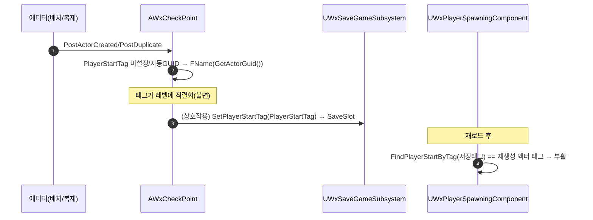

# WxCheckPoint: PlayerStartTag 미설정 시 안정적 GUID 자동 부여

## 계획

### 목표
디자이너가 `AWxCheckPoint`(=`APlayerStart`) 인스턴스에 `PlayerStartTag` 를 지정하지 않으면 `None` 이 저장돼
부활이 `"Default"` 로 폴백되고 그 체크포인트가 부활 지점으로 동작하지 못한다. 태그 미설정 체크포인트에
안정적 GUID 를 자동 부여해, 디자이너 태그 없이도 부활 지점으로 동작하게 한다.

### 수정 범위
| 파일 | 수정할 내용 | 구분 |
|---|---|---|
| `Source/WxGame/WorldObject/WxCheckPoint.h` | `#if WITH_EDITOR` 블록에 `PostActorCreated()`/`PostDuplicate(EDuplicateMode::Type)` override 선언 | 수정 |
| `Source/WxGame/WorldObject/WxCheckPoint.cpp` | 두 훅 정의 추가. `Super::` 후 미설정/자동GUID 태그면 `PlayerStartTag = FName(GetActorGuid().ToString())` | 수정 |

### 접근 방식
- **에디터 1회 베이킹(`PlayerStartTag` 직접)**: `SaveSlot` 런타임 즉석 GUID 는 재로드된 액터에 없어 매칭이
  깨지고, `GetActorGuid()` 는 에디터 전용이라 쿠킹/런타임 불가. 그래서 `AWxGimmick`/`AWxSpawner` 와 동일하게
  에디터(`PostActorCreated`/`PostDuplicate`)에서 GUID 를 베이킹한다. 별도 필드 없이 `PlayerStartTag` 에 직접
  넣어, 레벨에 직렬화된 그 태그가 런타임/세션 간 불변 키가 된다. 런타임 로직·세이브 시스템은 무변경
  (이미 `SetPlayerStartTag(PlayerStartTag)`→`SaveSlot` 호출).
- **복제 충돌 보강**: 복제 시 엔진은 새 `ActorGuid` 를 주지만 `PlayerStartTag` 문자열은 원본값이 복사된다.
  `PostDuplicate` 는 태그가 None 이거나 GUID 형태(`FGuid::Parse` 성공)면 새 GUID 로 재부여해 원본과의 충돌을
  막고, 디자이너가 지정한 비GUID 친화적 태그는 보존한다.

---

## 완료

### 수정한 파일
| 파일 | 수정한 내용 | 구분 |
|---|---|---|
| `Source/WxGame/WorldObject/WxCheckPoint.h` | `#if WITH_EDITOR` 블록에 `PostActorCreated`/`PostDuplicate` override 선언 추가 | 수정 |
| `Source/WxGame/WorldObject/WxCheckPoint.cpp` | 두 훅 정의 추가(`BeginPlay`↔`HandleInteracted` 사이, 헤더 선언 순서 준수) | 수정 |

### 구현·결정과 그 이유
- **PlayerStartTag 직접 베이킹**: 별도 GUID 필드/런타임 코드 없이 에디터 훅에서 `PlayerStartTag` 자체를
  채운다. 부활 매칭(`FindPlayerStartByTag` 의 태그 동등 비교)이 곧 PlayerStartTag 를 보므로, 같은 필드에
  안정적 GUID 를 넣으면 재로드 후에도 동일 액터가 같은 값을 가져 매칭된다. 런타임/세이브 경로는 무변경.
- **에디터 베이킹이 필수**: `GetActorGuid()` 가 에디터 전용이고 런타임 즉석 GUID 는 재로드 액터에 없어
  매칭이 깨진다. `AWxGimmick`/`AWxSpawner` 의 검증된 패턴을 그대로 채택.
- **복제 시 GUID-파싱 재부여**: 복제본은 새 ActorGuid 를 받지만 PlayerStartTag 문자열은 원본이 복사되므로,
  `IsNone` 만 검사하면 두 체크포인트가 같은 태그를 공유해 부활 지점이 충돌한다. `FGuid::Parse` 로 '자동 부여된
  GUID 태그'를 식별해 새 GUID 로 재부여하고, 디자이너의 비GUID 친화적 태그는 보존한다(승인 미리보기의
  `IsNone`-only 대비 정확성 보강).
- **빌드 검증**: WxEditor(Development) `Result: Succeeded`(WxCheckPoint.cpp 재컴파일·WxGame 링크 확인).
  `FGuid::Parse`/`ToString` 는 전이 포함으로 충분해 추가 include 불필요.

### 계획 대비 달라진 점
- 계획대로.

### 후속 과제
- **이미 배치된 인스턴스 수동 처리**: `BP_CheckPoint`/`BP_CheckPoint2` 등 기존 배치 인스턴스는
  `PostActorCreated` 가 과거에 이미 실행돼 retro-bake 되지 않는다(의도적으로 `PostLoad` 베이킹 미추가).
  태그가 None 인 기존 인스턴스는 살짝 이동 후 되돌려 재배치하거나 `PlayerStartTag` 를 수동 지정 후 레벨 재저장.
- **인게임 검증(미검증)**: 신규 미태그 체크포인트 배치 → PlayerStartTag GUID 자동 채움 확인 → 복제본이 다른
  GUID 인지 확인 → 상호작용 후 `Wx.Save.Dump` 로 GUID 기록 확인 → 사망/재로드 시 그 체크포인트로 부활 확인.
- **런타임 스폰 체크포인트 미지원**: `GetActorGuid()` 가 에디터 전용이라 쿠킹에서 런타임 스폰된 체크포인트는
  자동 태그가 안 붙는다(레벨 배치 전제, `AWxGimmick` 과 동일한 한계).
