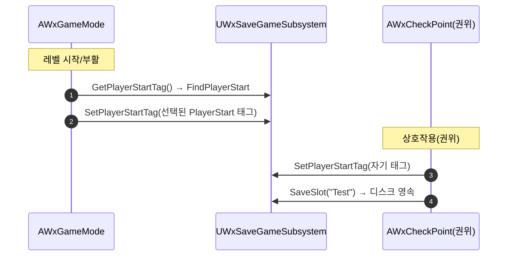

# WxSave: PlayerStartTag 리네임 + 갱신 트리거 + SaveSlot 호출 C++ 이관

## 계획

### 목표
WxSave 의 부활 지점 저장 필드/메서드를 "체크포인트" 결합 이름(`ActiveCheckpointTag`/`Set·GetActiveCheckpointTag`)에서 범용 `PlayerStartTag`/`Set·GetPlayerStartTag` 로 바꾼다. 더해서 저장 태그를 ① 레벨 시작(스폰) 시 ② 체크포인트 상호작용 시 모두 갱신하고, 체크포인트의 `SaveSlot` 호출을 BP 에서 C++(`HandleInteracted`, authority 게이트·태그 기록 이후)로 옮겨 저장 순서를 결정적으로 보장하고 서버 전용으로 만든다.

### 수정 범위
| 파일 | 수정할 내용 | 구분 |
|---|---|---|
| `Plugins/WxSave/.../Public/WxSaveGame.h` | 필드 `ActiveCheckpointTag` → `PlayerStartTag`, 주석 범용화 | 수정 |
| `Plugins/WxSave/.../Public/WxSaveGameSubsystem.h` | `Set/GetActiveCheckpointTag` → `Set/GetPlayerStartTag`, 주석 범용화 | 수정 |
| `Plugins/WxSave/.../Private/WxSaveGameSubsystem.cpp` | 메서드/필드 리네임, Dump·로그 문구, 주석 갱신 | 수정 |
| `Plugins/WxSave/README.md` | 옛 이름 참조 갱신 | 수정 |
| `Source/WxGame/Framework/WxGameMode.cpp` | `ChoosePlayerStart` 에 선택된 PlayerStart 태그 기록 추가, `PlayerStart.h` include | 수정 |
| `Source/WxGame/Framework/WxGameMode.h` | doc-comment 범용화 | 수정 |
| `Source/WxGame/WorldObject/WxCheckPoint.cpp` | `SetPlayerStartTag` 리네임 + 끝에 `SaveSlot(TEXT("Test"))` C++ 이관 | 수정 |

### 접근 방식
- **범용화 리네임**: 저장값 실체는 엔진 일반 식별자 PlayerStartTag. "체크포인트" 개념은 호출 측(WxGame)에만 남긴다.
- **레벨 시작 트리거**: `ChoosePlayerStart` 가 저장 태그로 스폰 위치 선택 후, 실제 선택된 `APlayerStart` 의 태그를 다시 기록. 체크포인트 부활 경로는 동일 태그 재기록(no-op).
- **SaveSlot C++ 이관**: BP OnInteracted 의 `SaveSlot("Test")` 제거(수동), `HandleInteracted` 끝(RespawnAutoSpawners 이후)에서 호출. 태그 기록 이후라 순서 보장, authority 게이트 안이라 서버 전용, 리셋된 월드 상태까지 직렬화.

---

## 완료

### 수정한 파일
| 파일 | 수정한 내용 | 구분 |
|---|---|---|
| `Plugins/WxSave/.../Public/WxSaveGame.h` | 필드 `ActiveCheckpointTag` → `PlayerStartTag`, 필드/클래스 주석 범용화 | 수정 |
| `Plugins/WxSave/.../Public/WxSaveGameSubsystem.h` | `Set/GetActiveCheckpointTag` → `Set/GetPlayerStartTag`, API 설명·LogSaveState 주석 갱신 | 수정 |
| `Plugins/WxSave/.../Private/WxSaveGameSubsystem.cpp` | 메서드/필드 리네임, Dump 명령 설명·로그 문구·SaveSlot/LoadSlot 주석 갱신 | 수정 |
| `Plugins/WxSave/README.md` | 책임·핵심 타입 표·확장 포인트의 옛 이름 참조 갱신, 갱신 시점 명시 | 수정 |
| `Source/WxGame/Framework/WxGameMode.cpp` | `ChoosePlayerStart` 에 선택된 PlayerStart 태그 되기록 추가, `PlayerStart.h` include | 수정 |
| `Source/WxGame/Framework/WxGameMode.h` | doc-comment 범용화(레벨 시작 트리거 명시) | 수정 |
| `Source/WxGame/WorldObject/WxCheckPoint.cpp` | `SetPlayerStartTag` 리네임 + 함수 끝에 `SaveSlot(TEXT("Test"))` C++ 이관 | 수정 |

### 구현·결정과 그 이유
- **범용 이름 PlayerStartTag**: 저장값 실체가 엔진 일반 식별자라 "체크포인트" 결합을 떼고 `PlayerStartTag` 로 통일(필드+메서드). "체크포인트" 개념은 호출 측 `AWxCheckPoint` 에만 남겨 도메인(WxSave foundation)을 깨끗하게 유지.
- **레벨 시작 트리거를 ChoosePlayerStart 에 둠**: "플레이어가 레벨에서 시작하는 위치"를 결정하는 엔진 후크가 바로 여기다. 저장 태그로 스폰 위치를 고른 뒤 실제 선택된 `APlayerStart` 의 태그를 되기록하므로, 체크포인트 미터치 신규 세션도 시작 PlayerStart 가 부활 진입점으로 남는다. 체크포인트 부활 경로는 동일 태그 재기록이라 no-op.
- **SaveSlot 을 BP→C++ 이관**: BP OnInteracted 의 `SaveSlot` 은 같은 멀티캐스트 델리게이트의 C++ `SetPlayerStartTag` 와 발화 순서가 보장되지 않았고(직전 워크로그는 네이티브 우선으로 봤으나 불확실), OnInteracted 가 서버 Multicast RPC 라 클라에서도 저장이 실행됐다. `HandleInteracted`(authority 게이트) 끝에서 직접 호출하면 ① 태그 기록 이후라 순서 결정적 ② 서버 전용 ③ RespawnAutoSpawners 이후라 리셋된 월드 상태까지 직렬화 — 세 문제를 동시에 해결.
- **빌드 검증**: WxEditor(Development) `Result: Succeeded` (WxGameMode/WxCheckPoint/WxSaveGameSubsystem 재컴파일·링크 확인).

### 계획 대비 달라진 점
- 계획대로. (추가로 `WxSaveGameSubsystem.h` 의 LogSaveState 주석에 남아있던 스테일 "부활 Transform" 문구도 리네임 김에 "PlayerStart 태그"로 정정.)

### 후속 과제
- **수동 작업(미완)**: 에디터에서 `BP_CheckPoint` OnInteracted 의 `SaveSlot("Test")` 노드 제거 후 재저장. 미제거 시 BP(이전 태그)+C++(최신 태그) 이중 저장(결과는 C++ 가 덮어써 정상이나 불필요).
- **세이브 호환성**: `ActiveCheckpointTag` → `PlayerStartTag` 키 변경으로 기존 "Test" 슬롯의 태그값 무효화(미설정 폴백). 개발 단계라 무해.
- **인게임 검증(미검증)**: 신규 세션 시작 → `Wx.Save.Dump` 로 시작 PlayerStart 태그 기록 확인 → 체크포인트 상호작용 → 재로드 후 해당 체크포인트로 부활·태그 갱신 확인.
- **슬롯명 하드코딩**: `"Test"` 가 C++/BP(MainMenu)에 분산. 향후 슬롯 관리(메타데이터·활성 슬롯 개념)로 통합 여지(별도 과제).

---

## 후속 변경 — WxGameMode 최소화 (같은 날)
- **요청**: `WxGameMode` 코드 최소화, WxCheckPoint 로 옮길 수 있는 부분 이관.
- **평가**: 옮길 코드 없음. `ChoosePlayerStart` 의 읽기(태그→스폰 선택)는 엔진 훅이라 GameMode 필수, 쓰기(시작 태그 기록)는 기본 스폰 시점이라 체크포인트 미개입. 체크포인트는 이미 자기 태그를 자가 등록해 이벤트가 겹치지 않음.
- **변경(`WxGameMode.cpp` 1함수)**: `ChoosePlayerStart` 를 early-return 구조로 축소 — 저장 태그가 있으면 그 PlayerStart 반환(즉시 return), 없을 때만 기본 PlayerStart 선택 + 태그 기록. 기존엔 부활 경로에서도 같은 태그를 다시 쓰는 no-op 재기록이 있었는데 이 중복을 제거.
- **검증**: WxEditor(Development) `Result: Succeeded`.

### 최종 결정 — 레벨 시작 쓰기 제거 (순수 셀렉터)
- **배경**: 레벨 시작 쓰기가 디스크 부활에 영향을 주는 경로는 "체크포인트 미터치 + 메뉴 저장 + 재로드 + 태그 붙은 다중 PlayerStart" 라는 좁은 엣지뿐이고, 기본 시작 PlayerStart 가 무태그면 `None` 덮어쓰기 no-op 라 동작이 사실상 동일. 비용 대비 효용이 낮다고 판단해 제거.
- **변경**: `ChoosePlayerStart` 에서 쓰기 블록 + 미사용 `GameFramework/PlayerStart.h` include + `Cast<APlayerStart>` 제거 → "저장 태그 있으면 그 PlayerStart 부활, 없으면 Super" 만 남는 **읽기 전용 셀렉터**. 사실상 세션 초반의 원래 구조로 회귀(이름만 PlayerStartTag). `WxGameMode.h` doc 도 "읽기 전용 셀렉터"로 갱신.
- **결과**: `PlayerStartTag` 갱신 주체는 이제 **체크포인트 상호작용(`AWxCheckPoint`) 단일 트리거**. (앞 "변경 2 — 레벨 시작 트리거"는 본 결정으로 철회됨.)
- **검증**: WxEditor(Development) `Result: Succeeded`.

### 후속 — 최초 접속용 기본 PlayerStartTag "Default" (같은 날)
- **배경**: 순수 셀렉터화로 첫 접속(세이브 없음)은 엔진 기본 = 미점유 `APlayerStart` 랜덤 픽인데, `AWxCheckPoint` 도 `APlayerStart` 라 체크포인트가 랜덤 풀에 섞여 비결정적. 첫 접속 입구를 고정하기 위해 하드코딩 태그 `"Default"` 도입.
- **변경**:
  - `WxGame.h`/`WxGame.cpp`: 로그 카테고리 `LogWxGame` 신설(WxGame 최초, `LogWxSave` 패턴).
  - `WxGameMode`: `ChoosePlayerStart` 3단 폴백 — ① 저장 태그 → ② `"Default"` 태그 → ③ 없으면 `UE_LOG(LogWxGame, Error)` 후 엔진 기본. 태그 조회는 비재귀 헬퍼 `FindPlayerStartByTag` 로.
- **비재귀 헬퍼가 필수인 이유**: 엔진 `FindPlayerStart` 는 태그 미발견 시 내부에서 `ChoosePlayerStart` 를 다시 불러 무한 재귀(크래시)가 난다. 직접 탐색 헬퍼(미발견 시 nullptr)라야 "Default 못 찾으면 에러 로그 + 폴백" 을 크래시 없이 구현 가능. 저장-태그 경로의 잠재 재귀도 함께 제거됨.
- **설계 선택(사용자 지정)**: 태그는 `EditDefaultsOnly` 프로퍼티가 아니라 `TEXT("Default")` 하드코딩(고정 규약). 미발견은 조용한 폴백이 아니라 에러 로그 후 폴백.
- **수동(디자이너)**: 각 레벨 입구 `APlayerStart` 의 `PlayerStartTag` 를 `Default` 로 지정.
- **검증**: WxEditor(Development) `Result: Succeeded`.

### 후속 — 스폰 선택을 GameState 컴포넌트로 분리 (Lyra/ModularGameplay, 같은 날)
- **요청 경위**: GameMode 비대화 우려 → Lyra 패턴(스폰 선택을 GameState 컴포넌트에 위임)으로. 처음엔 평범한 `UActorComponent` 로 합의했다가, "Lyra처럼 ModularGameplay 그대로" 로 전환(옵션2), 이어 TimeDilation 도 동일 베이스로 통일.
- **ModularGameplay 도입**: `Wx.uproject` 에 `ModularGameplay` 플러그인 활성. `WxGame.Build.cs`·`WxCombat.Build.cs` 에 `ModularGameplay` 모듈 의존 추가(엔진 플러그인이라 「WxCore 외 Wx 플러그인 참조 금지」 규칙엔 무저촉).
- **신규 `UWxPlayerSpawningComponent`**(`Source/WxGame/Framework/`, `UGameStateComponent` 상속): 스폰 선택 로직(저장 태그 → "Default" 태그 → 에러 로그 nullptr) + `FindPlayerStartByTag` 소유. `AWxGameState` 생성자에서 부착.
- **`AWxGameMode::ChoosePlayerStart` 위임화**: `GameState` 의 컴포넌트를 찾아 위임, nullptr 이면 `Super`(엔진 기본). 컴포넌트 부재 시 경고. `FindPlayerStartByTag`/`WxSave`·`PlayerStart` include 는 컴포넌트로 이동.
- **`UWxTimeDilationComponent` 도 `UGameStateComponent` 로 통일**(WxCombat): 두 GameState 컴포넌트가 동일 베이스.
- **빌드 함정 2개 해결**: ① `UGameStateComponent` 는 기본 생성자가 없어 파생 컴포넌트는 `(const FObjectInitializer&)` 생성자를 선언해 `Super` 전달(Lyra 동일). ② 컴포넌트 `ChoosePlayerStart` 반환형을 `AActor*` 로 두어 GameMode 가 `PlayerStart.h` 없이 처리(불완전 타입 변환 오류 회피, 엔진 시그니처와 일치).
- **검증**: WxEditor(Development) `Result: Succeeded`.
- **주의**: ModularGameplay 를 새로 활성했으므로 에디터는 **재시작 시 로드**됨(타겟은 이미 재빌드됨). IDE IntelliSense 가 어긋나면 `generate-project-files`.

### 후속 — GameState 컴포넌트 자동 주입 (GameMode 에셋 데이터 주도, 같은 날)
- **요청**: GameState 가 컴포넌트를 하드코딩하지 말고, GameMode 에셋 변수로 프레임워크 컴포넌트를 주입.
- **`AWxGameState` → receiver 화**: 생성자/컴포넌트 멤버 제거. `PreInitializeComponents` 에서 `UGameFrameworkComponentManager::AddGameFrameworkComponentReceiver(this)`, `EndPlay` 에서 Remove. GameState 가 어떤 컴포넌트가 붙는지 모름.
- **`AWxGameMode` → 주입 요청 등록**: `USTRUCT FWxFrameworkComponentEntry`(ReceiverClass `TSoftClassPtr<AActor>` + ComponentClass `TSubclassOf<UActorComponent>`) 배열 `InjectedFrameworkComponents`(EditDefaultsOnly) 추가. `InitGame` 에서 매니저에 `AddComponentRequest` 로 등록, 핸들을 `TArray<TSharedPtr<FComponentRequestHandle>>` 멤버에 보유(GameMode 수명).
- **타이밍**: InitGame(요청) → GameState spawn/PreInitializeComponents(receiver) 순이라 receiver 등록 시 자동 주입. ChoosePlayerStart 의 `FindComponentByClass<UWxPlayerSpawningComponent>` 위임은 그대로.
- **수동(디자이너) `GM_Combat`**: `InjectedFrameworkComponents` 에 {WxGameState, WxPlayerSpawningComponent}, {WxGameState, WxTimeDilationComponent} 2항목 설정 — 안 하면 컴포넌트가 안 붙음.
- **검증**: WxEditor(Development) `Result: Succeeded`.
- **복제(엔진 소스로 확인)**: GameMode 는 서버 전용이라 주입도 서버에서만 등록되지만, 복제 컴포넌트 TimeDilation 은 **표준 동적 서브오브젝트로 클라에 복제된다.** 근거: ModularGameplay 가 주입 컴포넌트를 `ComponentClass->GetFName()`(안정적 이름)으로 만들고 `RegisterComponent()`(`GameFrameworkComponentManager.cpp:539,548`) → 표준 복제 경로(`ReadyForReplication`/`ReplicatedComponents`) 진입. AGameStateBase 는 always-relevant·복제 액터. 클라엔 GameMode 가 없어 로컬 주입이 없으므로 중복도 없음(서버 인스턴스만 복제). 따라서 전 피어 등록(`ReceivedGameModeClass`) 같은 추가 복잡성은 불필요 — 현재 구현 유지로 결정.
- **남은 검증(MP)**: 2인 PIE(listen-server)로 서버 Global TimeDilation 의 클라 반영 + 클라 GameState 의 TimeDilation 1개만 존재 확인(정상 동작 기대).

### 후속 — 주입 대상 자동 추론 (같은 날)
- **요청**: 부착 대상(ReceiverClass)을 자동 선택.
- **변경**: `FWxFrameworkComponentEntry`(ReceiverClass+ComponentClass) struct 제거 → 변수를 `TArray<TSubclassOf<UGameFrameworkComponent>>` 평면 배열로. `InitGame` 에서 컴포넌트 베이스로 대상 추론(`UGameStateComponent`→GameState, `UPawnComponent`→Pawn, `UControllerComponent`→Controller, `UPlayerStateComponent`→PlayerState; 명시 if/else). 미지원 베이스는 경고 후 스킵.
- **디자이너 변경**: `GM_Combat` 의 `InjectedFrameworkComponents` 에 이제 **컴포넌트만** 나열(`WxPlayerSpawningComponent`, `WxTimeDilationComponent`) — 둘 다 `UGameStateComponent` 라 GameState 로 자동 추론.
- **한계**: 실제 부착은 대상이 receiver 여야 하므로 현재 GameState 만 유효. Pawn/Controller/PlayerState 는 그 액터 receiver 등록 추가 시 활성화(차후).
- **검증**: WxEditor(Development) `Result: Succeeded`.
