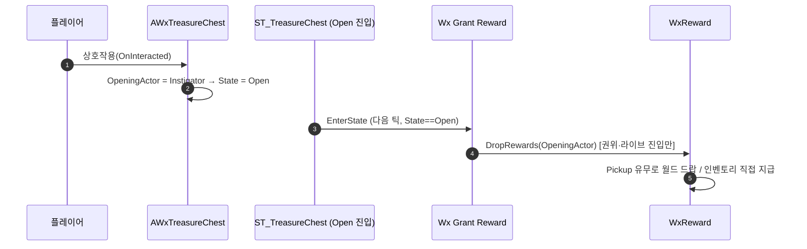

# WxTreasureChest 보상 지급을 StateTree 에셋으로 이관

## 계획

### 목표
보물 상자 보상 지급을 RewardComponent 자가바인딩(코드 경로)에서 ST_TreasureChest의 Open 상태 진입(Wx Grant Reward 태스크)으로 옮긴다. "상자가 열릴 때 일어나는 일"(연출·인터랙션 비활성)이 이미 ST에 모여 있으므로 보상도 같은 곳으로 통일한다. 공용 태스크 `FWxStateTreeTask_GrantReward`는 이미 구현돼 있어, 자가바인딩 제거 + 연 폰 노출 + ST 배선만 남았다.

### 수정 범위
| 파일 | 수정할 내용 | 구분 |
|---|---|---|
| `Plugins/WxInventory/Source/WxInventory/Public/Inventory/WxRewardComponent.h` | `BeginPlay()`·`HandleInteracted(AActor*)` 선언 제거, 자가바인딩 doc 단락 갱신 | 수정 |
| `Plugins/WxInventory/Source/WxInventory/Private/Inventory/WxRewardComponent.cpp` | `BeginPlay()`·`HandleInteracted()` 정의 및 `WxInteractionSource.h` include 제거 | 수정 |
| `Plugins/WxWorld/Source/WxWorld/Public/Gimmick/WxTreasureChest.h` | 연 폰 보관 멤버 `TObjectPtr<AActor> OpeningActor`(ST DirectGrantTarget 바인딩용, 비복제) 추가, 보상 doc 단락 갱신 | 수정 |
| `Plugins/WxWorld/Source/WxWorld/Private/Gimmick/WxTreasureChest.cpp` | `HandleInteracted`에서 `State=Open` 전에 `OpeningActor = InstigatorActor` set | 수정 |
| `Docs/Programmer/Reward_Grant_Flow.md` | 상호작용 트리거 서술·mermaid를 ST 경로로 갱신 | 수정 |

콘텐츠(에디터, 사용자): ST_TreasureChest Open 상태에 Wx Grant Reward 태스크 추가 → RewardComponent를 WxReward에, DirectGrantTarget을 OpeningActor에 바인딩. 코드만으로는 상자가 보상을 주지 않으므로 동반 필수.

### 접근 방식
- **자가바인딩 제거(이중 지급 방지)**: RewardComponent의 자가바인딩 경로를 쓰는 오너는 상자가 유일(적은 사망 시 DropRewards 직접 호출). 상자를 ST로 옮기면 죽은 코드이므로 통째 제거 — RewardComponent는 "외부 트리거형 스포너"로 단순화(적=직접 호출, 기믹=ST 태스크).
- **연 폰 노출(직접 지급)**: 상자 보상에 Pickup 없는 직접 지급(재화)이 포함되는데, ST 트리거는 복제 State 전이라 연 폰을 모른다. 상자가 `HandleInteracted`에서 받은 Instigator를 멤버로 보관해 태스크의 `DirectGrantTarget`으로 바인딩되게 노출.
- **비복제 정당성**: 태스크가 `Owner->HasAuthority()`에서만 지급하므로 멤버는 서버 전용 read. 서버 `HandleInteracted`가 State=Open 전에 set → ST는 다음 틱 전이에서 read. 복원/조인은 초기진입 가드로 재지급 안 함 → 멤버 미사용. Open으로 가는 유일 라이브 경로가 HandleInteracted라 지급 시점에 항상 유효.

---

## 완료

### 수정한 파일
| 파일 | 수정한 내용 | 구분 |
|---|---|---|
| `Plugins/WxInventory/.../Public/Inventory/WxRewardComponent.h` | `BeginPlay()`·`HandleInteracted` 선언 제거, doc 단락 갱신 | 수정 |
| `Plugins/WxInventory/.../Private/Inventory/WxRewardComponent.cpp` | `BeginPlay()`·`HandleInteracted()` 정의 및 `WxInteractionSource.h` include 제거 | 수정 |
| `Plugins/WxWorld/.../Public/Gimmick/WxTreasureChest.h` | `TObjectPtr<AActor> OpeningActor`(VisibleInstanceOnly·Transient·비복제) 추가, 보상 doc 단락 갱신 | 수정 |
| `Plugins/WxWorld/.../Private/Gimmick/WxTreasureChest.cpp` | `HandleInteracted`에서 `State=Open` 전 `OpeningActor = InstigatorActor` set | 수정 |
| `Docs/Programmer/Reward_Grant_Flow.md` | 상호작용 트리거 서술·mermaid를 ST 경로로 갱신, stale `bTriggered`→`State`, 참조표에 GrantReward 태스크 추가 | 수정 |

### 구현·결정과 그 이유
- **자가바인딩 통째 제거**: 그 경로를 쓰는 오너가 상자 하나뿐이라(적은 `DropRewards` 직접 호출) ST 이관 후 죽은 코드. opt-out 플래그 없이 제거해 RewardComponent를 "외부 트리거형 스포너"로 단순화했다. 결과적으로 `BeginPlay`·`IWxInteractionSource` 의존이 사라졌다.
- **OpeningActor 비복제**: 지급 태스크가 권위에서만 동작하고, 서버 `HandleInteracted`가 `State=Open` 확정 전에 set하므로 ST가 다음 틱 전이에서 읽을 때 항상 유효. 복원/조인은 태스크 초기진입 가드로 재지급 자체가 없어 읽지도 않는다 → 복제·저장 불필요. 런타임 전용이라 `Transient`·`VisibleInstanceOnly`로 두고 ST 바인딩 노출용으로 `BlueprintReadOnly`+`AllowPrivateAccess` 부여(기존 노출 멤버 패턴 동일).

### 계획 대비 달라진 점
- 계획대로. (빌드 시 `core.quotepath false` 선적용 — 기존 UBT 비ASCII 경로 크래시 예방, 코드 변경 아님.)

### 후속 과제
- **콘텐츠 배선(사용자)**: ST_TreasureChest Open 상태에 "Wx Grant Reward" 태스크 추가 → `RewardComponent`=WxReward, `DirectGrantTarget`=OpeningActor 바인딩. 이 배선 전까지 상자는 보상을 주지 않는다.
- 인게임 동작 검증(월드 드랍/직접 지급/이중 지급 없음/복원 시 재지급 없음)은 배선 후 PIE에서 확인.
