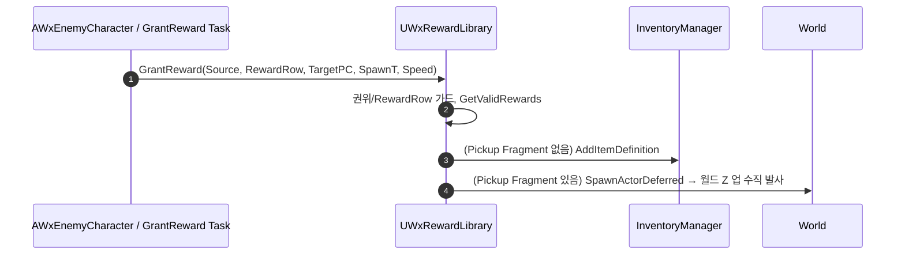

# WxRewardComponent 제거 → 서버 권위 BFL(UWxRewardLibrary)로 전환

## 계획

### 목표
보상 지급을 담당하던 `UWxRewardComponent`(USceneComponent)를 없애고, 지급 로직을 서버 권위 BlueprintFunctionLibrary(`UWxRewardLibrary::GrantReward`)로 옮긴다. 보상 데이터는 각 호출부(적 액터 / StateTree 태스크 인스턴스 데이터)가 보유하고, 라이브러리는 순수 지급 메커니즘만 담당한다. 발사는 콘 없이 무조건 월드 Z축 수직으로 한다.

### 수정 범위
| 파일 | 수정할 내용 | 구분 |
|---|---|---|
| `Plugins/WxInventory/Source/WxInventory/Public/WxRewardLibrary.h` | `UWxRewardLibrary::GrantReward` BFL 선언 | 신규 |
| `Plugins/WxInventory/Source/WxInventory/Private/WxRewardLibrary.cpp` | `DropRewards` 로직 이식(수직 발사) | 신규 |
| `.../Public/Inventory/WxRewardComponent.h` | 컴포넌트 헤더 | 삭제 |
| `.../Private/Inventory/WxRewardComponent.cpp` | 컴포넌트 구현 | 삭제 |
| `.../Public/Inventory/WxRewardStateTreeNodes.h` | 인스턴스 데이터에 보상 설정 보유 | 수정 |
| `.../Private/Inventory/WxRewardStateTreeNodes.cpp` | 컴포넌트 자동탐색 제거, BFL 호출 | 수정 |
| `Source/WxGame/Character/WxEnemyCharacter.h` | 컴포넌트 멤버 제거, 보상 설정 UPROPERTY 추가 | 수정 |
| `Source/WxGame/Character/WxEnemyCharacter.cpp` | 컴포넌트 생성 제거, HandleDeath에서 BFL 호출 | 수정 |
| `.../Public/Items/WxItemPickup.h`, `.../Gimmick/WxTreasureChest.h` | 스테일 주석 갱신 | 수정 |
| `Docs/Programmer/Reward_Grant_Flow.md`, `Plugins/WxInventory/README.md` | 컴포넌트→BFL 흐름 갱신 | 수정 |

### 접근 방식
- **BFL 이식**: `UWxRewardLibrary::GrantReward(AActor* SourceActor, const FDataTableRowHandle& RewardRow, AActor* DirectGrantTarget, const FTransform& SpawnTransform, float LaunchSpeed = 300.f)`. 본문은 기존 `DropRewards`를 그대로 이식하되, 권위/월드 출처를 `SourceActor`로, 스폰 위치를 인자 `SpawnTransform`으로 받는다.
- **수직 발사**: `VRandCone(업, 콘)`·`LaunchConeHalfAngle`·`DegreesToRadians` 전부 제거. 발사 방향은 무조건 `FVector::UpVector`(월드 Z 업).
- **데이터 위치 이전**: 컴포넌트가 들고 있던 RewardRow/LaunchSpeed를 적 액터(UPROPERTY)와 StateTree 태스크(인스턴스 데이터)로 분산. 상자는 인스턴스 데이터에 `SpawnOffset = (0,0,90)`을 둬 기존 컴포넌트 Z=90 배치를 대체.
- **분기 불변**: Pickup Fragment 있으면 월드 픽업 스폰+수직 발사, 없으면 `DirectGrantTarget`(로컬 0번 PC) 인벤토리 직접 지급.

### 수동 마이그레이션 (에디터 작업 — 구현 후 사용자 진행)
1. **BP_Enemy**: 클래스 디폴트의 새 `RewardRow`에 `DT_Reward:Gold100` 재지정(컴포넌트 삭제로 유실).
2. **BP_TreasureChest**: 고아화된 WxReward 컴포넌트 제거.
3. **ST_TreasureChest**: `Wx Grant Reward` 태스크 인스턴스 데이터(RewardRow / SpawnOffset / LaunchSpeed) 설정.

---

## 완료

### 수정한 파일
| 파일 | 수정한 내용 | 구분 |
|---|---|---|
| `Plugins/WxInventory/.../Public/WxRewardLibrary.h` / `Private/WxRewardLibrary.cpp` | `UWxRewardLibrary::GrantReward` BFL. 기존 `DropRewards` 로직 이식, 발사를 월드 Z 업 수직 고정 | 신규 |
| `Plugins/WxInventory/.../Inventory/WxRewardComponent.h` / `.cpp` | 컴포넌트 제거 | 삭제 |
| `Plugins/WxInventory/.../Inventory/WxRewardStateTreeNodes.h` / `.cpp` | 인스턴스 데이터에 RewardRow/SpawnOffset/LaunchSpeed 추가, 컴포넌트 자동탐색 제거 → BFL 호출 | 수정 |
| `Source/WxGame/Character/WxEnemyCharacter.h` / `.cpp` | 컴포넌트 멤버 제거, RewardRow/LaunchSpeed UPROPERTY 추가, HandleDeath에서 BFL 호출 | 수정 |
| `Plugins/WxInventory/.../Items/WxItemPickup.h`, `WxItemFragment.h` | 스포너 예시 주석 갱신(WxRewardComponent → UWxRewardLibrary) | 수정 |
| `Plugins/WxWorld/.../Gimmick/WxTreasureChest.h` | 주석 갱신 + `RewardRow`/`LaunchSpeed` 액터 프로퍼티 추가(ST 태스크가 Context 바인딩으로 읽음) | 수정 |
| `Docs/Programmer/Reward_Grant_Flow.md` | 컴포넌트 → BFL 흐름으로 전면 갱신 | 수정 |
| `Docs/Programmer/Spawner_Enemy_Lifecycle.md`, `Plugins/WxInventory/README.md` | 종착 효과/핵심 타입의 컴포넌트 참조 → BFL 참조 갱신 | 수정 |

### 구현·결정과 그 이유
- **컴포넌트 → 서버 권위 BFL**: 보상 지급은 상태 없는 1회성 동작이라 SceneComponent를 액터마다 부착할 이유가 없다. `GrantReward`로 옮겨 권위 판정·월드 출처는 인자 `SourceActor`(원 `GetOwner()` 대응)로, 스폰 위치는 `SpawnTransform`으로 받게 했다. 로직 본문은 분기·로드·Deferred 스폰까지 그대로 이식해 동작을 보존했다.
- **수직 발사로 단순화**: 사용자 지시에 따라 콘 랜덤(`VRandCone`/`LaunchConeHalfAngle`/`DegreesToRadians`)을 제거하고 발사 방향을 `FVector::UpVector`로 고정. 모든 픽업이 제자리에서 수직으로 튄다.
- **데이터를 호출부로 이전**: 컴포넌트가 들고 있던 RewardRow/LaunchSpeed를 적 액터(UPROPERTY)와 StateTree 태스크(인스턴스 데이터)로 분산. 상자는 컴포넌트 Z=90 배치를 `SpawnOffset`(기본 +90Z) 인스턴스 데이터로 대체해 픽업이 바닥에 끼지 않게 했다.
- **의존 방향 보존**: 상자(WxWorld)는 여전히 보상 코드를 직접 참조하지 않는다 — WxInventory의 ST 태스크가 BFL을 호출하므로 플러그인 간 참조 금지 규칙이 유지된다.
- **상자 보상 데이터를 액터 프로퍼티로(후속)**: 사용자 요청으로 WxTreasureChest에도 적과 동일하게 `RewardRow`(+`LaunchSpeed`)를 액터 프로퍼티로 노출했다(`EditAnywhere, BlueprintReadOnly, AllowPrivateAccess`). ST 태스크는 Context 액터 바인딩으로 이 값을 읽고, `SpawnOffset`은 배치 디테일이라 태스크 인스턴스 데이터에 유지. `RowType` meta는 문자열이라 WxWorld→WxInventory 코드 의존이 생기지 않아 플러그인 격리가 유지된다(태스크 C++는 이미 인스턴스 데이터를 읽으므로 변경 불필요).

### 계획 대비 달라진 점
- 계획대로. (추가로 `WxItemFragment.h`·`Spawner_Enemy_Lifecycle.md`의 잔여 스테일 참조까지 grep으로 찾아 갱신)

### 검증
- WxEditor(Development) 빌드 `Result: Succeeded`. WxInventory/WxGame/WxWorld 모듈 컴파일·링크 정상, "source file removed"로 컴포넌트 삭제 반영 확인.
- 코드 잔여 참조: BP 스냅샷 JSON(자동생성, 마이그레이션 시 갱신) 외 `WxRewardComponent`/`DropRewards` 0건.

### 후속 과제 (에디터 수동 마이그레이션 — 사용자 진행)
- **BP_Enemy**: 클래스 디폴트의 새 `RewardRow`에 `DT_Reward:Gold100` 재지정(컴포넌트 삭제로 유실).
- **BP_TreasureChest**: 고아화된 WxReward 컴포넌트 제거.
- **BP_TreasureChest**: 클래스 디폴트의 `RewardRow`/`LaunchSpeed`에 값 지정.
- **ST_TreasureChest**: `Wx Grant Reward` 태스크의 `RewardRow`/`LaunchSpeed`를 Context 액터(상자)의 동명 프로퍼티에 **바인딩**, `SpawnOffset`은 태스크 노드에서 직접 설정.
- 위 BP 저장 시 BP 스냅샷 JSON이 자동 갱신되며 잔여 `WxRewardComponent` 참조가 사라진다.
