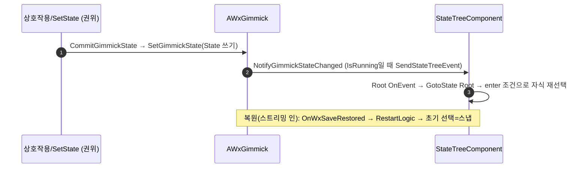

# 기믹 StateTree 상태 추종: per-leaf OnTick 폴링 → GameplayTag 이벤트 전환

## 계획

### 목표
기믹(`AWxGimmick` 파생) StateTree가 복제 `State`를 추종하는 방식을 leaf별 OnTick 폴링 전이에서 **GameplayTag 이벤트 기반 재선택**으로 바꿔, 상태 추가 시 leaf마다 OnTick+조건을 배선하던 보일러플레이트를 없앤다. 폴링이 담당하던 복원(특히 BeginPlay 이후 스트리밍 인)은 `OnWxSaveRestored`의 `RestartLogic`으로 스냅 복원 대체한다.

### 수정 범위
| 파일 | 수정할 내용 | 구분 |
|---|---|---|
| `WxGameplayTags.{h,cpp}` (WxCore) | `Event_GimmickStateChanged`("Event.GimmickStateChanged") 태그 추가 | 수정 |
| `WxGimmick.{h,cpp}` (WxWorld) | `NotifyGimmickStateChanged`(이벤트 발행), `CommitGimmickState`에서 호출, `OnRep_GimmickState` UFUNCTION, `OnWxSaveRestored` override(RestartLogic) | 수정 |
| `WxSpawnConsole.h` (WxWorld) | `State`를 `Replicated` → `ReplicatedUsing=OnRep_GimmickState` (파일럿) | 수정 |
| `ST_SpawnConsole.uasset` | leaf OnTick 전이 삭제 + Root에 OnEvent→GotoState Root 1개, enter 조건 유지 | 수정(에디터) |

### 접근 방식
- **이벤트 발행은 권위(`CommitGimmickState`)+클라(`OnRep_GimmickState`) 양쪽에서**, 단 `StateTree->IsRunning()`일 때만. 미실행 시엔 초기 시작의 enter 조건 선택이 담당하므로 침묵(라이브 전이로 잘못 들어가 애니/재발동되는 것 방지).
- **복원은 RestartLogic으로 스냅**: 스트리밍 인은 State가 ST 시작 이후 직접 직렬화로 들어오므로, `OnWxSaveRestored`에서 실행 중이면 재시작해 복원값으로 다시 초기 선택(=스냅)하게 한다. 미실행(월드 초기화)이면 BeginPlay 자동 시작에 맡겨 이중 시작 회피.
  - 엔진(UE5.7) 확인: `RestartLogic()`은 미실행이어도 자체 가드 없이 `StartTree()` 호출 → `IsRunning()` 가드 필수.
- **점진 롤아웃**: 베이스 C++는 전 기믹에 적용되나 미재배선 ST에선 이벤트가 무해한 no-op이라 기존 폴링이 그대로 동작. 파일럿 SpawnConsole 검증 후 Door/Elevator/TreasureChest에 "State 1단어 교체 + ST 재배선" 반복.

---

## 완료

### 수정한 파일
| 파일 | 수정한 내용 | 구분 |
|---|---|---|
| `WxGameplayTags.{h,cpp}` (WxCore) | `Event_GimmickStateChanged`("Event.GimmickStateChanged") 태그 추가 | 수정 |
| `WxGimmick.{h,cpp}` (WxWorld) | `OnRep_GimmickState`(이벤트 발행, IsRunning 가드), `CommitGimmickState`에서 직접 호출, `OnWxSaveRestored` override(RestartLogic), 클래스 doc 갱신 | 수정 |
| `WxSpawnConsole.h` (WxWorld) | `State`를 `Replicated` → `ReplicatedUsing=OnRep_GimmickState` (파일럿) | 수정 |
| `WxSpawnConsole.cpp` (WxWorld) | 핸들러 주석을 새 메커니즘으로 갱신 | 수정(사소) |
| `ST_SpawnConsole.uasset` | leaf OnTick 전이 삭제 + Root OnEvent→GotoState Root, enter 조건 유지 | 수정(에디터, **미완**) |

### 구현·결정과 그 이유
- **라이브 통지를 `OnRep_GimmickState` 하나로 통합**: 권위(`CommitGimmickState`)는 서버에서 OnRep 이 자동 발화하지 않으므로 같은 함수를 직접 호출한다. 서버·클라가 동일 반응 로직(이벤트 발행)을 공유하면서 함수는 하나 — UE RepNotify 관용구.
- **`IsRunning()` 가드로만 라이브 발행**: 트리 미실행 중 발행하면 초기 시작·복원이 라이브 전이로 잘못 들어가 비주얼 애니/사이드이펙트(Respawn 등)가 재발동된다. 초기 시작은 enter 조건 선택이, 복원은 RestartLogic 이 각각 스냅으로 처리한다.
- **복원은 `OnWxSaveRestored`→`RestartLogic`(실행 중일 때만)**: 스트리밍 인 복원은 State 가 ST 시작 이후 직접 직렬화로 들어오므로(폴링이 메우던 케이스), 실행 중이면 재시작해 복원값으로 다시 초기 선택=스냅한다. 월드 초기화(미실행)는 BeginPlay 자동 시작에 맡겨 이중 시작을 피한다. 엔진(UE5.7) 확인: `RestartLogic`은 미실행에도 자체 가드 없이 `StartTree` 호출 → 외부 `IsRunning` 가드 필수.

### 계획 대비 달라진 점
- 계획의 `NotifyGimmickStateChanged` + `OnRep_GimmickState` 2함수를 **`OnRep_GimmickState` 1개로 통합**(사용자 요청). 권위 측이 OnRep 을 직접 호출하는 형태.

### 후속 과제
- **ST_SpawnConsole 에셋 재배선(에디터, 미완)**: leaf(Idle) OnTick 전이 삭제 → Root 에 OnEvent(`Event.GimmickStateChanged`)→GotoState Root 1개 추가, enter 조건 유지. 이후 런타임 검증(상호작용 발동 / PIE 재시작 초기 복원 / 스트리밍 인 복원에서 스냅·재Respawn 없음).
- **나머지 기믹 롤아웃**: Door/Elevator/TreasureChest 각각 `State` 1단어 교체(`ReplicatedUsing=OnRep_GimmickState`) + 해당 ST 재배선.
- **미검증**: 컴파일만 확인(WxEditor Development 빌드 성공). 런타임·멀티 PIE 클라 추종은 에셋 재배선 후.
- **교차 기믹 동작 변화(즉시 적용)**: 베이스 `OnWxSaveRestored→RestartLogic`은 재배선 전 기믹(Door/Elevator/TreasureChest)에도 적용된다 → 스트리밍 인 복원이 기존 "폴링 라이브 추종(애니)"에서 "재시작 재선택(스냅)"으로 바뀐다(복원은 스냅이 정답이라 개선). `Context::Start`가 실행 중이면 `Stop()`(ExitState)부터 하므로 활성 태스크 정리 누락은 없음(`StateTreeExecutionContext.cpp:1393`). 미재배선 ST에선 이벤트는 무해한 no-op이라 폴링이 그대로 동작.
