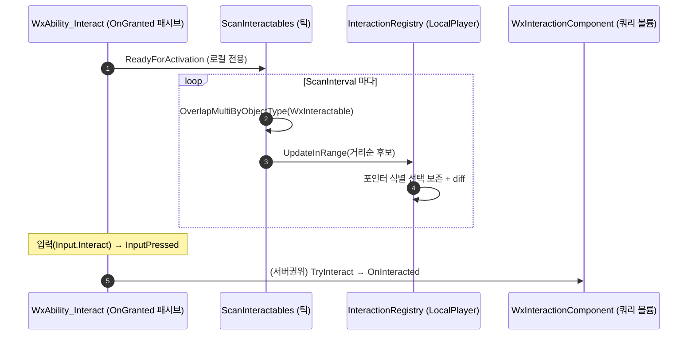

# 상호작용 감지 전환: 대상 역방향 overlap → 어빌리티 능동 반경 스캔

## 계획

### 목표
상호작용 대상 감지를 "각 대상의 SphereComponent가 플레이어를 overlap 감지(역방향)"에서 "플레이어/어빌리티가 주변을 능동 반경 스캔(정방향)"으로 전환한다. 선택 UX(후보 리스트·휠 cycle·HUD·하이라이트)는 보존하고, 락온 시스템과 1:1 대칭으로 구현한다.

### 수정 범위
| 파일 | 수정할 내용 | 구분 |
|---|---|---|
| `WxCollisionChannels.h` (WxCore) | `WxInteractable = ECC_GameTraceChannel2` 상수 추가 | 수정 |
| `Config/DefaultEngine.ini` | `WxInteractable` 오브젝트 채널 등록(DefaultResponse=Ignore) | 수정 |
| `WxInteractionComponent.{h,cpp}` (WxWorld) | overlap 이벤트/자기등록 로직 제거, dumb 쿼리 볼륨화(채널=WxInteractable), `SetInteractionEnabled`는 채널 응답 토글로. OnInteracted/TryInteract/프롬프트/하이라이트 유지 | 수정 |
| `WxInteractionRegistrySubsystem.{h,cpp}` (WxWorld) | 자기등록 제거 → `UpdateInRange()` push API, 포인터 식별 선택 보존, 목록 diff 브로드캐스트/하이라이트 | 수정 |
| `WxAbilityTask_ScanInteractables.{h,cpp}` (WxGame) | 주기 SphereOverlap → Registry push 하는 틱 태스크 신설 | 신규 |
| `WxAbility_Interact.{h,cpp}` (WxGame) | OnGranted 패시브로 전환(감지 태스크 호스트), InputPressed에서 실행 트리거(merge) | 수정 |

### 접근 방식
- **B1(스피어 강등 + 전용 채널)**: 대상 컴포넌트는 `USphereComponent`로 남기되 overlap 이벤트를 끄고 전용 채널의 수동 쿼리 볼륨으로만 둔다. 스캐너가 `OverlapMultiByObjectType(WxInteractable)`로 수집. BP/스냅샷·대상별 반경 author 보존.
- **merge(감지·실행 한 클래스)**: `UWxAbility_Interact`를 OnGranted 패시브로 전환. 부여 즉시 `IsLocallyControlled`에서 스캔 태스크 시작(감지), 입력은 `InputPressed`로 받아(ASC가 active 어빌리티에 전달 + 서버 복제) 검증된 TargetData→`TryInteract` 실행 경로 재사용.
- **선례 정렬**: 락온(`UWxAbility_LockOn` + `UWxAbilityTask_LockOnTarget` + 마커 `UWxLockOnPointComponent`)과 동형. OnGranted 자동활성(`WxAbilityBase::OnGiveAbility`), `bTickingTask` 폴링, `IsLocallyControlled` 게이트, 거리순 후보를 그대로 따른다.

---

## 완료

### 수정한 파일
| 파일 | 수정한 내용 | 구분 |
|---|---|---|
| `WxCollisionChannels.h` (WxCore) | `WxInteractable = ECC_GameTraceChannel2` 상수·주석 추가 | 수정 |
| `Config/DefaultEngine.ini` | `WxInteractable` 오브젝트 채널 등록(DefaultResponse=Ignore) | 수정 |
| `WxInteractionComponent.{h,cpp}` (WxWorld) | overlap 핸들러·자기등록·`IsLocalPlayerPawn`·`BeginPlay` 제거. 채널을 `WxInteractable`, 오버랩 이벤트 off. `SetInteractionEnabled`는 쿼리 토글로 | 수정 |
| `WxInteractionRegistrySubsystem.{h,cpp}` (WxWorld) | 자기등록 → `UpdateInRange()` push, 멤버십 diff(순서 보존)·포인터 식별 선택 보존. `RebuildAndNotify` 제거 | 수정 |
| `WxAbilityTask_ScanInteractables.{h,cpp}` (WxGame) | 주기 SphereOverlap → 거리순 정렬 → Registry push 하는 틱 태스크 | 신규 |
| `WxAbility_Interact.{h,cpp}` (WxGame) | OnGranted 패시브 전환. `ActivateAbility`에서 로컬 스캔 시작+서버 TargetData 구독, `InputPressed`에서 실행. AssetTag/commit 제거 | 수정 |

### 구현·결정과 그 이유
- **감지 책임을 어빌리티로, 실행 경로는 보존**: 락온 시스템과 동형으로 OnGranted 패시브가 스캔 태스크를 호스팅하게 했다. 검증된 LocalPredicted TargetData→TryInteract 실행 경로는 손대지 않고 진입점만 `ActivateAbility`에서 `InputPressed`로 옮겨, 멀티플레이 권위 흐름의 회귀 위험을 최소화했다.
- **대상 스피어 강등 + 전용 채널**: 대상별 overlap 감지 로직을 걷어내되 컴포넌트는 쿼리 볼륨으로 남겨, 6종 기믹·픽업의 `OnInteracted` 바인딩과 BP/스냅샷, 대상별 반경 author를 모두 그대로 두면서 감지 주체만 교체했다.
- **목록 안정성**: 매 스캔 거리 변동에 HUD가 흔들리지 않도록, Registry가 거리순 재정렬 대신 멤버십 diff(기존 순서 보존·신규 append·이탈 제거)를 하고, 내용이 실제로 바뀐 경우에만 발화한다. 선택은 인덱스가 아닌 포인터로 식별해 보존한다.

### 계획 대비 달라진 점
- **`SetInteractionEnabled`는 "채널 응답 토글"이 아니라 `CollisionEnabled` 토글**: ObjectType 쿼리는 채널 응답이 아니라 쿼리 활성 여부로 대상을 잡으므로, QueryOnly↔NoCollision 토글이 정확하다(비활성 시 스캔에서 자연 탈락).
- **사망 처리 구체화**: `ActivationBlockedTags=State.Dead` 유지에 더해, 패시브는 부여 시 이미 활성이라 차단이 안 걸리므로 `InputPressed`에서 `State.Dead` 가드를 두어 실행만 막았다(감지 스캔은 유지).
- **스캔 태스크에 `OnDestroy` 추가**: 어빌리티 종료(사망/언포제스) 시 잔여 후보를 비워 HUD 리스트를 정리한다.

### 후속 과제
- **멀티 PIE 런타임 검증(미완)**: 컴파일만 확인됨. (1) 원격 클라 다회 입력 시 활성화 PredictionKey 재사용으로 TargetData 왕복이 매번 정상 실행되는지, (2) 데디 서버에서 서버가 스캔/레지스트리 무동작인지, (3) 사망 중 실행 차단, (4) 단일 PIE에서 리스트·cycle·하이라이트·선택 안정성.
- **AbilitySet BP 확인**: 플레이어 AbilitySet에 `UWxAbility_Interact`가 `Input.Interact` InputTag로 등록되어 있어야 입력 라우팅이 동작한다(코드 무변경, 기존 등록 가정).
