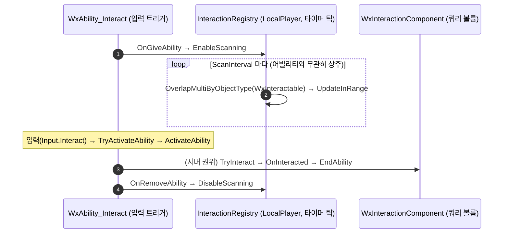

# 상호작용 어빌리티 입력 트리거 전환 + 스캔 서브시스템 이전

## 계획

### 목표
오늘 도입한 `OnGranted` 패시브 상호작용 어빌리티(스캔 태스크 호스트) 구조를, Interact를 일반적인 입력 트리거 어빌리티로 바꾸고 상시 스캔은 레지스트리 서브시스템 타이머 틱으로 옮기는 형태로 재전환한다. AbilityTask는 호스트 어빌리티가 active인 동안만 살므로, 입력 트리거(활성→실행→종료)와 부여 시점부터의 상시 감지를 한 어빌리티에 담을 수 없어 둘을 분리한다.

### 수정 범위
| 파일 | 수정할 내용 | 구분 |
|---|---|---|
| `Plugins/WxWorld/.../Interaction/WxInteractionRegistrySubsystem.{h,cpp}` | 타이머 기반 스캔 호스트로 확장(스캔 로직 이전), `EnableScanning`/`DisableScanning`/`ScanAndUpdate`/`Deinitialize` | 수정 |
| `Source/WxGame/AbilitySystem/Ability/WxAbility_Interact.{h,cpp}` | 입력 트리거 전환, `OnGiveAbility`/`OnRemoveAbility`에서 스캔 enable/disable, 실행을 `ActivateAbility`로, `InputPressed` 제거 | 수정 |
| `Source/WxGame/AbilitySystem/Task/WxAbilityTask_ScanInteractables.{h,cpp}` | 삭제(스캔 로직 서브시스템으로 이전) | 삭제 |
| `Plugins/WxWorld/.../Interaction/WxInteractionComponent.h` (주석) | 헤더 주석의 스캐너 주체를 "레지스트리 서브시스템"으로 갱신 | 수정 |

### 접근 방식
- **스캔을 GAS 밖 서브시스템 타이머로**: 후보를 소비하는 `UWxInteractionRegistrySubsystem`(LocalPlayer 전용)이 스캔까지 소유한다. LocalPlayer 전용이라 로컬에서만 도는 게 `IsLocallyControlled` 게이트를 구조적으로 대체한다.
- **어빌리티는 순수 입력 트리거**: `ActivationPolicy=OnInputTriggered`. `OnGiveAbility`에서 스캔 enable(데디 서버는 LocalPlayer 부재로 no-op), `OnRemoveAbility`에서 disable. `ActivateAbility`가 실행 진입점(검증된 LocalPredicted TargetData→`TryInteract` 경로 재사용). 매 입력 = 새 활성화/PredictionKey라 다회 입력 키 재사용 문제가 자연 해소되고, 서버 분기는 `CallReplicatedTargetDataDelegatesIfSet`로 선도착 레이스를 방어한다.
- **사망 처리 단순화**: 입력 트리거라 `ActivationBlockedTags(State.Dead)`가 실제로 활성화를 막으므로 기존 수동 가드 제거.

---

## 완료

### 수정한 파일
| 파일 | 수정한 내용 | 구분 |
|---|---|---|
| `WxAbility_Interact.{h,cpp}` (WxGame) | `OnInputTriggered` 전환, `OnGiveAbility`/`OnRemoveAbility`에서 월드 타이머 스캔 set/clear, `ScanAndPush`(스캔 로직 흡수), 실행을 `ActivateAbility`로, `InputPressed`·수동 State.Dead 가드 제거, `GetLocalRegistry` 헬퍼 분해 | 수정 |
| `WxAbilityTask_ScanInteractables.{h,cpp}` (WxGame) | 삭제(스캔 로직 어빌리티로 흡수), `Task/` 디렉터리 제거 | 삭제 |
| `WxInteractionComponent.h` (주석) | 스캐너 주체를 어빌리티 주기 스캔으로 갱신 | 수정 |

> `WxInteractionRegistrySubsystem`은 순수 데이터 홀더 그대로 유지(스캔 책임 미부여). 최종 net 변경 없음.

### 구현·결정과 그 이유
- **스캔을 어빌리티의 월드 타이머로**(AbilityTask/GameplayTask/서브시스템 호스트 대신): AbilityTask·GameplayTask는 호스트가 active인 동안만 살아 입력 트리거 어빌리티에 상주 폴링을 못 얹는다. 반면 어빌리티 인스턴스(InstancedPerActor)는 부여 동안 상주하는 UObject라, 월드 타이머매니저에 건 타이머가 활성화와 독립적으로 틱한다. `OnGiveAbility`에서 set, `OnRemoveAbility`에서 clear.
- **EndAbility가 타이머를 지우는 버그 → 재설정으로 해결**: 엔진 `UGameplayAbility::EndAbility`가 `ClearAllTimersForObject(this)`로 그 어빌리티의 모든 월드 타이머를 비운다. 따라서 상호작용(=활성화)이 끝나는 순간 스캔 타이머가 삭제돼, 이후 레지스트리가 갱신되지 않고 마지막 대상이 영원히 남는 버그가 있었다("상호작용 직후" 정황과 일치). 타이머 설정을 `StartScanTimer` 헬퍼로 추출해 `OnGiveAbility`와 `EndAbility` 양쪽에서 호출 — 활성화 종료 후 재설정해 부여 동안 스캔이 끊기지 않게 했다. 제거 경로는 엔진 EndAbility(재설정) 직후 `OnRemoveAbility`가 타이머를 최종 정리하므로 누수 없음. (이는 AbilityTask가 활성화에 묶이는 것과 같은 제약의 재확인 — 어빌리티 인스턴스는 grant-scoped 루프 호스트로 한계가 있으나, 사용 불가 게이트를 `CanActivateAbility`로 자연스럽게 두기 위해 어빌리티 호스팅 유지.)
- **감지 로직을 어빌리티(WxGame)에 둔 이유**: 스캔을 레지스트리 서브시스템에 넣는 안도 검토했으나, 레지스트리의 원래 계약(외부 스캐너가 `UpdateInRange`로 push)을 보존하고 WxWorld가 폰/월드/오버랩에 손대지 않아 더 얇게 유지되도록, 감지 주체는 그걸 소유하는 WxGame 어빌리티에 둠. 모듈 경계(도메인 플러그인은 WxCore만 의존, 조율은 WxGame)와도 일치한다.
- **입력 트리거 전환으로 멀티플레이 단순화**: 매 입력이 새 활성화/PredictionKey라 일반 1회성 TargetData 왕복이 되어, 상주 활성의 구독 트릭과 다회 입력 키 재사용 문제가 사라진다. 서버 분기는 `CallReplicatedTargetDataDelegatesIfSet`로 활성화 RPC보다 TargetData가 먼저 도착하는 레이스를 방어한다.
- **사망 가드 단순화**: 입력 트리거라 `ActivationBlockedTags(State.Dead)`가 활성화 자체를 막으므로 기존 InputPressed의 수동 가드가 불필요해 제거.
- **사용 불가 동안 스캔 중단 + 대상 초기화**: `ScanAndPush`가 `CanActivateAbility(GetCurrentAbilitySpecHandle(), GetCurrentActorInfo())` 실패 시 오버랩 쿼리를 건너뛰고 `Registry->UpdateInRange({})`로 후보를 비운다. 활성화도 막히지만 리스트/선택/하이라이트까지 정리해 상호작용을 완전히 차단한다. `CanActivateAbility`는 차단 태그·비용·쿨다운·요구 태그를 모두 보는 완전한 판정이라, 나중에 코스트/쿨다운이 붙어도 그대로 따라간다(`Super::OnGiveAbility`의 `SetCurrentActorInfo`로 `CurrentSpecHandle`/`CurrentActorInfo`가 채워져 타이머 콜백에서 유효). 별도 태그 델리게이트 없이 기존 타이머 틱 안에서 폴링해 타이밍 레이스를 피한다(차단 시 오버랩 미실행이라 실질 스캔은 멈춤, 타이머만 경량 no-op 유지).

### 계획 대비 달라진 점
- **스캔 호스트를 서브시스템 타이머 → 어빌리티 월드 타이머로 변경**: 계획은 스캔을 서브시스템이 소유(`EnableScanning` 등)하는 것이었으나, 작업 중 논의로 어빌리티가 월드 타이머를 직접 거는 형태로 바꿈(위 이유). 서브시스템은 순수 데이터 홀더로 원복.
- `GetLocalSelectedComponent`를 `GetLocalRegistry`로 분해해 OnGive/OnRemove와 레지스트리 해소를 공유.

### 후속 과제
- **런타임 검증(미완, 컴파일만 확인)**: (1) 단일 PIE에서 부여 즉시 스캔/프롬프트·하이라이트, cycle, 입력 시 실행. (2) 사망 시 리스트·프롬프트·하이라이트가 비워지고 입력 무동작, 부활 시 스캔 재개. (3) 멀티 PIE에서 원격 클라 다회 입력 TargetData 왕복, 데디 서버 스캔 무동작.
- **`ScanAndPush`의 ActorInfo 의존**: `GetCurrentActorInfo`/`GetAvatarActorFromActorInfo`가 InstancedPerActor 인스턴스 상주 + 활성화 사이 `CurrentActorInfo` 안정성을 전제한다. null이면 무동작(런타임에서 부여 직후/활성화 직후 스캔 지속 확인 필요).
