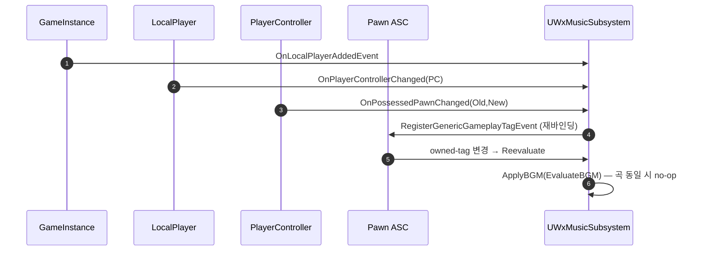

# BGM 재평가 이벤트화 (폴링 타이머 제거)

## 계획

### 목표
`UWxMusicSubsystem`의 0.5초 주기 재평가 폴링을 걷어내고 완전 이벤트 구동으로 바꾼다. 상태가 바뀌는 바로 그 순간 재평가하므로 "최대 0.5초 틀린 곡" 창이 사라져 더 안전하고, 매직 인터벌·반복 타이머가 사라져 더 깔끔하다. Chooser 선택 엔진은 그대로 둔다.

### 수정 범위
| 파일 | 수정할 내용 | 구분 |
|---|---|---|
| `Plugins/WxAudio/.../System/WxMusicSubsystem.h` | 폴링/타이머 멤버 제거, LocalPlayer→PC→Pawn→ASC 이벤트 체인 핸들러·바인딩 상태(`BoundASC`) 추가 | 수정 |
| `Plugins/WxAudio/.../System/WxMusicSubsystem.cpp` | `OnWorldBeginPlay`에서 타이머 대신 `OnLocalPlayerAddedEvent` 구독, ASC generic tag 이벤트로 재평가 구동, `Deinitialize` 언바인딩 정리 | 수정 |
| `Plugins/WxAudio/.../System/WxMusicSettings.h` | 폴링 전용이던 `ReevaluateInterval` 제거 (노브 감소) | 수정 |

### 접근 방식
- **폴링이 잡던 유일한 변화는 "로컬 ASC owned-tag 변경" 하나**: BGMTag는 `StartBGM`이, 폰 교체는 `OnPossessedPawnChanged`가 이미 이벤트로 처리. 그 하나를 `ASC->RegisterGenericGameplayTagEvent()`로 받으면 폴링이 통째로 사라진다. (이 관용구는 `WxViewModel_AbilitySystem`에 이미 존재.)
- **타이머의 부가 역할(늦게 뜨는 PC/폰 재시도 바인딩)은 `OnLocalPlayerAddedEvent` + `LocalPlayer->OnPlayerControllerChanged()`로 대체**: `WxUIManagerSubsystem`이 쓰는 타이머-프리 부트스트랩과 동일 패턴.
- **ASC는 폰(캐릭터)에 삶** (`AWxCharacterBase`): 폰이 바뀌면 ASC도 바뀌므로 `HandlePawnChanged`에서 generic tag 이벤트를 새 폰 ASC로 재바인딩(`RebindAbilitySystem`).
- **버스트는 동기 평가 + 기존 no-op 가드로 흡수**: generic tag 이벤트는 전투 중 프레임당 여러 번 발동할 수 있으나, `ApplyBGM`이 "고른 곡이 같으면 no-op"이라 오디오가 흔들리지 않고 Chooser 평가도 저렴하다. 다음-틱 코얼레싱은 도입하지 않는다(타이머 완전 0 유지, 필요 시 후속).

---

## 완료

### 수정한 파일
| 파일 | 수정한 내용 | 구분 |
|---|---|---|
| `Plugins/WxAudio/.../System/WxMusicSubsystem.h` | 타이머/`BindLocalController`/`GetLocalPlayerPawn` 제거, 이벤트 체인 핸들러(`HandleLocalPlayerAdded`/`HandlePlayerControllerChanged`/`HandleOwnedTagsChanged`/`RebindAbilitySystem`)와 `BoundASC` 추가, `HandleReevaluate`→`Reevaluate` | 수정 |
| `Plugins/WxAudio/.../System/WxMusicSubsystem.cpp` | `OnLocalPlayerAddedEvent` 부트스트랩, ASC generic tag 이벤트로 재평가 구동, `EvaluateBGM`이 `BoundASC` 직접 사용, `Deinitialize` 언바인딩 정리, 타이머 전면 제거 | 수정 |
| `Plugins/WxAudio/.../System/WxMusicSettings.h` | `ReevaluateInterval` 제거 | 수정 |

### 구현·결정과 그 이유
- **완전 이벤트 구동으로 전환**: 폴링이 실제로 잡던 변화는 로컬 ASC owned-tag 하나뿐이라, 이를 `RegisterGenericGameplayTagEvent`로 받으면 폴링이 불필요. 상태 변경 즉시 재평가되어 "최대 0.5초 틀린 곡" 창이 사라지고(안전), 매직 인터벌·반복 타이머 수명이 사라진다(깔끔).
- **부트스트랩은 `OnLocalPlayerAddedEvent` + `OnPlayerControllerChanged` 체인**: 타이머가 겸하던 "늦은 PC/폰 재시도 바인딩"을 대체. `WxUIManagerSubsystem`이 이미 쓰는 타이머-프리 패턴과 일치시켜 코드베이스 관용구를 재사용했다.
- **폰 교체마다 ASC 재바인딩(`RebindAbilitySystem`)**: ASC가 폰(`AWxCharacterBase`)에 직접 살아 폰이 바뀌면 ASC도 바뀌므로, `BoundASC`를 추적해 generic tag 구독을 새 폰 ASC로 옮긴다.
- **`EvaluateBGM`이 `BoundASC` 직접 사용**: 매 평가마다 폰/ASC를 재조회하던 `GetLocalPlayerPawn`을 없애고 이미 바인딩된 ASC를 읽는다 — 재조회 제거 + 소스 단일화.
- **버스트는 동기 평가 + 기존 no-op 가드로 흡수**: generic tag 이벤트가 전투 중 프레임당 여러 번 불려도 `ApplyBGM`이 곡 동일 시 no-op이라 오디오가 흔들리지 않는다. 다음-틱 코얼레싱은 도입하지 않아 타이머 0을 유지했다.

### 계획 대비 달라진 점
- 계획대로. (`EvaluateBGM`의 `BoundASC` 직접 사용 → `GetLocalPlayerPawn` 헬퍼 제거는 계획에 명시하진 않았으나 이벤트화에 따른 자연스러운 정리.)

### 후속 과제
- **런타임 검증은 콘텐츠 배선 후**: 이번엔 컴파일만 검증(빌드 성공). 이벤트 흐름(태그 변경→재평가→크로스페이드) 실동작은 `UWxBGMData`/`UChooserTable`/설정/`StartBGM` 호출부가 배선된 뒤 인게임 수동 검증 필요 — 음악 에셋이 게이트.
- **버스트 코얼레싱(보류)**: 전투 프레임의 generic tag 재평가 빈도가 실측상 문제되면 다음-틱 코얼레싱을 얹는다.
- **README 갱신**: `Plugins/WxAudio/README.md`의 "주기 타이머/이벤트 기반 재평가" 서술이 이제 stale — `/readme-writer`로 갱신 필요.
