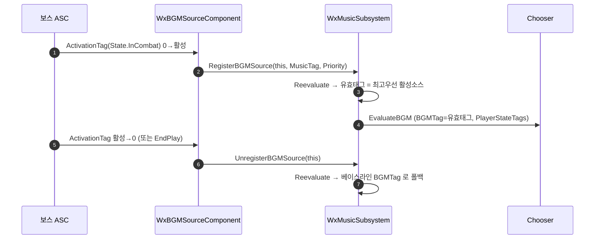

# BGM 소스 컴포넌트 (상태 기반)

## 계획

### 목표
캐릭터(보스 등)에 붙여 그 소유자의 상태 태그(예: `State.InCombat`)가 켜질 때 자신의 BGM 분류 태그를 기여하는 소스 컴포넌트를 추가한다. 전투(플레이어 ASC 태그) · 지역(StartBGM 베이스라인) · 보스(소스 컴포넌트)가 같은 Chooser 로 수렴해 상황에 맞는 BGM 이 선택되게 한다.

### 수정 범위
| 파일 | 수정할 내용 | 구분 |
|---|---|---|
| `WxSound/Public/WxBGMSourceComponent.h` | 소유자 ASC 의 ActivationTag 를 감시해 서브시스템에 자기 등록/해제하는 컴포넌트 선언 | 신규 |
| `WxSound/Private/WxBGMSourceComponent.cpp` | 위 구현 | 신규 |
| `WxSound/Public/System/WxMusicSubsystem.h` | 활성 소스 집합 + `RegisterBGMSource`/`UnregisterBGMSource` 선언, 유효 분류 태그 계산 | 수정 |
| `WxSound/Private/System/WxMusicSubsystem.cpp` | 등록/해제 구현, `EvaluateBGM` 이 유효 태그(최고 우선순위 활성 소스 → 없으면 BGMTag)를 사용하도록 변경 | 수정 |
| `WxGame/WxGame.Build.cs` | `WxSound` 를 PrivateDependency 에 추가 | 수정 |
| `WxGame/Character/WxPlayerCharacter.h/.cpp` | `BGMSourceComponent` 생성(생성자 CreateDefaultSubobject) | 수정 |
| `WxGame/Character/WxEnemyCharacter.h/.cpp` | 동일(추상 베이스 → 모든 적·보스 상속) | 수정 |

### 접근 방식
- **소스 = 서브시스템 등록**: 상태 기반 트리거는 보스 쪽에 있어 플레이어 ASC 우회 시 리스폰 시 태그 유실·다중 소스 중재 불가 문제가 생긴다. 따라서 소스가 로컬 `UWxMusicSubsystem` 에 `{자신, MusicTag, Priority}` 를 등록하고, 서브시스템이 활성 집합에서 최고 우선순위를 골라 분류 태그로 쓴다. 기존 단일 `BGMTag` 를 우선순위 있는 집합으로 일반화하는 것.
- **self-contained 활성 감지**: 컴포넌트는 소유자 ASC 를 부착 관계에서 자동 해석하고 `RegisterGameplayTagEvent(ActivationTag)` 를 구독한다. `BlueprintCallable` 없이 자기완결(전투 시스템이 이미 부여하는 태그를 재활용).
- **베이스라인 폴백**: `StartBGM(RegionTag)` 은 베이스라인 분류를 설정하고, 활성 소스가 있으면 그것이 덮는다. 보스 사망(태그 해제 또는 EndPlay)으로 소스가 빠지면 자동으로 베이스라인으로 복귀. `PlayerStateTags`(전투 등)는 그대로 레이어링.
- **로컬 전용**: 데디 서버 skip. 각 클라의 소스가 자기 로컬 서브시스템에 등록(BGM 로컬 전용 설계 유지, 복제 불필요).
- **캐릭터 통합은 데이터 주도**: WxPlayerCharacter/WxEnemyCharacter 는 C++ 에서 컴포넌트를 생성만 하고, MusicTag/ActivationTag/Priority 는 각 BP 에서 지정한다(MusicTag 는 콘텐츠별이라 C++ 기본값 부적절). 빈 MusicTag 소스는 등록하지 않아 트래시 몹은 무해하게 inert, 보스 BP 만 태그를 채워 활성. WxGame 은 게임 모듈이라 WxSound 플러그인 참조가 허용된다.

### 비목표
- 플레이어엔 소스 불필요(이미 리스너로 추적). "플레이어 자기 음악" 은 같은 컴포넌트 재사용으로 추후.
- MP 에서 "다른 플레이어에게 어그로된 보스" 가 내 음악에도 영향(보스 전투 상태 전역)은 알려진 한계로 범위 밖.

---

## 완료

### 수정한 파일
| 파일 | 수정한 내용 | 구분 |
|---|---|---|
| `WxSound/Public/WxBGMSourceComponent.h` | 소유자 ASC 의 ActivationTag 를 감시해 서브시스템에 자기 등록/해제하는 컴포넌트 | 신규 |
| `WxSound/Private/WxBGMSourceComponent.cpp` | 위 구현(ActivationTag·MusicTag 유효 시에만 동작) | 신규 |
| `WxSound/Public/System/WxMusicSubsystem.h` | `FWxBGMSourceRequest`, `RegisterBGMSource`/`UnregisterBGMSource`, `GetEffectiveBGMTag`, `ActiveSources` | 수정 |
| `WxSound/Private/System/WxMusicSubsystem.cpp` | 등록/해제(순서 보존 RemoveAt), 유효 태그 계산, `EvaluateBGM` 이 유효 태그 사용 | 수정 |
| `WxGame/WxGame.Build.cs` | `WxSound` PrivateDependency 추가 | 수정 |
| `WxGame/Character/WxPlayerCharacter.h/.cpp` | `BGMSourceComponent` 생성 | 수정 |
| `WxGame/Character/WxEnemyCharacter.h/.cpp` | `BGMSourceComponent` 생성(추상 베이스 → 적·보스 상속) | 수정 |

### 구현·결정과 그 이유
- **소스→서브시스템 등록(플레이어 ASC 우회 대신)**: 상태 트리거가 보스 쪽에 있어, 플레이어 ASC 로 우회하면 보스전 중 리스폰 시 태그 유실·다중 소스 중재 불가. 서브시스템이 활성 소스 집합을 들고 최고 우선순위를 고르게 해 리스폰·다중 소스에 강건. 기존 단일 BGMTag 를 우선순위 집합으로 자연 일반화(StartBGM 은 베이스라인 폴백으로 재정의).
- **빈 MusicTag 이중 가드**: 적 추상 베이스에 컴포넌트를 달아 모든 적·보스가 상속하되, MusicTag 미설정(트래시 몹) 소스가 베이스라인을 빈 태그로 덮지 않도록 컴포넌트 등록 억제 + `GetEffectiveBGMTag` skip 으로 이중 방어.
- **데이터 주도 설정**: MusicTag 는 콘텐츠별(보스마다 다름)이라 C++ 기본값 없이 각 BP 에서 지정. 미설정 컴포넌트는 무해하게 inert.
- **Private 의존성 + 전방선언**: WxSound 를 WxGame 공개 API 에 노출하지 않음. WxGame 은 게임 모듈이라 플러그인 참조 허용.
- **람다 회피(규칙4)**: `RemoveAll` 프레디킷 대신 역방향 `RemoveAt` 루프로 순서 보존.

### 계획 대비 달라진 점
- 계획대로.

### 후속 과제
- 데이터: Chooser 테이블에 보스/지역 행 추가, `BGM.*`/`Region.*` 태그 정의, 각 BP(BP_Player·보스 BP)에서 MusicTag/ActivationTag(예: `State.InCombat`)/Priority 설정. 데이터가 채워져야 실동작 확인 가능(현재 컴파일만 검증).
- MP: 원격 플레이어 소스가 로컬 음악에 영향, 보스 전역 어그로는 미해결(범위 밖).
