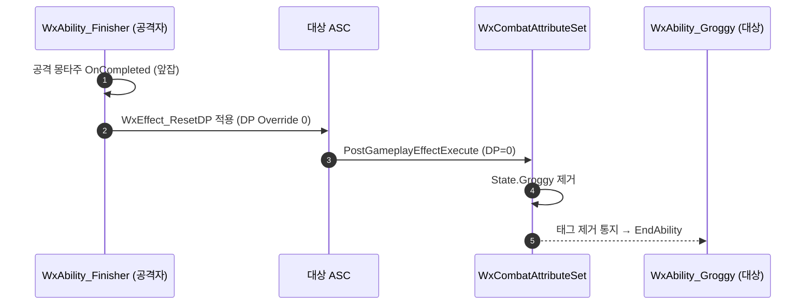

# 앞잡(Finisher) 종료 시 그로기 미해제 버그 수정 — 해제 권위 공격자 이관

## 계획

### 목표
그로기 적에게 앞잡을 걸고 앞잡이 끝나도 그로기가 안 풀리는 버그를 고친다. 원인은 그로기 해제(DP→0) 트리거가 "피해자 짝 피격 몽타주의 정상 완료" 하나에만 묶여 있는데, 앞잡 자신의 데미지가 그로기 피해자에게 `Event.HitReact.Normal`을 재송출해 그 짝 피격 몽타주를 재트리거로 끊어 `OnCompleted`를 못 띄우기 때문이다. 해제 권위를 공격자 `WxAbility_Finisher`로 옮겨 피해자 몽타주 완료와 무관하게 해제되도록 한다.

### 수정 범위
| 파일 | 수정할 내용 | 구분 |
|---|---|---|
| `WxAbility_Finisher.h` | 앞잡 전용 완료 핸들러 `HandleFinisherMontageCompleted` 선언 추가 | 수정 |
| `WxAbility_Finisher.cpp` | 앞잡 몽타주 `OnCompleted`를 전용 핸들러에 바인딩(뒤잡·중단/취소는 기존 그대로), 핸들러에서 확정 대상 ASC에 `WxEffect_ResetDP` 적용; ResetDP include 추가 | 수정 |
| `WxAbility_HitReact.h` | `HandleFinisherMontageCompleted` 선언 제거 | 수정 |
| `WxAbility_HitReact.cpp` | 앞잡 몽타주 전용 완료 바인딩·핸들러 정의 제거, ResetDP include 제거(짝 피격 몽타주 재생은 유지) | 수정 |

### 접근 방식
- **해제 권위 이관**: 공격자가 자기 공격 몽타주 정상 완료 시점에 확정 대상(`TargetActor`)의 DP를 `WxEffect_ResetDP`(Instant Override 0)로 직접 리셋한다. 대상 ASC의 `PostGameplayEffectExecute` DP 캐스케이드가 `State.Groggy`를 제거하고, 그 태그 제거를 구독하던 `WxAbility_Groggy`가 스스로 종료된다. 적용자 무관하게 대상 ASC에서 캐스케이드가 돌므로 정상 동작.
- **왜 종료 시점인가**: 처형 내내 그로기를 유지해야 (a) 적 AI가 조기 재개되지 않고, (b) 처형 몽타주 중간에 들어오는 앞잡 자신의 데미지가 `WxExecCalc_Damage`의 `if (!bIsGroggy)` 가드에 막혀 DP에 재가산되지 않는다(재그로기 방지). 진입 시 리셋은 이 두 이점을 잃어 기각.
- **변형 분기**: 앞잡(그로기 해제 대상)만 리셋, 뒤잡(즉사)은 기존 경로 유지. `ActivateAbility`의 `bBackstab` 지역 변수로 바인딩 시점 분기 — 멤버 플래그 신설 없음.
- **피해자 측 단순화**: 짝 피격 몽타주는 계속 재생하되, DP 리셋 책임은 제거해 일반 완료 핸들러로 통일.

---

## 완료

### 수정한 파일
| 파일 | 수정한 내용 | 구분 |
|---|---|---|
| `WxAbility_Finisher.h` | `HandleFinisherMontageCompleted` 선언 추가 | 수정 |
| `WxAbility_Finisher.cpp` | ResetDP include 추가, `bBackstab`로 `OnCompleted` 바인딩 분기(앞잡→전용 핸들러), 핸들러에서 대상 ASC에 `WxEffect_ResetDP` 적용 후 EndAbility | 수정 |
| `WxAbility_HitReact.h` | `HandleFinisherMontageCompleted` 선언 제거 | 수정 |
| `WxAbility_HitReact.cpp` | 앞잡 전용 완료 바인딩·핸들러 정의 제거, ResetDP include 제거(짝 피격 몽타주 선택·재생은 유지) | 수정 |

### 구현·결정과 그 이유
- **해제 권위를 공격자로 이관**: 종전엔 피해자 짝 피격 몽타주의 `OnCompleted` 하나에 그로기 해제가 묶여 있었고, 앞잡 자신의 데미지가 유발한 `Event.HitReact.Normal` 재트리거가 그 몽타주를 끊어 해제가 누락됐다. 공격자가 자기 몽타주 완료 시점에 대상 DP를 직접 리셋하면 피해자 몽타주 상태와 무관하게 해제가 보장된다.
- **대상 적용 방식**: 기존 `ApplyFinisherDamage`와 동일한 ASC 패턴(`MakeOutgoingSpec` → `ApplyGameplayEffectSpecToTarget`)으로 대상 ASC에 적용. 대상의 `PostGameplayEffectExecute` DP 캐스케이드가 적용자 무관하게 대상에서 돌아 `State.Groggy`를 제거한다.
- **종료 시점 리셋 유지(진입 시 리셋 기각)**: 처형 내내 그로기를 유지해야 적 AI 조기 재개를 막고, 몽타주 중간의 앞잡 데미지가 `if (!bIsGroggy)` 가드에 걸려 DP에 재가산되지 않는다(재그로기 방지).
- **뒤잡 분기**: 뒤잡은 그로기 대상이 아니므로 `bBackstab`일 때 기존 `HandleMontageFinished` 유지. 중단/취소(`OnInterrupted`/`OnCancelled`)는 두 변형 모두 리셋 없이 종료해 드레인 폴백에 맡긴다.

### 계획 대비 달라진 점
- 계획대로.

### 후속 과제
- **시각적 끊김(범위 밖)**: 앞잡 자신의 데미지가 그로기 피해자에게 `Event.HitReact.Normal`을 재송출해 피해자 처형 애니메이션이 일반 피격으로 잠깐 끊기는 현상은 남는다(그로기 해제와 별개). 필요 시 짝 피격 재생 중 자기 데미지 HitReact 억제 또는 앞잡 데미지 Row `HitReactTag` 비우기로 별도 처리.
- **인게임 검증 미실시**: 컴파일만 확인. 그로기→앞잡→종료 시 즉시 해제, 뒤잡 회귀는 인게임 확인 필요.
