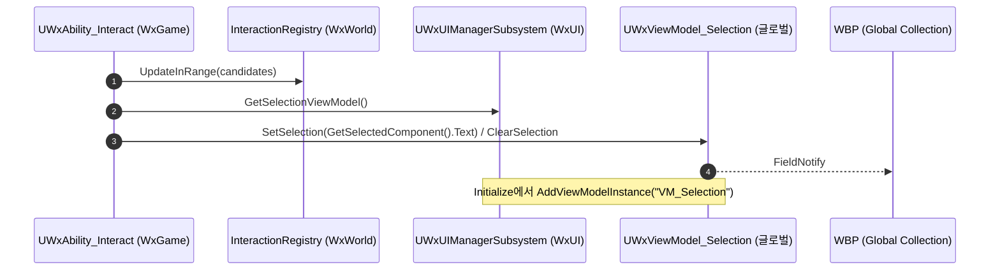

# WxViewModel_Selection — 글로벌 VM + 상호작용 pump

## 계획

### 목표
범용 "현재 선택된 대상" 표시 VM `UWxViewModel_Selection`을 **글로벌 뷰모델**로 세운다. 상호작용/인벤토리가 공유하는 단일 인스턴스를 엔진 표준 글로벌 컬렉션(`UMVVMGameSubsystem`)에 등록하고, 상호작용 선택을 그 인스턴스에 push한다. 이번 범위는 상호작용 pump까지(인벤토리 후속).

설계 경위: 1차 Resolver(위젯별 생성) 방식으로 만들었으나, 사용자가 **글로벌 VM**을 의도 → Resolver/브리지 삭제. 전용 서브시스템은 만들지 않고 **기존 `UWxUIManagerSubsystem`**(WxUI)가 소유·등록·노출, pump는 기존 `UWxAbility_Interact`(WxGame)가 담당.

### 수정 범위
| 파일 | 수정할 내용 | 구분 |
|---|---|---|
| `Source/WxGame/MVVM/WxViewModelResolver_Selection.h` / `.cpp` | 리졸버+브리지 제거 | 삭제 |
| `Plugins/WxUI/.../MVVM/WxViewModel_Selection.h` / `.cpp` | 필드/셋터 그대로 | 유지 |
| `Plugins/WxUI/.../System/WxUIManagerSubsystem.h` / `.cpp` | 글로벌 VM 생성·`UMVVMGameSubsystem` 등록·`GetSelectionViewModel()` 노출 | 수정 |
| `Source/WxGame/AbilitySystem/Ability/WxAbility_Interact.h` / `.cpp` | `PushSelectionToViewModel` 추가, `UpdateInRange` 직후 호출 | 수정 |

### 접근 방식
- **소유·등록(WxUI)**: `WxUIManagerSubsystem::Initialize`에서 `Collection.InitializeDependency(UMVVMGameSubsystem::StaticClass())` 후 VM 생성 → `AddViewModelInstance({UWxViewModel_Selection, "VM_Selection"})`. `Deinitialize`에서 `RemoveViewModel`.
- **pump(WxGame)**: WxUI가 WxWorld 레지스트리를 못 보므로, 선택의 유일한 로컬 생산자 `UWxAbility_Interact`가 `Registry->UpdateInRange(...)` 직후 매니저 VM에 `SetSelection`/`ClearSelection`. 상호작용 표시 데이터는 `GetInteractionText()`만(Description/Icon 비움).

---

## 완료

### 수정한 파일
| 파일 | 수정한 내용 | 구분 |
|---|---|---|
| `Source/WxGame/MVVM/WxViewModelResolver_Selection.h` / `.cpp` | 리졸버+브리지 제거 | 삭제 |
| `Plugins/WxUI/.../MVVM/WxViewModel_Selection.h` / `.cpp` | 변경 없음(글로벌에도 그대로) | 유지 |
| `Plugins/WxUI/.../System/WxUIManagerSubsystem.h` / `.cpp` | 글로벌 VM 생성·`UMVVMGameSubsystem` 등록/해제·`GetSelectionViewModel()` | 수정 |
| `Source/WxGame/AbilitySystem/Ability/WxAbility_Interact.h` / `.cpp` | `PushSelectionToViewModel` 추가, `UpdateInRange` 직후 3곳 호출 | 수정 |

Build.cs 변경 없음(WxUI는 이미 ModelViewViewModel public, WxGame는 이미 WxUI/WxWorld/ModelViewViewModel 의존).

### 구현·결정과 그 이유
- **글로벌 VM은 `UMVVMGameSubsystem` 컬렉션에 등록, 소유는 기존 `UWxUIManagerSubsystem`**: 전용 서브시스템 신설 대신 기존 UI 매니저 재사용(사용자 지시). GameInstance 스코프가 글로벌 컬렉션과 일치. `Collection.InitializeDependency(UMVVMGameSubsystem::StaticClass())`로 초기화 순서 방어.
- **pump는 WxGame 어빌리티**: WxUI는 WxWorld를 못 보므로 매니저가 직접 선택을 못 읽는다. 상호작용 선택의 유일한 로컬 생산자 `UWxAbility_Interact`가 `UpdateInRange` 직후 매니저의 VM에 push → 표시가 레지스트리 멤버십과 lockstep.
- **VM은 자신의 등록/pump를 모른다**: 순수 표시 계약 유지. 도메인·MVVM 결합은 매니저(등록)와 어빌리티(pump)에 격리.

### 계획 대비 달라진 점
- 계획대로. (1차 Resolver 방식 → 글로벌 VM 방식으로 전환한 뒤의 최종 계획 기준)

### 후속 과제
- **에디터(사용자)**: 상세 패널 WBP View Binding을 Creation Type = Global View Model Collection, 식별자 `VM_Selection`으로 지정 후 `bHasSelection`/`DisplayName`/`Description`/`Icon`(LazyImage) 바인딩. 런타임 검증은 그 후.
- **인벤토리 pump**: 아이템 선택 소유 개념이 없어 미착수. 같은 글로벌 VM에 push하는 소스가 별도 작업으로 남음.
- C++ 검증은 빌드 성공(WxEditor Development)까지 완료.
