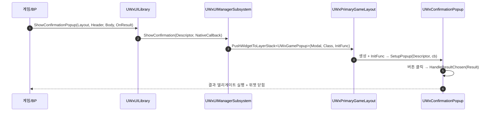

# WxUI 팝업(Popup) 시스템 추가 — Lyra 포팅

## 계획

### 목표
확인/에러 팝업을 띄우는 표준 경로를 WxUI에 추가한다. Lyra의 `CommonGame`+`LyraGame` 2계층 팝업
시스템(Descriptor·Dialog·Messaging·ConfirmationScreen)을 참고하되, WxUI 기존 인프라에 맞춰 얹는다.

### 수정 범위
| 파일 | 수정할 내용 | 구분 |
|---|---|---|
| `WxUI/Public/Widget/WxGamePopup.h` / `Private/.../WxGamePopup.cpp` | `EWxPopupResult`, `FWxPopupResultDelegate`, `FWxConfirmationPopupAction`, `UWxGamePopupDescriptor`(팩토리 4종), `UWxGamePopup` 베이스 | 신규 |
| `WxUI/Public/Widget/WxConfirmationPopup.h` / `Private/.../WxConfirmationPopup.cpp` | 구체 위젯: 제목/본문 세팅, 고정 3버튼(Confirm/Decline/Cancel) 클릭 라우팅, 결과 1회 콜백 | 신규 |
| `WxUI/Public/System/WxPrimaryGameLayout.h` | `PushWidgetToLayerStack<T>(tag, class, InitFunc)` templated 오버로드 | 수정 |
| `WxUI/Public/System/WxUIManagerSubsystem.h` / `Private/.../WxUIManagerSubsystem.cpp` | `ShowConfirmation`/`ShowError` + private `PushPopup` | 수정 |
| `WxUI/Public/System/WxUIDeveloperSettings.h` | `ConfirmationPopupClass`, `ErrorPopupClass` (TSoftClassPtr, Config) | 수정 |
| `WxUI/Public/WxUILibrary.h` / `Private/WxUILibrary.cpp` | BP 파사드 `ShowConfirmationPopup`/`ShowErrorPopup` + 다이나믹 델리게이트 + `EWxPopupButtonLayout` | 수정 |

### 접근 방식
- **CommonGame 추상 계층 생략**: Lyra의 `UCommonMessagingSubsystem`(파생-감지 간접)은 게임-무관 확장용
  이라 생략하고, `Show*`를 기존 `UWxUIManagerSubsystem`에 직접 얹는다.
- **결과 라우팅은 C++ 소유**: 규칙 #7(BlueprintCallable은 함수 라이브러리/Async 전용) 준수. 위젯은
  고정 3버튼의 네이티브 `OnClicked`를 C++에서 바인딩. Lyra의 DynamicEntryBox+LyraButtonBase(텍스트
  세터·InputAction 데이터테이블) 대신, 결과 3종에 1:1 대응하는 고정 버튼으로 모든 팩토리를 커버.
- **표시 전 초기화**: `PushWidgetToLayerStack<T>`의 InitFunc(활성화 이전 호출)에서 `SetupPopup`.
- **BP 파사드**: `UWxUILibrary`에 BlueprintCallable 진입점 + 다이나믹→네이티브 델리게이트 브릿지.

---

## 완료

### 수정한 파일
| 파일 | 수정한 내용 | 구분 |
|---|---|---|
| `WxUI/Public/Widget/WxGamePopup.h` / `Private/.../WxGamePopup.cpp` | `EWxPopupResult`, `FWxPopupResultDelegate`, `FWxConfirmationPopupAction`, `UWxGamePopupDescriptor`(팩토리 4종·한글 라벨), `UWxGamePopup` 베이스 | 신규 |
| `WxUI/Public/Widget/WxConfirmationPopup.h` / `Private/.../WxConfirmationPopup.cpp` | 제목/본문 세팅, 고정 3버튼 표시·클릭 라우팅, 결과 1회 콜백, `OnSetupPopup` BP 이벤트 | 신규 |
| `WxUI/Public/System/WxPrimaryGameLayout.h` | `PushWidgetToLayerStack<T>(tag, class, InitFunc)` templated 오버로드 + 컨테이너 헤더 include | 수정 |
| `WxUI/Public/System/WxUIManagerSubsystem.h` / `Private/.../WxUIManagerSubsystem.cpp` | `ShowConfirmation`/`ShowError` + private `PushPopup` | 수정 |
| `WxUI/Public/System/WxUIDeveloperSettings.h` | `ConfirmationPopupClass`, `ErrorPopupClass` | 수정 |
| `WxUI/Public/WxUILibrary.h` / `Private/WxUILibrary.cpp` | BP 파사드 2종 + 다이나믹 델리게이트 + `EWxPopupButtonLayout` + 브릿지 헬퍼 | 수정 |

### 구현·결정과 그 이유
- **CommonGame 추상 계층 생략**: 우리 엔진에 CommonGame 플러그인이 없고, 파생-감지 간접(`ShouldCreateSubsystem`)은 게임-무관 확장용이라 불필요. 기존 `UWxUIManagerSubsystem`에 직접 얹어 클래스 증식을 피함.
- **고정 3버튼 vs DynamicEntryBox**: Lyra 결과는 Confirmed/Declined/Cancelled 3종뿐이라 모든 팩토리가 이 조합. 버튼-텍스트 세터를 가진 자체 버튼 클래스(LyraButtonBase 대응물)를 새로 만들지 않고, 결과에 1:1 대응하는 `BindWidgetOptional` 고정 버튼으로 커버.
- **결과 라우팅 C++ 소유**: 규칙 #7 준수. 위젯의 결과 확정 함수를 BlueprintCallable로 열지 않고, 네이티브 `OnClicked`를 C++에서 payload 바인딩. WBP는 라벨/비주얼만 담당(`OnSetupPopup`).
- **1회 콜백을 언바인딩으로 표현**: 멤버 플래그 대신 `OnResultCallback.Unbind()`로 재진입 방어(memory: avoid-member-flag-variables).
- **팝업 클래스는 DeveloperSettings**: Lyra는 서브시스템 config였으나 기존 `LayoutClass`와 일관되게 `UWxUIDeveloperSettings`에 배치.

### 계획 대비 달라진 점
- **명명을 Popup으로 통일**: 구현 후 Lyra의 Dialog/Screen/Messaging 혼용 대신 프로젝트 전체를 `Popup`으로
  통일(모달 전용 의미로 좁힘). `Screen`은 전체화면 비-모달 뷰용으로 예약, `Popup`은 토스트/알림류와 구분.
  Lyra 참조 코드의 원래 명칭(UCommonGameDialog 등)과는 어긋나지만 구조는 동일.

### 후속 과제
- 런타임 배선(에디터 작업): `UWxConfirmationPopup` 상속 WBP 작성(위젯 바인딩·InputMode=Menu), Primary Layout의 ModalLayer 확인, Project Settings에서 `ConfirmationPopupClass` 지정 후 실제 표시/결과 반환 확인.
