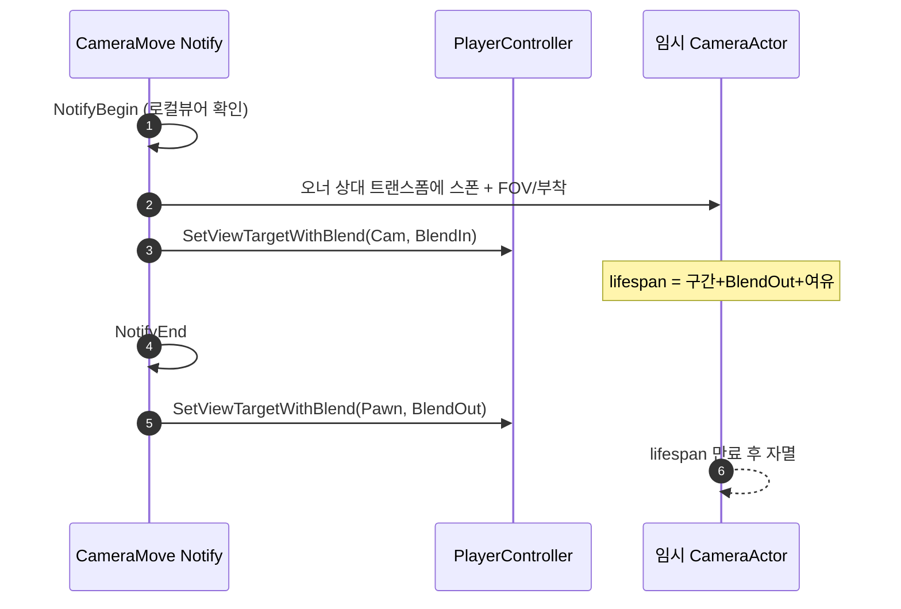

# 카메라 이동 AnimNotifyState (UWxAnimNotifyState_CameraMove)

## 계획

### 목표
Finisher(처형) 몽타주 구간 동안 카메라를 잠시 멋있는 고정 각도로 옮겼다가, 몽타주가 끝나면 원래 게임플레이 카메라로 자연스럽게 되돌리는 연출용 AnimNotifyState를 추가한다. 현재 Finisher는 카메라 연출이 전혀 없다.

### 수정 범위
| 파일 | 수정할 내용 | 구분 |
|---|---|---|
| `Plugins/WxCombat/Source/WxCombat/Public/AnimNotify/WxAnimNotifyState_CameraMove.h` | 노티스테이트 선언, 프로퍼티(오프셋·회전·부착·블렌드·FOV) | 신규 |
| `Plugins/WxCombat/Source/WxCombat/Private/AnimNotify/WxAnimNotifyState_CameraMove.cpp` | Begin=임시 카메라로 뷰 전환, End=폰 카메라로 복귀 | 신규 |

### 접근 방식
- **SetViewTargetWithBlend + 임시 CameraActor**: 프로젝트에 CameraManager/Modifier/ViewTarget 인프라가 없으므로, 엔진 표준 API로 임시 `ACameraActor`에 뷰를 위임했다가 복귀시킨다. 블렌드 인/아웃이 공짜로 처리되고 "잠깐 다른 지점에서 보고 부드럽게 돌아오기"에 정확히 대응된다.
- **로컬 뷰어 전용**: 카메라는 순수 로컬 연출이라 `IsLocallyControlled()`가 아니면 즉시 반환. 서버 권위 체크가 아니라 로컬 뷰어 체크다.
- **상태 무저장**: Begin이 상대 오프셋으로 카메라를 스폰하고, End는 폰으로 블렌드 복귀만 한다. 임시 카메라 액터는 lifespan(구간 길이+블렌드+여유)으로 자멸하므로 노티 멤버에 per-play 포인터를 들지 않는다 → 동시 재생/인터럽트에도 안전.
- **부착 옵션**: `bAttachToOwner`면 오너 루트에 KeepWorldTransform으로 부착해 캐릭터를 따라가고, 아니면 월드 고정 스냅샷.
- **레이어 준수**: `APawn`/`APlayerController`/`ACameraActor` 등 엔진 추상 타입만 사용 → WxGame(AWxPlayerCharacter) 캐스팅 없이 WxCombat 내부에서 완결. 모듈 의존성 추가 불필요.

---

## 완료

### 수정한 파일
| 파일 | 수정한 내용 | 구분 |
|---|---|---|
| `Plugins/WxCombat/Source/WxCombat/Public/AnimNotify/WxAnimNotifyState_CameraMove.h` | 노티스테이트 선언, 프로퍼티(오프셋·회전·부착·FOV·블렌드), 에디터 프리뷰 토글·기즈모 스케일, NotifyTick | 신규 |
| `Plugins/WxCombat/Source/WxCombat/Private/AnimNotify/WxAnimNotifyState_CameraMove.cpp` | Begin=임시 카메라로 뷰 전환, End=폰 복귀, Tick=프리뷰 기즈모. 기준은 메시 컴포넌트(프리뷰=인게임 일치) | 신규 |

### 구현·결정과 그 이유
- **SetViewTargetWithBlend + 임시 CameraActor**: 프로젝트에 재사용할 카메라 인프라가 없어 엔진 표준 뷰타겟 블렌드를 채택. 블렌드 인/아웃을 공짜로 얻고 "잠깐 다른 시점 → 부드럽게 복귀"에 정확히 대응.
- **상태 무저장 + lifespan 안전망**: 노티 멤버에 per-play 포인터를 두면 동시 재생 시 위험. Begin은 스폰만, End는 폰 복귀만 하고 임시 카메라는 (구간+블렌드+여유) lifespan으로 자멸시켜 인터럽트/동시재생에도 안전.
- **로컬 뷰어 전용**: 카메라는 순수 로컬 연출이라 `IsLocallyControlled()` 게이트로 데디서버/원격 클라에선 무동작.
- **엔진 추상 타입만 사용**: `APawn`/`APlayerController`/`ACameraActor`로 완결해 WxGame(AWxPlayerCharacter) 캐스팅 없이 레이어 규칙 준수, 모듈 의존성 추가 불필요.
- **에디터 프리뷰 미리보기**: Persona 프리뷰엔 PlayerController/뷰타겟이 없어 실제 뷰 전환 재현 불가. 대신 `EWorldType::EditorPreview`일 때 `DrawDebugCamera`로 카메라 아이콘+프러스텀(위치·방향·FOV) 기즈모를 그려 예측 가능하게 함. 전체를 `#if WITH_EDITOR`로 감싸 런타임 영향 0. 기본 스케일이 캐릭터 대비 너무 작아 `PreviewGizmoScale`(에디터 전용)로 키우고 조절 가능하게 함.
- **프리뷰↔인게임 배치 일치(버그픽스)**: 초기엔 런타임=액터 프레임, 프리뷰=프리뷰 액터 기준이라 방향이 어긋났다(ACharacter의 메시 -90도 보정이 런타임에만 존재). 두 경로 모두 기준을 **메시 컴포넌트 트랜스폼(실제 렌더 몸체)**으로 통일해, 오프셋을 항상 몸체 로컬로 적용 → 프레임 절대각과 무관하게 프리뷰가 인게임 배치를 그대로 예측.

### 계획 대비 달라진 점
- 애니메이션 에디터 프리뷰 미리보기(카메라 아이콘+프러스텀 기즈모)를 추가했다. 사용자 요청으로 NotifyTick에서 프리뷰 월드 한정 DrawDebugCamera로 구현.
- 기준 프레임을 액터→메시 컴포넌트로 변경했다. 프리뷰와 인게임 카메라 방향이 어긋나는 버그를 없애기 위함(신규 기능이라 튜닝된 컨텐츠 없어 프레임 변경 자유로움).
- 프리뷰 뷰포트 내 "미니카메라 PiP"(실제 렌더 화면) 안은 검토했으나 채택하지 않음. 전용 에디터 모듈+씬캡처+뷰포트 오버레이가 필요한 별도 대공사라, 기즈모로 충분하다는 판단.

### 후속 과제
- 에디터 동작 확인(사용자): finisher 몽타주에 노티 구간 추가 → 프리뷰 재생 시 노란 기즈모로 위치·각도 확인, 실제 앞잡 발동 시 프리뷰와 같은 위치에서 블렌드 전환/복귀되는지 확인.
- 프리뷰 기즈모는 NotifyTick 기반이라 프리뷰 "재생/스크럽" 중에만 표시된다(정지 상태에선 안 보임).
- 오프셋 기준이 메시 로컬이라 축 방향은 캐릭터 애셋 forward 관례를 따른다(기즈모로 보며 튜닝).

---

## 후속 변경 — 프리뷰를 MatineeCam_SM 메시로 (2026-07-12)

### 계획
프리뷰에서 `DrawDebugCamera`로 직접 그리던 카메라 기즈모(아이콘 + FOV 프러스텀)를, 엔진의 실제 카메라 모델 스태틱 메시 `/Engine/EditorMeshes/MatineeCam_SM.MatineeCam_SM`으로 대체한다. 기존의 상태 무저장·NotifyTick·에디터 전용 설계와 메시 컴포넌트 기준 배치는 그대로 두고 "그리는 대상"만 바꾼다.

- MatineeCam_SM을 `FSoftObjectPath::TryLoad()`로 지연 로드해 GC 안전한 `Transient UPROPERTY` 멤버에 캐시.
- LOD0 지오메트리(정점·인덱스)를 뽑아 `CameraTransform`(메시 컴포넌트 기준 + `PreviewGizmoScale` 스케일)으로 변환 후 `DrawDebugMesh`로 단색 실루엣 렌더. 별도 액터/컴포넌트를 스폰·정리하지 않아 인터럽트/동시재생 안전성 유지.
- `PreviewGizmoScale`을 메시 스케일 배수로 재해석(트랜스폼 스케일에 반영). FOV 프러스텀 표시는 사라진다(메시는 FOV를 나타내지 않음).

### 완료
초기엔 `DrawDebugMesh`로 메시 지오메트리를 뽑아 그렸으나, 솔리드 삼각형 채움이 "노란 덩어리"처럼 보여(디버그 렌더의 한계) 폐기. 최종적으로 **엔진 카메라 모델을 실제 `UStaticMeshComponent`로 프리뷰 월드에 등록해 그대로 렌더**하는 방식으로 전환했다(재질·셰이딩 포함, 실제 CameraActor 아이콘과 동일한 외형).

| 파일 | 수정한 내용 |
|---|---|
| `...Public/AnimNotify/WxAnimNotifyState_CameraMove.h` | `UStaticMeshComponent` 전방 선언, 프리뷰 주석 갱신, `Transient TObjectPtr<UStaticMeshComponent> PreviewCameraMeshComponent`(렌더 컴포넌트) 추가 |
| `...Private/AnimNotify/WxAnimNotifyState_CameraMove.cpp` | 인클루드 `Components/StaticMeshComponent.h`+`Engine/StaticMesh.h`(DrawDebug 계열 제거). NotifyTick=프리뷰 월드에 카메라 모델 컴포넌트 1회 스폰 후 매 틱 트랜스폼만 갱신. 재생이 멈춰도 보이도록 유지, 정리는 토글 오프·월드 교체 시 |

**구현·결정과 그 이유**
- **실제 메시 컴포넌트 렌더**: `DrawDebug*`는 단색이라 형상이 뭉개진다. MatineeCam_SM을 `SetStaticMesh`한 컴포넌트를 `RegisterComponentWithWorld`로 프리뷰 씬에 올리면 재질까지 제대로 나와 "실제 카메라를 놓은" 모습이 된다.
- **구간 안에서만 표시 + 비저빌리티 토글**: 컴포넌트는 한 번 만들어 재사용하고 파괴하지 않는다. 구간 진입(NotifyTick)에서 `SetVisibility(true)`, 구간 이탈(NotifyEnd)에서 `SetVisibility(false)`. 루프 재생 시 생성·파괴 반복을 피하는 최적화(사용자 요청). (※ "구간 안 정지 시 유지"는 아래 후속 변경에서 위치 판정으로 확정 — 이 경로는 일시정지에도 NotifyEnd가 호출됨.)
- **월드 교체 가드**: 유지형이라 이전 에디터 세션의 낡은 컴포넌트(다른 월드)를 재사용하면 새 프리뷰에 안 보이고 월드가 잔존한다. `GetWorld() != World`면 참조를 버려(GC가 낡은 컴포넌트+월드 회수) 현재 월드에 새로 생성.
- **bAttachToOwner 프리뷰 반영**: 부착 모드는 실시간 몸체 트랜스폼을 따라가고, 고정 모드는 `NotifyBegin`에서 스냅샷한 `PreviewAnchorTransform`에 고정(스냅샷 전에는 실시간으로 대체). 앵커는 NotifyEnd에서 무효화해 다음 구간 진입 때 재기록.
- **메시 동기 로드(캐시 없음)**: 에디터 프리뷰 전용이라 로드 비용이 의미 없어, 지연 로드+캐시 멤버를 빼고 컴포넌트 생성 시점에 `LoadObject`로 직접 로드(1회만 실행).
- **런타임 영향 0**: 프리뷰 코드·멤버 전부 `#if WITH_EDITOR`/`WITH_EDITORONLY_DATA`. PIE에선 컴포넌트가 생성되지 않고, 쿠킹 시 통째로 스트립.

**검증**
- WxEditor(Development) 빌드 성공(`WxAnimNotifyState_CameraMove.cpp`만 재컴파일, 무관한 엔진 deprecation 경고만).
- (사용자) 구간 안에서 카메라가 보이고 구간 밖으로 나가면 사라지는지, 구간 안에서 멈추면 유지되는지, `bAttachToOwner` on/off로 추종/고정이 프리뷰에 반영되는지 확인.

**계획 대비 달라진 점**
- `DrawDebugMesh`(솔리드 실루엣) → 실제 `UStaticMeshComponent` 렌더로 전환. 이후 반복 요청으로 "구간 안에서만 표시 + 멈추면 유지"를 비저빌리티 토글(파괴 없이 재사용)로 구현. 에디터 프리뷰 한정이라 런타임 무영향은 유지.
- 사용자 요청으로 `PreviewGizmoScale`은 제거됨(네이티브 스케일 사용).

---

## 후속 변경 — 프리뷰 카메라 메시를 변수로 노출 (2026-07-12)

### 계획
프리뷰 카메라 모델 경로 `/Engine/EditorMeshes/MatineeCam_SM.MatineeCam_SM`가 cpp에 문자열 리터럴로 하드코딩돼 있어, 다른 형상을 쓰려면 코드 수정이 필요했다. 이 경로를 에디터에서 편집 가능한 UPROPERTY 변수로 승격하되 디폴트는 현재와 동일한 MatineeCam_SM으로 유지한다.

- 헤더 `WITH_EDITORONLY_DATA` 블록에 `TSoftObjectPtr<UStaticMesh> PreviewCameraMesh`를 추가하고 인라인 초기화로 디폴트를 현재 경로로 설정. `class UStaticMesh;` 전방 선언 추가(소프트 포인터라 전방 선언으로 충분).
- cpp `NotifyTick`의 하드코딩 `LoadObject`를 `PreviewCameraMesh.LoadSynchronous()`로 교체(생성 시점 동기 로드 동작 유지). 널 가드 그대로.
- 하드코딩 전제가 담긴 주변 주석을 변수 기반 표현으로 소폭 정리.

### 완료

| 파일 | 수정한 내용 |
|---|---|
| `...Public/AnimNotify/WxAnimNotifyState_CameraMove.h` | `class UStaticMesh;` 전방 선언, `WITH_EDITORONLY_DATA`에 편집 가능 `TSoftObjectPtr<UStaticMesh> PreviewCameraMesh`(디폴트 MatineeCam_SM 인라인 초기화) 추가, 프리뷰 주석 하드코딩 전제 제거 |
| `...Private/AnimNotify/WxAnimNotifyState_CameraMove.cpp` | 하드코딩 `LoadObject` → `PreviewCameraMesh.LoadSynchronous()`, 주변 주석 변수 기반으로 정리 |

**구현·결정과 그 이유**
- **소프트 포인터 + 인라인 디폴트**: 에디터 편집용 애셋 참조는 `TSoftObjectPtr`가 관례. 인라인 `FSoftObjectPath` 초기화로 생성자 추가 없이 디폴트를 현재 경로로 고정 → 기존 동작 그대로 유지. 전방 선언만으로 컴파일(완전 타입 불필요).
- **`LoadSynchronous()` 채택**: 소프트 포인터의 지연 로드 대신 접근 시점 동기 로드라, 기존 `LoadObject` "생성 시점 1회 동기 로드"와 동일 타이밍. 미지정·로드 실패 시 널 반환하므로 뒤의 널 가드가 그대로 방어.
- **프리뷰 전용 범위 유지**: 필드를 기존 프리뷰 데이터와 함께 `WITH_EDITORONLY_DATA`에 둬 런타임/쿠킹 영향 0.

**검증**
- WxEditor(Development) 빌드 성공(`WxAnimNotifyState_CameraMove.cpp` 재컴파일·링크, 무관한 엔진 deprecation 경고만). `TSoftObjectPtr`/`FSoftObjectPath`는 추가 include 없이 컴파일됨.
- (사용자) 디테일 패널에 `PreviewCameraMesh` 노출 확인, 다른 스태틱 메시로 바꾸면 프리뷰 형상이 바뀌고 비우면(디폴트 유지 시) MatineeCam_SM으로 보이는지 확인.

**계획 대비 달라진 점**
- 계획대로. 헤더 전방 선언·`CoreMinimal`만으로 소프트 포인터 타입이 해석돼 추가 include 불필요.

---

## 후속 변경 — 뷰 전환 시 레터박스 제거 (2026-07-12)

### 계획
노티파이 사용 시 카메라 전환 구간 동안 화면 위아래에 검은 띠(레터박스)가 나타나는 문제를 없앤다. 원인은 `NotifyBegin`이 스폰하는 엔진 `ACameraActor`다. 엔진 생성자가 내부 `UCameraComponent`에 `bConstrainAspectRatio = true`, `AspectRatio = 1.777778f`(16:9)를 기본으로 넣어, 뷰 타겟이 이 카메라로 전환되면 화면을 16:9로 마스킹하고 남는 영역을 검은 띠로 채운다. 노티파이 코드 자체는 시네마틱 바 위젯을 붙이지 않으므로 레터박스의 유일한 출처는 이 종횡비 제약이다.

- `NotifyBegin`의 카메라 컴포넌트 설정 블록(현재 `SetFieldOfView`만 호출)에서 스폰 직후 `SetConstraintAspectRatio(false)`로 제약을 해제해 뷰포트 전체를 채우게 한다.
- 엔진 기존 API이고 include는 이미 걸린 `Camera/CameraComponent.h`로 충족 → 헤더/include 변경 없음. 프리뷰는 실제 뷰 전환을 하지 않으므로 영향 없고, 변경은 런타임 스폰 경로 한 곳뿐이다.

### 완료

| 파일 | 수정한 내용 |
|---|---|
| `...Private/AnimNotify/WxAnimNotifyState_CameraMove.cpp` | `NotifyBegin` 카메라 컴포넌트 블록에 `SetFieldOfView` 다음 `SetConstraintAspectRatio(false)` 한 줄 추가(주석 포함) |

**구현·결정과 그 이유**
- **종횡비 제약 해제**: 레터박스의 출처는 엔진 `ACameraActor` 생성자가 넣는 `bConstrainAspectRatio=true`/16:9였다. 스폰 직후 `SetConstraintAspectRatio(false)`로 껐다. 노티파이가 별도 시네마틱 바를 그리지 않으므로 이 한 줄로 검은 띠가 완전히 사라진다.
- **최소 변경**: 스폰·뷰타겟·lifespan·프리뷰 등 나머지 설계는 그대로. 카메라 컴포넌트 초기화 지점 한 곳만 손대 부작용 표면을 최소화. 헤더/include 변경 없음(`Camera/CameraComponent.h` 이미 포함).

**검증**
- WxEditor(Development) 빌드 성공(EXIT CODE 0). `WxAnimNotifyState_CameraMove.cpp`만 재컴파일·링크, 무관한 엔진 경고만.
- (사용자) PIE에서 해당 노티 구간 재생 시 위아래 검은 띠가 사라지고 화면 전체가 채워지는지 확인.

**계획 대비 달라진 점**
- 계획대로.

---

## 후속 변경 — 적·플레이어 애니 양쪽에서 사용 (MP 안전) (2026-07-12)

### 계획
지금까지 이 노티는 "몽타주 재생 액터 = 로컬 플레이어"를 전제로 `MeshComp` 주인을 `APawn`으로 캐스팅해 `IsLocallyControlled()`가 아니면 반환했다. 그래서 적(AI 폰) 애니에 붙이면 무동작. 플레이어·적 어느 애니에 붙여도 로컬 플레이어의 카메라 연출로 동작하게 만들되, **멀티플레이에서 남의 피니셔가 내 카메라를 흔들지 않아야 한다**는 제약을 지킨다.

- 원인은 **뷰 구동 컨트롤러**와 **몽타주 재생 액터**를 한 덩어리로 본 것. 이 둘을 분리한다.
- MP 함정: 플레이어 A의 몽타주는 모든 클라에 리플리케이트돼 B의 클라에서도 이 노티가 실행된다. 무조건 로컬 PC를 집으면 B의 카메라까지 흔들린다. 그래서 "재생 주체가 플레이어냐 AI냐"로 갈라야 한다.
- 게이트(Begin·End 공통): `OwnerPawn`이 플레이어 제어(`IsPlayerControlled`)인데 로컬이 아니면(`!IsLocallyControlled`) 반환 → 남의 플레이어 몽타주 차단. 그 외엔 `GEngine->GetFirstLocalPlayerController`로 로컬 PC를 집는다(데디서버 null → 무동작).
- End 복귀 대상은 재생 주체 폰 → `PC->GetPawn()`(로컬 플레이어 폰). `SpawnParams.Owner`는 재생 주체 액터.

### 완료

| 파일 | 수정한 내용 |
|---|---|
| `...Private/AnimNotify/WxAnimNotifyState_CameraMove.cpp` | `#include "Engine/Engine.h"` 추가. Begin·End의 로컬 컨트롤 게이트를 "플레이어·비로컬이면 반환 + `GetFirstLocalPlayerController`" 게이트로 교체. `SpawnParams.Owner = Owner`, End 복귀 대상 `PC->GetPawn()` |
| `...Public/AnimNotify/WxAnimNotifyState_CameraMove.h` | 클래스 doc 주석 갱신(플레이어/적 재생 주체, MP에서 남의 피니셔 무영향, 데디서버 무동작), `bAttachToOwner` 주석에 "오너=몽타주 재생 액터" 명시 |

**구현·결정과 그 이유**
- **플레이어냐 AI냐로 분기**: "적에도 붙이기"와 "MP에서 남에게 영향 없음"이 충돌하는 지점을 재생 주체 종류로 가른다. 플레이어 몽타주는 소유 클라만(`IsLocallyControlled`), 적/AI 몽타주는 각 로컬 뷰어에 적용. 한 줄 게이트로 두 요구를 동시에 만족.
- **역할 분리 최소안**: 배치 기준(`MeshComp`)·부착 대상(`Owner`)은 이미 재생 주체 기준이라 그대로 두고, 컨트롤러 조회와 복귀 대상만 로컬 플레이어로 바꿈. 레터박스 수정·프리뷰·lifespan 등 나머지 무변경.
- **프리뷰 무영향**: 프리뷰 경로는 컨트롤러를 안 쓰고 `MeshComp` 기준이라 적 몽타주 프리뷰에서도 이미 동작.

**검증**
- WxEditor(Development) 빌드 성공. `WxAnimNotifyState_CameraMove.cpp`만 재컴파일·링크, 무관한 엔진 경고만. `GEngine`/`IsPlayerControlled`은 `Engine/Engine.h` 추가로 해결.
- (사용자) PIE에서 ① 기존 플레이어 피니셔 회귀 없음, ② 적 몽타주 노티 구간 발동 시 로컬 화면이 적 기준 각도로 전환·복귀, ③ (Play As Client 2인) 한 플레이어 피니셔가 상대 카메라에 영향 없는지 확인.

**계획 대비 달라진 점**
- 계획대로.

### 후속 과제
- co-op MP에서 적 패턴은 그 자리의 **모든 로컬 플레이어** 카메라를 움직인다(노티에 대상 플레이어 정보 없음). 특정 플레이어만 겨냥하려면 타겟 전달 설계가 별도로 필요 — 이번 범위 밖.

---

## 후속 변경 — 구간 안 일시정지 시 프리뷰 유지 (NotifyEnd 위치 판정) (2026-07-12)

### 계획
비저빌리티 토글은 `NotifyEnd`에서 무조건 숨기는데, 이 프리뷰 경로는 **구간 안에서 일시정지해도 `NotifyEnd`를 호출**한다(사용자 확인). 그래서 구간 안 정지 시 카메라가 사라졌다. 무조건 숨기지 말고 **현재 플레이헤드가 실제로 구간 밖일 때만** 숨기도록 위치로 판정한다.

- `NotifyEnd`(에디터 블록)에서 `EventReference.GetNotify()`로 노티 구간 `[GetTriggerTime(), GetEndTriggerTime()]`을, 프리뷰 인스턴스(`Cast<UAnimSingleNodeInstance>(MeshComp->GetAnimInstance())`)의 `GetCurrentTime()`으로 현재 위치를 얻는다.
- `현재 > 시작 && 현재 <= 끝`(엔진 `UpdateActiveStateBranchingPoints`와 동일 판정)이면 구간 안 → 숨기지 않고 유지. 밖이면 숨김 + 앵커 무효화.
- `NotifyBegin` 앵커 스냅샷에 `!bPreviewAnchorValid` 가드 추가: 일시정지→재개로 Begin이 재진입해도 구간 시작 스냅샷을 덮어쓰지 않는다.
- include 추가: `Animation/AnimSingleNodeInstance.h`, `Animation/AnimTypes.h`, `Components/SkeletalMeshComponent.h`.

### 완료

| 파일 | 수정한 내용 |
|---|---|
| `...Private/AnimNotify/WxAnimNotifyState_CameraMove.cpp` | `NotifyEnd` 위치 판정(구간 안이면 유지, 밖일 때만 숨김+앵커 무효화). `NotifyBegin` 앵커 스냅샷에 `!bPreviewAnchorValid` 가드. 프리뷰 전용 include 3종 추가 |

**구현·결정과 그 이유**
- **위치로 판정**: `NotifyEnd`가 "구간 이탈"과 "구간 안 일시정지" 둘 다에서 불리므로 콜백만으로는 구분 불가. 현재 플레이헤드(`GetCurrentTime`)를 노티 구간과 비교해 실제 이탈만 숨긴다. 판정 근거는 엔진 몽타주의 활성 판정(`CurrentTrackPosition > Start && <= End`)과 동일.
- **앵커 유지**: 위치 판정으로 정지 중엔 `bPreviewAnchorValid`가 살아 있으므로, 재개 시 Begin이 앵커를 다시 찍지 않도록 가드 → 고정 모드가 구간 시작 스냅샷을 유지.
- **런타임 영향 0**: 전부 `#if WITH_EDITOR`. 판정 실패(널·비프리뷰 인스턴스) 시 보수적으로 숨김.

**검증**
- WxEditor(Development) 빌드 성공(`WxAnimNotifyState_CameraMove.cpp`만 재컴파일, 무관한 엔진 deprecation 경고만).
- (사용자) 구간 안에서 일시정지 시 카메라 유지, 구간 밖으로 스크럽/재생 시 사라짐 확인.

---

## 후속 변경 — 프리뷰 앵커를 TOptional<FTransform>로 (2026-07-12)

### 계획
고정 모드 프리뷰 앵커의 "값 + 유효 플래그" 쌍(`FTransform PreviewAnchorTransform` + `bool bPreviewAnchorValid`)을, 유효성을 값에 접은 `TOptional<FTransform>` 하나로 대체한다. 분기용 멤버 플래그를 없애 프로젝트 방침에 맞추고 표현을 정확하게 한다.

- 타입은 `FVector`가 아니라 `FTransform` 유지: 앵커는 `NotifyTick`에서 `FTransform(CameraRelativeRotation, CameraRelativeLocation) * BaseTransform`의 기준 프레임이라 회전이 카메라 상대 오프셋의 기준이다. 위치만 담으면 스냅샷 당시 캐릭터 방향이 사라져 회전한 캐릭터의 고정 프리뷰가 어긋난다(동작 변경). `TOptional<FTransform>`는 현재 동작을 그대로 보존.
- 헤더: `bPreviewAnchorValid` 멤버 삭제, `PreviewAnchorTransform`를 `TOptional<FTransform>`로. `TOptional`은 `CoreMinimal` 제공이라 include 추가 없음.
- cpp 4개 참조 지점 변환: NotifyBegin 재진입 가드 `!bPreviewAnchorValid`→`!PreviewAnchorTransform.IsSet()`, 스냅샷 대입 후 `= true` 삭제, NotifyTick 판정·접근 `IsSet()`/`GetValue()`, NotifyEnd `Reset()`. 주변 주석 갱신.
- 에디터 전용 영역만 수정 → 런타임/쿠킹 영향 0.

### 완료

| 파일 | 수정한 내용 |
|---|---|
| `...Public/AnimNotify/WxAnimNotifyState_CameraMove.h` | `bPreviewAnchorValid` 멤버 삭제, `PreviewAnchorTransform`를 `FTransform`→`TOptional<FTransform>`로. 남은 앵커 멤버 주석에 "미설정이면 실시간 대체" 통합 |
| `...Private/AnimNotify/WxAnimNotifyState_CameraMove.cpp` | NotifyBegin 재진입 가드 `!PreviewAnchorTransform.IsSet()`·플래그 대입 삭제, NotifyTick `IsSet()`/`GetValue()`, NotifyEnd `Reset()`. 주석 갱신 |

**구현·결정과 그 이유**
- **유효성을 값에 접기**: "값 + 유효 플래그"를 `TOptional`로 합쳐 분기용 멤버 플래그를 제거(프로젝트 방침). `IsSet()`이 곧 유효성이라 두 상태가 어긋날 여지가 없어진다.
- **`FTransform` 유지(동작 불변)**: 앵커 회전이 카메라 상대 오프셋의 기준 프레임이라 `FVector`(위치만)면 회전한 캐릭터의 고정 프리뷰가 어긋난다. 전체 트랜스폼을 담아 기존 동작을 그대로 보존.
- **참조 지점만 기계적 치환**: 재진입 가드·스냅샷·판정/접근·무효화 4곳만 `TOptional` API로 교체. 게이트·레터박스·프리뷰 렌더 등 나머지 로직 무변경.

**검증**
- WxEditor(Development) 빌드 성공(EXIT CODE 0). `WxAnimNotifyState_CameraMove.cpp`·`Module.WxCombat.cpp` 재컴파일·링크, 무관한 엔진 deprecation 경고만. `TOptional`은 `CoreMinimal`로 해결(추가 include 없음).
- (사용자) 애님 프리뷰 고정 모드(`bAttachToOwner=false`)에서 캐릭터가 회전한 상태로 구간 재생 시 카메라 모델이 스냅샷 위치·방향에 고정되는지, 구간 안 일시정지→재개 시 앵커가 유지되는지(기존과 동일) 확인.

**계획 대비 달라진 점**
- 계획대로.

---

## 후속 변경 — 정지 중 편집 즉시 반영 + 기준 트랜스폼 단일화 (2026-07-12)

### 계획
카메라 위치 적용이 `NotifyTick`뿐이라 정지 중 `CameraRelativeLocation`/`CameraRelativeRotation` 편집이 프리뷰에 즉시 반영되지 않는다. `PostEditChangeProperty`로 편집 시 즉시 재배치한다. 이를 위해 필요한 "기준 트랜스폼" 캐시를, 기존 고정 모드 앵커(`PreviewAnchorTransform`)와 통합해 **단일 `PreviewBaseTransform`** 하나로 정리한다(두 값은 고정 모드에서 동일, 부착 모드에선 앵커 미사용이라 중복).

- 단일 멤버 규칙: 부착 모드=매 틱 몸체 트랜스폼으로 갱신, 고정 모드=최초 1회만 스냅샷 후 유지(`if (bAttachToOwner || !IsSet()) 갱신`). 구간 이탈(NotifyEnd)에서 `Reset()`.
- `NotifyBegin`의 앵커 스냅샷 블록 제거: 첫 틱이 스냅샷 역할을 하고, 일시정지→재개 유지도 `!IsSet()` 갱신 규칙이 그대로 커버.
- `PostEditChangeProperty`(에디터 전용): 컴포넌트+`PreviewBaseTransform`가 있으면 `FTransform(회전, 위치) * 기준`을 즉시 `SetWorldTransform`.

### 완료

| 파일 | 수정한 내용 |
|---|---|
| `...Public/AnimNotify/WxAnimNotifyState_CameraMove.h` | `#if WITH_EDITOR` `PostEditChangeProperty` 선언. `PreviewAnchorTransform`+`PreviewLastBaseTransform` 2개 멤버를 단일 `TOptional<FTransform> PreviewBaseTransform`로 통합 |
| `...Private/AnimNotify/WxAnimNotifyState_CameraMove.cpp` | `NotifyBegin` 앵커 블록 제거. NotifyTick 기준 트랜스폼 갱신 규칙(부착=매 틱, 고정=1회) 단일화. NotifyEnd `PreviewBaseTransform.Reset()`. `PostEditChangeProperty` 구현(즉시 재배치) |

**구현·결정과 그 이유**
- **틱 밖 즉시 반영**: 위치 적용이 `NotifyTick`뿐이라 정지 중 편집이 안 보였다. 프로퍼티 변경 콜백에서 마지막 기준으로 재적용해 정지 상태 WYSIWYG 튜닝을 가능하게 함.
- **기준 트랜스폼 단일화**: 앵커(고정 모드 스냅샷)와 "마지막 기준"(PostEdit용)은 고정 모드에서 같고 부착 모드에선 앵커가 안 쓰여, 별도 멤버가 중복이었다. "배치 기준 트랜스폼" 하나로 합치고 모드별 갱신 규칙(부착=매 틱/고정=1회)만 두어 `NotifyBegin` 앵커 블록까지 제거.
- **런타임 영향 0**: 선언·구현·멤버 전부 `#if WITH_EDITOR`/`WITH_EDITORONLY_DATA`.

**검증**
- WxEditor(Development) 빌드 성공(`WxAnimNotifyState_CameraMove.cpp`만 재컴파일, 무관한 엔진 deprecation 경고만). `FPropertyChangedEvent`는 추가 include 없이 해석됨.
- (사용자) 구간 안 정지 상태에서 오프셋·회전 편집이 즉시 반영되는지, 고정/부착 모드 배치와 일시정지 유지가 기존과 동일한지 확인.

**계획 대비 달라진 점**
- 단일 멤버로 통합하면서 `NotifyBegin`의 프리뷰 앵커 블록을 제거(첫 틱 스냅샷으로 대체). 동작 동일.

---

## 후속 변경 — 블렌드 아웃 튐 수정 (bLockOutgoing) (2026-07-12)

### 계획
`BlendOutTime`을 1초로 늘리면 런타임 복귀 시 화면이 살짝 튀는 문제. 원인은 블렌드 아웃의 **출발 카메라가 블렌드 도중 움직임**이다. `bAttachToOwner=true`면 임시 카메라가 오너에 부착돼, 피니셔 종료 후 캐릭터가 로코모션 복귀·이동으로 스냅하면 부착 카메라가 따라 튄다. `SetViewTargetWithBlend`가 기본 `bLockOutgoing=false`라 그 움직이는 출발점에서 계속 보간해 화면이 튄다. 짧은 블렌드는 스냅 전에 끝나 안 보이고, 1초는 겹쳐서 보인다. (프로젝트 전체 뷰타겟 조작은 이 노티 2줄뿐 → 외부 가로채기 아님. lifespan은 `+BlendOutTime`이라 파괴 문제도 아님.)

- 블렌드 아웃 `SetViewTargetWithBlend`에 `bLockOutgoing=true`(5번째 인자)를 준다. 블렌드 시작 순간의 출발 POV를 고정해 두고 폰까지 보간 → 출발 카메라가 이후 움직이거나 파괴돼도 안 튄다. 블렌드 인은 문제없어 그대로.

### 완료

| 파일 | 수정한 내용 |
|---|---|
| `...Private/AnimNotify/WxAnimNotifyState_CameraMove.cpp` | NotifyEnd 블렌드 아웃 `SetViewTargetWithBlend(..., 0.0f, /*bLockOutgoing=*/true)`로 교체(주석 포함) |

**구현·결정과 그 이유**
- **출발 POV 고정**: 튐의 원인이 "움직이는 출발 카메라"라, 엔진 표준 인자 `bLockOutgoing`으로 출발 POV를 블렌드 내내 고정. 부착/파괴 어느 쪽이든 매끄럽게 복귀. 최소 변경(한 줄).
- **블렌드 인 무변경**: 인쪽은 출발이 폰 카메라라 문제없고, 잠그면 오히려 부자연스러울 수 있어 그대로.

**검증**
- WxEditor(Development) 빌드 성공(`WxAnimNotifyState_CameraMove.cpp`만 재컴파일, 무관한 엔진 deprecation 경고만).
- (사용자) PIE에서 `BlendOutTime`을 1초로 두고 피니셔 종료 시 화면이 안 튀고 매끄럽게 복귀하는지 확인.

**계획 대비 달라진 점**
- 계획대로.
