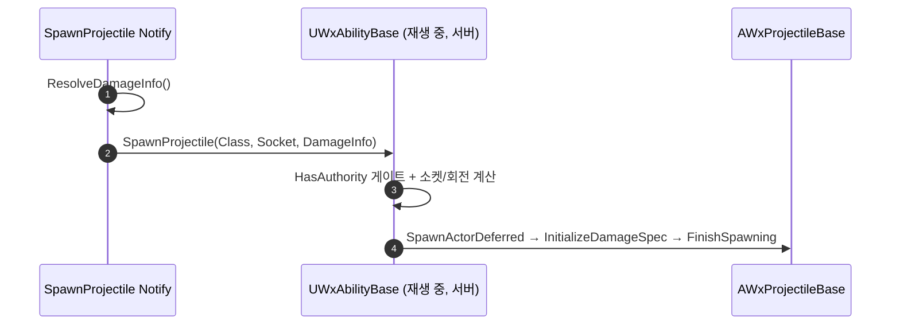

# WxAnimNotify_SpawnProjectile 게임 로직 이관 (재생 중 어빌리티로 위임)

## 계획

### 목표
프로세스형 노티파이 순차 이관의 일환. `WxAnimNotify_SpawnProjectile`이 직접 투사체 액터를 `SpawnActorDeferred`로 스폰하고 `InitializeDamageSpec`으로 데미지 스펙을 초기화하는 게임 로직을, 정착된 위임 패턴(`WxAnimNotify_FinisherDamage`)대로 재생 중인 어빌리티(서버 권위)로 옮기고 노티파이는 순수 위임만 남긴다. 투사체 스폰은 코스메틱이 아닌 서버 권위 게임플레이라 어빌리티가 소유처로 적합하다.

### 수정 범위
| 파일 | 수정할 내용 | 구분 |
|---|---|---|
| `WxCombat/.../Public/AbilitySystem/Ability/WxAbilityBase.h` | `class AWxProjectileBase;`·`struct FWxDamageInfo;` 전방선언, `SpawnProjectile(...)` 선언(public, `StartRecovery` 근처) | 수정 |
| `WxCombat/.../Private/AbilitySystem/Ability/WxAbilityBase.cpp` | `SpawnProjectile` 구현 + include(`Weapon/WxProjectileBase.h`, `Components/SkeletalMeshComponent.h`, `GameFramework/Pawn.h`, `Engine/World.h`) | 수정 |
| `WxCombat/.../Private/AnimNotify/WxAnimNotify_SpawnProjectile.cpp` | `Notify()`를 위임형으로 교체, 스폰/트랜스폼/authority·`WxProjectileBase.h` 제거 | 수정 |
| `WxCombat/.../Public/AnimNotify/WxAnimNotify_SpawnProjectile.h` | `// TODO: 게임 로직 이관 필요` 마커 제거, 클래스 주석에 위임 반영 | 수정 |

### 접근 방식
- **스폰 실행을 `UWxAbilityBase::SpawnProjectile(ProjectileClass, SpawnSocketName, DamageInfo)`로 이관**: `StartRecovery()`처럼 노티파이가 호출하는 베이스 유틸 메서드. `GetCurrentActorInfo()`에서 아바타+`SkeletalMeshComponent` 취득 → `Avatar->HasAuthority()` 게이트 → 소켓 위치+아바타 회전으로 `SpawnActorDeferred<AWxProjectileBase>` → `InitializeDamageSpec` → `FinishSpawning`. (기존 노티파이 로직을 그대로 이동, 소켓 해석원만 MeshComp→ActorInfo 메시)
- **노티파이는 순수 위임**: `GetAbilitySystemComponent(Owner)` → `Cast<UWxAbilityBase>(ASC->GetAnimatingAbility())` → `Ability->SpawnProjectile(...)`. 디자이너 저작 데이터(`ProjectileClass`/`SpawnSocketName`/`DamageDataRow`/`DamageInfo`)와 에디터 UX(`CanEditChange`/`ResolveDamageInfo`)는 유지.

---

## 완료

### 수정한 파일
| 파일 | 수정한 내용 | 구분 |
|---|---|---|
| `WxCombat/.../Public/AbilitySystem/Ability/WxAbilityBase.h` | `SpawnProjectile(...)` 선언 + `AWxProjectileBase`·`FWxDamageInfo` 전방선언 | 수정 |
| `WxCombat/.../Private/AbilitySystem/Ability/WxAbilityBase.cpp` | `SpawnProjectile` 구현(`GetCurrentActorInfo` 기반 서버 권위 Deferred 스폰) + include 4종 | 수정 |
| `WxCombat/.../Private/AnimNotify/WxAnimNotify_SpawnProjectile.cpp` | `Notify()`를 `GetAnimatingAbility`→`SpawnProjectile` 위임형으로 교체, 스폰/트랜스폼/authority·`WxProjectileBase.h` 제거 | 수정 |
| `WxCombat/.../Public/AnimNotify/WxAnimNotify_SpawnProjectile.h` | `// TODO` 마커 제거, 클래스 주석에 위임 반영 | 수정 |

### 구현·결정과 그 이유
- **어빌리티 베이스가 소유처**: 투사체는 서버 권위 데미지 액터라 코스메틱 컴포넌트가 아닌, 몽타주를 재생하는 어빌리티가 스폰 실행의 자연스러운 소유자다. `FinisherDamage`가 데미지 적용을 재생 어빌리티에 위임하는 것과 동형. `StartRecovery`처럼 노티파이가 호출하는 베이스 유틸로 배치했다(공격/스킬/패턴 등 다수 어빌리티가 투사체를 쏘므로 특정 서브클래스가 아닌 공통 베이스).
- **소켓 해석원을 ActorInfo 메시로**: 노티파이의 `MeshComp` 대신 `ActorInfo->SkeletalMeshComponent` 사용 — 캐릭터에선 몽타주 재생 메시와 동일해 동치이며, 노티파이가 트랜스폼 계산 없이 순수 위임(클래스·소켓·데미지만 전달)으로 남게 한다.
- **authority 게이트를 어빌리티로 이동**: 기존 노티파이의 `Owner->HasAuthority()`를 `Avatar->HasAuthority()`로 옮겼다. 서버 스폰·복제, 클라 예측 인스턴스 무동작 — 넷 동작 동치.

### 계획 대비 달라진 점
- 계획대로.

### 후속 과제
- 남은 프로세스형 노티파이 이관: SnapToTarget, AreaAttack, CameraMove.
- (미검증) 에디터 플레이에서 원거리 공격 몽타주로 투사체 스폰·데미지 적용·넷 동작(서버 스폰/클라 복제) 확인.
