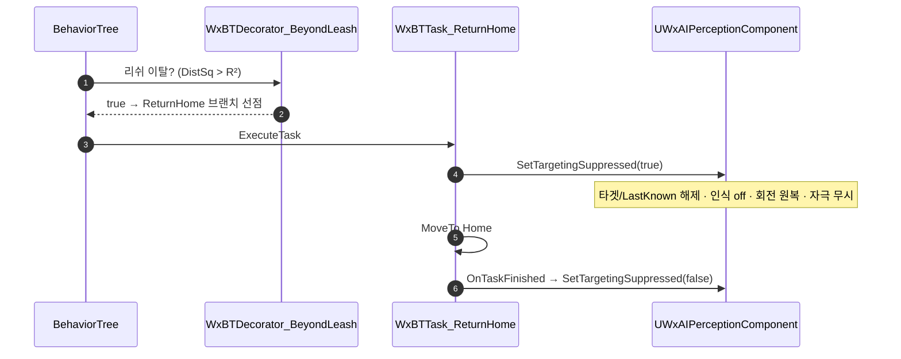

# 리쉬(복귀) 처리를 BT Task 방식으로 전환

## 계획

### 목표
"언제 추격을 포기하고 복귀하나"라는 리쉬 판정이 `UWxAIPerceptionComponent`의 1초 폴 타이머에 박혀 있어 감지와 행동 결정이 섞여 있고, 디자이너가 반경을 조율할 수 없다. 리쉬 **검출과 복귀를 모두 BT 노드**(Decorator 판정 + ReturnHome Task)로 옮겨 데이터 주도로 만들고, 퍼셉션은 순수 감지 + 인식 태그만 담당하게 한다.

### 수정 범위
| 파일 | 수정할 내용 | 구분 |
|---|---|---|
| `Plugins/WxAI/.../Public/WxBTDecorator_BeyondLeash.h` | 홈에서 LeashRadius 이탈 판정 조건 데코 | 신규 |
| `Plugins/WxAI/.../Private/WxBTDecorator_BeyondLeash.cpp` | 위 구현 | 신규 |
| `Plugins/WxAI/.../Public/WxBTTask_ReturnHome.h` | MoveTo(Home) 상속 + 타겟 억제 | 신규 |
| `Plugins/WxAI/.../Private/WxBTTask_ReturnHome.cpp` | 위 구현 | 신규 |
| `Plugins/WxAI/.../Public/WxAIPerceptionComponent.h` | 리쉬/폴 제거, 억제 API + 죽음 바인드 선언 | 수정 |
| `Plugins/WxAI/.../Private/WxAIPerceptionComponent.cpp` | 위 구현 | 수정 |
| `Source/WxGame/Controller/WxEnemyController.cpp` | OnPossess/OnUnPossess 죽음 바인드 | 수정 |
| `Plugins/WxAI/README.md` | 책임 이동 반영(경량) | 수정 |

### 접근 방식
- **리쉬 판정 = Decorator**: `WxBTDecorator_BeyondLeash`가 `DistSq(Pawn, HomeLocation) > LeashRadius²`이면 true. BB 접근은 `WxBlackboardKeys::GetHomeLocation` 경유. `LeashRadius`(기본 3000)를 데코 프로퍼티로 두어 디자이너가 BT에서 조율.
- **복귀 = ReturnHome Task**: `UBTTask_MoveTo` 상속(Patrol 패턴). 진입 시 퍼셉션에 `SetTargetingSuppressed(true)`(타겟/LastKnown 해제 + 재감지 억제 + 인식 off + 회전 원복) 후 `MoveTo Home`. 종료 시 억제 해제. 퍼셉션은 `AIController->GetPerceptionComponent()` 캐스트로 획득(WxGame 컨트롤러 타입 비참조).
- **퍼셉션 리팩터**: `LeashRadius`·폴 타이머·리쉬 분기 제거. `bTargetingSuppressed` 플래그로 억제(HandleTargetPerceptionUpdated 최상단 가드). 폴 제거로 사라지는 "죽음 시 인식 off"는 ASC `State_Dead` 태그 이벤트 구독(`HandleDeathTagChanged`)으로 대체 — 바인드는 컨트롤러 `OnPossess`에서(빙의 후 ASC 확정).

---

## 완료

### 수정한 파일
| 파일 | 수정한 내용 | 구분 |
|---|---|---|
| `Plugins/WxAI/.../WxBTDecorator_BeyondLeash.h`/`.cpp` | 홈에서 LeashRadius 이탈 판정 조건 데코 | 신규 |
| `Plugins/WxAI/.../WxBTTask_ReturnHome.h`/`.cpp` | MoveTo(Home) 상속 + 진입/종료 시 퍼셉션 억제 토글 + 속도 배율 | 신규 |
| `Plugins/WxAI/.../WxAIPerceptionComponent.h`/`.cpp` | `LeashRadius`·`LeashTimerHandle`·폴(BeginPlay)·리쉬 분기 제거; `bTargetingSuppressed`+`SetTargetingSuppressed`, 사망 태그 구독(`BindOwnerDeath`/`UnbindOwnerDeath`/`HandleDeathTagChanged`) 추가 | 수정 |
| `Source/WxGame/Controller/WxEnemyController.cpp` | `OnPossess`→`BindOwnerDeath`, `OnUnPossess`→`UnbindOwnerDeath` | 수정 |
| `Plugins/WxAI/README.md` | 리쉬 책임 이동 반영(담당 목록·핵심 타입 표) | 수정 |

### 구현·결정과 그 이유
- **리쉬 판정=Decorator / 복귀=Task 분리**: 판정(`BeyondLeash`)은 순수 조건 노드로 두고 상태 변경(타겟 해제)은 실행 노드(`ReturnHome`)가 소유. 데코에 부작용을 넣지 않아 관용 패턴을 지킴. LeashRadius(기본 3000)를 데코 프로퍼티로 옮겨 디자이너가 BT에서 조율(데이터 주도).
- **억제(`bTargetingSuppressed`) 도입 이유**: 퍼셉션에서 리쉬를 걷어내면 복귀 중 시야 내 플레이어를 재감지해 재-어그로/strafe 회전이 튀는 회귀가 생긴다. 복귀 Task가 진입 시 억제를 켜 자극을 무시하게 하고 종료 시 해제 → "리쉬 밖에선 재-어그로 안 함" 기존 거동을 정확히 보존. 퍼셉션에 리쉬 로직을 되돌리지 않는 좁은 신호.
- **사망 인식 해제를 이벤트로 대체**: 폴 타이머가 하던 "시체 위 State.InCombat 잔존 방지"를 없애면 안 되므로, ASC `State.Dead` 태그 이벤트(`RegisterGameplayTagEvent`)를 구독해 사망 시 1회 정리. 폴 전면 제거의 유일한 대가였고, 이벤트化가 더 깔끔.
- **바인드 시점=컨트롤러 OnPossess**: 퍼셉션 `BeginPlay`엔 빙의 전이라 ASC 미확정 가능. 기존 `ApplySenseSettings`와 동일하게 빙의 후 지점에서 바인드. 억제 플래그와 사망 정리는 플래그를 공유하지 않아 경합 없음.
- **퍼셉션 획득은 캐스트로**: Task가 `AIController->GetPerceptionComponent()`를 `UWxAIPerceptionComponent`로 캐스트(`OnRegister`가 컨트롤러에 자신을 등록) → WxGame 컨트롤러 타입 비참조로 플러그인 의존 방향 보존.

### 계획 대비 달라진 점
- 계획대로. (퍼셉션 `BeginPlay` 오버라이드는 폴 제거로 빈 껍데기가 되어 제거, `EndPlay`는 타이머 해제 대신 `UnbindOwnerDeath` 안전망으로 재활용 — 계획에 함축돼 있던 정리.)

### 후속 과제
- **BT 에셋 배선(에디터, 사용자)**: 리쉬 필요한 BT(`BT_Enemy`/`BT_Enemy1`/`BT_Enemy2`/`BT_Boss`/`BT_Gunman` 등)의 루트 Selector 최상위에 `[BeyondLeash]→ReturnHome` 브랜치 추가, 데코 `FlowAbortMode`=Lower Priority 설정(Self/Both 는 복귀 중 자기중단→경계 왕복을 유발하므로 금지). `.uasset`은 코드로 편집 불가.
- **플레이 검증**: 어그로 유인→리쉬 밖→복귀·인식 off·재-어그로 억제·홈 도착 후 재전투, 전투 중 사망→인식 즉시 해제 확인.
- 빌드: WxEditor(Development) 컴파일·링크 성공(신규 3소스 포함).
