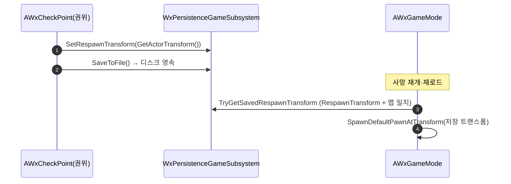

# 체크포인트 부활 — PlayerStartTag → 체크포인트 트랜스폼 통합

## 계획

### 목표
부활 좌표 소스가 태그(체크포인트)와 트랜스폼(명시 저장) 두 갈래로 나뉜 것을 하나로 통일한다. 종료·사망 모두 마지막 체크포인트에서 재개하도록 하고("그 자리 재개" 제거), 저장되는 부활 정체성을 `FName PlayerStartTag` → `FTransform RespawnTransform`(SaveGame 최상위)으로 바꿔 태그 파이프라인·`APlayerStart` 상속·`FlushPlayerTransform`·캡처 게이트를 걷어낸다.

### 수정 범위
| 파일 | 수정할 내용 | 구분 |
|---|---|---|
| `Plugins/WxSave/.../Public/WxPersistenceSaveGame.h` | `TravelData.PlayerTransform` 제거, 최상위 `PlayerStartTag`(FName) → `RespawnTransform`(FTransform, Identity=미설정) 교체 | 수정 |
| `Plugins/WxSave/.../WxPersistenceGameSubsystem.h/.cpp` | `Set/GetPlayerStartTag` → `Set/GetRespawnTransform`. `SaveToFile` 슬롯 재지정 유지·캡처 게이트 인자 제거. Dump/LogSaveState 갱신 | 수정 |
| `Plugins/WxSave/.../WxPersistenceWorldSubsystem.h/.cpp` | `RequestSaveFlush` 의 `bCapturePlayerTransform` 인자·`FlushPlayerTransform()` 제거. `FlushMapTravelData` 주석 갱신 | 수정 |
| `Source/WxGame/Framework/WxGameMode.h/.cpp` | `TryGetSavedPlayerTransform`→`TryGetSavedRespawnTransform` 리네임, 읽기 소스 `RespawnTransform`. 맵 게이트(`TravelData.Map`) 유지 | 수정 |
| `Source/WxGame/Framework/WxPlayerSpawningComponent.h/.cpp` | `FindPlayerStartByTag` + `ChoosePlayerStart` 태그 분기 제거. PIE→기본시작 체크포인트→nullptr 흐름만 유지 | 수정 |
| `Source/WxGame/WorldObject/WxCheckPoint.h/.cpp` | 베이스 `APlayerStart`→`AActor`(SceneRoot 명시). `HandleInteracted` 가 `SetRespawnTransform(GetActorTransform())`. CheckForErrors/PostDuplicate 의 태그 부분 제거, bIsDefaultStart 부분 유지 | 수정 |

### 접근 방식
- **정체성을 좌표로**: 저장되는 부활 정체성을 FName 태그 → FTransform 으로 바꾸고, 부활 경로를 `ChoosePlayerStart+FindPlayerStartByTag` 대신 기존 `SpawnDefaultPawnAtTransform` 하나로 통일.
- **최상위 필드로 flush 회피**: `RespawnTransform` 을 `PlayerStartTag` 처럼 SaveGame 최상위(TravelData 밖)에 둬 `FlushMapTravelData` 재구성에 지워지지 않게 하고, 체크포인트가 `SaveToFile()` 전에 직접 세팅.
- **`bIsDefaultStart` 유지**: 신규 세션(RespawnTransform=Identity) 시작 지점 결정은 `ChoosePlayerStart` 가 담당. 부활 위치는 `SpawnDefaultPawnAtTransform` 전담.

---

## 완료

### 수정한 파일
| 파일 | 수정한 내용 | 구분 |
|---|---|---|
| `Plugins/WxSave/.../Public/WxPersistenceSaveGame.h` | `TravelData.PlayerTransform` 제거, 최상위 `PlayerStartTag`(FName) → `RespawnTransform`(FTransform, Identity=미설정) | 수정 |
| `Plugins/WxSave/.../WxPersistenceWorldSubsystem.h/.cpp` | `RequestSaveFlush` 의 `bCapturePlayerTransform` 인자·`FlushPlayerTransform()` 제거, `FlushMapTravelData` 주석 갱신 | 수정 |
| `Plugins/WxSave/.../WxPersistenceGameSubsystem.h/.cpp` | `Set/GetPlayerStartTag` → `Set/GetRespawnTransform`, `SaveToFile` 캡처 게이트 제거, `Wx.Save.Dump` 갱신 | 수정 |
| `Plugins/WxCore/.../WxGameplayTags.h/.cpp` | `Gimmick.CheckPoint.Unlit`·`Gimmick.CheckPoint.Lit` 태그 추가 | 수정 |
| `Source/WxGame/Framework/WxGameMode.h/.cpp` | `TryGetSavedPlayerTransform` → `TryGetSavedRespawnTransform`, 읽기 소스 `RespawnTransform`(맵 게이트는 `TravelData.Map` 유지) | 수정 |
| `Source/WxGame/Framework/WxPlayerSpawningComponent.h/.cpp` | `FindPlayerStartByTag` + `ChoosePlayerStart` 태그 분기 제거(신규 세션 `bIsDefaultStart` 만 담당) | 수정 |
| `Source/WxGame/WorldObject/WxCheckPoint.h/.cpp` | 부모 `APlayerStart` → `AWxGimmick`. 상호작용 시 `CommitGimmickState(Lit)` + `SetRespawnTransform(자기 트랜스폼)`. 태그 검증 제거·`bIsDefaultStart` 검증 유지 | 수정 |

### 구현·결정과 그 이유
- **정체성을 좌표로**: 부활 정체성을 FName 태그 → FTransform 으로 바꾸고 부활 경로를 기존 `SpawnDefaultPawnAtTransform` 하나로 통일. `RespawnTransform` 을 SaveGame 최상위에 둬 `FlushMapTravelData` 재구성에 지워지지 않게 하고 체크포인트가 직접 세팅한다.
- **부모를 AWxGimmick 으로(사용자 지시)**: 원래 "상태 없는 반복 효과"라 기믹 인프라를 피했으나, 사용자 요청으로 기믹 자식으로 전환. SceneRoot·복제·IWxSavable·WxSaveId 베이킹을 베이스에서 상속하고, 컴포넌트는 `SceneRoot` 에 부착(생성자에서 `bReplicates`·루트 생성 불필요).
- **불 켜짐 지속 상태**: 상호작용 시 `CommitGimmickState(Gimmick.CheckPoint.Lit)`. State 는 복제 + SaveGame 이라 재로드 후에도 Lit 유지. 비주얼은 GimmickStateTree 몫(ST 에셋 미할당 시 State 만 지속, 비주얼 없음).
- **신규 세션 스폰 분리**: 부활 위치는 `SpawnDefaultPawnAtTransform`(RespawnTransform), 최초 시작지점은 `ChoosePlayerStart`(bIsDefaultStart 체크포인트)로 명확히 분담. 사망 재개는 체크포인트가 쓴 RespawnTransform 으로 자연 폴백.
- **빌드 검증**: WxEditor(Development) `Result: Succeeded`(WxCore/WxSave/WxGame 재컴파일·링크 확인).

### 계획 대비 달라진 점
- 승인 계획은 베이스를 `AActor` 로 강등했으나, 구현 중 사용자 지시로 **`AWxGimmick`** 으로 변경.
- 계획에 없던 **지속 상태(Unlit→Lit) + 신규 GameplayTag 2개**를 추가(사용자 선택 "지속 상태 추가").

### 후속 과제
- **배치 BP 인스턴스 재검증(에디터)**: `APlayerStart`→`AWxGimmick` 재부모화로 루트가 Capsule→SceneRoot 로 바뀐다. 배치된 체크포인트 BP 의 메시/상호작용 볼륨 위치·계층 확인 필요.
- **기존 배치 인스턴스 WxSaveId**: 리페어런트 전에 배치된 인스턴스는 WxSaveId 가 비어(PostActorCreated 미재실행) Lit 상태가 슬롯에 안 남을 수 있다. 부활 위치(RespawnTransform)는 영향 없음. 필요 시 재배치/재저장으로 GUID 부여.
- **불 켜짐 ST 에셋**: Lit 상태 비주얼(불 파티클 등)을 적용할 GimmickStateTree(ST) 에셋을 체크포인트 BP 에 할당(디자이너).
- **PIE 수동 검증**: 신규 세션 시작지점 / 체크포인트 A→이동→사망→A 부활 / A→B 후 B 부활 / 메뉴 저장→재로드 재개 / Lit 지속.
