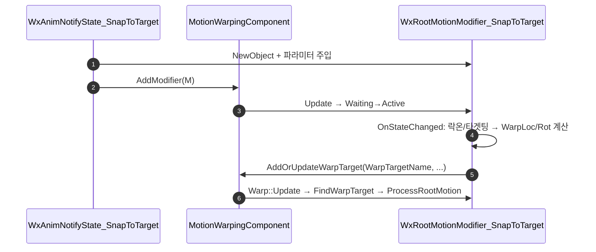

# SnapToTarget 게임 로직을 커스텀 RootMotionModifier로 이관

## 계획

### 목표
`UWxAnimNotifyState_SnapToTarget`의 `// TODO: 게임 로직 이관`을 처리한다. 노티파이가 `NotifyBegin`/`NotifyEnd`에서 직접 하던 락온·타겟팅 조회와 SkewWarp 등록을 커스텀 RootMotionModifier로 옮겨, 엔진 순정 MotionWarp처럼 "로직은 modifier, 노티파이는 등록만" 구조로 만든다. 단 노티파이 클래스·파라미터·디테일 패널은 이전과 동일하게 유지해 기획자 사용법을 보존한다.

### 수정 범위
| 파일 | 수정할 내용 | 구분 |
|---|---|---|
| `WxCombat/.../Public/Targeting/WxRootMotionModifier_SnapToTarget.h` | `URootMotionModifier_SkewWarp` 상속 커스텀 modifier 선언. `TargetingPreset`·`MinDistance` UPROPERTY, `OnStateChanged` override | 신규 |
| `WxCombat/.../Private/Targeting/WxRootMotionModifier_SnapToTarget.cpp` | Active 진입 시 락온·타겟팅으로 타겟 결정 → 방향/거리 계산 → 플레이어 폰 게이팅 → `AddOrUpdateWarpTargetFromLocationAndRotation` | 신규 |
| `WxCombat/.../Public/AnimNotify/WxAnimNotifyState_SnapToTarget.h` | 클래스·상속·파라미터 유지. `DefaultWarpTargetName` 유지 | 수정 |
| `WxCombat/.../Private/AnimNotify/WxAnimNotifyState_SnapToTarget.cpp` | `NotifyBegin`을 modifier 생성·주입·`AddModifier`로 축소. `NotifyEnd` tail은 `bSubtractRemainingRootMotion`으로 통합 후 제거 | 수정 |

### 접근 방식
- **노티파이 = 얇은 등록**: `NotifyBegin`은 `NewObject<UWxRootMotionModifier_SnapToTarget>(MotionWarpingComp)` → 파라미터 주입(`bSnapLocation`→`bWarpTranslation` 등, `WarpTargetName`="SnapToTarget", `RotationType=Default`, `bSubtractRemainingRootMotion=true`) → `AddModifier`. 현행 `AddRootMotionModifierSkewWarp` 진입점과 동형.
- **로직 = modifier**: 컴포넌트가 modifier를 Waiting→Active 전이시킬 때 `OnStateChanged`에서 타겟을 결정하고 워프 타겟을 컴포넌트에 등록. 부모 `URootMotionModifier_Warp::Update`가 같은 `WarpTargetName`으로 픽업해 루트모션 보정.
- **네트워크**: modifier 로컬 실행 + 플레이어 폰 게이팅 유지로 현행 MP 동작 보존. authority 게이트 없음(현행 유지).

---

## 완료

### 수정한 파일
| 파일 | 수정한 내용 | 구분 |
|---|---|---|
| `WxCombat.Build.cs` | `MotionWarping`을 Private→Public 의존으로 이동 | 수정 |
| `Public/Targeting/WxRootMotionModifier_SnapToTarget.h` | `URootMotionModifier_SkewWarp` 상속 modifier 선언(`TargetingPreset`·`MinDistance` 주입 프로퍼티) | 신규 |
| `Private/Targeting/WxRootMotionModifier_SnapToTarget.cpp` | `OnStateChanged`(Active)에서 락온·타겟팅 판정 → 방향/거리 계산 → 플레이어 폰 게이팅 → 워프 타겟 등록 | 신규 |
| `Public/AnimNotify/WxAnimNotifyState_SnapToTarget.h` | `NotifyEnd` 선언 제거, 클래스·상속·직속 파라미터 유지 | 수정 |
| `Private/AnimNotify/WxAnimNotifyState_SnapToTarget.cpp` | `NotifyBegin`을 modifier 구성·`AddModifier`로 축소, `NotifyEnd` 제거 | 수정 |

### 구현·결정과 그 이유
- **로직을 modifier의 `OnStateChanged`(Active)에 배치**: 부모 `Warp::Update`의 `FindWarpTarget`이 픽업하려면 워프 타겟이 modifier Active 시점에 컴포넌트에 있어야 한다. `Super`를 먼저 호출한 뒤 Active 진입 프레임에 등록해 같은 Update 사이클에서 픽업되도록 순서를 맞췄다.
- **파라미터는 노티파이 직속 유지 + modifier에 런타임 주입**: 기획자 UX(디테일 패널·몽타주 배치·직렬화)를 이전과 동일하게 보존하기 위함. modifier의 `TargetingPreset`·`MinDistance`는 `UPROPERTY()`로 에디터 비노출.
- **tail hold를 `bSubtractRemainingRootMotion`으로 통합**: 별도 `NotifyEnd` 워프 대신 부모의 잔여 루트모션 보정을 써서 노티파이를 얇게 유지.

### 계획 대비 달라진 점
- **`MotionWarping`을 Private→Public 의존으로 이동**: 계획은 "모듈 의존 추가 불필요"였으나, 커스텀 modifier의 **Public 헤더**가 `URootMotionModifier_SkewWarp` 헤더를 include(상속)하므로 Public 의존이 필요했다. 프로젝트가 Public-only 헤더 스타일이라 modifier를 Private 헤더로 두는 대안은 배제.

### 후속 과제
- **동작 검증 미완(중요)**: 컴파일만 확인했다. PIE에서 ①락온 대상 위치·회전 스냅, ②락온 없는 플레이어의 회전-only 게이팅, ③노티 종료 후 타겟 너머 밀림 억제를 실측해야 한다. 특히 `bSubtractRemainingRootMotion`이 기존 `NotifyEnd` tail hold(종료 시점 위치 hold)와 동등한지 확인이 필요하며, 다르면 modifier 내 별도 처리로 조정한다.
