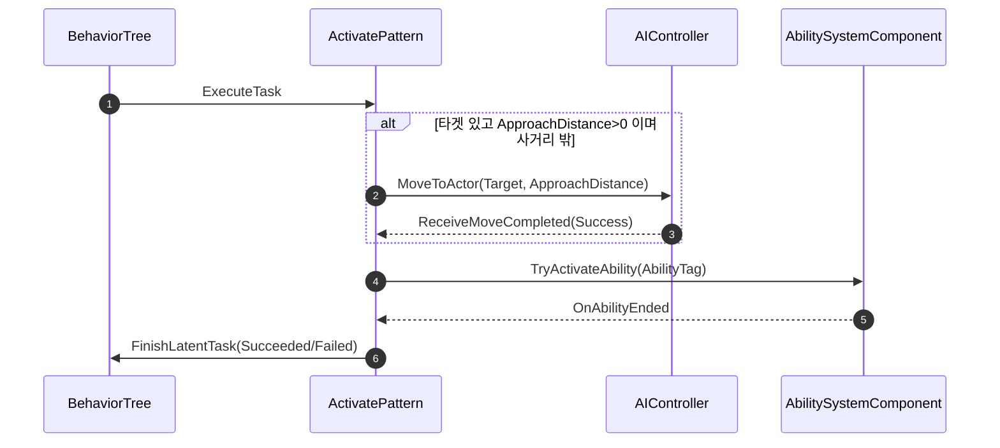

# ActivatePattern BT Task (접근 이동 + 어빌리티 발동)

## 계획

### 목표
적 패턴 발동이 대개 "사정거리만큼 접근 후 해당 어빌리티 발동"인 점을 하나의 BT Task로 묶는다. 기존 `WxBTTask_ActivateAbility`(발동 전용)는 그대로 두고, 접근 거리를 옵션으로 노출한 신규 `WxBTTask_ActivatePattern`을 추가한다.

### 수정 범위
| 파일 | 수정할 내용 | 구분 |
|---|---|---|
| `Plugins/WxAI/Source/WxAI/Public/WxBTTask_ActivatePattern.h` | `UBTTaskNode` 직접 상속 독립 Task 선언 | 신규 |
| `Plugins/WxAI/Source/WxAI/Private/WxBTTask_ActivatePattern.cpp` | 접근 이동(MoveToActor) + 자기완결 어빌리티 발동 구현 | 신규 |

### 접근 방식
- **독립 Task**: `WxBTTask_ActivateAbility`를 상속하지 않고 `UBTTaskNode`를 직접 상속. 발동 로직은 이 Task 안에 자기완결로 구현(기존 클래스와 상속 결합 없음).
- **이동**: `AAIController::MoveToActor(Target, AcceptanceRadius = ApproachDistance)`로 경로/도착을 엔진에 위임, `ReceiveMoveCompleted` 델리게이트로 완료 수신. 타겟은 Blackboard `TargetActor`.
- **발동**: ASC에서 `AbilityTag` 매칭 스펙 → `TryActivateAbility` → 동기 종료 가드 → `OnAbilityEnded` → `FinishLatentTask`.
- **게이팅**: `ApproachDistance <= 0` 또는 타겟 없음이면 이동 생략 즉시 발동. `AlreadyAtGoal`도 즉시 발동.
- **abort**: 이동 페이즈면 언바인드+`StopMovement` 후 `Aborted`, 발동 페이즈면 `CancelAbilities(AbilityTag)`.

---

## 완료

### 수정한 파일
| 파일 | 수정한 내용 | 구분 |
|---|---|---|
| `Plugins/WxAI/Source/WxAI/Public/WxBTTask_ActivatePattern.h` | `UBTTaskNode` 직접 상속 독립 Task 선언 (`AbilityTag`, `ApproachDistance`) | 신규 |
| `Plugins/WxAI/Source/WxAI/Private/WxBTTask_ActivatePattern.cpp` | 접근 이동(`MoveTo`) + 자기완결 어빌리티 발동/abort 구현 | 신규 |

### 구현·결정과 그 이유
- **독립 Task(상속 없음)**: `WxBTTask_ActivateAbility`를 상속하지 않고 발동 로직을 자기완결로 재구현. 두 Task 간 상속 결합을 두지 않기로 함.
- **이동 API는 `MoveTo(FAIMoveRequest)`**: `MoveToActor`는 `EPathFollowingRequestResult::Type`만 반환해 `MoveId`를 못 얻는다. 본 Task 요청 이동만 완료 콜백에서 걸러내려면 `MoveId`가 필요해 코드+MoveId를 함께 돌려주는 `MoveTo(FAIMoveRequest)`를 사용.
- **이동/발동 2페이즈 상태를 `bMovePhaseActive`로 구분**: abort가 이동 중이면 `StopMovement`, 발동 중이면 `CancelAbilities(AbilityTag)`로 갈라지게 함.
- **동기 종료 가드 이식**: `TryActivateAbility` 직후 `!Spec->IsActive()`면 Failed 반환 — 발동 즉시 종료 시 델리게이트 콜백이 안 와 InProgress 영구정지하는 것을 막음(기존 ActivateAbility와 동일).

### 계획 대비 달라진 점
- 이동 호출을 계획의 `MoveToActor` → `MoveTo(FAIMoveRequest)`로 변경(MoveId 확보 목적).
- 헤더에 `Navigation/PathFollowingComponent.h` include 추가(`EPathFollowingResult`는 `AITypes.h`가 아니라 여기에 선언됨 — 빌드 에러로 확인).

### 후속 과제
- 원거리 카이팅(너무 가까우면 벌리기)은 본 Task 범위 밖 — 필요 시 별도 리프로.
- 에디터 인게임 동작 확인(접근 후 발동 / 사거리 내 즉시 발동 / 이동 중 인터럽트 abort)은 미실시.
