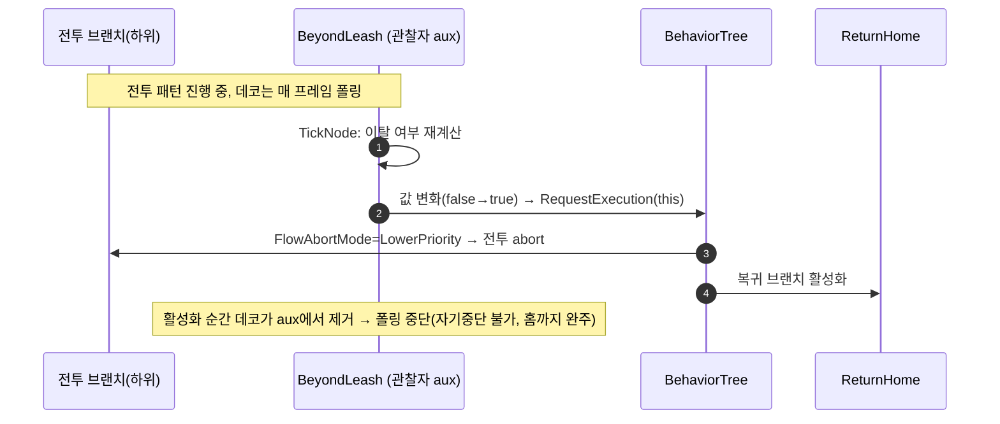

# 리시 데코를 자가 폴링 관찰자로 (전투 패턴 중 실시간 abort)

## 계획

### 목표
전투에 진입한 적이 현재 공격 패턴 Sequence가 끝나기 전까지는 리시를 벗어나도 복귀하지 않는 증상을 없앤다. 원인은 이탈 판정 데코(`UWxBTDecorator_BeyondLeash`)가 폰-홈 거리를 직접 계산하는데 이를 관찰해 트리 재평가를 촉발할 트리거가 없어, Selector가 루트부터 다시 훑는 패턴 종료 시점에만 리시가 걸리기 때문이다. 데코를 매 프레임 자가 폴링하는 관찰자로 만들어 전투 패턴 도중에도 이탈 즉시 전투를 abort하고 복귀시킨다.

### 수정 범위
| 파일 | 수정할 내용 | 구분 |
|---|---|---|
| `Plugins/WxAI/.../Public/WxBTDecorator_BeyondLeash.h` | 오버라이드 3개(`GetInstanceMemorySize`/`OnBecomeRelevant`/`TickNode`) 선언, 클래스 주석 정정 | 수정 |
| `Plugins/WxAI/.../Private/WxBTDecorator_BeyondLeash.cpp` | 생성자 알림 플래그·기본 FlowAbortMode, 노드 메모리, 자가 폴링 구현, `GetStaticDescription` Super 체이닝 | 수정 |
| `.claude/worklog/2026-07-13-리쉬-복귀-BT-Task-전환.md` | 후속 과제의 `FlowAbortMode=Lower Priority/Both` → `Lower Priority` 정정 | 수정 |

`CalculateRawConditionValue` 판정 로직, `ReturnHome`·퍼셉션·블랙보드·컨트롤러, 전투 데코의 abort 모드, `LeashRadius` 값은 건드리지 않는다.

### 접근 방식
- **엔진 관용 패턴 채택**: `UBTDecorator_ConeCheck`(UE 5.8 소스 대조)와 동일하게, 거리처럼 블랙보드 밖 상태를 판정하는 데코를 관찰자로 만든다. 생성자에서 `INIT_DECORATOR_NODE_NOTIFY_FLAGS()`로 오버라이드를 감지해 `bNotifyTick`/`bNotifyBecomeRelevant`를 켜고, 노드 인스턴스 메모리에 직전 이탈 여부(`bWasBeyond`)를 폰별로 보관한다.
- **엣지에서만 재평가 요청**: `OnBecomeRelevant`에서 현재 이탈 여부를 시드하고, `TickNode`에서 재계산해 값이 바뀌는 프레임에만 `RequestExecution(this)`을 호출한다. 실제 abort 여부·방향은 엔진이 데코의 FlowAbortMode로 판단한다.
- **Lower Priority 전용**: FlowAbortMode가 Lower Priority면 전투 중엔 데코가 관찰자 aux로 등록돼 폴링하다가 이탈 시 하위 전투를 선점하고, 복귀 브랜치가 활성화되는 순간 엔진이 이 데코를 aux에서 제거해 폴링이 멈추므로 자기중단 없이 홈까지 완주한다. Self/Both면 복귀 중에도 폴링이 계속돼 반경 재진입 순간 자기중단→재-어그로→경계 왕복이 생기므로 금지한다. 코드는 새 배치 기본값만 Lower Priority로 인코딩하고, 기존 `.uasset` 데코의 FlowAbortMode 지정은 에디터에서 사용자가 확인한다(코드로 편집 불가).

---

## 완료

### 수정한 파일
| 파일 | 수정한 내용 | 구분 |
|---|---|---|
| `Plugins/WxAI/.../WxBTDecorator_BeyondLeash.h`/`.cpp` | 자가 폴링 관찰자로 전환(`INIT_DECORATOR_NODE_NOTIFY_FLAGS`·노드 메모리·`OnBecomeRelevant`/`TickNode`), 기본 `FlowAbortMode=LowerPriority`, `GetStaticDescription` Super 체이닝, 클래스 주석 정정 | 수정 |
| `.claude/worklog/2026-07-13-리쉬-복귀-BT-Task-전환.md` | 후속 과제의 FlowAbortMode 안내에서 Both 제거(Lower Priority 단독) | 수정 |

### 구현·결정과 그 이유
- **자가 폴링 관찰자로 전환(핵심)**: 이탈 판정이 블랙보드 밖 상태(폰-홈 거리)라 관찰 트리거가 없어, 엔진 `UBTDecorator_ConeCheck`와 동일하게 관찰자로 등록된 동안 매 틱 폴링하고 값이 바뀌는 엣지에서만 `RequestExecution`으로 재평가를 능동 유발한다. 이게 전투 패턴이 끝나기 전에도 리시가 걸리게 하는 유일한 지점이다.
- **알림 플래그는 매크로로**: 수동 `bNotifyTick` 대신 `INIT_DECORATOR_NODE_NOTIFY_FLAGS()`가 오버라이드를 감지해 플래그를 설정한다(5.8 정본, ConeCheck/BlackboardBase 공통). 오버라이드-플래그 불일치를 원천 차단.
- **노드 메모리(인스턴싱 아님)**: 폰별로 직전 이탈 여부 한 bit만 필요해 `bCreateNodeInstance`(UObject 인스턴싱) 대신 경량 노드 메모리를 쓴다. 엔진 zero-init + `OnBecomeRelevant` 시드라 별도 Init/Cleanup·`OnCeaseRelevant`가 불필요.
- **Lower Priority 전용**: 복귀 브랜치가 활성화되는 순간 엔진이 LowerPriority 데코를 aux에서 제거해 폴링이 멈추므로, 복귀 중 자기중단이 원천 불가능해 홈까지 완주한다. Self/Both는 복귀 중에도 폴링해 반경 재진입 순간 자기중단→재-어그로→경계 왕복을 부른다. 코드는 새 배치 기본값만 인코딩하고, 기존 `.uasset`은 직렬화값을 유지하므로 에디터 확인이 필요하다.
- **`GetStaticDescription` Super 체이닝**: 노드에 abort 모드/반전 주석이 함께 표시돼 FlowAbortMode 배선을 눈으로 확인할 수 있다(컨벤션도 충족).

### 계획 대비 달라진 점
- 계획대로. (설계를 프로젝트가 참조하는 UE 5.8 엔진 소스와 대조 검증 후 착수했다.)

### 후속 과제
- **에셋 설정(사용자, 필수)**: `BT_Enemy`(및 리시 쓰는 다른 BT)의 `Beyond Leash` 데코 `FlowAbortMode`를 에디터에서 **Lower Priority**로 지정한다(현재 None이라 전투 중 abort가 안 걸림). 코드 기본값은 새로 배치하는 데코에만 적용된다.
- **플레이 검증(사용자)**: 전투/패턴 중 리시 밖으로 유인 → 패턴 종료 전 즉시 복귀, 복귀 완주(경계 왕복 없음), 홈 도착 후 재전투 확인.
- 빌드: WxEditor(Development) 성공. 변경 파일이 비유니티로 컴파일되고 WxAI 링크 성공(내 코드발 경고 없음).

