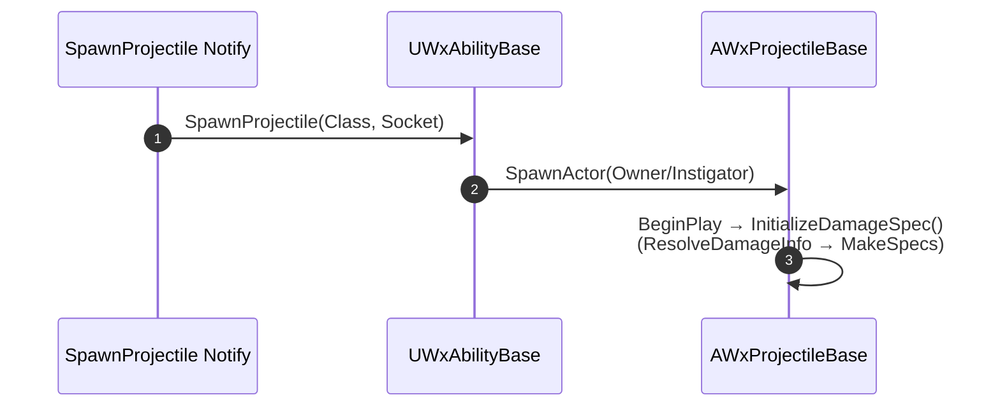

# WxProjectile이 대미지 데이터를 직접 소유하도록 이관

## 계획

### 목표
투사체 대미지 데이터(`DamageDataRow`/`DamageInfo`)의 저작 주체를 `WxAnimNotify_SpawnProjectile`에서 투사체(`AWxProjectileBase`) 자신으로 옮긴다. 데이터가 스폰 시점에 클래스 디폴트로 존재하게 되어, 외부 주입용 Deferred 스폰 + `InitializeDamageSpec(DamageInfo)` 기계 장치가 불필요해지므로 함께 정리한다.

### 수정 범위
| 파일 | 수정할 내용 | 구분 |
|---|---|---|
| `WxCombat/.../Public/Weapon/WxProjectileBase.h` | `DamageDataRow`·`DamageInfo` 멤버 추가, `InitializeDamageSpec()` 무인자 private화, `ResolveDamageInfo()`·`CanEditChange` 선언 추가, doc 주석 갱신 | 수정 |
| `WxCombat/.../Private/Weapon/WxProjectileBase.cpp` | `BeginPlay`에서 `InitializeDamageSpec()` 호출, `ResolveDamageInfo`/`CanEditChange` 구현, `WxDamageTableRow.h` include | 수정 |
| `WxCombat/.../Public/AbilitySystem/Ability/WxAbilityBase.h` | `SpawnProjectile`에서 `FWxDamageInfo` 인자 제거, 전방선언·doc 주석 정리 | 수정 |
| `WxCombat/.../Private/AbilitySystem/Ability/WxAbilityBase.cpp` | Deferred 3단계 → 정상 `SpawnActor` 1회로 교체 | 수정 |
| `WxCombat/.../Public/AnimNotify/WxAnimNotify_SpawnProjectile.h` | `DamageDataRow`·`DamageInfo`·`ResolveDamageInfo`·`CanEditChange` 제거, include·doc 주석 정리 | 수정 |
| `WxCombat/.../Private/AnimNotify/WxAnimNotify_SpawnProjectile.cpp` | `Notify`를 3인자→2인자 위임으로 축소, 대미지 관련 코드·include 제거 | 수정 |

### 접근 방식
- **데이터 소유권 이전**: 대미지 저작 변수를 투사체 멤버로 옮기고, 대미지 확정(`ResolveDamageInfo`)·에디터 UX(`CanEditChange`)도 함께 이동. 노티파이는 "무엇을 어디서 스폰할지"(`ProjectileClass`/`SpawnSocketName`)만 남긴다.
- **스폰 단순화**: 데이터가 스폰 즉시 유효하므로 어빌리티는 정상 `SpawnActor`로 스폰하고, 투사체는 `BeginPlay`에서 자기 데이터로 Spec을 생성. Owner/Instigator는 스폰 시 세팅되어 `GetInstigator()`/`GetAnimatingAbility()`가 종전과 동일하게 유효.

---

## 완료

### 수정한 파일
| 파일 | 수정한 내용 | 구분 |
|---|---|---|
| `WxCombat/.../Public/Weapon/WxProjectileBase.h` | `DamageDataRow` 멤버 추가, `InitializeDamageSpec()` 무인자 private화, `Engine/DataTable.h` include, doc 주석 갱신 | 수정 |
| `WxCombat/.../Private/Weapon/WxProjectileBase.cpp` | `BeginPlay`에서 `InitializeDamageSpec()` 호출, Row→`ApplyTableRow`→`MakeSpecs` 인라인, `WxDamageTableRow.h` include | 수정 |
| `WxCombat/.../Public/AbilitySystem/Ability/WxAbilityBase.h` | `SpawnProjectile`에서 `FWxDamageInfo` 인자·전방선언 제거, doc 주석 정리 | 수정 |
| `WxCombat/.../Private/AbilitySystem/Ability/WxAbilityBase.cpp` | Deferred 3단계 → `SpawnActor` 1회 | 수정 |
| `WxCombat/.../Public/AnimNotify/WxAnimNotify_SpawnProjectile.h` | `DamageDataRow`·`DamageInfo`·`ResolveDamageInfo`·`CanEditChange` 제거, include·doc 주석 정리 | 수정 |
| `WxCombat/.../Private/AnimNotify/WxAnimNotify_SpawnProjectile.cpp` | `Notify` 2인자 위임으로 축소, 대미지 코드·include 제거 | 수정 |
| `WxCombat/.../Public/AnimNotify/WxAnimNotifyState_WeaponAttack.h` | `DamageInfo`·`CanEditChange` 제거, `DamageDataRow`만 유지 | 수정 |
| `WxCombat/.../Private/AnimNotify/WxAnimNotifyState_WeaponAttack.cpp` | `CanEditChange` 제거, `ResolveDamageInfo`를 Row 단독 기반으로 단순화 | 수정 |

### 구현·결정과 그 이유
- **데이터 소유권 이전**: 노티파이가 스폰마다 대미지를 저작하는 대신 투사체 클래스가 소유하게 함. 데이터가 스폰 시 클래스 디폴트로 이미 존재하므로, 외부 주입용 Deferred 스폰 + `InitializeDamageSpec(DamageInfo)` 기계 장치를 걷어내고 일반 `SpawnActor` + `BeginPlay` Spec 생성으로 단순화. Owner/Instigator·`GetAnimatingAbility()`는 스폰 시 세팅되어 종전과 동일하게 유효.
- **`DamageDataRow` 단독 강제**: 인라인 `DamageInfo` 저작 경로와 그 UX(`CanEditChange`)를 제거해 대미지의 단일 원천을 테이블 Row로 고정. 단일 필드가 되어 조건부 편집 비활성화가 불필요해짐. 투사체는 Row 미지정 시 Spec 자체를 만들지 않고, WeaponAttack은 기존 히트 윈도우 계약을 지키려 기본값 `FWxDamageInfo`로 진행(둘 다 미설정=설계 오류로 간주).

### 계획 대비 달라진 점
- **인라인 `DamageInfo` 제거**: 계획은 `DamageDataRow`+인라인 `DamageInfo` 폴백을 투사체로 옮기는 것이었으나, 작업 중 인라인 변수 제거·`DamageDataRow` 단독 강제로 변경. `ResolveDamageInfo`/`CanEditChange`도 그에 맞춰 정리.
- **`UWxAnimNotifyState_WeaponAttack` 추가 반영**: 계획 범위 밖이었으나 동일 패턴(인라인 `DamageInfo` 제거)을 요청받아 함께 처리.

### 후속 과제
- (데이터) 투사체 BP(`BP_Projectile` 등)와 무기 공격 몽타주의 `WxAnimNotifyState_WeaponAttack`에 `DamageDataRow`를 재저작. 서로 다른 대미지 프로파일이 필요하면 투사체 BP 서브클래스로 분리.
- (검증) 에디터에서 원거리 공격 시 투사체 스폰·대미지 적용, 근접 공격 시 무기 히트 대미지가 Row대로 들어오는지 실플레이 확인.
