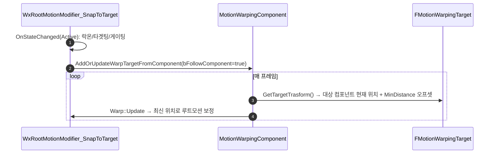

# SnapToTarget 워프 중 대상 이동 추적

## 계획

### 목표
`ANS_SnapToTarget`은 현재 워프 진입 프레임에 대상 위치를 1회만 스냅샷으로 찍어, 워프 도중 대상이 이동하면 따라가지 못한다. 워프 진행 중 대상의 현재 위치를 추적하도록 고친다.

### 수정 범위
| 파일 | 수정할 내용 | 구분 |
|---|---|---|
| `Private/Targeting/WxRootMotionModifier_SnapToTarget.cpp` | `OnStateChanged`의 방향/거리 계산·정적 좌표 등록을 컴포넌트 추종 등록으로 교체(락온·타겟팅·게이팅 로직은 유지) | 수정 |
| `Private/AnimNotify/WxAnimNotifyState_SnapToTarget.cpp` | `RotationType`을 `Default → Facing`으로 변경 | 수정 |

### 접근 방식
- **엔진 내장 component-follow 사용**: 이동 추적은 별도 modifier가 아니라 워프 타겟(`FMotionWarpingTarget`)의 속성이다. 부모 `URootMotionModifier_Warp::Update`가 매 프레임 `GetTargetTrasform()`을 다시 읽으므로, `AddOrUpdateWarpTargetFromComponent(..., bFollowComponent=true, VectorFromTargetToOwner, LocationOffset=(MinDistance,0,0))`로 등록하면 대상을 자동 추적하고 "MinDistance 앞 정지"까지 엔진이 재현한다. 우리는 이미 `SkewWarp` 파생이라 새 클래스·`Update` 오버라이드가 불필요.
- **게임 로직 유지**: 락온 우선·`TargetingPreset` 범위 게이팅·MP 디싱크 게이팅은 엔진 대응물이 없어 `OnStateChanged`에 그대로 두고, 마지막 등록 호출만 교체.
- **응시 회전**: `Facing`은 매 프레임 sync point(대상 앞 지점, 수평)를 바라봐 현행 응시와 동일. Z는 `SkewWarp bIgnoreZAxis=true`로 무시.

---

## 완료

### 수정한 파일
| 파일 | 수정한 내용 | 구분 |
|---|---|---|
| `Private/Targeting/WxRootMotionModifier_SnapToTarget.cpp` | `OnStateChanged`의 방향/거리 계산·정적 좌표 등록을 삭제하고 컴포넌트 추종 등록(`AddOrUpdateWarpTargetFromComponent`, `bFollowComponent=true`, `VectorFromTargetToOwner`, `LocationOffset.X=MinDistance`)으로 교체. RootComponent null 가드 추가 | 수정 |
| `Private/AnimNotify/WxAnimNotifyState_SnapToTarget.cpp` | `RotationType` `Default → Facing` | 수정 |

### 구현·결정과 그 이유
- **엔진 내장 component-follow 채택(새 클래스·`Update` 오버라이드 없음)**: 추적은 modifier가 아니라 워프 타겟 속성이라, `Warp::Update`가 매 프레임 다시 읽는 `GetTargetTrasform()`이 컴포넌트를 추종하게 만드는 것으로 충분하다. `VectorFromTargetToOwner`+`LocationOffset.X`가 "대상 MinDistance 앞"을 매 프레임 재계산해 기존 좌표 계산을 그대로 대체한다. 오프셋 방향의 `AvatarActor`는 등록 메서드가 `GetOwner()`로 자동 세팅.
- **회전은 `Facing`으로 전환**: 정적 등록 때는 미리 계산한 회전값을 `Default`로 매칭했지만, 컴포넌트 추종에서 `Default`는 대상 컴포넌트의 회전을 따라가므로 응시가 깨진다. `Facing`은 매 프레임 sync point(대상 앞 지점, 수평)를 바라봐 기존 응시와 동일. Z는 `SkewWarp bIgnoreZAxis=true`로 무시.
- **게임 로직은 그대로**: 락온 우선·`TargetingPreset` 범위 게이팅·MP 디싱크 게이팅은 엔진 대응물이 없어 `OnStateChanged`에 유지하고, 결정된 대상의 등록 방식만 교체.
- **degenerate 가드 제거**: 대상 겹침(방향 0) 처리는 엔진 오프셋 계산이 흡수하므로 별도 early-return 불필요. 대신 RootComponent 유효성만 확인.

### 계획 대비 달라진 점
- 계획대로.

### 후속 과제
- **PIE 실측 미완**: 이동 중 대상 추종·MinDistance 정지, 락온 없는 플레이어 회전-only 게이팅, tail 밀림 억제, 대상 파괴 시 폴백을 실측해야 한다.
- **추적 정밀도 옵션**: 현재 대상 RootComponent(액터 원점) 기준. 락온 시 락온 부위 컴포넌트를 넘기면 특정 부위 추종으로 정밀도를 높일 수 있으나, 현행 "액터 위치" 세만틱 보존을 위해 보류.
