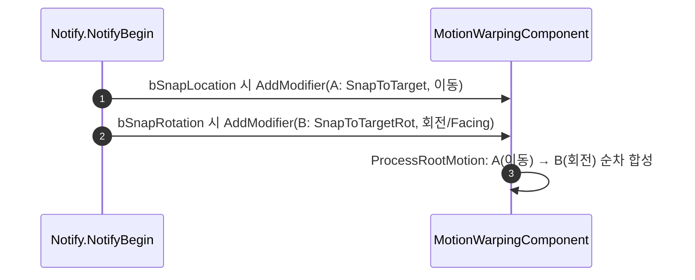

# SnapToTarget: 이동/회전 모디파이어 분리 (LocationOffset 위치 전용)

## 계획

### 목표
`RotationType=Facing`가 워프 도달 지점(=대상+LocationOffset)을 응시해 회전이 오프셋의 영향을 받는 문제("가끔 엉뚱한 곳을 쳐다봄")를 해결한다. 엔진은 한 워프 타겟 안에서 이동/회전을 분리 못 하지만 다중 모디파이어 순차 합성을 지원하므로, 이동/회전을 **두 모디파이어**로 나눈다.

### 수정 범위
| 파일 | 수정할 내용 | 구분 |
|---|---|---|
| `Private/AnimNotify/WxAnimNotifyState_SnapToTarget.cpp` | `NotifyBegin`을 재작성: `bSnapLocation`→이동 A, `bSnapRotation`→회전 B 모디파이어를 각각 생성·config·AddModifier. 회전 타겟명 상수 추가 | 수정 |
| `Public/AnimNotify/WxAnimNotifyState_SnapToTarget.h` | `RotationWarpTargetName` 상수 선언, 클래스 doc 갱신 | 수정 |
| `WxRootMotionModifier_SnapToTarget.h/.cpp` | 변경 없음(현행 OnStateChanged가 두 역할 모두 처리). doc 주석만 선택적 갱신 | 유지 |

### 접근 방식
- **역할별 2 모디파이어**: 기존 `UWxRootMotionModifier_SnapToTarget`를 config만 달리해 2개 생성. 이동/회전 채널이 직교라 순서 의존·워프 타겟 공유 없음.
- **A(이동)**: `SnapToTarget`, LocationOffset=노티파이값, bWarpTranslation=true(게이팅), bWarpRotation=false.
- **B(회전)**: `SnapToTargetRot`, LocationOffset=Zero(대상 중심), bWarpTranslation=false, bWarpRotation=true, RotationType=Facing. 오프셋 0이라 오너가 응시점에 안 겹쳐 특이점 소멸.
- 둘 다 component-follow → 추적은 엔진 담당(Update 오버라이드 불필요). 각자 대상 독립 판정(둘 다 켜지면 판정 2회, 워프 시작 1회뿐이라 수용).

---

## 완료

### 수정한 파일
| 파일 | 수정한 내용 | 구분 |
|---|---|---|
| `Private/AnimNotify/WxAnimNotifyState_SnapToTarget.cpp` | `NotifyBegin`을 재작성: `bSnapLocation`→이동(A: `SnapToTarget`, LocationOffset, bWarpTranslation)·`bSnapRotation`→회전(B: `SnapToTargetRot`, 오프셋0, bWarpRotation+Facing) 모디파이어를 각각 생성·AddModifier. `RotationWarpTargetName` 상수 추가 | 수정 |
| `Public/AnimNotify/WxAnimNotifyState_SnapToTarget.h` | `RotationWarpTargetName` 선언, 클래스 doc를 이동/회전 분리 구조로 갱신 | 수정 |
| `Public/Targeting/WxRootMotionModifier_SnapToTarget.h` | 클래스 doc에 두 역할 인스턴스화 설명 한 줄 추가(동작 불변) | 수정 |
| `.../WxRootMotionModifier_SnapToTarget.cpp` | 변경 없음 | 유지 |

### 구현·결정과 그 이유
- **회전 커플링의 근본 원인**: `Facing`은 워프 도달 지점(`대상+LocationOffset`)을 응시하는데, 엔진은 한 워프 타겟에서 이동·응시가 같은 `CachedTargetTransform`을 공유해 분리 불가. 그래서 오프셋 X는 근접 시 뒤돌아봄·도착 특이점(`GetSafeNormal2D`→0), Y는 측면 응시를 유발.
- **엔진 다중 모디파이어 합성 사용**: `ProcessRootMotion`이 활성 모디파이어를 순차 체이닝하고 이동/회전 채널이 직교하므로, 이동 전용·회전 전용 모디파이어를 겹쳐 등록해 분리. 회전 모디파이어는 오프셋 0으로 대상 중심을 응시 → 오너가 응시점에 안 겹쳐 특이점 소멸, LocationOffset 무관.
- **각 모디파이어 독립 판정(자기 워프 타겟만 등록) 채택**: A가 B의 워프 타겟까지 등록하는 대안 대비 순서 의존·크로스 커플링·비활성 시 stale 타겟 문제가 없다. 둘 다 켜지면 락온·타겟팅 판정이 2회 돌지만 워프 시작 1회뿐이라 수용.
- **모디파이어 클래스 무변경**: 현행 OnStateChanged가 `AddOrUpdateWarpTargetFromComponent(WarpTargetName, …, VectorFromTargetToOwner, LocationOffset)`로 이미 두 역할을 처리(회전 인스턴스는 LocationOffset=0·bWarpTranslation=false). config만 노티파이가 달리 준다.
- **두 config 블록 풀어쓰기**: 반복되지만 [[prefer-explicit-over-tiny-helpers]] 방침대로 헬퍼 추출 없이 명시.

### 계획 대비 달라진 점
- 계획대로.

### 후속 과제
- **PIE 실측 미완**: ①이동 추종·LocationOffset.X 앞 정지, ②근접/도착 시 대상 정면 응시(뒤돌아봄·튐 없음), ③LocationOffset.Y 시 위치만 측면 이동·응시는 정면 유지, ④기본값(회전 전용) 몽타주, ⑤플레이어 위치 게이팅(A 억제) 중에도 회전(B) 적용을 실측.
