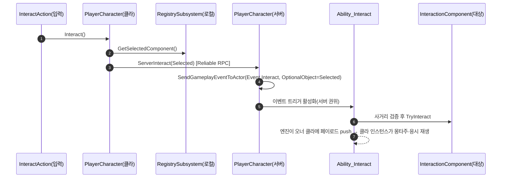

# 상호작용에서 예측 제거 — ServerInitiated + 게임플레이 이벤트, TargetData 구조체 폐기

> **[폐기·2026-07-18]** 이 작업의 `ServerInitiated` + 캐릭터 `ServerInteract` RPC 접근은 다음 날 `LocalPredicted` + 게임플레이 이벤트로 대체되었다(`2026-07-18-상호작용-LocalPredicted-이벤트전환.md`). 여전히 유효한 것은 **TargetData 구조체 폐기**와 **`Event.Interact` 태그 도입**뿐. `ServerInitiated`·`ServerInteract` 서술은 현재 코드가 아니다.

## 계획

### 목표
상호작용 어빌리티에서 클라 예측을 원칙적으로 걷어낸다. `LocalPredicted`는 예측을 위해서가 아니라 클라의 선택을 서버로 넘길 TargetData 채널(예측키에 묶여 있다)을 얻으려고 쓰던 수단이었다. 예측을 버리면 그 채널도 사라지므로 `FWxAbilityTargetData_Interaction`은 목적을 잃고 함께 폐기된다. 프로젝트의 다른 반응형 어빌리티(Finisher·Death·Groggy·HitReact)가 이미 쓰는 `ServerInitiated` + 게임플레이 이벤트 관례로 합류한다.

### 수정 범위
| 파일 | 수정할 내용 | 구분 |
|---|---|---|
| `Plugins/WxCore/.../WxGameplayTags.{h,cpp}` | `Event_Interact`("Event.Interact") 추가(`Event_Finisher`/`Event_Backstab` 옆). `Input_Interact` 제거 — 1급 입력 액션이 되면 코드·데이터 양쪽에서 무참조 | 수정 |
| `Source/WxGame/Input/WxInputConfig.h` | `InteractAction` 추가(`CrouchAction` 옆) | 수정 |
| `Source/WxGame/Character/WxPlayerCharacter.{h,cpp}` | `InteractAction` → `Interact()` 바인딩. `Interact()`가 로컬 레지스트리 선택을 읽어 `ServerInteract` 호출. `ServerInteract`(Server, Reliable)가 게임플레이 이벤트 송출 | 수정 |
| `Source/WxGame/.../Ability/WxAbility_Interact.{h,cpp}` | 정책 → `ServerInitiated`, 이벤트 트리거 등록, `ActivateAbility` 축약, `HandleTargetDataReceived`·`GetLocalSelectedComponent` 제거 | 수정 |
| `Source/WxGame/.../TargetData/WxAbilityTargetData_Interaction.{h,cpp}` | 폐기(TargetData 폴더가 비게 된다) | 삭제 |
| `Plugins/WxWorld/.../WxInteractionComponent.cpp` | 복제 근거 주석 갱신 — TargetData가 아니라 `bInteractionEnabled` 복제와 이벤트 페이로드의 net-addressable 요구 | 수정 |
| `Docs/Programmer/Interaction_System.md` | 실행 절(역할 분기 표·시퀀스 다이어그램)·타입 표 갱신 | 수정 |

### 접근 방식
- **누를 때 페이로드를 함께 보낸다**: 선택이 의도와 원자적으로 한 RPC에 실려 간다. 지금 TargetData가 가진 강점을 보존한다. 선택을 상시 미러링하는 대안은 기각했다 — 레지스트리는 LocalPlayerSubsystem이라 RPC가 없고, 액터로 옮기면 캐릭터行은 리스폰마다 죽어 VM 리졸버를 다시 엮어야 하며 PlayerController行은 ASC와 액터 채널이 갈려 "사이클 → 곧바로 입력"의 순서 보장을 잃는다.
- **입력은 1급 액션으로 내린다**: GAS의 입력→활성화 경로엔 페이로드가 없어(`CallServerTryActivateAbility`는 핸들·입력·예측키만) Interact가 더 이상 ASC 태그 입력일 수 없다. 캐릭터가 이미 Move·Look·Jump·Crouch에 쓰는 모양 그대로 `CrouchAction` 옆에 두어, 범용 라우터(`AbilityInputPressed`)엔 손대지 않는다.
- **정책은 ServerInitiated**: 서버가 이벤트로 활성화하면 엔진이 같은 TriggerEventData를 오너 클라로 push하고, 클라는 활성화 검사를 우회해 곧장 인스턴스를 띄운다. 덕분에 클라 인스턴스가 살아 있어 몽타주·응시가 그대로 동작한다. ServerOnly는 클라 인스턴스를 주지 않아 응시가 죽으므로 기각. 어빌리티 자체 RPC도 기각했다 — `ReplicateYes`를 요구하는데 그러면 클라가 로컬 인스턴스를 만들지 않아 `OnGiveAbility`에 얹힌 스캔 타이머가 CDO로 떨어져 깨진다.
- **대가**: 오너 클라 몽타주가 RTT만큼 늦게 시작한다. 즉시 재생은 예측을 요구하므로 이는 예측 제거의 정직한 대가다.

---

## 완료

### 수정한 파일
| 파일 | 수정한 내용 | 구분 |
|---|---|---|
| `Plugins/WxCore/.../WxGameplayTags.{h,cpp}` | `Event_Interact` 추가, `Input_Interact` 제거 | 수정 |
| `Source/WxGame/Input/WxInputConfig.h` | `InteractAction` 추가(`CrouchAction` 옆), 직접 바인딩 이유 주석 | 수정 |
| `Source/WxGame/Character/WxPlayerCharacter.{h,cpp}` | `InteractAction`→`Interact()` 바인딩, `Interact()`가 로컬 레지스트리 선택을 `ServerInteract`로 전송, `ServerInteract`(Server, Reliable)가 `Event.Interact` 송출. include 추가(ASBlueprintLibrary·LocalPlayer·PlayerController·Interaction 2종) | 수정 |
| `Source/WxGame/.../Ability/WxAbility_Interact.{h,cpp}` | 정책 `ServerInitiated`+이벤트 트리거, `ActivateAbility` 축약(페이로드→권위 실행+연출), `HandleTargetDataReceived`·`GetLocalSelectedComponent` 제거, 불필요 include(TargetData·ASC·GameplayPrediction) 제거, 클래스 주석 갱신 | 수정 |
| `Source/WxGame/.../TargetData/WxAbilityTargetData_Interaction.{h,cpp}` | 폐기(폴더도 제거) | 삭제 |
| `Plugins/WxWorld/.../WxInteractionComponent.cpp` | 복제 근거 주석을 RPC·페이로드·`bInteractionEnabled` 기준으로 갱신 | 수정 |
| `Docs/Programmer/Interaction_System.md` | 요약·flowchart·실행 절·시퀀스·제약·주의·타입 표를 새 구조로 갱신(이미 서버 전용이던 `OnInteracted`의 잔존 Multicast 서술도 정정) | 수정 |

### 구현·결정과 그 이유
- **입력을 캐릭터 1급 액션으로**: GAS 입력 라우팅(`TryActivateAbility`)엔 페이로드 인자가 없어, 선택을 함께 넘기려면 입력 지점이 ASC 태그 라우터 밖이어야 한다. 태그 조회로 `Input.Interact`를 살려두는 대안은 "어빌리티 입력 바인딩" 배열에 어빌리티로 안 가는 항목을 남겨 거짓말이 되므로, 태그를 완전히 지우고 전용 슬롯을 택했다.
- **페이로드는 누를 때 함께**: 선택을 상시 미러링하는 대신 입력 순간에 한 RPC로 실어 보내, 의도와 대상이 원자적으로 건너가게 했다(기존 TargetData의 강점 보존). 레지스트리는 LocalPlayerSubsystem이라 RPC를 못 갖고, 액터로 옮기면 리스폰·채널 문제가 생겨 기각.
- **ServerOnly가 아니라 ServerInitiated**: 오너 클라 인스턴스가 있어야 몽타주·응시가 로컬 재생된다. 엔진이 이벤트 페이로드를 오너 클라로 push하므로 클라도 같은 대상을 받아 연출한다. 어빌리티 자체 RPC는 `ReplicateYes`를 강제해 스캔 타이머를 깨뜨리므로 기각.

### 계획 대비 달라진 점
- 계획대로. 구현 중 `InteractAction` 전용 변수의 필요성을 재확인(태그 조회 대안의 의미 오염 문제)했고 전용 슬롯 유지로 결론.

### 후속 과제
- **에디터 데이터(사용자)**: `DA_InputConfig`에서 `IA_Interact`를 `AbilityInputBindings`→`InteractAction` 슬롯으로 이전, `ABS_Player`의 `GA_Interact` 행 `InputTag` 비우기. 둘 다 해야 동작.
- **런타임 검증(사용자)**: 데디 서버+클라 2대에서 원격 클라 상호작용 — 몽타주 RTT 후 재생·응시 회전·시뮬 프록시 가시성. 빌드는 통과했으나 실측은 미완(코드 경로는 엔진 소스 대조로 확인).
- 무관한 별개 WIP(`WxAbility_Dodge` 판정 캡슐, `DestroyJudgementCapsule` 미정의)가 working tree에 있어 빌드를 막았음 — 검증 시 임시 stash로 격리 후 복구. 이 작업과 무관.
