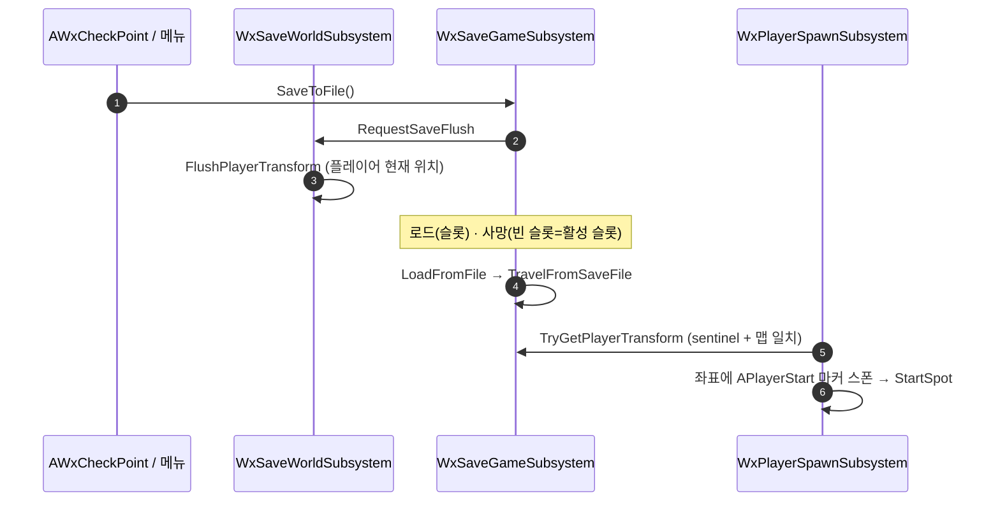

# 재개 지점을 저장 시점 플레이어 위치로 — 부활 지점 좌표 원천 통합

## 계획

### 목표

세이브의 트랜스폼은 체크포인트 자신의 좌표라, 메뉴에서 저장하고 로드해도 마지막 체크포인트로 되돌아간다. 재개 지점을 **저장 시점의 플레이어 위치**로 바꿔 로드가 저장한 그 자리에서 시작되게 한다.

사망 부활은 "마지막 세이브 위치"로 정의한다. 체크포인트가 유일한 오토세이브라 실사용 부활은 지금과 같고, 사망·로드가 완전히 같은 연산("슬롯을 다시 읽어 저장된 자리에서 재개")이 되어 좌표 원천이 하나로 유지된다. 메뉴에서 필드 저장 후 죽으면 그 필드에서 부활하는 것은 받아들이는 트레이드오프다(사용자 선택).

### 수정 범위
| 파일 | 수정할 내용 | 구분 |
|---|---|---|
| `Plugins/WxSave/.../Public/WxSaveGame.h` | `RespawnTransform` → `PlayerTransform`(`PlayerStats` 옆으로). 주석을 "마지막 저장 시점 플레이어 트랜스폼 = 재개 지점"으로 재작성 | 수정 |
| `Plugins/WxSave/.../WxSaveWorldSubsystem.h/.cpp` | `FlushPlayerTransform()` 추가 — 첫 플레이어 폰 트랜스폼 캡처(폰 부재 시 이전 값 보존). `RequestSaveFlush` 의 `!bIsTearingDown` 분기에서 호출. 낡은 주석 갱신 | 수정 |
| `Plugins/WxSave/.../WxSaveGameSubsystem.h/.cpp` | `SetRespawnTransform` 삭제. `TryGetRespawnTransform` → `TryGetPlayerTransform`. `LoadFromFile` 빈 슬롯 → 활성 슬롯 폴백. 동의어가 되는 `ReloadFromFile` 삭제. `LogSaveState` 라벨 | 수정 |
| `Plugins/WxSave/.../WxSaveLibrary.h/.cpp` | `ReloadFromFile` 래퍼 삭제 | 수정 |
| `Source/WxGame/Framework/WxPlayerSpawnSubsystem.h/.cpp` | 호출을 `TryGetPlayerTransform` 으로 교체, 주석의 "부활 지점" → "재개 지점" | 수정 |
| `Source/WxGame/WorldObject/WxCheckPoint.h/.cpp` | `SetRespawnTransform` 호출 삭제 + 서브시스템 조회를 `SaveToFile()` 직전 하나로 접음. 주석 갱신 | 수정 |
| `Plugins/WxSave/README.md`, `Source/WxGame/README.md` | 저장 항목·부활 흐름을 재개 지점 기준으로 갱신 | 수정 |

### 접근 방식

- **트랜스폼 필드는 계속 하나**: 의미만 "체크포인트 부활 지점" → "마지막 저장 시점 플레이어 트랜스폼"으로 바뀐다. 쓰는 쪽은 세이브 플러시 하나, 읽는 쪽은 `UWxPlayerSpawnSubsystem` 하나. 체크포인트는 좌표를 세팅하지 않는다 — 상호작용 시점에 플레이어가 그 앞에 서 있으므로 플러시가 캡처하는 값이 곧 체크포인트 자리다.

- **이름은 `PlayerTransform`(2026-07-13 이전 이름)으로 회귀**: 최상위 `PlayerStats`/`bHasPlayerStats` 와 나란히 "저장 시점 플레이어 스냅샷"을 이룬다. Identity sentinel + `TravelData.Map` 일치 게이트는 그대로.

- **빈 슬롯 = 활성 슬롯**: 이 설계에서 사망 부활의 정확성은 활성 슬롯을 제대로 다시 읽는가에 달렸는데, `WBP_DeathScreen` 은 슬롯 이름 없이 `LoadFromFile()` 을 부른다. 빈 슬롯은 디스크에 없어 빈 SaveGame 리셋으로 떨어지고 활성 슬롯 이름까지 `""` 로 덮인다. BP 를 고치는 대신 `LoadFromFile` 의 빈 슬롯을 활성 슬롯으로 정의한다 — `SaveToFile` 이 이미 같은 규칙이라 대칭이 맞고, 그 결과 `ReloadFromFile` 은 완전한 동의어가 되어 지운다(호출자 없음).

---

## 완료

### 수정한 파일
| 파일 | 수정한 내용 | 구분 |
|---|---|---|
| `Plugins/WxSave/.../Public/WxSaveGame.h` | `RespawnTransform` → `PlayerTransform`(`PlayerStats` 옆). 클래스 주석을 "저장 시점 플레이어 스냅샷"으로, `TravelData` 필드 주석을 실제 역할(트래블 맵 + 맵 일치 게이트 기준)로 정정 | 수정 |
| `Plugins/WxSave/.../WxSaveWorldSubsystem.h/.cpp` | `FlushPlayerTransform()` 추가 + `RequestSaveFlush` 의 `!bIsTearingDown` 분기에서 호출. `RequestSaveFlush`·`FlushMapTravelData` 낡은 주석 갱신 | 수정 |
| `Plugins/WxSave/.../WxSaveGameSubsystem.h/.cpp` | `SetRespawnTransform` 삭제. `TryGetRespawnTransform` → `TryGetPlayerTransform`. `LoadFromFile` 빈 슬롯 → 활성 슬롯 폴백(인자 기본값 부여). `ReloadFromFile` 삭제. `LogSaveState` 라벨 | 수정 |
| `Plugins/WxSave/.../WxSaveLibrary.h/.cpp` | `ReloadFromFile` 래퍼 삭제, `LoadFromFile` 주석에 빈 슬롯 규칙 명시 | 수정 |
| `Source/WxGame/Framework/WxPlayerSpawnSubsystem.h/.cpp` | `TryGetPlayerTransform` 으로 교체, 주석의 "부활 지점" → "재개 지점" | 수정 |
| `Source/WxGame/WorldObject/WxCheckPoint.h/.cpp` | `SetRespawnTransform` 호출 삭제 + 서브시스템 조회를 `SaveToFile()` 직전 하나로 접음. 주석 갱신 | 수정 |
| `Plugins/WxSave/README.md`, `Source/WxGame/README.md` | 저장 항목·재개 흐름 갱신. WxGame 은 07-17 StartSpot 이관 이후 낡아 있던 부활 서술·읽기 순서 안내도 함께 정정 | 수정 |
| `Docs/Programmer/WxSave_PersistenceLab_Comparison.md` | 함수 대응표에서 `ReloadFromFile` 제거(이번 삭제로 새로 어긋난 줄만) | 수정 |

### 구현·결정과 그 이유
- **트랜스폼 필드를 늘리지 않았다(사용자 결정)**: 요구는 "부활=체크포인트, 그 외=저장 위치" 였고 그건 필드 2개를 강제한다 — 필드에서 저장→종료→재실행→로드→사망 시나리오에서 두 좌표가 모두 디스크에서 나와야 하기 때문이다. 사용자가 부활을 "마지막 세이브 위치"로 완화하기로 해 필드 1개로 끝났다. 체크포인트가 유일한 오토세이브라 실사용 부활은 종전과 같고, 사망·로드가 같은 연산이 되어 사망 전용 API·스폰 분기·트래블 넘는 플래그·BP 수정이 전부 불필요해졌다.

- **체크포인트가 좌표를 세팅하지 않는다**: 상호작용 시점에 플레이어가 그 앞에 서 있으므로 플러시가 캡처하는 값이 곧 체크포인트 자리다. 저장 경로가 이미 하는 일을 체크포인트가 중복으로 알 이유가 없어져 `SetRespawnTransform` 과 호출부가 통째로 사라졌다.

- **빈 슬롯 = 활성 슬롯(계획 외 발견분)**: 이 설계는 사망 부활이 활성 슬롯을 제대로 다시 읽는 데 전적으로 의존하는데, `WBP_DeathScreen` 은 슬롯 이름 없이 `LoadFromFile()` 을 부르고 있었다. 빈 슬롯은 디스크에 없어 빈 SaveGame 리셋으로 떨어지고 활성 슬롯 이름까지 `""` 로 덮여, 사망 시 진행이 날아가는 상태였다(미커밋 BP 라 최근 배선으로 추정). BP 를 고치는 대신 빈 슬롯을 활성 슬롯으로 정의했다 — `SaveToFile` 이 이미 같은 규칙이라 대칭이 맞고, 그 결과 `ReloadFromFile` 이 완전한 동의어가 되어 삭제했다(호출자 없음).

- **`ReloadFromFile` 삭제가 안전한 이유**: C++ 호출자는 라이브러리 래퍼뿐이고, BP 스냅샷 전수 검색에서도 호출부가 없었다. 스냅샷이 없는 BP 가 부르고 있었다면 BP 컴파일 에러로 드러난다.

- **빌드 검증**: WxEditor(Development) `Result: Succeeded`(WxSave·WxGame 재컴파일·링크 확인).

### 계획 대비 달라진 점
- 계획대로. 문서에서 계획에 없던 두 줄을 더 고쳤다: `Source/WxGame/README.md` 의 부활 서술·읽기 순서 안내가 07-17 StartSpot 이관 이후 이미 낡아 있었고(제거된 `AWxGameMode::SpawnDefaultPawnAtTransform` 를 가리킴), 이번 변경으로 더 어긋나는 자리라 같이 정정했다.

### 후속 과제
- **PIE 수동 검증**(런타임 미검증 — 07-17 StartSpot 주입분과 겹치므로 같이 확인):
  - 체크포인트 점등 → 멀리 이동 → 메뉴 저장 → 메뉴 로드 → 저장한 그 자리·그 시선에서 시작, 스탯 복원.
  - 체크포인트 점등 → 멀리 이동 → 사망 → 체크포인트에서 부활(빈 슬롯 리셋으로 진행이 날아가지 않는지).
  - 세이브 없는 신규 세션에서 사망 → 레벨 `APlayerStart` 폴백. PIE "여기서 플레이" 는 저장 위치 무시.
  - `Wx.Save.Dump` 로 재개 위치가 체크포인트 저장 시 그 자리, 필드 저장 시 그 필드로 갱신되는지.
- **`Docs/Programmer/WxSave_PersistenceLab_Comparison.md` 전면 갱신**: 이번에 고친 줄 외에도 07-13 `PlayerStartTag` 제거 이후 낡은 서술이 남아 있다(`UWxSaveGame` 행의 `PlayerStartTag`, `FWxSaveTravelData` 행의 "폰 트랜스폼·컨트롤 로테이션·플래그 2개", Wx 유지분의 `SetPlayerStartTag`/`GetPlayerStartTag`). 범위 밖이라 손대지 않았다.
- **저장 시점 자세 문제**: 낙하·수영 중 저장하면 그 공중 좌표에서 재개한다. 지금은 저장 지점이 체크포인트뿐이라 드러나지 않지만, 메뉴 저장을 실제 기능으로 열면 접지 판정이 필요해질 수 있다.
