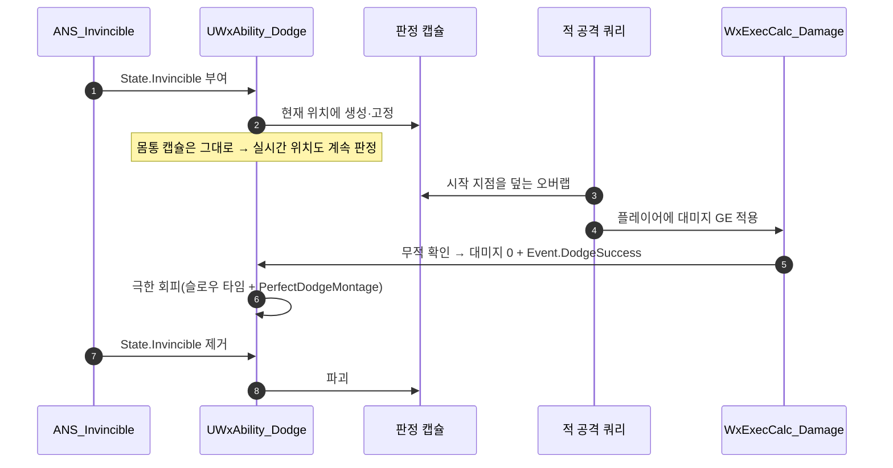

# 회피 판정 개선 — 무적 시작 지점에 판정용 캡슐 남기기

## 계획

### 목표

극한 회피가 "무적 중 실제로 얻어맞아야만" 성립해, 회피를 잘할수록 아무 보상이 없고 제자리에서 무적으로 버티는 쪽이 이득인 상태다. 무적 구간에 "피하지 않았다면 맞았을 자리"를 판정용 캡슐로 남겨, 몸통이 맞든 그 자리가 맞든 극한 회피가 성립하게 한다.

### 수정 범위

| 파일 | 수정할 내용 | 구분 |
|---|---|---|
| `WxAbility_Dodge.h` | 무적 태그 관찰 태스크·판정 캡슐 멤버와 콜백 선언 | 수정 |
| `WxAbility_Dodge.cpp` | 무적 태그 수명에 맞춰 판정 캡슐을 생성·고정·파괴 | 수정 |

데미지 파이프라인(`WxExecCalc_Damage`)·무적 노티파이(`WxAnimNotifyState_Invincible`)·타게팅 프리셋은 건드리지 않는다.

### 접근 방식

- **판정 볼륨은 아바타에 붙는 캡슐 컴포넌트**: 공격은 `TargetingSelectionTask_AOE`(Sphere)가 `CollisionObjectTypes=[Pawn]`으로 오버랩해 액터를 찾고, `TargetingFilterTask_ActorClass`가 `RequiredActorClassFilters=[ACharacter]`를 요구한다. 별도 판정 액터를 스폰하면 이 필터에서 탈락하므로(GAS 스톡 TargetActor도 동일. 애초에 TargetActor는 능동적 타겟 선택용이라 피격 수신에 맞지 않는다) 기각하고, 캡슐을 아바타의 컴포넌트로 둔다. 오버랩 결과의 액터가 플레이어라 모든 필터를 그대로 통과한다.
- **이중 피격이 없는 근거**: `TargetingSelectionTask_AOE::ProcessOverlapResults`가 액터 단위로 중복 제거하므로, 몸통과 판정 캡슐이 동시에 겹쳐도 타겟 결과는 1건이다.
- **기존 경로 재사용**: 판정 캡슐이 잡히면 플레이어가 타겟이 되고, 대미지 GE가 적용되며, `ExecCalc`가 무적을 확인해 대미지를 0으로 만들고 `Event.DodgeSuccess`를 발송한다. 극한 회피 경로는 손댈 곳이 없다.
- **수명은 무적 태그와 동일**: GAS 스톡 `WaitGameplayTagAdd`/`WaitGameplayTagRemove`(둘 다 재무장)로 `State.Invincible`을 관찰해, 붙는 순간 현재 위치에 캡슐을 고정 생성하고 떨어지는 순간 파괴한다. 무적이 끝난 뒤 유령이 남아 헛피격을 만들 수 없다.
- **캡슐 구성**: 크기는 캐릭터 캡슐을 그대로 미러하고, 루트에 부착하되 절대 트랜스폼으로 월드에 고정해 루트모션에 끌려가지 않게 한다. 콜리전은 `QueryOnly` + `ObjectType=Pawn` + 모든 채널 응답 `Ignore`로, 오브젝트 타입 쿼리(공격)에만 잡히고 이동·시야·카메라 트레이스에는 무해하다.
- 아바타를 `ACharacter`로만 다뤄 `WxGame` 의존 없이 플러그인 규칙을 지킨다.

---

## 완료

### 수정한 파일
| 파일 | 수정한 내용 | 구분 |
|---|---|---|
| `WxAbility_Dodge.h` | 판정 캡슐 멤버·무적 태그 콜백 선언, 판정 방식을 클래스 주석에 명시 | 수정 |
| `WxAbility_Dodge.cpp` | 무적 태그 관찰 태스크 기동, 태그 수명에 맞춘 판정 캡슐 생성·고정·파괴 | 수정 |

### 구현·결정과 그 이유
- **판정 볼륨을 별도 액터가 아니라 아바타의 캡슐 컴포넌트로**: 공격 쿼리가 캐릭터 클래스를 요구하는 필터를 쓰기 때문에, 별도 액터는 스폰해도 후보에서 탈락한다. 컴포넌트로 두면 잡히는 액터가 플레이어 자신이라 클래스·팀 필터를 그대로 통과하고, 대미지·이벤트 라우팅도 손댈 곳이 없다. 필터 완화도 검토했으나, 필터를 풀면 판정용 액터에 어빌리티 시스템·팀 인터페이스 전달을 따로 구현해야 하고 모든 공격이 잡을 수 있는 대상이 전역적으로 넓어진다. 회피 전용 기능 때문에 전투 전반의 타겟 규칙을 바꾸는 셈이라 기각했다.
- **캡슐을 매번 만들지 않고 재사용, "붙였다 떼는" 방식으로**: 어빌리티가 InstancedPerActor라 인스턴스가 회피 사이에 유지된다. 평상시 캡슐은 콜리전을 끈 채 몸통 캡슐에 붙어 함께 움직이고, 무적이 시작되면 콜리전을 켜고 떼어내(KeepWorldTransform) 그 자리에 남긴다. 무적이 끝나면 콜리전을 끄고 몸통에 다시 붙인다(SnapToTarget). 붙어 다니게 두어 판정 위치를 따로 계산·고정할 필요가 없어졌다(절대 트랜스폼 플래그·수동 위치 세팅 제거). 첫 회피에서 한 번만 생성한다.
- **이중 피격 걱정이 없는 이유**: 엔진의 범위 선택 태스크가 오버랩 결과를 액터 단위로 중복 제거한다. 몸통과 판정 캡슐이 동시에 겹쳐도 타겟은 1건이다.
- **무장/해제를 무적 태그와 1:1로**: 엔진 태그 대기 태스크는 0→1, →0 전이에서만 브로드캐스트하므로 부여·해제가 엄격히 교대한다. 덕분에 "무장돼 있다 == 무적 중"이 항상 성립하고, 무적이 끝난 뒤 켜진 캡슐이 남아 헛피격을 만들 수 없다. 무적 도중 어빌리티가 취소되는 경로를 위해 EndAbility에서도 무장 해제한다.
- **모든 채널 응답을 무시**: 공격은 오브젝트 타입 오버랩이라 채널 응답을 보지 않는다. 그래서 응답을 전부 무시해도 공격에는 잡히면서 이동·시야·카메라·조준 트레이스에는 전혀 걸리지 않는다. 판정 캡슐이 다른 시스템에 새는 것을 원천 차단한다.

### 계획 대비 달라진 점
- **매번 생성·파괴 → 생성 후 재사용(붙였다 떼기)**: 계획은 무적 태그 수명에 맞춰 캡슐을 생성·파괴하는 방식이었으나, 첫 회피에서 한 번 만들어 두고 이후에는 콜리전 토글 + 부착/분리로 재사용하도록 바꿨다. 성능 이득은 사실상 없지만(NoCollision↔QueryOnly 전환이 물리 바디를 재생성하므로), 붙어 다니는 캡슐을 떼어내기만 하면 판정 위치가 정해져 위치 계산 코드가 사라지고 흐름이 단순해진다.

### 후속 과제
- **에디터 실행 확인 필요(미검증)**: 오브젝트 타입 오버랩이 채널 응답을 보지 않는다는 전제가 핵심인데 빌드로는 검증되지 않는다. 아슬아슬한 회피에서 극한 회피가 뜨는지 확인하고, 만약 판정 캡슐이 안 잡히면 Pawn 채널 응답을 Overlap으로 주는 한 줄로 해결된다.
- 판정이 빡빡하게 느껴지면 캡슐 크기 스케일 노브를 추가한다(현재는 몸통과 동일 크기).
