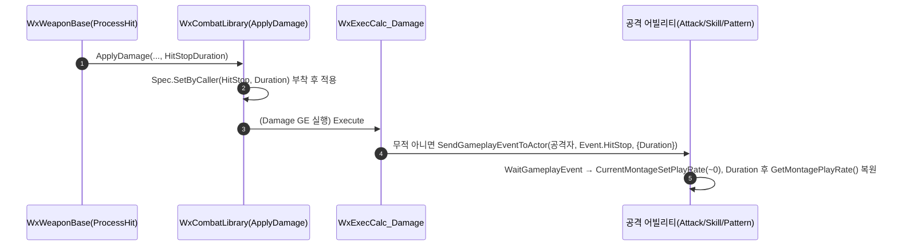

# HitStop: GameplayCue → GameplayEvent (AbilityBase 리스너)

## 계획

### 목표
히트스톱(역경직)을 `UWxCueNotify_HitStop` GameplayCue에서 `Event.HitStop` GameplayEvent로 전환한다. Cue는 관전자용 unreliable multicast가 본질이라 self-local 연출인 히트스톱에 부적합하고(스킵·예측 미적용 위험), 별도 BP 큐 에셋 등록을 강제한다. 재생 중인 공격 어빌리티가 이벤트를 받아 자기 몽타주를 직접 멈추게 한다.

### 수정 범위
| 파일 | 수정할 내용 | 구분 |
|---|---|---|
| `WxCore/.../WxGameplayTags.h` `.cpp` | `Event_HitStop`·`SetByCaller_HitStop` 추가, `GameplayCue_HitStop` 제거 | 수정 |
| `WxCombat/.../WxAbilityBase.h` `.cpp` | 히트스톱 리스너(`StartHitStopListener`/`HandleHitStopEvent`/`ResumeFromHitStop`) + `EndAbility` override로 타이머 정리 | 수정 |
| `WxCombat/.../WxAbility_Attack.cpp` `_Skill.cpp` `_Pattern.cpp` | `ActivateAbility`에서 `StartHitStopListener()` opt-in 호출 | 수정 |
| `WxCombat/.../WxCombatLibrary.cpp` `.h` | 이벤트 발송 제거, 스펙에 `SetByCaller.HitStop` 부착 (HitStopDuration 파라미터 유지) | 수정 |
| `WxCombat/.../WxExecCalc_Damage.cpp` | 무적 회피 제외 모든 적중에 공격자로 `Event.HitStop` 송출 | 수정 |
| `WxCombat/.../Cue/WxCueNotify_HitStop.h` `.cpp` | 클래스 삭제 | 삭제 |
| BP GC_HitStop 에셋 + 스냅샷 | 에디터에서 수동 삭제 | 삭제 |

### 접근 방식
- **리스너를 공통 베이스에 한 번**: `Attack/Skill/Pattern`은 이미 `UWxAbilityBase`(InstancedPerActor·LocalPredicted)를 공유하고 전부 `PlayMontageAndWait`로 재생한다. 베이스에 `WaitGameplayEvent(Event.HitStop)` 리스너를 두고 세 어빌리티만 opt-in 호출 → 중복 없음.
- **이미 활성인 어빌리티가 수신**: `WaitGameplayEvent`는 활성 어빌리티 안에서 델리게이트만 로컬로 때리므로 새 활성화가 없다 → prediction key·Block/Cancel 태그 조율 불필요. 별도 어빌리티화는 남의 몽타주에 손대는 큐를 GAS로 감싸는 셈이라 기각.
- **정지/복원**: `ASC->CurrentMontageSetPlayRate(~0)`로 자기 몽타주 정지, 아바타 월드 타이머로 `Duration` 후 `CurrentMontageSetPlayRate(GetMontagePlayRate())` 복원. 큐의 하드코딩 `1.0` 복원 버그(ASPD≠1일 때 속도 틀어짐)를 ASPD 반영값 복원으로 해소.
- **트리거 = ExecCalc**: `ApplyDamage`는 HitStopDuration을 `SetByCaller.HitStop`로 스펙에 실기만 하고, 실제 이벤트는 `WxExecCalc_Damage`가 발동한다. ExecCalc는 이미 온-히트 이벤트 허브(DodgeSuccess/PerfectGuard/HitReact/Parry)이며 무적 회피는 `HandleInvincible`로 조기 리턴하므로, "실제로 닿았을 때만"이 자연히 보장된다(기존 `bAppliedAny`는 무적 회피에도 발동하던 버그). ExecCalc는 오너클라(예측)+서버 양쪽에서 돌아 결정론적.
- **발동 범위**: 무적 회피만 제외, 나머지 적중(퍼펙트 가드 포함) 전부.

---

## 완료

### 수정한 파일
| 파일 | 수정한 내용 | 구분 |
|---|---|---|

### 구현·결정과 그 이유

### 계획 대비 달라진 점

### 후속 과제
