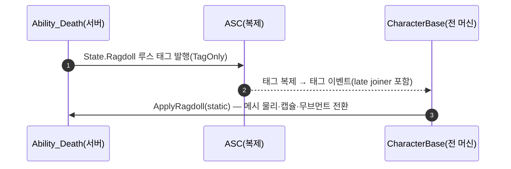

# 래그돌을 ASC에서 UWxAbility_Death로 이관 (State.Ragdoll 태그 발행)

## 계획

### 목표
래그돌 물리 전환이 범용 GAS 라우터인 `UWxAbilitySystemComponent`에 구현되어 있고 호출처는 죽음 어빌리티 한 곳뿐이다. 죽음 전용 로직을 `UWxAbility_Death`로 이관해 ASC를 정리하되, 멀티플레이 원격 시점(시뮬 프록시·late joiner)의 래그돌 가시성은 그대로 유지한다.

### 수정 범위
| 파일 | 수정할 내용 | 구분 |
|---|---|---|
| `Plugins/WxCore/.../WxGameplayTags.{h,cpp}` | `State_Ragdoll`("State.Ragdoll") 추가 (`State_Dead` 옆) | 수정 |
| `Plugins/WxCombat/.../Ability/WxAbility_Death.{h,cpp}` | `ApplyRagdoll(ACharacter*)` public static 추가(물리 전환 구현 이식), `EnableRagdoll`을 authority 게이트 후 `State.Ragdoll` 루스 태그 발행으로 교체 | 수정 |
| `Plugins/WxCombat/.../WxAbilitySystemComponent.{h,cpp}` | `SetRagdollActive`·`OnRep_RagdollActive`·`bRagdollActive`·`GetLifetimeReplicatedProps` 오버라이드 및 래그돌 전용 include 삭제 | 수정 |
| `Source/WxGame/Character/WxCharacterBase.{h,cpp}` | `HandleRagdollTagChanged` 추가, `PostInitializeComponents`에서 태그 구독+기존재 시 즉시 적용 | 수정 |
| `Docs/Programmer/Ability_Activation_Flow.md` | 죽음 행의 래그돌 서술을 새 구조로 갱신 | 수정 |

### 접근 방식
- **발행/감지/구현의 3분리**: 어빌리티 인스턴스는 서버+오너 클라에만 존재하므로, 원격 시점 커버를 위해 역할을 나눈다. 서버의 죽음 어빌리티가 복제 루스 태그를 발행하고(`State.Dead`와 동일한 TagOnly 관례), 전 머신에 존재하는 베이스 캐릭터가 태그 이벤트를 감지해, 어빌리티의 정적 함수(물리 전환 구현)를 호출한다. "래그돌이 무엇인지"는 죽음 어빌리티가 단독 소유하고, 캐릭터에는 감지 배관만 남는다.
- **태그는 Event가 아닌 State**: 발행은 일회지만 late joiner 커버는 태그가 계속 남아 있는 것에 의존한다. 남아서 조건을 표현하는 태그는 상태 관례(State.*)에 속한다.
- **구독은 전 머신 공통 지점에서**: 기존 ASC 초기화 경로는 서버·오너 클라에서만 돌아 적 시뮬 프록시가 빠진다. `PostInitializeComponents`에서 등록하고, 등록 직후 태그가 이미 있으면 즉시 1회 적용해 late join 시 복제 순서 의존을 없앤다.

---

## 완료

### 수정한 파일
| 파일 | 수정한 내용 | 구분 |
|---|---|---|
| `Plugins/WxCore/.../WxGameplayTags.{h,cpp}` | `State_Ragdoll`("State.Ragdoll") 추가 (`State_Dead` 옆) | 수정 |
| `Plugins/WxCombat/.../Ability/WxAbility_Death.{h,cpp}` | `ApplyRagdoll(ACharacter*)` public static 추가(ASC의 물리 전환 코드 이식), `EnableRagdoll`을 authority 게이트 후 `State.Ragdoll` 루스 태그 발행(TagOnly)으로 교체, 클래스 주석에 발행/감지 구조 설명 추가 | 수정 |
| `Plugins/WxCombat/.../WxAbilitySystemComponent.{h,cpp}` | `SetRagdollActive`·`OnRep_RagdollActive`·`bRagdollActive`·`GetLifetimeReplicatedProps` 오버라이드와 래그돌 전용 include 4종 삭제 | 수정 |
| `Source/WxGame/Character/WxCharacterBase.{h,cpp}` | `HandleRagdollTagChanged` 추가, `PostInitializeComponents`에서 태그 구독+기존재 시 즉시 적용 | 수정 |
| `Docs/Programmer/Ability_Activation_Flow.md` | 죽음 어빌리티 행의 래그돌 서술을 태그 발행/감지 구조로 갱신 | 수정 |

### 구현·결정과 그 이유
- **발행/감지/구현의 3분리**: 어빌리티 인스턴스는 서버+오너 클라에만 존재해 원격 시점을 직접 못 다룬다. 서버의 죽음 어빌리티가 상태 태그를 발행하고, 전 머신에 존재하는 베이스 캐릭터가 감지해, 어빌리티의 정적 함수를 호출한다. 물리 전환의 내용은 죽음 어빌리티가 단독 소유하고 캐릭터에는 감지 배관만 남는다.
- **Event가 아닌 State 태그**: late joiner 커버는 태그가 계속 남아 있는 것에 의존하므로 상태 관례를 따랐다. Event.*는 비복제 순간 신호 관례라 owned로 상주하면 오독을 부른다.
- **발행에 서버 게이트**: 오너 클라 인스턴스도 같은 경로에 들어오므로, 게이트가 없으면 클라에 로컬 루스 태그가 중복 추가된다.
- **구독은 PostInitializeComponents**: 기존 ASC 초기화 경로는 서버·오너 클라 전용이라 적 시뮬 프록시가 빠진다. 전 머신 공통 지점에서 구독하고, 등록 직후 태그 기존재를 1회 확인해 late join 복제 순서 의존을 없앴다.

### 계획 대비 달라진 점
- 계획대로.

### 후속 과제
- **런타임 검증(사용자)**: PIE에서 몽타주 없는 적 처치 시 래그돌 확인, 데디+클라 2대에서 원격 시점·late join 시체 래그돌 확인. 빌드는 통과했으나 실측은 미완.
